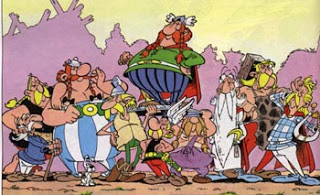
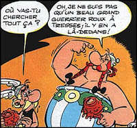
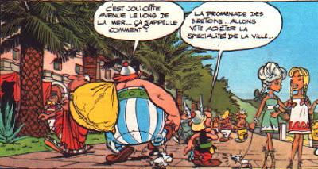
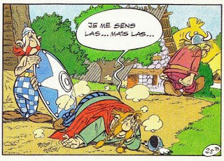
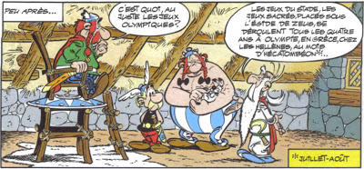

:doctitle: Les différentes formes de leadership
:description: Les différentes formes de leadership dans un village gaulois.... Parallèle avec la célèbre BD Astérix et Obélix
:keywords: Agilité, Leadership, Management
:author: Guillaume EHRET - Dev-Mind
:revdate: 2015-09-15
:category: Agilité
:teaser: Yves Enrègle est un enseignant chercheur spécialisé sur les questions de management et de la responsabilité sociétale. Dans un de ces écrits il compare les 5 types de pouvoirs possibles dans une organisation avec 5 des personnages principaux des albums d'Asterix le Gaulois. Je vous propose ici une transposition de cette vision sur un projet informatique.
:imgteaser: ../../img/blog/2015/formes_leadership_00.jpg

Yves Enrègle est un enseignant chercheur spécialisé sur les questions de management et de la responsabilité sociétale. Dans un de ces écrits il compare les 5 types de pouvoirs possibles dans une organisation avec 5 des personnages principaux des albums d'Asterix le Gaulois. Je vous propose ici une transposition de cette vision sur un projet informatique.

Quels types de personne faut il trouver pour constituer une bonne équipe projet ? Une réponse est peut être de se rapprocher de l'organisation du village gaulois où 5 leaders incarnent chacun une forme de pouvoir.

== Le pouvoir de la compétence (le réalisateur)

Sur un projet informatique nous avons besoin d'un  ou plusieurs bons techniciens, compétents et qui se caractérisent par leur dynamisme et leur savoir faire.  Dans le célèbre village gaulois, la personne qui n'hésite pas à mettre la main à la pâte pour tailler des menhirs ou repousser les romains, est Obelix. On parlera du Réalisateur (R).  On ne veut pas forcément lui ressembler physiquement mais nous aimerions bien de temps en temps, prendre de la potion magique pour avoir les mêmes facilités.

Lorsqu'il se lance dans l'action, les autres gaulois veulent le suivre et faire même mieux que lui.

Par contre Obelix n'aime pas forcément qu'on lui prenne sa part de romains à assommer.... Les réalisateurs ont une telle envie de faire qu'il peuvent parfois être réfractaire aux changements. Ces aspects peuvent être les mauvais côtés des réalisateurs (délégation et inertie au changement)

Les réalisateurs savent  tout faire, mais il ne savent pas toujours ce qu’il faut faire ni quand il faut s'arrêter pour changer....

== Le pouvoir de l'expertise (le guide)

Le guide (G) lui ne sait rien faire de particulier mais il sait ce qu'il faut faire. C'est l'opposé du réalisateur. Il est capable d'analyser le contexte et définir des objectifs à atteindre en fonction des menaces ou des opportunités. Asterix possède ce pouvoir d'expertise. La réalisation n'est pas forcément son fort car il a besoin de prendre de la potion magique pour y arriver.

En contre partie les guides peuvent faire preuve d'une envie trop fréquente de changement.

Comme pour Asterix et Obelix,  la compétence et l'expertise sont indissociables et sont le fruit du succès. L'équipe d'Yves Enrègle a d'ailleurs observé que plus de 80% des échecs dans les équipes venaient d'une mauvaise coordination entre les forces de type R et de type G. La différence d'inertie et la séparation entre celui qui fait et celui qui dit comment faire peut entraîner des tensions.

Comme dans la célèbre BD, les guides et les réalisateurs sont au même niveau hiérarchique et quand les deux parties divergent, il faut une autorité extérieure pour trancher.

== Le pouvoir de l'administratif (l'organisateur)

Le pouvoir administratif est là pour réguler et coordonner  les relations entre les réalisateurs et les guides. Abraracourcix, le chef du village incarne ce pouvoir et c'est lui qui doit trancher quand plusieurs options sont possibles. Le chef se doit également de fournir les moyens  nécessaires pour que les guides et les réalisateurs puissent accomplir leurs tâches convenablement.

Le rôle de l'organisateur (O) est instable car il n'a de sens que si les guides et les réalisateurs reconnaissent son autorité. Les organisateurs peuvent parfois se défendre négativement de cette vulnérabilité. Ils peuvent se réfugier dans leur statut et perdre le contact avec la réalité. Mais plus ils seront haut perchés plus la redescente sur terre sera douloureuse (comme dans la BD quand Abraracourcix ne passe plus sous la porte et s'étale sur le sol).

Par contre en cas de grosse difficulté il peut arriver que le niveau hiérarchique ne soit pas suffisant. Abraracourcix tombe souvent de son bouclier quand les situations s'enveniment.

== Le pouvoir charismatique (le mobilisateur)

Panoramix a une position à part dans le village. Sa sagesse, sa posture, ses actes font qu'il n'a rien à prouver. Il est respecté de tous. Le mobilisateur (M) a le pouvoir de rassembler les gens par un phénomène de séduction ou via une expertise remarquable (la potion magique).

Le mobilisateur peut aider l'organisateur a reprendre la main (coaching, présence) ou peut débloquer une situation entre les guides et les réalisateurs (expertise métier ou technique). Son rôle est essentiel mais ne doit être fait que de façon ponctuelle. Si l'intervention s'étale son aura peut en pâtir. Il ne doit pas profiter de la situation pour s'approprier le pouvoir.

Les mobilisateurs doivent être capable de prendre de la hauteur par rapport à un problème. Par contre il arrive que Panoramix ait des ratés. Que faire si le leader charismatique n'est pas là. En cas de conflits dans notre village gaulois les villageois se scindent en deux. Ils peuvent en découdre à coups de poissons pourris....

== Le pouvoir de l'intégrateur négatif (le mobilisateur négatif)

Au contraire de Panoramix qui est respecté de tous, le barde Assurancetourix fait l'unanimité contre lui. Il arrive à déclencher une unité du groupe car tous les villageois s'associent pour qu'il n'exprime pas ses talents musicaux... Il ne risque pas de confisquer le pouvoir car dès qu'il veut s'exprimer on le fait taire.

C'est une forme de pouvoir qui doit intervenir quand toutes les autres formes de pouvoir ont échoué. Certaines personnes, du  «fou du roi» à l'«idiot du village» (les boucs émissaires), ont de tout temps contribué à structurer les groupes humains.

== Le leadership

Le leadership se déploie donc sous 4 dimensions :

* la compétence sur le métier ou dans son domaine
* la compétence stratégique, qui sait ce qu'il faut faire
* le pouvoir statutaire, qui a le pouvoir et l'utilise a bon escient
* le pouvoir charismatique et une capacité d'influence dont la source est inconnue
* Le leader ne doit en aucun cas jouer le rôle de l'intégrateur négatif. Dans le cas des conflits avec la base c'est souvent le jeu des syndicats de monter tout le monde contre le leader. Mais dans la réalité peu de personnes vont avoir ces 4 qualités à la fois.

Chaque leader sera plus à l'aise sur l'une ou l'autre des dimensions. Un bon leader sera celui qui saura constituer une équipe complémentaire. Si vous avez des équipes auto gérées vous devrez essayer de la même façon de constituer au mieux vos équipes afin de mettre toutes les chances de votre côté.

Pour plus d'information vous pouvez lire « Pourquoi Astérix n’est-il pas chef ? Du conflit à la motivation », Éditions d’organisation, 1985.

__Merci à Alfred Almendra pour sa relecture de cet article __

