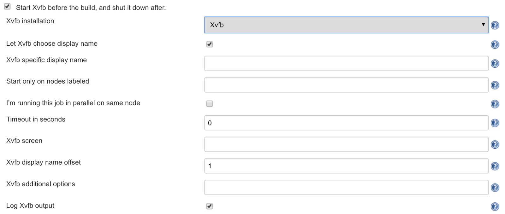

:doctitle: 	Installer un serveur X virtuel pour exécuter ses tests headless
:description: Headless testing : comment installer un serveur X virtuel pour exécuter vos tests unitaires ou end-to-end
:keywords: Java, SpringBoot, Kotlin
:author: Guillaume EHRET - Dev-Mind
:revdate: 2016-06-03
:category: Java
:teaser: Quel moteur JavaScript utilisez-vous pour exécuter vos tests unitaires et vos tests end-to-end écrits en JavaScript ? Vous avez le choix... Pour les tests unitaires vous pouvez soit utiliser un navigateur classique (Chrome, Firefox...) soit un navigateur headless (sans interface graphique) comme PhantomJS.
:imgteaser: ../../img/blog/2016/testheadless_00.png

Quel moteur JavaScript utilisez-vous pour exécuter vos tests unitaires et vos tests end-to-end écrits en JavaScript ? Vous avez le choix... Pour les tests unitaires vous pouvez soit utiliser un navigateur classique (Chrome, Firefox...) soit un navigateur headless (sans interface graphique) comme http://phantomjs.org/[PhantomJS].

http://phantomjs.org/[PhantomJS] utilise le moteur Javascript https://webkit.org/[WebKit] et c’est l’idéal pour exécuter des tests sur un serveur où aucun écran n’est branché (plateforme d’intégration continue par exemple). Par contre vous ne pouvez pas utiliser ce type de navigateur pour vos tests end-to-end car vous avez besoin d’interagir avec l’interface.

Quand vous faites des tests http://www.seleniumhq.org/[Selenium] (ou http://www.protractortest.org/#/[Protractor]) vous avez la possibilité d'utiliser les services https://saucelabs.com/[SauceLabs] pour déporter l’exécution des tests sur leurs serveurs. Mais le coût n’est pas anodin. L’autre solution est d’essayer d’utiliser une solution de virtualisation de serveur X sur votre plate-forme qui exécute les tests et vous pourrez ainsi utiliser n’importe quel navigateur.

Nous allons donc voir comment installer https://www.x.org/archive/X11R7.6/doc/man/man1/Xvfb.1.xhtml[Xvfb] sur un serveur Linux.

== Un projet exemple

Vous pouvez consulter l'exemple de projet sous https://github.com/Dev-Mind/devmind-xvfb[mon Github]. Ce projet est une petite application AngularJS comportant des tests unitaires lancés via Karma et des tests end-to-end exécutés via Protractor. Dans les deux cas j’utilise Firefox.

Vous pouvez bien évidemment utiliser d’autres versions de navigateur, utiliser une autre stack technique. Ce qui est dit dans cet article restera vrai. Si vous voulez vérifier l’exécution le projet contient également un DockerFile permettant de lancer un conteneur sous CentOS 6.

== Xvfb
https://www.x.org/archive/X11R7.6/doc/man/man1/Xvfb.1.xhtml[Xvfb] (X virtual framebuffer) est un serveur X virtuel. Xvfb implémente le protocole de serveur d’affichage X11. Les requêtes, les événements, les erreurs sont les mêmes mais rien n’est affiché, tout se passe en mémoire.

Nous pouvons utiliser cette solution sur un serveur qui n’a aucun écran. La seule chose qui est utilisé c’est la couche réseau.

Sur CentOS vous devrez installer les packages suivants

[source, java, subs="specialchars"]
----
yum install -y Xvfb libXfont Xorg firefox
----

Si vous lancez firefox vous avez le message d’erreur suivant

[source, java, subs="specialchars"]
----
Error: no display specified
----

Utilisons maintenant Xvfb. Pour pouvoir lancer une commande dans un serveur X virtualisé Xvfb vous pouvez utiliser le wrapper http://manpages.ubuntu.com/manpages/xenial/man1/xvfb-run.1.html[xvfb-run] qui simplifie la configuration du serveur X et de votre processus

[source, java, subs="specialchars"]
----
xvfb-run -a firefox
----

Permet de lancer votre navigateur cette fois sans erreur. Si vous utilisez le conteneur Docker que je vous ai fourni vous pouvez lancer l’exécution des tests unitaires via Gulp

[source, java, subs="specialchars"]
----
gulp unit
⇒ error

xvfb-run -a gulp unit
⇒ OK
----

Il en est de même pour les tests end-to-end

[source, java, subs="specialchars"]
----
gulp e2e
⇒ error

xvfb-run -a gulp e2e
⇒ OK
----

La configuration des tests est tout à fait classique et je vous laisserai consulter les sources du projet exemple si vous voulez plus d’informations. Ce qui est intéressant de noter c’est que sans changer la moindre configuration dans votre projet vous êtes maintenant capable d’exécuter des tests sur n’importe quel serveur qu’il dispose d’un écran ou non.

Vous avez peut être remarqué l’option `_-a_` que j’ai ajouté à la commande `_xvfb-run_`. Quand vous lancez une commande Xvfb vous pouvez spécifier plusieurs options

* Un numéro de serveur : c’est utile quand vous lancez plusieurs commandes en parallèles. Sur un serveur d’intégration continue on lance souvent plusieurs jobs concurrents
* Un écran : vous pouvez choisir quel écran est lancé et quelle résolution il a
* ...

Par exemple

[source, java, subs="specialchars"]
----
Xvfb :1 -screen 0 1600x1200x32
----

Le serveur écoutera les connexions sur le serveur numéro 1, l’écran numéro 0 ayant une résolution de 1600x1200 et une profondeur de 32

[source, java, subs="specialchars"]
----
Xvfb :45 -screen 1 1600x1200x16
----

Le serveur écoutera les connexions sur le serveur numéro 45, l’écran numéro 1 ayant une résolution de 1600x1200 et une profondeur de 16

L’option `_-a_` de la commande `_xvfb-run_` permet d’allouer un numéro de serveur non utilisé. Xvfb utilise par défaut l’écran 0 et ce dernier a une résolution de 640x480x8. Si vous voulez une autre taille d’écran dans les tests end-to-end vous pouvez par exemple utiliser la commande

[source, java, subs="specialchars"]
----
xvfb-run -a --server-args="-screen 0 1024x768x24" gulp e2e
----

== Configuration Jenkins

Comment faciliter l’exécution de vos jobs Jenkins ? C’est un peu dur de passer par la commande `_xvf-run_`... Rassurez vous comme je l’ai dit plus haut,  xvf-run n’est qu’un wrapper qui vous simplifie l'interaction avec Xvfb.

Dans Jenkins vous pouvez utiliser le https://wiki.jenkins-ci.org/display/JENKINS/Xvfb+Plugin[plugin] dédié qui lancera un serveur avant l’exécution de votre job et le fermera à la fin.

== Les ressources

Cet article m’a été inspiré par la lecture du https://gist.github.com/addyosmani/5336747[Gist] partagé par https://twitter.com/addyosmani[Addy Osmani] et lorsque je voulais savoir comment https://docs.travis-ci.com/user/gui-and-headless-browsers/[Travis CI] se débrouillait sur leurs serveurs.

Vous trouverez ici un https://gist.github.com/nwinkler/f0928740e7ae0e7477dd[article] expliquant comment piloter Xvfb via Grunt

Pour finir la page du https://wiki.jenkins-ci.org/display/JENKINS/Xvfb+Plugin[plugin Jenkins].

== Conclusion

Vous avez maintenant toutes les ressources pour utiliser les navigateurs que vous voulez sur vos serveurs d’intégration continue tournant sous Linux. Personnellement j’ai de plus en plus d’erreur d’installations avec PhantomJS, des difficultés pour savoir quelle est la bonne version à utiliser... et au final je préfère être au plus près de l’utilisateur final et  tester les applications sur les navigateurs cibles.
