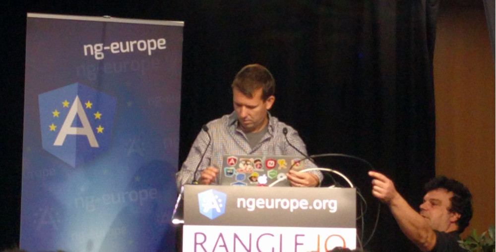
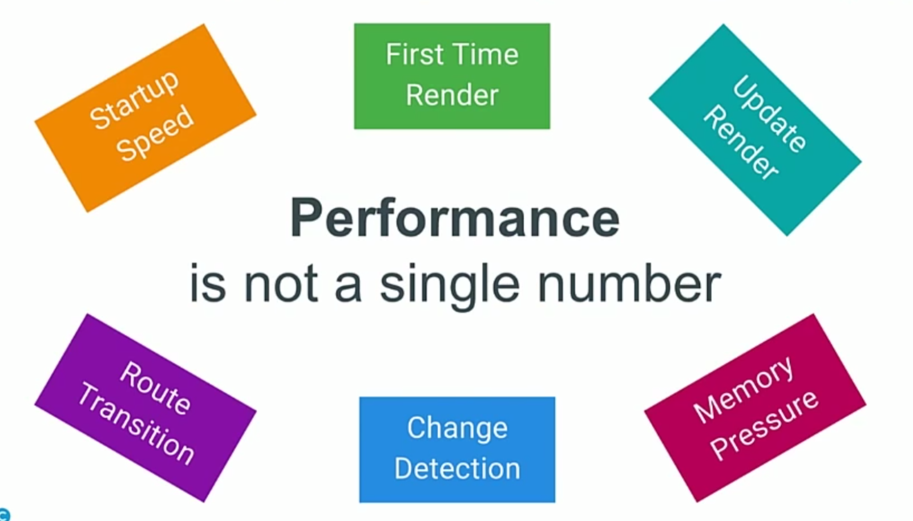
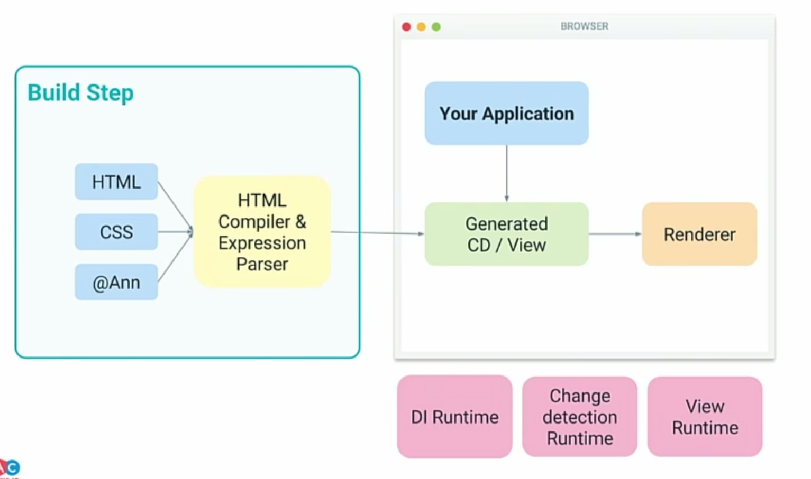

:doctitle: Keynote de Miško Hevery à ng-europe 2016
:description: Ng-europe Paris du 24 au 26 octobre 2016 retour sur la keynote de Miško Hevery à ng-europe 2016
:keywords: Angular, Angular2, ng-europe, Web
:author: Guillaume EHRET - Dev-Mind
:revdate: 2016-10-24
:category: Web
:teaser: Quoi de mieux dans une conférence Angular qu’une keynote de Miško Hevery, fondateur du framework venu parler des dernières nouveautés de la plateforme Angular
:imgteaser: ../../img/blog/2016/ngeurope/ngeurope-keynote-misko-hevery00.jpg
:figure-caption!:

Quoi de mieux dans une conférence Angular qu’une keynote de https://twitter.com/mhevery[Miško Hevery], fondateur du framework.

Angular peut être vu comme une véritable plateforme. On peut utiliser Angular pour faire des applications web destinées au desktop, au mobile, et même faire des applications natives.

Angular est construit sur différentes briques de bases

* Compilation : le code et les templates sont compilés pour avoir un code optimisé. Vous pouvez utiliser plusieurs langages comme ES6, Dart mais surtout TypeScript
* Synchronisation entre vos formulaires et les objets JavaScript (binding)
* Rendu (navigateur, natif,...)
* Injection de dépendances
* Décorateurs : si on faisait un parallèle ils ressemblent beaucoup aux annotations Java et permettent d’injecter du comportement à la compilation rendant le code moins fastidieux
* Zones elles représentent des contextes d’utilisation

Des modules annexes vont vous aider à construire des applications (i18n, animation, router).

Sur ces briques de base on va retrouver les composants https://github.com/angular/material2[Material] pour construire des applications, le https://mobile.angular.io/[Mobile Web Kit], https://github.com/angular/universal[Universal] qui permet de faire du rendering côté serveur...

Mais la grande force d’Angular est d’avoir proposé une solution très performante. Tout est fait pour qu’une application soit à la fois rapide au premier chargement et aussi au refresh. Les tests de performance montrent qu’Angular est 5 fois plus rapide que Angular 1.

Des efforts ont été fait pour transmettre moins de données

* La taille de la librairie est maintenant plus petite
* Vous pouvez faire du lazy loading avec le nouveau système de module et le router

Angular 2 utilise aussi les Web Workers pour ne pas surcharger le thread principal dédié au rendu. Pour accélérer le premier rendu vous pouvez utiliser Angular Universal pour déporter cette première phase sur le serveur.

Dans Angular 1 nous avions des problèmes de performance liées au databinding (mécanisme permettant de synchroniser automatiquement les données de la page et des données liées à un contrôleur JavaScript) et au dirty checking. Les données de la page sont liées à un ou plusieurs objets. Chaque fois qu’une propriété est changée l’arbre des objets est parcouru pour détecter les modifications (phase https://docs.angularjs.org/api/ng/type/$rootScope.Scope#$digest[digest]). Comme cet arbre est cyclique nous pouvons avoir plusieurs parcours.

En Angular 2 un composant ne peut accéder qu’à ces fils (la communication dans l’autre sens se fait par événements). L’arbre des objets n’est donc parcouru qu’une seule fois pour détecter les modifications (du haut vers le bas).

Pour simplifier le démarrage d’un projet vous pouvez utiliser https://github.com/angular/angular-cli[angular cli]. Dans cette optique de simplifier le travail des développeurs un gros effort a été fait pour que les IDE puissent proposer facilement de la complétion, de la détection d’erreur, des stacks d’erreur... Un module https://augury.angular.io/[Augury] développé par la communauté peut également être ajouté au Chrome DevTools pour inspecter les données de votre page liées à des composants Angular.

image::../../img/blog/2016/ngeurope/ngeurope-keynote-03.png[Fonctionnement Angular]

.Voir la vidéo
video::wpxnU62mNJ4[youtube]