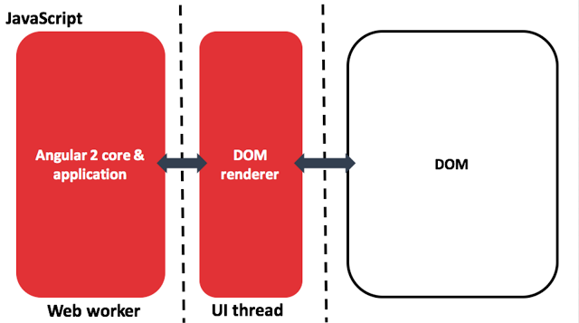

:doctitle: Angular 2 et Rendering : Universal, React Native, NativeScript
:description: Ng-europe Paris du 24 au 26 octobre 2016 Angular 2 et Rendering : Universal, React Native, NativeScript
:keywords: Angular, Angular2, ng-europe, Universal
:author: Guillaume EHRET - Dev-Mind
:revdate: 2016-10-24
:category: Web
:teaser: Angular 2 et rendering, retour sur ng-europe ayant eu lieu à Paris du 24 au 26 octobre 2016
:imgteaser: ../../img/blog/2016/ngeurope/ngeurope-rendering00.jpg

== https://twitter.com/marclaval[Marc Laval] Custom renderers in Angular 2 : https://docs.google.com/presentation/d/1Ay8TXGblvW0Y9rXXresTPdOeYwOJIts0XJzEOiKXuhE/edit#slide=id.p[slides]

Angular 2 a revu toute la partie rendering pour deux raisons

.photo de Philippe Chatel

Une application JavaScript s’exécute sur un seul thread. Pour éviter de ralentir ce thread principal qui cumule exécution des scripts et rendu de votre page, les web workers permettent d’exécuter du code en parallèle dans d’autres thread.

Comme nous faisons de plus en plus de traitement dans nos applications JavaScript vous pouvez avoir de gros ralentissements. Les appels distants en asynchrones on permis de résoudre ce problème il y a quelques années mais ces derniers se multiplient et quand les résultats arrivent et sont traités nous retombons dans les mêmes problèmes. L’avènement des framework est aussi problématique car toute la logique pour charger des ressources, les compiler, faire du routage accentue le nombre de traitements.

Avec les Web Workers le thread principal peut être réservé au rendering. Pour limiter les problèmes les web workers ont un accès limité aux API du navigateur. Ils ne peuvent par exemple pas interagir avec le DOM. Les échanges entre thread se font par messages

Exemple d’un worker initialisé dans le thread principal

[source, javascript, subs="none"]
----
var worker = new Worker('doWork.js');
worker.addEventListener('message', function(e) {
  console.log('Worker said: ', e.data);
}, false);
worker.postMessage('Hello World'); // Send data to our worker.
----

Voici à quoi ressemble un web worker. Dans notre exemple on s’abonne à l’événement message et dans notre cas on renvoie le même message au thread principal

[source, javascript, subs="none"]
----
self.addEventListener('message', function(e) {
  self.postMessage(e.data);
}, false);
----

Angular 2 se lance dans un web worker pour améliorer les performances. Nous allons avoir de grandes disparités dans les temps d’exécution entre les navigateurs dits “modernes” et les “anciens” qui trainent à implémenter les dernières normes du W3C.

Revenons à notre sujet sur le rendering. La refonte permet d’isoler les problématiques de rendering. Ainsi nous aurons le cheminement suivant

L’autre intérêt d’avoir dissocier le rendering du reste est que vous avez maintenant plusieurs solutions en sortie. Par défaut l’application est rendue sur un navigateur Internet mais avec Angular 2 vous pouvez avoir un rendering sous forme d’application mobile (react-native ou NativeScript).

Marc montre dans sa conférence comment écrire son propre render pour par exemple générer des fichiers markdown à partir d’une application angular. Le résultat est peut être peu utile mais l’exercice est intéressant pour montrer les possibilités de rendering dans Angular.

== https://twitter.com/manekinekko[Wassim Chegham] Getting Universal with Angular 2 http://slides.com/wassimchegham/angular2-universal#/[slides]

Avec Angular 2 le rendering peut également se faire côté serveur. Nous pouvons nous interroger de l’intérêt.

.photo de Philippe Chatel

Le premier est le Search Engine Optimization (SEO). Pour rappel les robots des différents moteurs de recherche parsent régulièrement les sites web pour indexer les différentes pages d’un site. Les robots ne comprennent pour la plupart que le HTML. Ils sont capables ensuite de parser les pages et de suivre les liens pour indexer plus en profondeur un site web.

Mais les applications Single Page propose un template de page principal souvent vide. En gros nous avons une page vide et c’est le JavaScript qui va générer le contenu. Hormis Google qui a enrichit son robot pour être capable de parser les sites écrits en Angular, la plupart des moteurs de recherche vont au plus simple.

Conséquence votre site n’est pas indexé. Vous pouvez faire des parades et intercepter l’agent appelant votre serveur. Si ce dernier est un robot vous pouvez renvoyer des pages statiques. Déporter le rendering côté serveur permet de résoudre ce problème, car dans tous les cas le HTML généré contiendra toutes les informations.

Le deuxième problème est lié au partage de lien dans les applications sociales. Quand vous indiquez une URL dans un message Twitter, Facebook, Google+, un aperçu du site est potentiellement joint au message. Mais si votre site utilise un framework comme Angular, ces services ne voient qu’une page blanche.

Le dernier point concerne le temps de chargement de votre application. On sait que les utilisateurs n’aiment pas attendre mais quand votre application Angular se charge elle peut mettre du temps à le faire en fonction de sa taille. Prémâcher le travail côté serveur peut dans ce cas encore, aider à améliorer ce qu’on appel le first loadtime.

Nous savons maintenant pourquoi cette fonctionnalité peut être intéressante mais que se passe t-il si une fois l’application chargée l’utilisateur effectue des actions (car la page est finalisée et le framework Angular non boostrapé).. La librairie preload.js permet d’enregistrer les différents événements et de les rejouer une fois que l’application est initialisée.

Après on peut se dire mais c’est cool on a du pre rendering mais qu’en est il quand vous utilisez votre application ? En fait tout se passe comme avant, si votre route a besoin de charger un nouveau module il le fait, si un nouveau template doit être affiché il est compilé et chargé. En gros le server side rendering permet surtout d’améliorer les performances au premier chargement.

Universal est le nom de code du projet où vou retrouverez toutes les informations pour faire du server side rendering en Angular. Pour le moment votre serveur doit être en .Net ou Node. Spring travaille sur le sujet pour nous fournir ça dans les applications Java.
