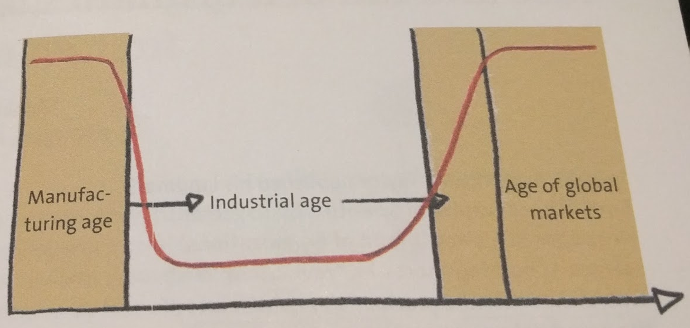
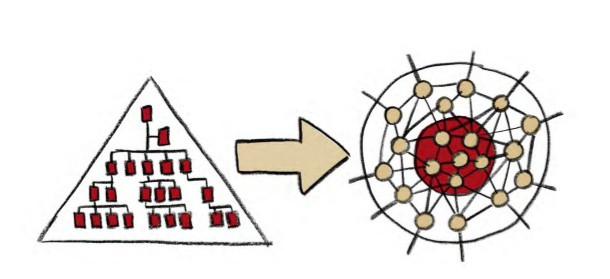
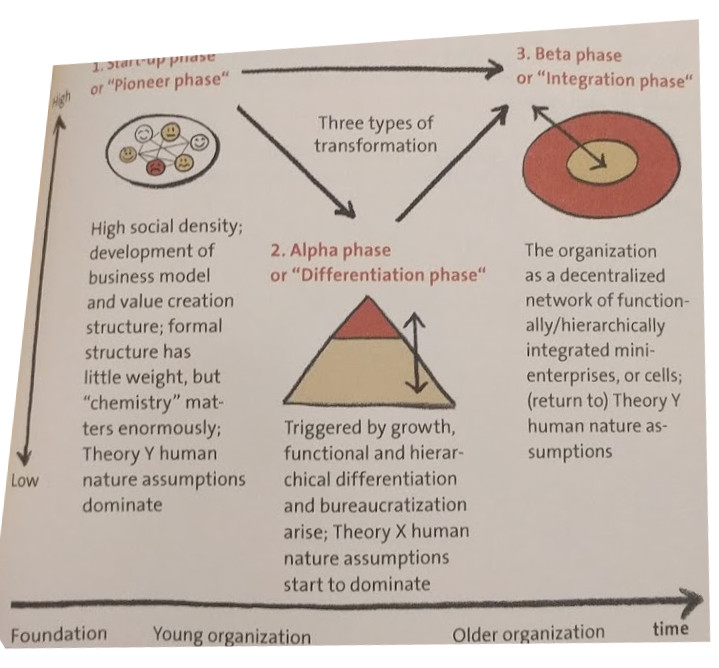

:doctitle: 	S'organiser pour la complexité
:description: S'organiser pour la complexité
:keywords: Agile method, Complexity
:author: Guillaume EHRET - Dev-Mind
:revdate: 2016-02-22
:category: Agile method
:teaser: Retour sur le livre « Organize for Complexity » de Niels Pflaeging qui essaye d’aider les grandes entreprises à amorcer leur réorganisation pour s’adapter au marché actuel. Niels est à l'origine du réseau BetaCodex qui fournit différentes ressources sur le management.
:imgteaser: ../../img/blog/2016/complexity_00.jpg

JJe voulais faire un retour sur le livre « http://www.organizeforcomplexity.com/[Organize for Complexity] » de Niels Pflaeging qui essaye d’aider les grandes entreprises à amorcer leur réorganisation pour s’adapter au marché actuel. Niels est à l'origine du réseau http://www.betacodex.org/papers[BetaCodex] qui fournit différentes ressources sur le management.

Ce livre est découpé en 7 parties et permet d'expliquer pourquoi les entreprises doivent changer. J'ai déjà abordé certains sujets dans d'autres articles inspirés des travaux de Niels ou d'autres.

* Complexity : why it matters to work and organizations : http://javamind-fr.blogspot.fr/2014/01/histoire-du-management-et-evolution-de.html[Histoire du management], http://javamind-fr.blogspot.fr/2013/12/comment-apprehender-la-complexite-dune.html[Comment appréhender la complexité d’une organisation]
* Humans at work : the secret ingredient : http://javamind-fr.blogspot.fr/2014/03/la-motivation-au-travail.html[La motivation au travail]
* Self organizing teams and the networked organization : http://javamind-fr.blogspot.fr/2014/01/sorganiser-pour-la-complexite-en.html[Décentraliser la chaine de responsabilités]
* Organizations as systems : designing for complexity
* Dynamic robust networks for all : this is how you pull it off
* Leadership in complexity
* Transform or stay stuck : the way forward

Niels explique que le problème actuel de la plupart des sociétés est principalement lié au management. Ce dogme qu'on appelle management n'est ni approprié aux personnes travaillant dans les entreprises, ni aux investisseurs, ni à l'entreprise elle même....

Le monde a évolué entre l'ère préindustrielle et aujourd'hui . Le marché est devenu complexe car les besoins ne sont plus uniformes. Si on revient au début de l'industrialisation (Fordisme avec la Ford T), plus personne ne veut la même voiture de la même couleur avec exactement les mêmes options. Les besoins sont à l'image de la société, un système complexe ou chaque demande peut être personnalisée.

Le management peut être comparé à la médecine au moyen âge. Les gens ne connaissaient rien à l'origine des maladies, les scientifiques n'étaient pas reconnus et nous étions dans un monde où les charlatans utilisaient des méthodes inspirées de croyances et de pratiques parfois assez éloignées de la science. Dans le monde de l'entreprise aujourd'hui les clients, les employés sont souvent saignés par des cadres tous formés sur le même moule ou par des consultants externes ne valant pas mieux.

Les problèmes complexes ne peuvent pas être résolus avec ce que l'on retrouve dans les pratiques managériales actuelles (organisation Alpha). Il faut quelque chose de nouveau. Un système basé sur le leadership (organisation Beta). Il faut abolir cette division entre les personnes qui pensent et celles qui réalisent.

Si nous essayons de dresser les différences entre les deux types d'organisations nous pouvons lister les points suivants

[cols=2*,options=header]
|===
|Alpha
|Beta

|Amorphe
|Dynamique

|Répétition
|Surprise

|Règles
|Principes

|Structure formelle / Commande
|Structure informelle / Création de valeur

|http://javamind-fr.blogspot.fr/2014/03/la-nature-humaine-theorie-x-et-y.html[Théorie X nature humaine]
|http://javamind-fr.blogspot.fr/2014/03/la-nature-humaine-theorie-x-et-y.html[Théorie Y nature humaine]

|Mécanique
|Systémique

|Centralisé
|Décentralisé

|Economie d'échelle
|Economie de flux

|Management
|Leadership

|Fonctions, départements, divisions
|Réseau de cellules comme "mini entreprise"

|Mode pull
|Mode push

|Décision poussée par le supérieur hiérachique
|Création de valeur ensemble

|Les clients et les investisseurs d'abord
|Les personnes d'abord, les clients ensuite

|Le management décide
|Le marché décide

|Les divisions fonctionnelles déterminent la structure
|L'intégration fonctionnelle détermine la structure

|Leadership centralisé et lié à la position
|Leadership décentralisé et tournant

|Les chefs gouvernent en mode command-and-control
|Les leaders servent l'équipe

|Les managers sont payés pour prendre des décisions
|Tout le monde prend des décisions importantes

|Les processus amènent la stabilité et doivent être suivis
|Les concertations amènent de la stabilité

|L'ensemble est la somme des individualités
|L'ensemble est la somme des interactions

|Décision prise le plus tôt possible
|Décision prise le plus tard possible

|Les équipes sont anticipées, le budget prime
|Les ressources sont engagées quand il faut, le dialogue prime

|Les RH et les chefs embauchent les ressources
|Les équipes embauchent leurs collègues

|Individualité, contrôle hiérarchique, bureaucratie
|Equipes, auto organisaton, pression sociale

|L'information est le pouvoir
|Transparence de l'information

|Les stratèges décident les autres suivent
|Tout le monde décide et réalise

|Système de bonus individuel pour driver la performance
|Partage des résultats

|Récompense et punition
|Tout le monde célèbre les victoires et assument les échecs

|Paie en fonction de la position des personnes dans la hierarchie
|Paie les personnes

|Gestion de projet, projet en mode waterfall
|Méthodes agiles mettant le client au coeur des choses

|Encourage les individualités
|Encourage les interactions

|Investissement court terme
|Investissement long terme

|...
|...

|===

Le problème trouve son origine au moment où les sociétés ont besoin d'évoluer, de changer de taille. Au lieu de mettre en place des bureaucraties il faut essayer de dupliquer les cellules originelles

Je vous conseille vivement la lecture de ce livre qui est assez rapide et qui peut vous apporter certaines réponses si vous essayer de comprendre ou optimiser l'organisation de votre société.