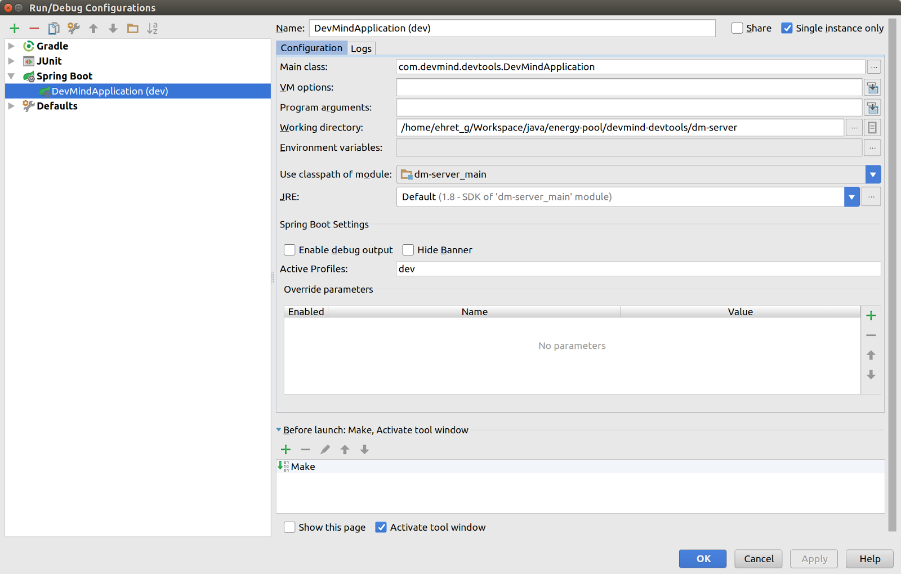

:doctitle: Optimiser son quotidien de développeur avec Spring DevTools
:description:  Optimiser son quotidien de développeur avec Spring DevTools
:keywords: Java, SpringBoot
:author: Guillaume EHRET - Dev-Mind
:revdate: 2016-06-29
:category: Java
:teaser: Les DevTools permettent d’automatiser le redémarrage et le rechargement de votre application lorsque les fichiers sources sont recompilés ou modifiés.
:imgteaser: ../../img/blog/2016/springdevtools_00.png

Je vais vous parler d'un ensemble d'outils mis à disposition par Spring pour améliorer le quotidien des développeurs des applications Spring Boot. Les http://docs.spring.io/spring-boot/docs/current/reference/html/using-boot-devtools.html[DevTools] permettent d’automatiser le redémarrage et le rechargement de votre application lorsque les fichiers sources sont recompilés ou modifiés.

== Configuration
Pour installer DevTools vous devez simplement ajouter la dépendance à votre projet SpringBoot. Par exemple avec Gradle vous ajoutez

[source, java, subs="none"]
----
compile "org.springframework.boot:spring-boot-devtools"
----

Il est préférable d’utiliser ces fonctionnalités uniquement en développement et non en production. Si vous oubliez d’enlever la dépendance, il y a tout de même une désactivation “automatique”. Spring Boot considère que vous êtes en production quand le jar de l’application est lancé via java -jar ou lorsque le classpath est personnalisé.

En mode développement DevTools est capable de désactiver certaines propriétés de cache susceptible d’être utilisées par des librairies Spring, notamment celles de templating (voir la https://github.com/spring-projects/spring-boot/blob/v1.3.5.RELEASE/spring-boot-devtools/src/main/java/org/springframework/boot/devtools/env/DevToolsPropertyDefaultsPostProcessor.java[liste des propriétés])

== Projet exemple

Avant d’aller plus loin il est toujours intéressant de se baser sur un exemple concret. Vous pouvez utiliser un de vos projets ou vous pouvez récupérer sous Github  https://github.com/Dev-Mind/devmind-devtools[cet exemple (SpringBoot / ES6)]. Ce starter utilise Gradle pour le packaging Java et Gulp/npm pour toute la partie Javascript. Vous avez peut être d’autres manières de faire mais personnellement j’aime bien découpler complètement les développements front et back de mes applications.

Si vous voulez tester ce projet sur votre poste vous pouvez le cloner et lancer la commande

[source, java, subs="none"]
----
./gradlew bootRun
----

Spring Boot va démarrer un serveur d’application Tomcat, et servir l’application sur http://localhost:8080.

L’application est découpée en 2 modules

* dm-client : pour la partie cliente initiée via https://github.com/google/web-starter-kit[Google WebKit Starter] (la configuration a été légèrement changée pour ne pas utiliser de framework CSS et faire de l’ES6)
* dm-server : la partie backend est écrite en Java et utilise Spring Boot

Pour la petite histoire je ne voulais pas rentrer dans la guerre des frameworks côté front et j’ai développé une application en utilisant JavaScript ES6 (ES2015) ainsi que l’API fetch pour charger des ressources web ou REST. Les scripts sont transpilés via Babel en ES5.

== Redémarrage automatique

Lorsque DevTools est ajouté à votre projet Spring, la compilation d'un fichier source va déclencher un redémarrage pour vous aider à tester au plus vite votre modification. La compilation n'est pas toujours automatique dans un IDE. Sous IntelliJ vous devez faire `_Ctrl+F9_` ou aller dans le menu `_Build_` > `_Make project_`.

Super mais quand est il de ma partie Javascript ?

Vous pouvez ajouter différentes propriétés pour surveiller d’autres ressources que des fichiers Java.

Voici un exemple en YAML

[source, javascript, subs="none"]
----
spring:
  profiles: dev
  resources:
    static-locations:
      - file:../dm-client/app/
      - file:../dm-client/build/.tmp/
  devtools:
    restart:
      additional-paths:
        - ../dm-client/app/
        - ../dm-client/build/.tmp/
      additional-exclude: "**/*.js, **/*.css, **/*.html"
----

Ici je surcharge les emplacements par défaut des ressources statiques via la propriété `_spring.resources.static-locations_`. J'indique mes répertoires utilisés en développement : `_../dm-client/app/_` et `_../dm-client/build/.tmp/_`.

Le second répertoire est le répertoire de travail dans lequel sont placés les fichiers ES6 transpilés en ES5 et les fichiers SASS compilés en CSS.

Par défaut SpringBoot sert toutes les ressources trouvées dans les répertoires `_classpath:/META-INF/resources/, classpath:/resources/, classpath:/static/, classpath:/public/_`.

Quand vous packagez votre application pour la production vous pouvez les placer dans un de ces répertoires compressés dans un jar (voir https://github.com/Dev-Mind/devmind-devtools/blob/master/dm-client/build.gradle[un exemple]).

J’indique à DevTools que les répertoires contenant mes ressources web doivent être scrutés (propriété devtools.restart.additional-paths) mais que les resources js, css ou html ne doivent pas déclencher un redémarrage complet (propriété devtools.restart.additional-exclude). Un simple reload des ressources suffit. En fait DevTools embarque un serveur LiveReload sans aucune configuration de votre part.

Vous n’avez qu’à ajouter une extension dans votre navigateur (exemple https://chrome.google.com/webstore/detail/livereload/jnihajbhpnppcggbcgedagnkighmdlei?utm_source=chrome-app-launcher-info-dialog[extension] pour chrome) et vos ressources statiques surveillées sont automatiquement rechargées dans votre navigateur dès qu’elles ont modifiées.

== Des petits trucs à savoir sur mon exemple

La surcharge des propriétés n’est activée que pour le profil dev. En production ceci serait inutile et je préfère servir les ressources préparées à cet effet (minifiées, concaténées, compressées….)

Dans IntelliJ vous pouvez spécifier le profil par défaut dans le lanceur SpringBoot

Dans mon exemple j’utilise des langages qui nécéssitent une compilation (SASS) ou une transpilation (ES6). Je souhaite donc que le répertoire .tmp contenant les ressources compilées avant traitement pre prod (minification, concaténation…) soient mises à jour dès que je modifie une ressource. Pour automatiser cette mise à jour j’utilise Gulp et ses watchers

Dans mon exemple vous pouvez lancer la tâche

[source, javascript, subs="none"]
----
gulp watch
----

Voici la configuration

[source, javascript, subs="none"]
----
gulp.task('watch', ['scripts', 'styles', 'html-template'], () => {
  gulp.watch(['app/**/*.html'], ['html-template', reload]);
  gulp.watch(['app/src/**/*.{scss,css}'], ['styles', reload]);
  gulp.watch(['app/**/*.js'], ['lint', 'scripts']);
  gulp.watch(['app/images/**/*'], reload);
});
----

Au final en développement je lance SpringBoot via IntelliJ  et un gulp watch. Je peux ensuite commencer à travailler sans me soucier du redémarrage de l’application ou de son rafraîchissement quand je modifie les sources de mon projet.

== Comment ça marche ?

Le mécanisme repose sur l’utilisation de 2 classloaders.

* Les classes contenues dans les librairies sont placées dans un premier classloader.
* Les classes que vous êtes susceptible de changer (celles dans votre IDE) sont elles chargées dans un second classloader qu’on appelera “restart classloader”

Quand votre application est redémarrée seul le “restart classloader” est pris en compte. Il est supprimé et recréé. Ce mode de fonctionnement permet d’avoir des temps de démarrage plus rapide qu’un redémarrage complet.

Le redémarrage peut être coûteux mais DevTools a un avantage par rapport à http://zeroturnaround.com/software/jrebel/[JRebel] ou https://github.com/spring-projects/spring-loaded[Spring Loaded], c’est qu’il n’a pas besoin d’ajouter des plugins aux IDE et en plus il est gratuit.

== A vous de jouer...

Voila je vais m’arrêter ici mais DevTools fournit également différents outils pour manipuler votre application si elle est déployée sur un serveur distant. Comme je ne l’ai pas encore mis en pratique je vous réoriente vers la http://docs.spring.io/spring-boot/docs/current/reference/html/using-boot-devtools.html#using-boot-devtools-remote[documentation].

La configuration est vraiment minimale pour les bénéfices et les gains de productivité apportés. Quand vous switchez de contexte et que vous n’avez pas ce genre d’outils, ils vous manquent vite.

J’avais envie d’écrire un article depuis un bon moment sur le sujet mais je n’avais jamais trouvé le temps. Le fait de regarder la vidéo de https://twitter.com/snicoll?lang=fr[Stephan Nicoll] et https://twitter.com/brianclozel?lang=fr[Brian Clozel] sur Spring pour le web a fini de me motiver.

video::sR8PyhJa-Zw[youtube]
