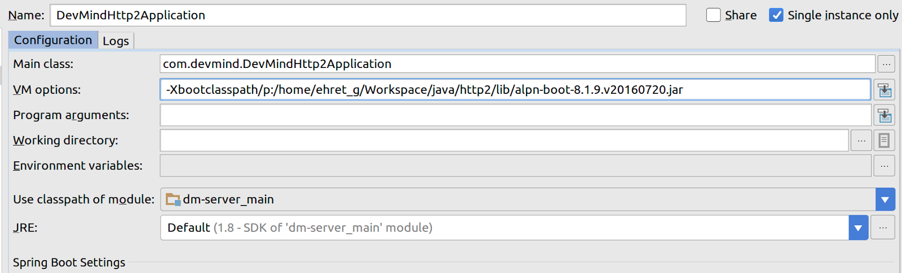

:doctitle: HTTP 2 comment l'utiliser dans une webapp Spring Boot
:description:  HTTP 2 comment l'utiliser dans une webapp Spring Boot
:keywords: Java, SpringBoot, HTTP/2
:author: Guillaume EHRET - Dev-Mind
:revdate: 2016-07-10
:category: Java
:teaser: Comment utiliser HTTP 2 dans une webapp Spring Boot
:imgteaser: ../../img/blog/2016/springhttp2_00.png

Le web se base sur le protocole HTTP (HyperText Transfer Protocol). Ce protocole permet d’échanger des documents hypermédia entre un client (un navigateur Internet) et un serveur. Le client ouvre une connexion, émet une requête et attend une réponse.

== HTTP 1 & 1.1

Au départ (en 1991), HTTP ne pouvait transférer que des fichiers. Le protocole a ensuite vite évolué (version 1.0 en 1996) pour permettre le transfert de tout type de fichiers comme des images, vidéos, scripts, feuilles de styles… La version 1.1 a permis d’améliorer les performances en permettant de réutiliser la même connexion. C’est la version la plus répandue aujourd’hui alors qu’elle date de pratiquement 20 ans. Il aura fallu attendre tout ce temps pour que les différents acteurs s’entendent sur une nouvelle version du protocole.

== HTTP 2

La version 2 a été finalisée en 2015 et est en cours de déploiement. Cette nouvelle mouture se veut tout d’abord à 100% rétrocompatible afin de ne pas à avoir à changer le code des différentes applications utilisant les versions anciennes du protocole. En gros les méthodes, statuts, codes erreur sont conservés.

Le but principal de HTTP2, est de rendre les requêtes moins coûteuses en ressources, afin d’améliorer les performances sur des devices où la qualité du réseau varie beaucoup.

HTTP se base sur les protocoles TCP et IP. Actuellement HTTP peut ouvrir plusieurs connexions TCP en parallèle ce qui peut congestionner le réseau. Les navigateurs mettent des garde fous en limitant ce nombre de requêtes et si votre site doit charger beaucoup de ressources, les temps de chargement peuvent être assez longs.

Avec HTTP 2 le but est de regrouper ces échanges sur la même connexion TCP.

HTTP 2 n’impose pas de sécuriser les échanges en cryptant les informations via un chiffrement TLS. Mais il va par contre limiter le surcoût dans le chiffrement. Certaines implémentations comme nous allons le voir plus loin et vous imposent des échanges sécurisés.

HTTP 2 permet le multiplexage pour échanger différents messages en même temps. Une connexion TCP est aujourd’hui clôturée à la fin d’un échange. En HTTP 2 un client pourra maintenir une connexion même si l’utilisateur clique sur un bouton ou choisit de fermer une connexion. Ceci permet au serveur de pouvoir faire du push.

== Spring Boot et HTTP 2

Regardons maintenant comment migrer une application Spring Boot pour que cette dernière puisse bénéficier de HTTP 2. Ces problématiques ne sont d’ailleurs pas liées à Spring mais au container dans lequel l'application sera déployée.

Par défaut une application Spring Boot utilise un Tomcat embarqué. Tomcat n’implémente HTTP 2 que depuis la version 8.5, Jetty depuis 9.3 et Undertow depuis sa version 1.2.

Vous pouvez consulter l’exemple de https://twitter.com/brianclozel?lang=fr[Brian Clozel] (Pivotal) sous https://github.com/bclozel/http2-experiments[Github] fait pour Jetty en HTTP 2. Je vous conseille aussi vivement de suivre le talk de Brian sur https://www.infoq.com/fr/presentations/mix-it-brian-clozel-http2-pour-le-developpeur-web[HTTP 2  à Mix-IT] en 2016.

Dans cet article nous allons détailler comment mettre en place undertow

== Changer les dépendances

Dans la première étape nous allons changer le build pour utiliser undertow à la place de Tomcat

[source, java, subs="specialchars"]
----
compile("org.springframework.boot:spring-boot-starter-web") {
    exclude module: "spring-boot-starter-tomcat"
}
compile "org.springframework.boot:spring-boot-starter-undertow"
----

== Configuration TLS

Vous pouvez créer votre propre keystore (.jks). Le but est de le référencer ensuite dans la configuration Spring

[source, javascript, subs="none"]
----
server:
  ssl:
    key-store: classpath:perf.jks
    key-store-password: DevMind
    key-password: DevMind
    protocol: TLSv1.2
----

Dans le cadre de vos tests vous pouvez générer une keystore simple avec cette ligne de commande. Pour de la prod vous pouvez passer par exemple par du https://letsencrypt.org/[let's encrypt]

  keytool -genkeypair -alias mycert -keyalg RSA -sigalg MD5withRSA -keystore perf.jks -storepass DevMind -keypass DevMind -validity 9999

HTTP 2 utilise un nouveau protocole appelé TLS ALPN (TLS application-layer protocol negotiation). Nous avons préciser la version dans le fichier de paramètres juste ci dessus (TLSv1.2). En attendant que le JDK intègre ce protocole en standard, nous devons ajouter dans le classpath une librairie lors du lancement de l’application (voir la liste)

  java -Xbootclasspath/p:<path_to_alpn_boot_jar> …

Dans mon exemple j’utilise Java 1.8.0_101 et la version de la librairie est alpn-boot-8.1.9.v20160720 (voir la http://www.eclipse.org/jetty/documentation/current/alpn-chapter.html#alpn-versions[liste])

Pour mes tests voici mon launcher dans IntelliJ

Maintenant tout est prêt pour faire de l’HTTP 2.

== Références

J'espère vous avoir montré que nous pouvons passer dès maintenant à HTTP 2. Voici quelques références qui m'ont servi à écrire cet article. Les sources sont disponibles sous Github.

* http://www.eclipse.org/jetty/documentation/current/alpn-chapter.html#alpn-versions
* https://github.com/bclozel/http2-experiments
* http://undertow.io/
