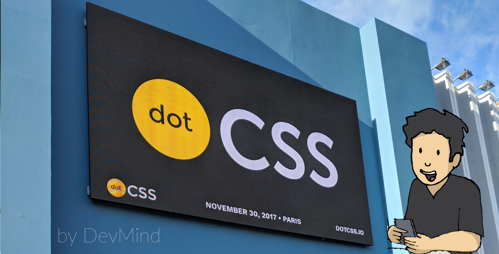
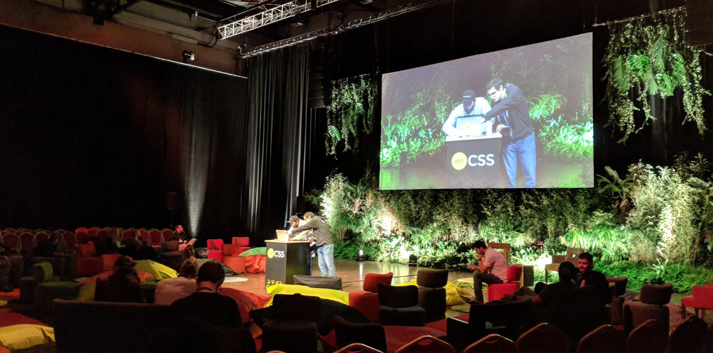
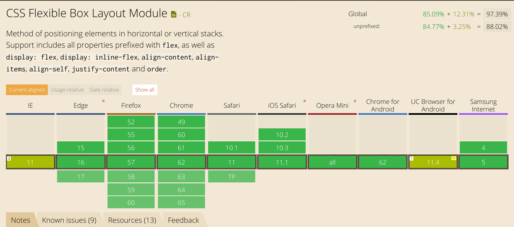
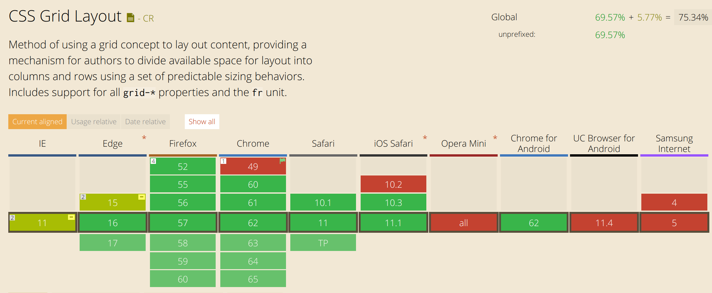
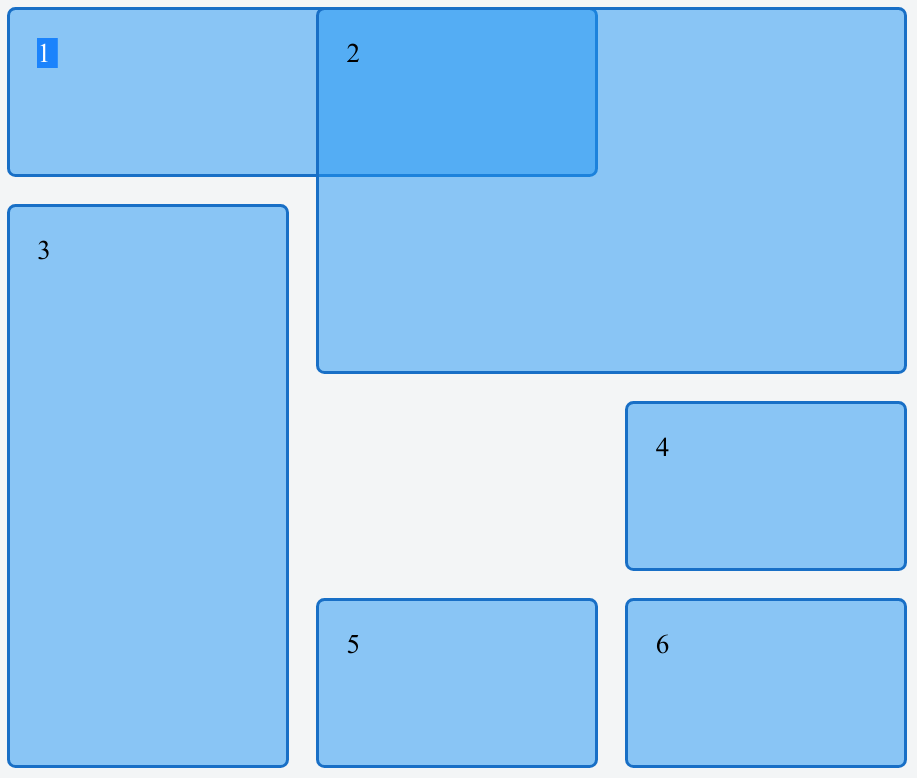
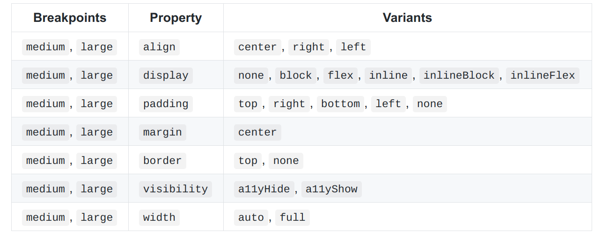
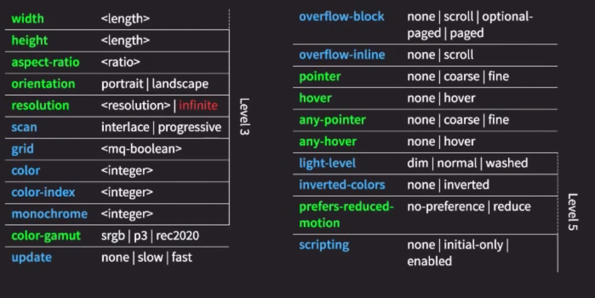
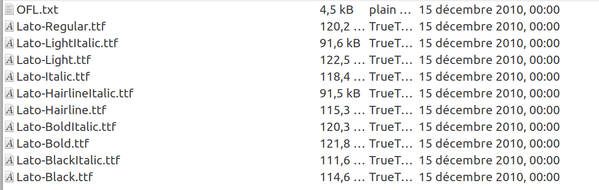
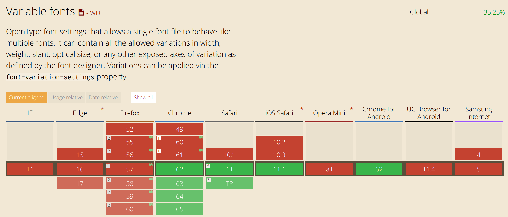
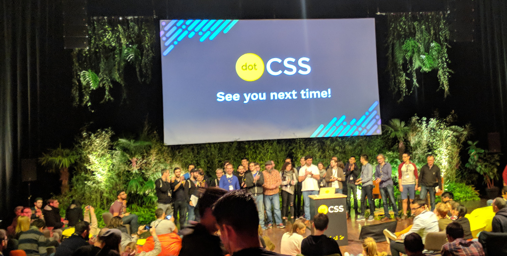

:doctitle: DotCSS 2017
:description:  Retour sur l'édtion 2017 de dotCSS
:keywords: Internet, Web, CSS, MediaQueries, Font
:author: Guillaume EHRET - Dev-Mind
:revdate: 2017-12-01
:category: Web
:teaser: Retour sur ma journée à dotCSS 2017 et focus sur les sélecteurs CSS, les fonts, les media queries... Plus de 700 personnes étaient venues de toute l'Europe pour cette édition.
:imgteaser: ../../img/blog/2017/dotcss_00.jpg

Dans cet article je reviens sur la conférence dotCSS qui a eu lieu à Paris le 30 novembre 2017.  Si vous voulez suivre les talks ils vont très rapidement être publiés sur la chaîne https://www.youtube.com/user/dotconferences[Youtube]  et via le https://www.2017.dotcss.io/[site web] .

Dans ce compte rendu je ne parle pas de toutes les sessions. Je n’ai sélectionné que celles qui m’ont vraiment fait ressortir des idées ou des concepts applicables dans mon quotidien proche ou futur.

== https://twitter.com/pixelastic[Tim Carry]

Avant de venir à la conférence, Tim était le seul speaker que je connaissais. Tim était venu l’an dernier à https://mixitconf.org[MiXiT] donner un talk sur le CSS intitulé https://mixitconf.org/2017/compagnonnage-css-et-vexillologie[_Compagnonnage, CSS et Vexillologie_].

Tim aime apprendre le CSS en essayant de trouver des projets concrets. Il avait fait sensation dans les conférences, en montrant projet sur les drapeaux entièrement créés en CSS. Allez jeter un cou d’oeil à http://pixelastic.github.io/css-flags/[CSS Flags].

Son nouveau délire était de créer un moteur de recherche exclusivement en CSS. Certes le langage CSS est assez limité pour gérer les conditions, les boucles, les fonctions… Mais il est très performant pour sélectionner des éléments dans le DOM via les selectors. Et les combinateurs permettent d’ajuster les styles à un sous ensemble d’éléments.

Si vous n’êtes pas familier avec cette notion, les sélecteurs sont en fait des blocs de déclaration CSS pour identifier les parties spécifiques à mettre en forme dans un document HTML. Si vous avez déja ajouté du code dans une feuille de style CSS, vous connaissez forcément les sélecteurs

* sélecteurs de type permettant de sélectionner des balises du langages HTML
[source, css, subs="none"]
----
h1 {
   font-size: 1.5em;
}
----
* Sélecteur de classes permettant de sélectionner des éléments via les valeurs définies dans les propriétés HTML de type class
[source, css, subs="none"]
----
.devmind_title{
   font-size: 1.1em;
   color: #2c2c2c;
}
----
* Sélecteur d’identifiant permettant de sélectionner l’élément défini avec un id particulier
[source, css, subs="none"]
----
#welcome{
   text-transform: uppercase;
}
----

Les sélecteurs d’attribut sont moins connus. Ils permettent de sélectionner les éléments HTML en fonction de leurs attributs et des valeurs de ces derniers. Un sélecteur d’attribut s’écrit avec des crochets "[]", dans lesquels on place le nom de l'attribut et éventuellement une condition sur la valeur de l'attribut.

* `_[attr]_` : sélectionne tous les éléments avec l'attribut `_attr_`, quelque soit sa valeur.
* `_[attr=val]_` : sélectionne tous les éléments avec l'attribut `_attr_`, mais seulement si la valeur est égale à `_val_`.
* `_[attr|=val]_` : sélectionne tous les éléments dont l'attribut `_attr_` vaut val ou commence par `_val_`
* `_[attr^=val]_` : sélectionne tous les éléments dont la valeur de l'attribut `_attr_` commence par `_val_`
* `_[attr$=val]_` : sélectionne tous les éléments dont la valeur de l'attribut `_attr_` finit avec `_val_`
* `_[attr*=val]_` : sélectionne tous les éléments dont la valeur de l'attribut `_attr_` contient la chaîne `_val_`
* `_[attr~=val]_`: sélectionne tous les éléments avec l'attribut `_attr_`, seulement si la valeur `_val_` correspond à une des valeurs `_attr_`, séparées par des espaces.

Au delà des sélecteurs il est intéressant aussi de s’attarder sur les combinateurs qui permettent de sélectionner des voisins à un sélecteur donné.

* Combinateur `_‘+’_` (voisin direct) permet de sélectionner les éléments qui suivent immédiatement un élément donné. Par exemple `_p + span_` permettra de cibler n’importe quel élément span qui suit un élémént  p
* Combinateur `_‘~’_` (voisins) permet de sélectionner les nœuds qui suivent un élément et qui ont le même parent. Par exemple : `_p ~ span_` cible tous les spans d’un élement
* Combinateur `_‘>’_` (enfants directs) permet de sélectionner les nœuds qui les fils directs d'un élément donné.
* Combinateur `_‘ ‘_` (blanc) permet de sélectionner les nœuds qui sont des descendants (pas nécessairement des fils directs) d'un élément donné.

== https://twitter.com/bdc[Benjamin De Cock]

Benjamin travaille pour la société https://stripe.com/fr[Stripe]. Sa présentation avait pour but de faire un focus sur la puissance de la propriété CSS https://developer.mozilla.org/fr/docs/Web/CSS/display[display] et notamment de https://developer.mozilla.org/fr/docs/Web/CSS/CSS_Grid_Layout[CSS Grid]  et dans une moinde mesure de CSS Flexbox.

Contrairement à quelques années en arrière, vous avez tous les outils aujourd’hui pour disposer facilement des éléments (selon une direction donnée via les flexbox) ou en découpant l’écran en zone (grid). Les flexbox sont utilisables partout

.Can i use flexbox

Et les CSS grid bientôt

.Can i use CSS Grid

Sur les Flexbox je vous laisse lire https://www.dev-mind.fr/blog/2016/flexbox_layouts_faciles.html[mon article] sur le sujet. Il contient un lien vers la très bonne vidéo de https://twitter.com/hsablonniere[Hubert Sablonière] sur le sujet.

Chez Stripe, Benjamin a mis en place des feuilles de style à base de grilles (CSS grid) pour définir le layout commun à tous les écrans. Les animations sont ensuite appliquées sur ce layout complet et ceci a considérablement simplifier leur code.

Je ferai certainement un article sur CSS GRid prochainement mais voici un exemple simple. Si vous avez le HTML suivant

[source, html, subs="none"]
----

  
1

  
2

  
3

  
4

  
5

  
6

----

Vous pouvez utiliser CSS grid pour indiquer que ce code s’affiche sous forme de grille. Cette spécification permet de définir les contraintes
* sur les colonnes et les lignes (nombre total et tailles minimales ou maximales) et
* sur chacune des cellules pour indiquer où les placer sur la grille et sur combien de colonnes ou de lignes

[source, css, subs="none"]
----
.grid{
		display: grid;
    grid-template-columns: repeat(3, 1fr);
    grid-gap: 1em;
    grid-auto-rows: minmax(100px, auto);

	}
  .grid > div {
    border: 2px solid rgb(24,111,198);
    border-radius: 5px;
    background-color: rgba(33,150,243,.5);
    padding: 1em;
   }
	.one {
    grid-column: 1 / 3;
    grid-row: 1;
  }
  .two {
    grid-column: 2 / 4;
    grid-row: 1 / 3;
  }
  .three {
    grid-column: 1;
    grid-row: 2 / 5;
  }
  .four {
    grid-column: 3;
    grid-row: 3;
  }
  .five {
    grid-column: 2;
    grid-row: 4;
  }
  .six {
    grid-column: 3;
    grid-row: 4;
  }
----

Ce qui donnera le visuel suivant

.Exemple CSS Grid

Vous pouvez voir le https://jsfiddle.net/devmindfr/awgo1u11/[JsFiddle]

Une astuce intéressante a été montrée pendant le talk. Il est important de gérer les navigateurs qui ne savent pas interpréter une version trop récente d’une spécification CSS. Vous pouvez par exemple charger une feuille de style de fallback dynamiquement en JavaScript si votre navigateur n'implémente pas encore les CSS Grid. Par exemple

[source, javascript, subs="none"]
----
if(!'grid' in document.body.style){
  var head  = document.getElementsByTagName('head')[0];
  var link  = document.createElement('link');
  link.rel  = 'stylesheet';
  link.type = 'text/css';
  link.href = 'styles/fallbax.css';
  head.appendChild(link);
}
----

== https://twitter.com/akdetrick[Adam Detrick]
Adam travaille chez https://www.meetup.com[Meetup]. Lorsqu’un projet commence à grossir, à avoir plusieurs équipes, le CSS suit la même tendance, il grossit sans cesse. Comme le disait Melvin Conway, “organizations which design systems are constrained to produce designs which are copies of the communication structures of these organizations”...

Le CSS augmente et il est de plus en plus compliqué à lire. Nous avons tendance à ne pas réutiliser les styles existants car nous avons toujours peur de casser quelque chose… Malheureusement on en crée de nouveaux, faisant encore grandir la complexité. Au bout d’un moment, quand on arrive à ne plus avoir ce que l’on veut à l’écran, on introduit les `_!important_`.  Pour rappel cette propriété indique que nous cassons l’héritage des styles, et là nous commençons à toucher le fond.

Mais il faut garder à l’esprit que le CSS est une ressource bloquante. Le navigateur doit l’interpréter pour être capable d’afficher les éléments à l’écran.  Plus vos feuilles de style seront grosses et complexes plus les pages seront longues à s’afficher.

Il est important de maîtriser les styles que l’on défini. Le problème n’est pas technique mais humain.

Plusieurs pistes

* Bannir le `_!important_`
* Définir une nomenclature de styles en utilisant des noms de style ni trop précis ni trop abstrait
* Mettre en place une documentation des styles utilisés. Il existe plusieurs outils pour générer automatiquement cette documentation.

Niveau nomenclature Adam proposait d’utiliser la notation suivante
[source, javascript, subs="none"]
----
.at[Breakpoint]_[property]--[variant]
----

Les breakpoint correspondent aux changements d’affichage au niveau des media queries. Par exemple

Vous pouvez par exemple définir un style `_.atLarge_margin--center_`. Il est important de définir des règles simples que tout le monde peut retrouver ou partager.

== https://twitter.com/frivoal[Florian Rivoal]
Florian est membre du CSS working group et il est venu nous parler des prochaines évolutions du langage, et plus précisément des dernières évolutions sur les Media Queries.

Pour rappel une media query (ou requête média) définit un type de média et permet d’appliquer un ensemble de styles différents en fonction des particularités du média : largeur, hauteur, couleurs....

Les media queries ont connu plusieurs évolutions

* CSS 2.1 : introduction de `_@media screen_` (écran), `_@media print_` (imprimante)
* Le niveau 3 a permi de définir des caractéristiques du media afin d’être plus générique (largeur minimale, maximale….)
* Les niveaux 4 et 5 arrivent et vont permettre de simplifier la syntaxe

Par exemple aujourd’hui on écrit
[source, css, subs="none"]
----
@media (min-width: 20em) and (max-width: 40em){
}
----

Demain nous écrirons
[source, css, subs="none"]
----
@media (20em <= width <= 40em){
}
----

Autre exemple, nous pouvons aujourd’hui cumuler les déclarations pour être plus précis. Les déclarations peuvent être illisible comme par exemple
[source, css, subs="none"]
----
@media (min-width: 20em), not all and (min-height: 40em){
   @media not all and (pointer:none){
   }
}
----
Alors que demain nous pourrons simplement écrire

[source, css, subs="none"]
----
@media ((width >= 20em) or (height < 40em)) and (not (pointer:none)){
}
----

Voici le récapitulatif des propriétés

.Media queries level 3, 4 and 5

Malheureusement ceci n’est pas encore implémenté dans les navigateurs et nous devrons encore attendre avant de les utiliser.

== https://twitter.com/lorp[Laurence Penney]

Laurence est venu nous parler de l’utilisation des fonts dans une application web. Quand nous voulons utiliser une police d’écriture (par exemple Lato), nous avons plusieurs niveaux de personnalisation.

Par exemple quand voulez utilisez la police d’écriture Lato vous déclarez dans votre page que vous utilisez la famille Lato

[source, css, subs="none"]
----
<link href="https://fonts.googleapis.com/css?family=Lato" rel="stylesheet">
----

Mais derrière si vous téléchargez cette famille vous avez plusieurs fichiers (dont la taille peut être non négligeable) en fonction des styles

.Fonts de la famille Lato

Les possibilités de déclinaison sont énormes et nous pouvons définir des dizaines de dimension
* Taille
* Couleur
* Espacement
* Style
* Poids : Largeur du trait de thin à bold
* …

Avec les dernière versions de OpenType (2016 v1.8) le but est de définir un seul fichier et de définir à l’intérieur les variations autorisées. Ces variations sont personnalisables en CSS via les `_font-variation-settings_`

Malheureusement pour le moment peu de navigateur permettent leur utilisation

.Can i use font-variation-settings

Si vous voulez tester les possibilités vous pouvez aller sur le site http://www.axis-praxis.org/specimens/dunbar[AxisPraxis], développé par Laurence

A la fin de sa présentation Laurence nous a montré des travaux effectués sur des fonts contenant des icônes pour montrer que les fonts pourraient même servir dans un futur proche à créer des animations

Merci à toute la team dotCSS pour l'organisation de cet event

