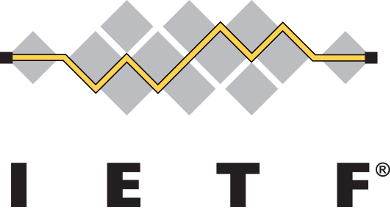
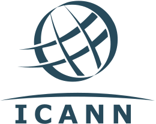

:doctitle: Retour sur la création d'Internet
:description:  Retour sur la création d'Internet
:keywords: Internet
:author: Guillaume EHRET - Dev-Mind
:revdate: 2017-11-20
:category: Web
:teaser: On mélange souvent les termes Web et Internet. Nous allons remonter dans l'histoire au cours de plusieurs articles et expliquer les différences entre ces deux notions.
:imgteaser: ../../img/blog/2017/internet_00.png

On mélange souvent les termes Web et Internet. Nous allons remonter dans l'histoire au cours de plusieurs articles et expliquer les différences entre ces deux notions.

== Un peu d'histoire de l'informatique

Les premiers ordinateurs sont apparus pendant la seconde guerre mondiale. Ils étaient initialement utilisé pour effectuer des calculs simples ou plus compliqués comme des opérations de cryptage / décryptage (https://fr.wikipedia.org/wiki/Colossus_(ordinateur)[Colossus par exemple] . Les premiers ordinateurs étaient gigantesques et l’arrivée du transistor a permis leur miniaturisation et leur lente démocratisation.

NOTE: Les transistors sont des composants électroniques actifs qui peuvent jouer plusieurs rôles : interupteur, amplificateur de signal, stabilisateur de tension... Ils ont remplacés les tubes électroniques qui étaient volumineux, fragiles et très consommateurs de courant.

Une fois que la mise en place des ordinateurs individuels a été possible, il restait à résoudre les problèmes de communication entre les ordinateurs (mise en réseau).

En 1958 le premier modem a été créé par les laboratoires Bell et permettait de transporter des données binaires sur un réseau téléphonique.

== Les premiers réseaux

Les premières initiatives sont apparues fin des année 60, début 70 aux Etats Unis mais aussi en Europe en Grande Bretagne et en France.

image::../../img/blog/2017/internet_00.png[Internet]

=== Réseau ARPANET
Le premier réseau, ARPANET est créé par la défense américaine à la fin des années 60. Il avait pour but de relier des sites stratégiques et les universités américaines (4 ordinateurs reliés en 1969 et 23 en 1971). Le développement d’ARPANET était centré autour des RFC (Request for comments). ARPANET a aujourd’hui disparu (depuis 1990) mais les RFC sont restées.

NOTE: Une https://fr.wikipedia.org/wiki/Request_for_comments[RFC] est un document technique décrivant une technique, un composant...  Ces documents sont soumis au groupe de normalisation d’Internet (https://www.ietf.org/[IETF] : Internet Engineering Task Force) et peuvent aboutir à une standardisation.
Une RFC peut avoir plusieurs status : Proposed Standard, Draft Standard et Internet Standard

=== Réseau NPL
A la même période en Europe (1970), le http://www.npl.co.uk/[National Physical Laboratory] (Royaume-Uni) a mis en place son propre réseau basé sur la commutation de paquet (packet-switching). Cette initiative est la première implémentation de ce mode de transmission de données (en 1976 le réseau reliait 12 ordinateurs et 75 terminaux)

=== Réseau Merit
Au Etats Unis, au Michigan en 1971 nous avons également des travaux qui vont dans le même sens avec le réseau MERIT (Michigan Educational Research Information Triad) qui avait pour but de relier les 3 universités publiques de l’état (but atteint en 1972).

=== Réseau Cyclades
En France nous pouvons citer les travaux de https://fr.wikipedia.org/wiki/Louis_Pouzin[Louis Pouzin] qui a créé le réseau Cyclades en 1971. Ce réseau expérimental utilise également la commutation de paquet. Le but était de trouver des alternatives à ARPANET et aider la recherche.

.Louis Pouzin

C’est la première intiative dans l'histoire où les machines sont responsables de la fiabilité des données transmises. Les données sont découpées en paquet (datagrammes) et sont ensuite réconciliées à l’arrivée. L’émetteur ne sait pas si le récepteur a bien reçu les paquets.

Le réseau s’est heurté au monopole des PTT françaises, qui ont fait un choix différent et misé sur une solution à commutation de circuit qu’ils trouvaient plus fiable et moins coûteuse. Le projet a été abandonné en 1978 mais les concepts ont été repris lors de la mise en place du protocole TCP/IP et de la naissance d’Internet.

=== Réseau X25
L’Union internationale des télécommunications a essayé de normaliser les échanges réseaux par commutation de paquets via le réseau X25. X25 utilise la commutation de paquets mais est construit sur le concept de circuit virtuels émulant des connexions téléphoniques traditionnelles. Les grands opérateurs de télécoms (tous publics à cette période) ont adopté cette norme.

La première implémentation date de de 1974 au Royaume Uni. En 1978, le British Post Office (UK), Western Union International (USA) et Tymnet (USA) collaborent pour mettre en place le premier réseau commuté international (IPSS : International Packet Switched Service).

En 1979 CompuServe se base sur ce réseau pour proposer le premier service de courrier électronique.

En France France Telecom crée une filiale, Transpac spécialisée dans la fourniture d'accès réseaux pour les entreprises. Transpac est à l’origine

* du https://fr.wikipedia.org/wiki/Minitel[Minitel] (1980) qui reposait sur le réseau X25 français et
* du réseau monétique https://fr.wikipedia.org/wiki/%C3%89change_t%C3%A9l%C3%A9matique_banque-clients[ETEBAC] (1991).

Le principal atout de X25 était l'absence de perte de donnée, garantie par de multiples contrôles et la gestion automatique de la retransmission des paquets éventuellement perdus. Ce réseau a été arrêté en France en 2012.

=== Réseau Usenet
En 1979 des étudiants ont l’idées de transférer des news et des messages via de simple scripts shell en utilisant UUCP (Unix to Unix Copy Protocol).  UUCP permet les échanges de fichiers entre 2 machines et permet aussi d’exécuter des commandes sur une machine distante. Les données sont d’abord mis dans une file d’attente et la machine distante les récupère au moment voulu.

Les réseaux UUCP se répandirent rapidement, grâce à leur coût peu élevé et leur capacité à utiliser les lignes téléphoniques existantes, comme les liens X.25, les connexions ARPANET...

== Unification des réseaux

=== Les protocoles TCP / IP
Comme nous venons de le voir il y a eu plusieurs initiatives de mise en place de réseaux. Mais chacun utilisait sa propre méthode de communication et ils ne pouvaient pas être interconnectés les uns avec les autres.

L'idée d’un réseautage à architecture ouverte a été introduite en 1972 par https://fr.wikipedia.org/wiki/Robert_Elliot_Kahn[Robert E. Kahn], peu après son arrivée à https://www.darpa.mil/[DARPA] (agence qui est à l’initiative d’ARPANET).  Le nom de son programme de recherche était appelé « Internetting » (interréseautage). Il recrute https://fr.wikipedia.org/wiki/Vint_Cerf[Vinton G. Cerf] et ils reprennent ensemble certains concepts mis en place dans le réseau Cyclades de https://fr.wikipedia.org/wiki/Louis_Pouzin[Louis Pouzin].

.Robert E. Kahn co-créateur de TCP / IP

.Vint Cerf co-créateur de TCP / IP
image::../../img/blog/2017/internet_03.jpg[Vint Cerf]

Leur but était de réduire le réseau physique à son strict minimum, le transport. Ce sont les machines qui sont responsables de la réconciliation des messages. Si un morceau du message (paquet) s’est perdu elles redemandent sa retransmission. En 1973 Kahn et Cerf présentent le protocole TCP / IP.

Le *protocole TCP* (Transmission Control Protocol) fournit les services de transport et d’acheminement : contrôle de flux et récupération des paquets perdus.

Le *protocole IP* (Internet Protocol) permet l’adressage et la transmission de paquet simple.

Le *protocole UDP* (User Datagram Protocol) apparait aussi dans la spécification et fournit un accès direct aux services de base IP (sans le contrôle de flux ou la récupération de paquets).

Le terme *Internet* désigne un réseau basé sur les protocoles TCP/IP . Il a été adopté dans la première RFC publiée sur le protocole TCP. Internet a été conçu comme une infrastructure globale permettant de relier tous les réseaux existant entre eux.

=== Le développement d’Internet

La technologie Ethernet, développée en 1973 par https://www.xerox.com/[Xerox Parc] est commercialisée en 1980. Elle s’est très vite généralisée pour créer des réseaux dans les entreprises. Les liaisons transatlantiques sont passées en TCP / IP en 1984 et tout ces réseaux ont pu être regroupés pour former Internet.

Le passage de quelques réseaux à une multitude de réseaux entraîna la mise en place de plusieurs concepts.

==== Les classes de Réseau
Le nombre d’adresses IP dans sa version acuelle (IPv4) est limitée à un peu plus de 4 milliards (stockage sur 32 bits). Pour répartir au mieux les adresses des classes de réseaux ont été créées (A, B, C)

* la classe A pour les grands réseaux à échelle nationale,
* la classe B pour une échelle régionale et
* la classe C pour les réseaux locaux.

Comme le nombre d’objet connecté grandit toujours de manière exponentielle, une nouvelle version du protocole (IPv6 ou IPng) va permettre de résoudre ce problème d’adresse tout en améliorant d’autres points.

==== Les DNS
Les adresses IP sont une suite de numéro difficile à retenir. Un mécanisme d’alias pour faire correspondre une adresse à un nom de domaine a été mis en place en 1983, c’est le *DNS* Domain Name System.

Les algorithmes de routage ont du aussi évolué avec les Exterior Gateway Protocol (EGP) utilisés pour relier les régions entre elles et les Interior Gateway Protocol (IGP)

On pourrait écrire beaucoup de choses sur le protocole IP notamment sur la nouvelle implémentation. Si vous êtes intéressés par le sujet je vous réoriente vers http://www.commentcamarche.net/contents/524-le-protocole-ipv6[cet article].

=== La généralisation d’Internet

Le développement en Europe a été d’abord été axé sur X25. En 1984 le https://home.cern/fr[CERN] (Conseil européen pour la recherche nucléaire) tabla pour une utilisation plus étendue du protocole TCP/IP. Le réseau européen fut relié à Internet en 1989.

1989 marque aussi l’entrée sur Internet de l’Australie et du Japon.

En 1991 comme nous le verrons dans un prochain article le World Wide Web fut créé et depuis le nombre de pays se connectant à Internet n’a été que grandissant.

Il est intéressant de voir la croissance du nombre de machines connectées à Internet

* 1984 : 1.000 ordinateurs connectés
* 1987 : 10.000 ordinateurs connectés
* 1989 : 100.000 ordinateurs connectés
* 1992 : 1.000.000 ordinateurs connectés
* 1996 : 36.000.000 ordinateurs connectés
* 2000 : 368.000.000 ordinateurs connectés

Aujourd’hui nous avons plus de 1,5 milliards d’ordinateurs connecté et 2 milliards de smartphone

La croissance rapide d’Internet est aussi liée à l’accès libre et gratuit de toutes les spécifications (RFC Request for comments). Ces mémos étaient censés être une façon rapide et informelle de partager des idées avec d'autres chercheurs. Une RFC était remplacée par une autre quand elle était complétée jusqu’à l'obtention d’un consensus. On pouvait ensuite avoir un document de spécification. Au fil du temps les RFC sont devenues les documents de référence.

== Régulation Internet

=== IETF (Internet Engineering Task Force)
Toute la communauté derrière Internet ne souhaitait qu’aucune personne, aucune entreprise ou aucune organisation prennent la main sur le réseau.

Mais dans un système anarchique c’est difficile de trouver un consensus, de mettre en place des contrôles. L’ https://www.ietf.org/[IETF] a été mise en place en 1986.

C’est un groupe informel, ouvert à toute personne motivée. L’IETF (Internet Engineering Task Force) maintient des  groupes de travail répartis sur une dizaine de domaine. Chaque groupe discute sur des listes de diffusion d’un projet en cours de développement. Lorsque le consensus est atteint le projet est diffusé sous forme de RFC.

L'IETF se réunit 3 fois dans l’année.

Chaque domaine est dirigé par une ou deux personnes. Les directeurs de domaine nomment le ou les directeurs de chaque nouveau groupe de travail.

=== ISOC (Internet Society)
http://www.isoc.fr/[ISOC] est une association (droit américain) à vocation internationale. L’association regroupe 28 000 membres venant de 170 pays, ainsi que plus de 80 organisations et 90 filiales réparties dans le monde entier.

On en retrouve une en France. Cette association a été crée en 1992 par les pionniers de l’Internet afin de coordonner son développement.

L’ISOC finance et veille à la bonne marche de l’IETF via

* https://www.iab.org/[Internet Architecture Board] (IAB)  :  ce comité se charge de l'orientation à long terme d'Internet, et donc des activités données à l’IETF.
* https://www.ietf.org/iesg/[Internet Engineering Steering Group] (IESG)  : ce groupe pilote le processus de normalisation d’une RFC pour que cette dernière deviennent un standard Internet ou non. Il est constitué par des directeurs des groupes de travail de l’IETF

Le financement de l’ISOC provient des organisations membres, et de l’organisme contrôlant le domaine Internet

=== ICANN (Internet Corporation for Assigned Names and Numbers).

https://www.icann.org/fr[ICANN] est l’autorité de régulation d’Internet. C’est une organisation à droit privé à but non lucratif mais elle est décriée par de nombreuses personnes à cause de ses liens très étroit avec le gouvernement américain. Elle a été fondée en 1998 à la suite d'une directive du département du commerce américain et elle va rester sous tutelle des Etats Unis jusqu'à ce qu'il remplisse un certain nombre d'objectifs.

Bien évidemment la complétude de ces objectifs est toujours niée par le gouvernement américain. Face à la colère de nombreux pays l’ICANN devait se réorganiser en 2014. Mais finalement au bout de 2 ans l’ICANN a trouvé son indépendance le 1er octobre 2016 mais elle reste soumise aux lois américaines.

On peut se demander mais à quoi sert cet organisme ? Son rôle principal qui lui assure d’ailleurs se revenus est lié à la vente des noms de domaine et les adresses IP. C’est eux qui assurent également la gestion des serveurs racines du DNS (Domain Name System). Les serveurs racines les noms de domaine de premier niveau .fr, .com…. Elle délivre ensuite un droit à des sociétés comme VeriSign pour les domaines en .com, l’Afnic pour les domaines .fr….

Le fait que l’ICANN suive le droit américain entraîne que tout arbitrage est fait par le procureur général de Californie et en dernier recours par le département du Commerce des Etats Unis. Il était donc légitime que tous les pays fassent pression pour que cet organisme devienne indépendant.

Mais il existe des réseaux alternatifs. Les chinois ont leur propre DNS racine et un .com.cn apparait pour un chinois en .com (d’où la facilité de la censure...). Un site chinois ne sera accessible que s’il en fait la demande aux autorités. Vu le nombre d’internautes chinois (22% et le nombre monte en flêche) nous avons deux Internet en parallèle.

Ces dernières années l’ICANN s’est ouvert au monde. Les noms de domaine ne sont plus exclusivement en alphabet latin depuis 2009.  Ils peuvent être rédigé avec des caractères arabes, chinois, coréens, japonais ou cyrilliques.

Depuis 2013 vous pouvez utiliser n’importe quel nom de domaine de premier niveau à condition toutefois de débourser 185.000 € au départ et 25.000€ ensuite par an.

