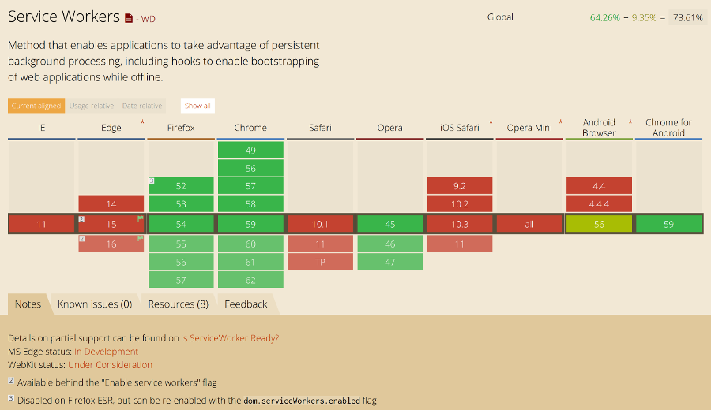
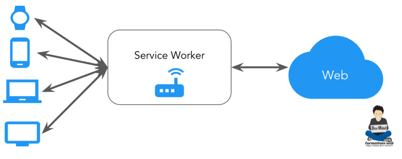
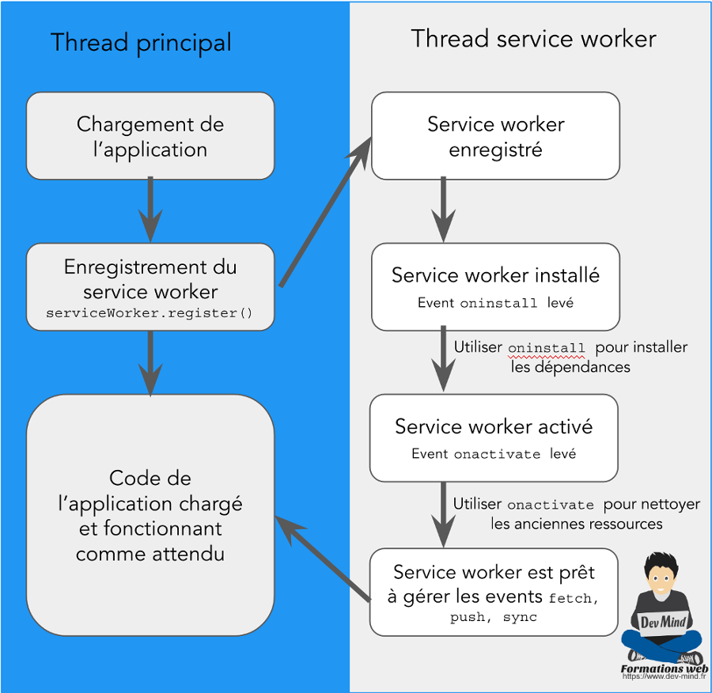

:doctitle: Les services workers
:description:  Comment marche les progressive webapps et focus sur les services workers
:keywords: Web, PWA, ServiceWorker
:author: Guillaume EHRET - Dev-Mind
:revdate: 2017-06-20
:category: Web
:teaser: Les services workers sont un moyen technique pour arriver à mettre en place certains concepts d'une progressive webapp comme le fonctionnement hors ligne ou sur un réseau défaillant. Regardons comment fonctionne les services workers.
:imgteaser: ../../img/blog/2017/service_worker_00.png

Si vous suivez l'actualité Dev-Mind (https://www.dev-mind.fr/formation_optimiser.html[formation] ou https://www.dev-mind.fr/experience.html#conferences[conférence] sur les performances web), j'ai introduit à plusieurs occasions le concept des https://developers.google.com/web/progressive-web-apps/[progressive webaps] et des https://developer.mozilla.org/fr/docs/Web/API/Service_Worker_API[service workers].

== Progressive Webapp et service worker

Revenons un peu à la base si vous ne connaissez pas ces termes.

* Les *progressive webapps* (PWA) sont un concept poussé par Google. Le but est de pousser les développeurs à créer des applications web modernes facilitant la navigation des utilisateurs. Les évolutions des standards du web, font que les applications proposées au sein d'un navigateur se rapprochent de plus en plus, de ce que l'on peut faire avec des applications natives. Une application web, doit s'adapter aux tailles des écrans des utilisateurs, être rapide à charger, doit marcher quand le réseau est faible ou inexistant, doit pouvoir faire des notifications sur un téléphone...
* Les *services workers* sont un moyen technique pour arriver à mettre en place certains concepts d'une progressive webapp comme le fonctionnement hors ligne ou sur un réseau défaillant. Il n'y a pas de magie, les services workers permettent simplement de recharger les données déjà chargées et qui ont été persistées dans un cache local. Les services workers permettent de faire ce travail de l'ombre et de charger en tâche de fond les ressources dont vous avez besoin sur votre site et de les servir pour améliorer les performances ou lorsque vous n'avez pas de réseau.

Je vais revenir un peu plus en détail sur les services workers juste après mais il est important de savoir que toutes ses fonctionalités peuvent aujourd'hui être mises en place dans les navigateurs modernes.

Gros bémol pour Safari (navigateur Apple) qui traîne à implémenter les normes et qui est aujourd'hui le pire navigateur pour surfer sur le web. Mais ces nouvelles fonctionnalités peuvent tout de même être ajoutées à votre site. Elles ne s'activeront tout simplement pas sur les navigateurs à la traîne. Sur Edge ils ne sont pas encore actifs par défaut mais ça devrait arriver

== Les workers

Tous les navigateurs implémentent aujourd'hui l'API des web workers. Par défaut JavaScript est mono thread et tout s'exécute dans un thread principal. Bien évidemment si vous multipliez les traitements dans cet unique thread vous risquez d'avoir des problèmes de performance. L'api https://developer.mozilla.org/fr/docs/Utilisation_des_web_workers[Web Worker] permet de déporter des traitements dans un thread en arrière plan. Ce thread ne peut pas accéder à toutes les API. Par exemple, vous ne pouvez pas manipuler le DOM, mais vous pouvez utiliser d'autres API comme WebSocket, IndexedDB...

Les échanges entre un worker et votre thread principal ne peut se faire que par échange de messages. Le mieux pour comprendre ce concept est de prendre un exemple. Dans le code ci dessous je déclare un worker dans le thread principal. J'ajoute ensuite un listener qui sera à l'écoute des messages envoyés par le worker.

[source, javascript, subs="none"]
----
// Création du worker
var worker = new Worker('doWork.js');

// On crée un event listener pour intercepter les messages envoyés par le worker
worker.addEventListener('message', (e) => {
   console.log('Worker said: ', e.data);
}, false);

// Vous pouvez à tout moment envoyé un message au worker
worker.postMessage('Hello World');
----

Au final le code du worker _doWork.js_ sera
[source, javascript, subs="none"]
----
// On crée un listener pour recevoir les messages du thread principal
self.addEventListener('message',(e) => {
   // la méthode postMessage permet de renvoyer un message
   self.postMessage(e.data);
}, false);
----

== Les services workers

Les services workers sont des workers. Il n'ont donc pas d'accès au DOM, et s'exécutent dans une tâche de fond différente de celle du thread principal de votre application. Ils sont donc non-bloquants. Dans un web worker tout est asynchrone et le nombre d'API utilisable est plus restreint.

Un service worker peut être vu comme un proxy, qui va se mettre entre votre site et le serveur. Il est capable d'intercepter tous les requêtes qui rentrent ou qui sortent pour les modifier. Les ressources prises en charge par le service worker sont définies dans un fichier de configuration JavaScript.

Plutôt sensible et critique non ? C'est pourquoi les services workers ne fonctionnent qu'en HTTPS. Le service worker vient aussi avec un cache de ressources. Il faut être vigilant dans votre configuration, si vous ne voulez pas que vos ressources ne soient jamais raffraîchies.

== Le cycle de vie

L'activation des services workers va se faire en plusieurs étapes que nous allons décrire rapidement.

Quand votre site se charge vous pouvez réserver une section de votre code pour paramétrer le service worker. C'est là que vous pourrez tester que votre navigateur prend bien en charge cette API.

[source, javascript, subs="none"]
----
if ('serviceWorker' in navigator){
    // ..
}
----

* La première étape consiste à enregistrer votre service worker via `_serviceWorkerContainer.register('sw.js')_`
* Si tout se passe bien le service worker (_sw.js_ dans notre exemple) est exécuté dans un thread séparé. Il passe à l'état REGISTERED
* Une fois que vous essayez d'accéder à une ressource gérée par le service worker, ce dernier va tenter de s'installer. Si tout se passe bien l'événement `_oninstall_` est déclenché. C'est dans ce listener que nous pouvons par exemple utiliser l'API IndexedDB pour mettre en cache nos ressources.
* Le service worker va ensuite essayé de s'activer en envoyant l'événement `_onactivate_`. Le listener associé est généralement utilisé pour faire le ménage dans le cache et supprimer les ressources qui ne sont plus nécéssaires
* Les pages qui sont à ce moment ouvertes seront contrôlées par le service worker. Vous pouvez intercepter dans le script de votre service worker les événements `_push_`, `_fetch_` et `_sync_`

== Ecriture du service worker

Nous venons de voir comment fonctionnait un service worker. Regardons maintenant comment se passe la mise en place. Pour celà rendez vous dans l'article https://www.dev-mind.fr/blog/2017/creer_service_worker.html[créer un service worker].
