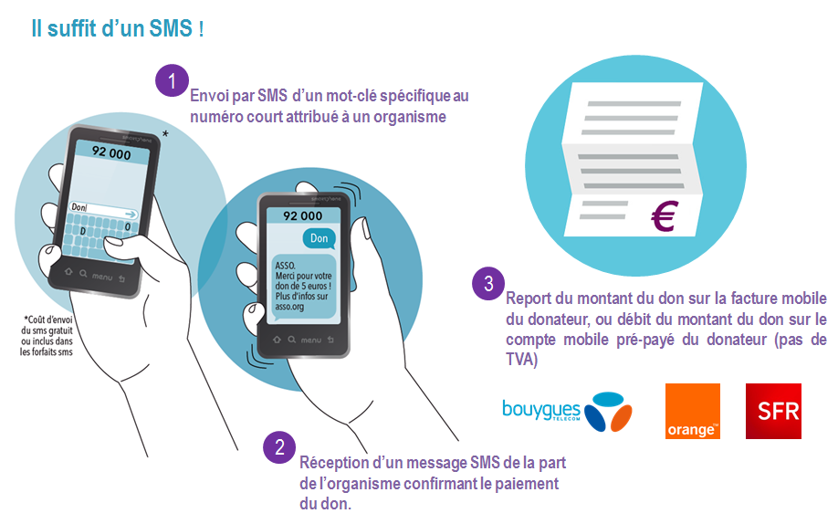
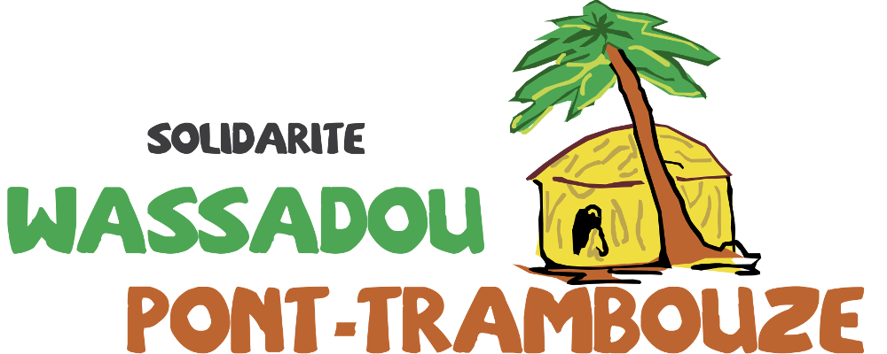

:doctitle: Solidarité Wassadou Pont-Trambouze
:description:  Retour sur la création du site Solidarité Wassadou Pont-Trambouze
:keywords: Web, Firebase, Serverless
:author: Guillaume EHRET - Dev-Mind
:revdate: 2017-08-05
:category: Web
:teaser: Retour sur la mise en ligne du site de l'association Solidarité Wassadou Pont-Trambouze https://solidarite-wassadou.fr et sur les solutions existantes pour financer en ligne une association.
:imgteaser: ../../img/blog/2017/wassadou_00.png

Quand je suis devenu indépendant, ma volonté était de travailler pour des clients bien évidemment mais aussi d'avoir plus de temps à accorder aux autres et à la veille technique. C'est de cette manière que j'ai pu

* rejoindre l'équipe https://mixitconf.org/[MiXiT]
* trouver le temps d'intervenir dans des https://www.dev-mind.fr/experience.html#conferences[conférences]
* dégager du temps pour travailler sur des projets OpenSource ou des projets associatifs.

C'est sur ce dernier point que je vais écrire aujourd'hui. Je viens de finir la refonte du site web d'une association qui se nomme _Solidarité Wassadou Pont-Trambouze_ et qui intervient pour aider les enfants d'un petit village du Sénégal nommé Wassadou. Le but principal est de les aider à avoir une éducation décente afin qu'ils soient maître de leur destin et qu'ils puissent à leur tour aider les gens du village.

L'adresse du site web est https://solidarite-wassadou.fr.

== Micropaiement pour les associations

Le don par SMS a été inscrit à la https://www.economie.gouv.fr/republique-numerique[loi pour une République numérique] (promulguée le 7 octobre 2016). Cette loi qui légalise le don par SMS aux associations, part d'un constat évident. En France les petites associations ont du mal à récolter des fonds pour soutenir leurs actions. Mais dans la pratique cette loi n'est pas pour les petites associations et est plutôt destinée aux très grosses. La mise en oeuvre a été confiée aux opérateurs Bouygues, Orange et SFR regroupés au sein de l'association AFMM (Association française du multimédia mobile). Leur proposition semble intéressante sur le papier

Vous pouvez formuler une demande sur le site de http://www.afmm.fr/don-par-sms/[l'AFMM]. Mais pour que votre demande soit acceptée vous devez monter un dossier avec 700€ de frais et payer la somme de 300€ par an. Pour une petite association ces coûts sont exhorbitants.

Il existe d'autres solutions. Vous pouvez utiliser des solutions de micropaiement classiques mais là encore les opérateurs prennent 40 à 50% de commission sur la somme totale. Avec ces solutions il me semble qu'on ne parle plus de don en faveur d'une association mais d'un détournement d'un système pour engraisser des sociétés privées. Paypal peut être une solution alternative. Les commissions sont de 8% pour un don de 5 euros et 6% pour 10 euros. Mais tout le monde ne possède pas de comptes Paypal.

_Solidarité Wassadou Pont-Trambouze_ n'est composée que de bénévoles et 100% des sommes récoltées sont attribuées au village de Wassadou. Il était hors de question d'avoir des intérmédiaires sur les dons. Le salut est venu du site https://www.helloasso.com. Ce site a été pensé pour être une boîte à outils pour des associations. Vous pouvez gérer les dons en ligne, les adhésions, vos billeteries pour vos événements... et le tout sans aucun frais. Après il faut bien évidemment que les frais de développement et d'hébergement soient pris en charge. Mais en fait ce sont les donateurs qui peuvent choisir de participer ou non à ces frais. Vous voulez tester ? Vous pouvez voir la page de don de l'association _Solidarité Wassadou Pont-Trambouze_ : https://www.donnerenligne.fr/solidarite-wassadou-pont-trambouze/faire-un-don.

== Web design

Quand on fait un site le choix des couleurs est très important car ces couleurs vont donner le ton de ce site et elles jouent sur l'inconscient des visiteurs. Je ne vais pas faire un article sur la théorie des couleurs car vous trouverez des ressources bien plus intéressantes que les miennes sur le web. Mais si vous vous interrogez sur les couleurs utilisées, voici mes choix

* *Orange* est une déclinaison du jaune et du rouge et peut représenter la chaleur du ciel africain mais aussi la bienveillance véhiculée par les activités de l’association. Cette couleur a été choisie pour le menu
* *Jaune*  représente le soleil et il amplifie la chaleur du orange. Le but est de représenter les couchers et levers de soleil et dégager de l’énergie positive. Cette couleur est la couleur principale du site. Celle qui est utilisée pour présenter l’association et les différents articles
* *Marron* l’Afrique est pour moi indissociable de cette couleur. Cette couleur représente la terre, les constructions, les personnes…  J’ai utilisé cette couleur pour parler du village de Wassadou
* *Vert* car l’Afrique n’est pas que désert et regorge de vie et de végétation. Le vert est une couleur froide qui représente ces notions. L’effet est plus doux que les couleurs précédentes et je l’ai utilisé pour la partie dons
* *Rouge* représente parfois la terre mais également le sang et les guerres. Je trouvais important de représenter du rouge et je l’ai utilisé pour représenter le symbole de la terre, les racines. C’est la couleur utilisée pour la partie contact

Avoir une idée des couleurs à utiliser est une chose. Choisir une couleur en particulier dans la gamme disponible est autre chose. C'est là que vous pouvez utiliser des sites proposant des palettes de couleur. Personnelement j'utilise beaucoup https://material.io/guidelines/style/color.html. Il en existe d'autres comme http://www.colourlovers.com/ ou http://paletton.com

Par rapport à ces couleurs j'ai pu retravailler le logo de l'association

Pour aider à embarquer les visiteurs dans mon délire, j'ai également essayé d'utiliser des transitions qui permettent d'être un peu plus concret que des couleurs :

* utilisation de cases pour imager la section de présentation du village,
* des baobabs pour la partie donation (c'est en plantant des graines qu'on arrive à construire quelque chose),
* des racines de baobabs pour la partie contact...

== Conclusion

Le but de cet article était surtout de revenir sur les différents moyens pour financer en ligne une association mais il m'aura aussi permis de vous parler de l'association Solidarité Wassadou Pont-Trambouze et de ses activités.