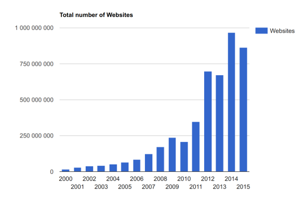

:doctitle: Le World Wide Web
:description:  Retour sur la création du world wide web
:keywords: Internet, Web
:author: Guillaume EHRET - Dev-Mind
:revdate: 2017-11-25
:category: Web
:teaser: Après avoir parlé du réseau Internet, il est temps de parler des applications utilisant Internet. Au début le mail était celle qui prédominait, mais aujourd’hui c’est sans contexte le World Wide Web (www) plus communément appelé le web.
:imgteaser: ../../img/blog/2017/web_00.png

Après avoir parlé du https://www.dev-mind.fr/blog/2017/internet.html[réseau Internet], il est temps de parler des applications utilisant Internet. Au début le mail était celle qui prédominait, mais aujourd’hui c’est sans contexte le World Wide Web (www) plus communément appelé le web.

image::../../img/blog/2017/web_00.png[Internet]

Le web est une application qui permet de consulter une ressource via un logiciel (navigateur internet) et de naviguer vers d’autres ressources en cliquant sur des liens hypertextes. Une ressource peut aussi bien être une page, une vidéo, une image…. Les transferts se font via le protocole HTTP.

Le maillage des ressources web peut être vu comme une immense toile d’araignée (Spider Web). C’est de là qu’est issu le nom World Wide Web (www).

Au fur et à mesure de leurs évolutions, les technologies Web ont permis aux développeurs de rendre le Web de plus en plus captivant.


== Création du web

En 1989 Tim Berners-Lee décide de créer au CERN (Centre Européen de la Recherche sur le Nucléaire) un système distribué au sein du réseau du centre de recherche pour faciliter l’échange des documents entre les différents collaborateurs. Robert Cailliau rejoint très vite le projet pour aider à son développement.

.Tim Berners-Lee


En 1993 le CERN renonce aux droits d’auteur sur les logiciels écrits pour leur World Wide Web. Ce projet devient alors utilisable par tous. La même année un laboratoire américain NCSA, sort

* le premier navigateur nommé Mosaic (il servira de sources d’inspiration ensuite à Netscape Navigator puis plus tard à Mozilla Firefox).
* le serveur NCSA HTTPd qui deviendra plus tard le serveur HTTP Apache.

La révolution est en marche le web peut devenir le plus grand système d’information.

== Fonctionnement

Le web permet de mettre à disposition différentes ressources (image, pages, video…) qui sont situées sur des serveurs distants.

Pour accéder à ces ressources vous avez besoin

* D’un device connexté à Internet  (on parle d’un hôte)
* D’un logiciel sur ce device qui permet d’afficher les ressources : le navigateur Internet
* D’un logiciel sur le serveur distant qui permet d’indiquer et d’envoyer les ressources mises à disposition : le serveur HTTP

Le protocole d’échange se nomme le HTTP (HyperText Transfer Protocole). Nous le verrons en détail un peu plus loin.

Le nombre de sites Web augmente fortement et il est nécéssaire de pouvoir les retrouver rapidement. En 1994 le premier moteur de recherche Yahoo, est mis en ligne. Depuis le nombre de sites web et le nombre d’internautes ne fait que bondir

.http://www.internetlivestats.com/total-number-of-websites/


== Langages

Les sites web sont écrits avec plusieurs langages qui sont interprétés par un logiciel le navigateur sur le poste client

.Les langages du Web


=== HTML HyperText markup pour décrire le contenu
Le HTML est un langage descriptif permettant de décrire et d’organiser le contenu de vos pages

La première version est sortie en 1993 et très vite le langage a été enrichi de nouvelles balises : 1.2 en 1994, 3 en 1995, 3.2 en 1997 et version 4 en 1998. La version 5 (version actuelle) n’est apparue qu’en 2008

=== Le JavaScript pour apporter du dynamisme.
Il a été mis en place en 1995 par Netscape. En 1996 Microsoft emboite le pas en créant son propre langage le Jscript. Heureusement le langage a été normalisé pour permettre sa globalisation. Malheureusement la norme n’est pas toujours complètement implémentée par les éditeurs des navigateurs Internet et certains ont toujours du retard.

Pour savoir si un élément est correctement implémenté dans un navigateur vous pouvez utiliser le site https://caniuse.com

=== Le CSS (Cascading Style Sheet) pour le coup de pinceau
Dès 1994 CSS est mis en place pour externaliser les aspects graphiques des pages écrites en HTML.

Le but est de pouvoir simplifié l’écriture de ces pages et de facilité la mise en place d’une ergonomie uniforme sur tout votre site.

Les versions normalisées sont sorties en 1996 (CSS 1),  1997 (CSS2), 1998 à aujourd’hui (CSS3). CSS est très puissant mais le board a du mal à finaliser une version définitive de la spécification. Les navigateurs peinent donc dans la mise en oeuvre. Aujourd’hui il existe de grosses disparités dans l’implémentation.


== Les moteurs de recherche et le dark web
Nous avons aujourd’hui plus de 1 milliards de site web qui peuvent recenser des dizaines (et parfois beaucoup plus) de liens hypertextes vers d’autres pages ou des ressources statiques (images, documents, vidéos…). Ce site http://www.internetlivestats.com/ permet de suivre les statistiques.

Le web peut être représenté par un graphe orienté possédant des cycles. Pour aider la recherche d’information, des applications web, les moteurs de recherche ont été mises en place afin d’indexer le maximum de pages et de fournir des points d’entrée sur les ressources Web. Mais il existe de nombreuses pages ou ressources qui sont présentes sur le web et qui restent non indexées (pages sécurisées, non accessible via les protocoles standard, ressources excluses des robots, pages générées par des scripts…).

On parle alors de web invisible ou de web profond ou du dark web. Certaines études montre que cette partie invisible représentait plus de 99% du web. C’est pourquoi on retrouve aujourd’hui des sociétés spécialisés dans la recherche de ces ressources masquées.

Mais ce n’est pas le but de ce chapitre. Lorsque l’on est une entreprise notre but est d’appraître dans les moteurs de recherche afin que nos potentiels clients puissent nous trouver.

Au lancement du premier moteur de recherche en 1996, les pages étaient organisées comme un annuaire par thème. Les développeurs de site devaient soumettre leur site web via un simple formulaire.

Aujourd’hui nous pouvons faire des recherches en tapant ou en dictant des mots clés. Le début du web sémantique nous permet aussi de poser de véritables questions. Les moteurs de recherche commencent également à être capable de faire des recherches en fonction des images que vous lui donnez, le texte que vous dictez....

Ces moteurs de recherche nous affichent des ressources qui peuvent être des pages, des images, des vidéos, des newsgroup… Chaque ressource est indexée afin de la retrouver en fonction de mot clés.

Le classement des résultats de recherche est de plus en plus complexe. Initialement amélioré pour fournir des résutats pertinents aux utilisateurs (vérification que le site contient bien les mots clés, que le site est rapide à charger, qu’il est sécurisé….), ce classement est plutôt aujourd’hui dominé par la publicité.

Les entreprises achètent des mots clés pour apparaître en premier.

L’indexation des ressources ne se fait plus de manière manuelle mais elle est effectuée par des robots (les bots) qui parcourent les sites à intervalles réguliers et qui recensent les liens en fonction des instructions laissées par les développeurs.

== Les adresses web

Comme nous l’avons vu, le web est constitué de différentes ressources que nous avons besoin de retrouver facilement. Un mécanisme d’adressage a donc été mis en place. Ce sont les URL (Uniform Resource Locator).

Une URL peut être saisi dans un logiciel comme votre navigateur Internet ou dans le code d’une page. Par exemple en HTML

* ``<a href="mon_url">Lien hypertexte</a>`` permet de définir un lien vers une autre page
* ```` permet de charger une image
* ...


Lorsque vous voulez accéder à une ressource vous pouvez soit utiliser une adresse complète (on parlera d’adresse absolue) soit d’une adresse définie par rapport à la ressource courante (on parle d’adresse relative)

=== Les adresses relatives
Quand vous chargez une page dans votre navigateur, les URL définies à l’intérieur peuvent être définies de manière relatives à ce document.

Par exemple si le document chargé a cette URL : ``https://dev-mind.fr/test/mapage.html``

* ``./mapage2.html`` désignera la page dans le répertoire courant   ``https://dev-mind.fr/html/test/mapage2.html``
* ``../mapage2.html`` désignera la page  dans le répertoire parent  ``https://dev-mind.fr/html/mapage2.html``
* ``/mapage2.html`` désignera la page  dans le dossier racine ``https://dev-mind.fr/mapage2.html``

Il est recommandé de passer par ces adresses relatives dans vos pages afin de simplifier la mise à jour quand vos URL changent (un cas courant est par exemple le passage d’un site d’un serveur de test à un serveur de production), et le travail des robots indexers de vos pages qui essayent de contruire une arborescence de votre site web quand il l’analyse.


=== Les adresses absolues
Une adresse absolue va être composé de la mnière suivante

[source, java]
----
protocol:://user:password@server:port/path/resource?param1=value1&param2=value2
----

==== Protocol
Protocol permet de définir le protocole de communication utilisé. Le cas le plus courant dans le web est d’utiliser le http ou https (http securisé) mais vous pouvez aussi pointer vers une adresse mail (protocol = mailto), un fichier local (protocol = file), une ressource ftp (protocol = ftp)

==== User / password

Vous pouvez dans de rare cas passer un identifiant et un mot de passe dans l’URL pour accéder à une ressource. Normalement les aspects de sécurité sont définis d’une manière plus efficace à un autre endroit que dans l’URL.

Dans la majorité des cas votre URL aura plutôt cette forme :
[source, java]
----
protocol:://server/path/resource?param1=value1&param2=value2
----

==== Server / port
Vous devez définir l’identifiant de votre serveur. A la base c’est une adresse IP. Mais si vous achetez un nom de domaine vous pourrez utiliser cet alias. Par exemple Dev-Mind possède le nom de domaine appelé dev-mind défini dans le domaine de premier niveau .fr

Comme nous l’avons vu plus haut il existe plusieurs DNS qui font les corrélations entre une adresse IP et un nom plus facile à retenir.

Quand vous tapez ``www.dev-mind.fr`` le

* *.fr* désigne le nom de domaine de premier niveau. L’ensemble des noms de domaine de premier niveau sont supervisés par l’ICANN et la gestion des .fr est délégué à l’AFNIC. Mais quand vous voulez mettre en place un site web, la déclaration est généralement faite via un prestataire. Par exemple le site web `dev-mind` est hébérgé sur des serveurs OVH et OVH propose un service pour gérer les noms de domaine.
* *dev-mind* est le nom de domaine de deuxième niveau qui va identifier une marque, un concept...
* *www* est un sous domaine. Quand vous avez un nom de domaine vous pouvez spécifier plusieurs sous domaines si vous avez par exemple différents serveurs web.

Pour compléter vous pouvez préciser le numéro de port utilisé par votre serveur web. Si ce dernier utilise le port par défaut, le port 80 vous n’êtes pas obligé de le préciser.

==== Localisation de la ressource
L’étape suivante consiste à indiquer l’emplacement de votre ressource sur le serveur web. Ce dernier détient un ensemble de fichier hierarchisé. Vous devez spécifier le répertoire et le nom.

Par exemple `img/logo.jpg` permet de désigner l’image `logo.jpg` dans le répertoire `img`

==== Paramètres optionnels
Vous pouvez passer des paramètres dans l’URL. Comme nous le verrons un peut plus tard il existe différentes actions possibles quand vous utiliser un protocole. Par exemple une action GET via le protocole HTTP accèpte des paramètres définis dans l’URL

Quand vous avez un ou plusieurs paramètres vous devez l’indiquer dans l’URL.

* *?* permet d’indiquer que vous avez des paramètres
* *&* permet de séparer la définition de plusieurs paramètres

Quand vous voulez ajouter un paramètre vous définissez le nom et la valeur. Par exemple ci dessous j’accède à un service distant à qui je passe le paramètre name = Mix-IT
[source, java, subs="none"]
----
https://www.dev-mind.fr/api/conference?name=Mix-IT
----

== Les signets
Le HTML permet de définir des liens vers des ressources externes mais aussi de faire des liens vers une partie du document courant

Par exemple si vous avez le code suivant

[source, html, subs="none"]
----
<div id=”part1”>
  <!-- code -->
</div
<div id=”part2”>
  <!-- code -->
</div
----

L’URL `#part2` chargera le document courant et scrollera vers l’élément HTML ayant l’identifiant `part2`.

== Prochain article
Dans le prochain article nous finirons la présentatin du web en parlant tu protocole HTTP et des différents organismes de régulation.

