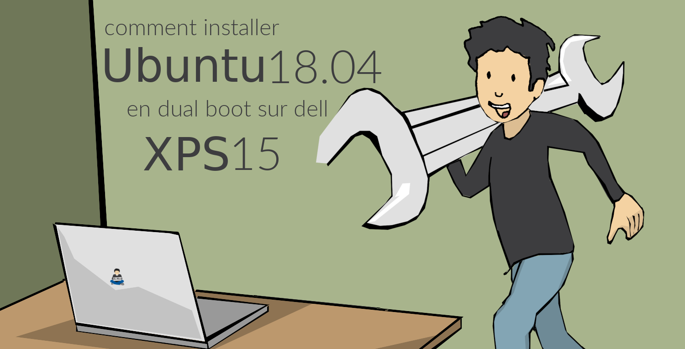
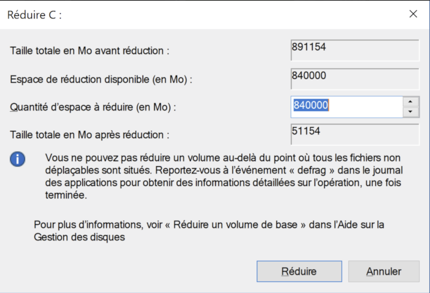
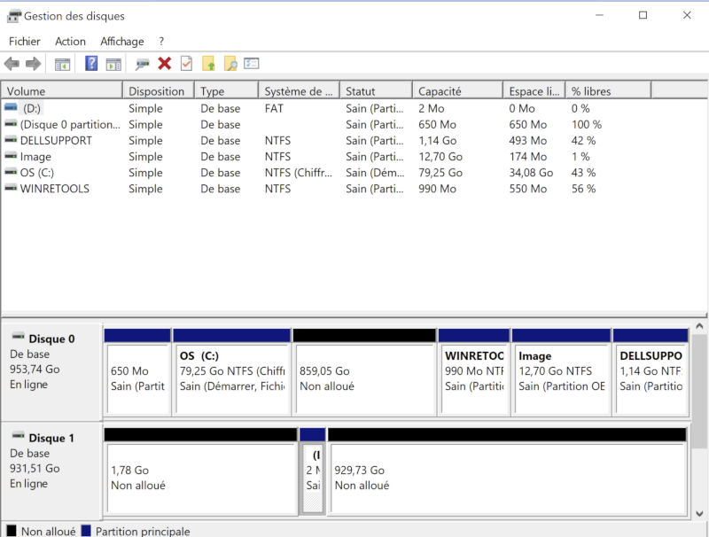
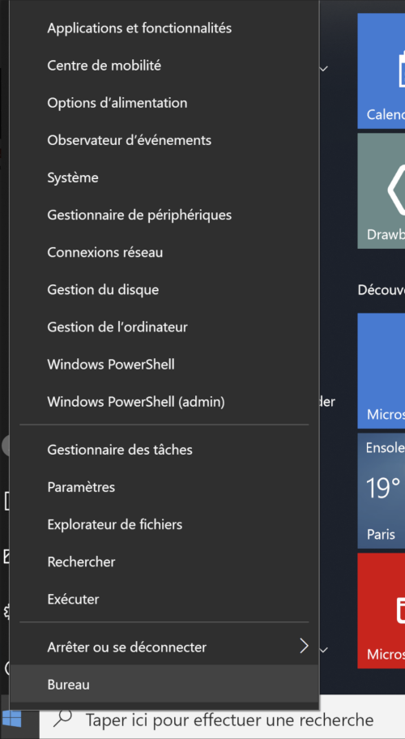
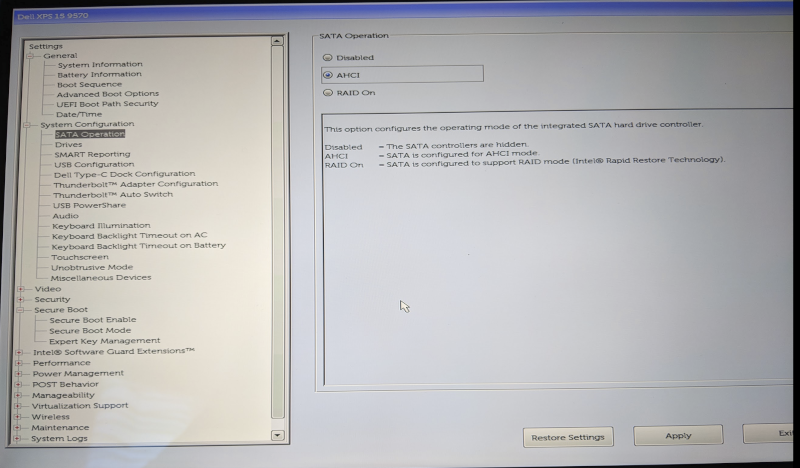
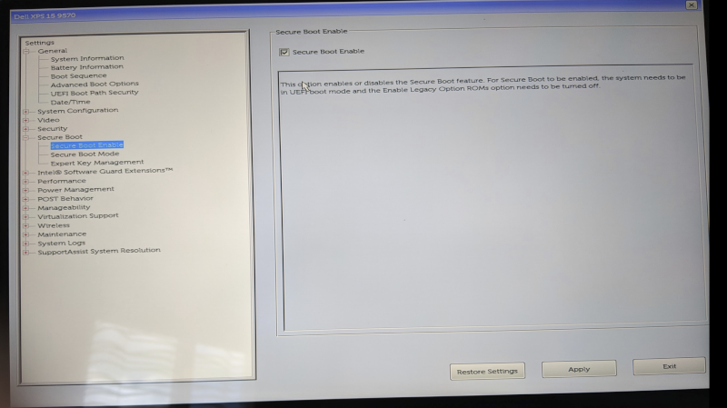
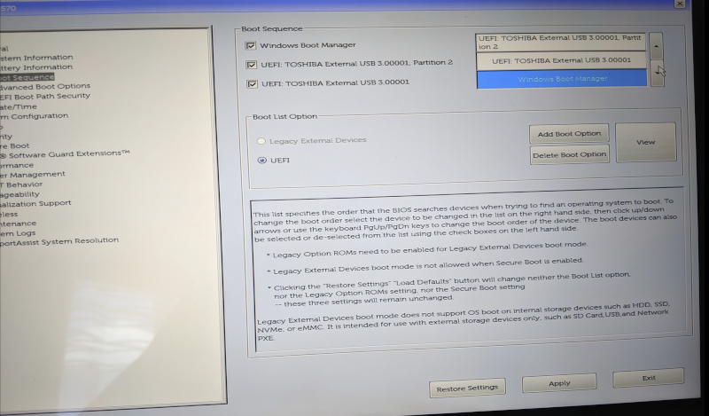

:doctitle: Installer Ubuntu en dual boot sur XPS 15
:description: Comment installer Ubuntu sur XPS 15 à côté de Windows
:keywords: Système, Ubuntu
:author: Guillaume EHRET - Dev-Mind
:revdate: 2018-09-16
:category: Ubuntu
:teaser: Je reviens sur les manipulations à faire pour installer Ubuntu sur un XPS 15 à côté de Windows.
:imgteaser: ../../img/blog/2018/ubuntun00.png

Un bon artisan doit avoir les bons outils. En tant que développeur j'ai décidé de changer mon portable pour avoir un peu plus de mémoires et de CPU. Mon choix c'est porté sur un XPS15. Voici ce que j'ai du faire pour le mettre sous Ubuntu

== Quelle machine choisir ?

J'utilisais au quotidien un XPS 15 depuis plus de 3 ans. Je me suis donc logiquement porté sur la même gamme.

Mon premier choix portait sur un Core i9. Ce choix n'a pas été très opportun car ces toutes dernières machines ne sont pas capable de supporter des processeurs aussi rapide. Quand vous utilisez votre portable 10h par jour en lançant beaucoup de compilations, le CPU a tendance à être utilisé... au final au bout de 2 jours d'utilisation le portable se mettait en sécurité car le CPU chauffait... 2 jours plus tard l'alimentation a grillé... et donc retour à l'envoyeur.

Pour ma deuxième tentative je me suis rabattu sur XPS15 core i7. La machine se comporte beaucoup mieux malgré quelques problèmes avec le Wifi qui devraient être résolus rapidement.

== Quel OS choisir ?

En tant que développeur, je trouve que l'OS le plus intéressant est Linux. Malheureusement Dell ne livre pas de PC de cette gamme sous Linux. Comme la gamme XPS 13 comporte une machine sur Ubuntu, j'ai choisi d'utiliser la même édition afin de bénéficier des drivers pour les composants communs aux XPS13 et XPS15.

Vous pouvez écraser le disque et n'installer qu'un Ubuntu. Mais si vous avez un problème matériel, le support Dell ne maîtrise que les outils installés sous Windows. J'ai fait le choix de faire cohabiter les deux systèmes

== Comment installer Ubuntu ?

Je ne vais pas vous décrire la procédure ici car vous trouverez de nombreux forum vous expliquant comment installer http://releases.ubuntu.com/18.04/[Ubuntu 18.04] sur votre laptop. Je vais plutôt revenir sur les commandes "non standards" que j'ai du faire pour installer Ubuntu à côté de Windows.

En effet les postes sont packagés pour Windows et le mode Secure Boot est activé pour bloquer tout élément étranger au système (comme un autre système d’exploitation). Autre problème, votre système est configuré pour protéger votre disque et le disque dur n'est pas visible par défaut quand vous lancez un live CD pour l'installation à partir d'une clé ou d'un disque externe.

Si vous ête dans le même cas que moi, voici la procédure à suivre

== Préparer Windows à accepter un petit nouveau ?

Pour pouvoir installer Ubuntu sur le disque système, il faut lui faire de la place! Pour le moment, 100% de l’espace disque est occupé par Windows et ses partitions : une partition EFI, une partition MSR, une partition Système et une partition Windows. Ce qu’on va faire, c’est réduire la taille de la partition Windows afin qu’Ubuntu puisse s’installer dans l’espace libre désormais disponible.

Vous devez pour celà

1. lancer le gestionnaire de disque Windows,
2. sélectionner le disque C, réduire l'espace

Normalement après cette opération vous avez la taille nécéssaire à l'installation de Ubuntu

== Modifier les options de démarrage

Ubuntu ne sait pas encore accéder aux disques en technologie https://fr.wikipedia.org/wiki/RAID_%28informatique%29[RAID] souvent utilisés par windows. Il faut donc casser ce mode d'accès. Démarrez sous Windows et ouvrez une console PowerShell en mode admin (clic droit sur l'icône windows en bas à gauche)

Vous devez lancer la commande suivante

[source, shell, subs="none"]
----
bcdedit /set ""{current}" safeboot minimal
----

Il faut ensuite rebooter et aller dans les options dans le bios de votre machine (F2) et choisir option AHCI

Vous pouvez aussi en profiter pour désactiver le SecureBoot

Booter ensuite sous Windows et lancez dans une console PowerShell en mode admin la commande

[source, shell, subs="none"]
----
bcdedit /deletevalue "{current}" safeboot
----

Vous pouvez redémarrer votre machine pour vérifier que tout est opérationnel.

== Installer Ubuntu

Vous pouvez maintenant installer Ubuntu via ue clé USB. Pour pouvoir la lancer n'oubliez pas de changer le boot sequence. Dans mon cas j'ai passé mon disque USB Toshiba en premier

Vous n'avez plus qu'à suivre les instructions de Ubuntu pour installer votre systême

