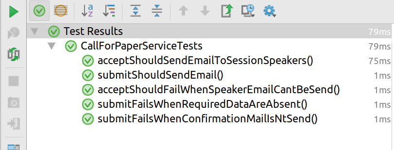
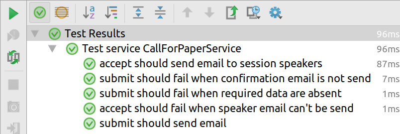
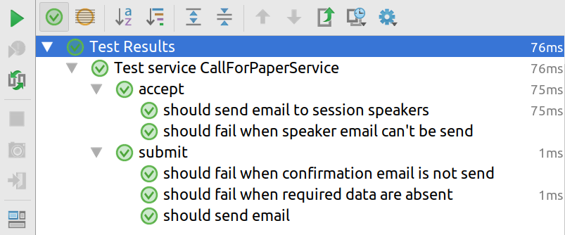
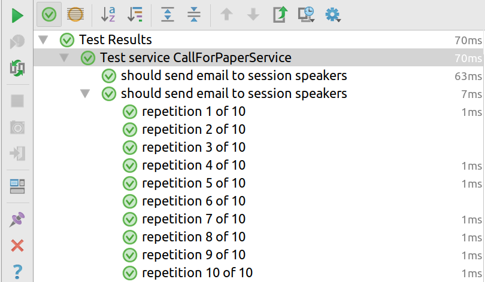

:doctitle: Utiliser Junit 5 dans une application Spring Boot
:description: Tout ce qu'il fut savoir pour utiliser la dernière version de Junit 5 dans un projet Java et plus particulièrement dans un projet Spring Boot
:keywords: Java, Junit, Spring Boot
:author: Guillaume EHRET - Dev-Mind
:revdate: 2018-01-08
:category: Java
:teaser: Le projet Junit a été en suspend pendant pas mal de temps (version 4 a été créée en 2006 et la dernière grosse mise à jour date de 2011) mais il reste une des librairies Java les plus utilisées quelque soit les projets. Quelques personnes ont repris le projet en main pour écrire une librairie offrant toutes les possibilités de Java 8 et beaucoup plus modulaire.
:imgteaser: ../../img/blog/2018/junit5_00.png

Le projet Junit a été en suspend pendant pas mal de temps (version 4 a été créée en 2006 et la dernière grosse mise à jour date de 2011) mais il reste une des librairies Java les plus utilisées quelque soit les projets. Quelques personnes ont repris le projet en main pour écrire une librairie offrant toutes les possibilités de Java 8 et beaucoup plus modulaire.

JUnit 5 = JUnit Platform + JUnit Jupiter + JUnit Vintage

* JUnit Platform est le socle pour lancer des frameworks de tests sur la JVM. Une API a été définie et chacun est libre de l'implémenter. Ce module contient aussi tous les plugins pour pouvoir lancer des tests et notamment les plugins Maven et Gradle.
* JUnit Jupiter est une implémentation de l'API définie dans JUnit Platform
* JUnit Vintage est le projet qui permet d'assurer la rétrocompatibilité avec Junit 4 et Junit 3

Nous allons voir comment utiliser cette nouvelle version dans un projet Spring Boot 2. Les sources du code montré ici, sont disponibles https://github.com/Dev-Mind/devmind-junit5[sous Github].

== Description de l'exemple
Ce projet exemple est minimaliste et comprend un bean de propriétés qui va injecter la propriété `_devmin.name_` dans le code et notre test consiste à vérifier que ce bean est bien peuplé

[source, java, subs="specialchars"]
----
@ConfigurationProperties("devmind")
public class Junit5ApplicationProperties {
    private String name;

    public String getName() { return name; }

    public void setName(String name) { this.name = name; }
}
----

Ce bean est initialisé dans le bean de bootstrap de l'application

[source, java, subs="specialchars"]
----
@SpringBootApplication
@EnableConfigurationProperties(Junit5ApplicationProperties.class)
public class Junit5Application {
	public static void main(String[] args) {
		SpringApplication.run(Junit5Application.class, args);
	}
}
----

Et le test Junit 4 peut être écrit de cette manière. J'ai indiqué les packages pour que vous puissiez voir les différences plus loin

[source, java, subs="specialchars"]
----
import org.assertj.core.api.Assertions;
import org.junit.Test;
import org.junit.runner.RunWith;
import org.springframework.beans.factory.annotation.Autowired;
import org.springframework.boot.test.context.SpringBootTest;
import org.springframework.test.context.junit4.SpringRunner;

@RunWith(SpringRunner.class)
@SpringBootTest
public class Junit5ApplicationTests {

	@Autowired
	private Junit5ApplicationProperties properties;

	@Test
	public void contextLoads() {
		Assertions.assertThat(properties.getName()).isEqualTo("Dev-Mind");
	}

}
----

Nous allons maintenant écrire ce même test avec Junit 5.

== Paramétrer Gradle pour pouvoir utiliser Junit 5 dans un projet Spring Boot

Votre descripteur de build Gradle (`_build.gradle_`) doit pour le moment ressembler à
[source, groovy, subs="none"]
----
buildscript {
	ext {
		springBootVersion = '2.0.0.M7'
	}
	repositories {
		mavenCentral()
		maven { url "https://repo.spring.io/milestone" }
	}
	dependencies {
		classpath("org.springframework.boot:spring-boot-gradle-plugin:${springBootVersion}")
	}
}

apply plugin: 'java'
apply plugin: 'org.springframework.boot'
apply plugin: 'io.spring.dependency-management'

group = 'com.devmind'
version = '0.0.1-SNAPSHOT'
sourceCompatibility = 1.8

repositories {
	mavenCentral()
	maven { url "https://repo.spring.io/milestone" }
}

dependencies {
	compile('org.springframework.boot:spring-boot-starter')
	testCompile('org.springframework.boot:spring-boot-starter-test')
}
----

Nous allons indiquer à Gradle qu'il doit utiliser le plugin `_JUnit Platform_`.

[source, groovy, subs="none"]
----
classpath("org.junit.platform:junit-platform-gradle-plugin:${junitPlatformVersion}")
apply plugin: "org.junit.platform.gradle.plugin"
----

Pour être sûr de ne plus utiliser l'ancienne version de Junit, nous allons exclure la dépendance junit tirée par `_spring-boot-starter-test_`
[source, groovy, subs="none"]
----
testCompile("org.springframework.boot:spring-boot-starter-test") {
	exclude module: "junit"
}
----
ou même mieux vous pouvez le faire d'une manière globale
[source, groovy, subs="none"]
----
configurations {
	all {
		exclude module: "junit"
	}
}
----

Nous devons maintenant ajouter les dépendances Junit5 pour que notre projet puisse lancer les tests
[source, groovy, subs="none"]
----
testCompile("org.junit.jupiter:junit-jupiter-api")
testRuntime("org.junit.jupiter:junit-jupiter-engine")
----

Votre code avec les dépendances Junit4 ne doit plus compiler! Vous pouvez maintenant lire la documentation Junit sur comment http://junit.org/junit5/docs/current/user-guide/#migrating-from-junit4[migrer de Junit4 à Junit5].

Quand vous avez un gros projet vous voulez peut être faire cohabiter les 2 versions et migrer au fur et à mesure vos tests. Dans ce cas, gardez la dépendance junit pour que votre code compile et ajouter la dépendance suivante dans votre script Gradle
[source, groovy, subs="none"]
----
testRuntime("org.junit.vintage:junit-vintage-engine:4.12.2")
----

== Comment migrer ces tests Junit4 à Junit5 ?

Pour la partie pure Junit, vous pouvez suivre la http://junit.org/junit5/docs/current/user-guide/#migrating-from-junit4[documentation officielle]. Pour résumer voici les principales évolutions

=== Renommages et changements de package

* Les annotations, les assertions et les hypothèses (Assumptions) ont été déplacées dans le package `_org.junit.jupiter.api_`. Personnellement je n'utilise pas les assertions Junit et je préfère les assertions offertes par le projet https://joel-costigliola.github.io/assertj/[AssertJ]. Pour les Assumptions je ne suis pas fan car je préfère qu'un test en échec soit bloquant.
* Les annotations `_@Before_` et `_@After_` ont été remplacées par `_@BeforeEach_` et `_@AfterEach_`
* Les annotations `_@BeforeClass_` et `_@AfterClass_` ont été remplacées par `_@BeforeAll_` et `_@AfterAll_`
* L'annotation `_@Ignore_` a été remplacée par `_@Disabled_`. Petite remarque, un projet ne devrait pas avoir de test ignorés. S'ils ne sont plus valides ils doivent être supprimés.
* Les catégories `_@Category_` ont été remmplacées par les `_@Tag_`
* L'annotation `_@RunWith_` est remplacée par `_@ExtendWith_`

Ces renommages permettent d'avoir des noms d'annotation plus parlant. Par contre vous mixez peut être des tests TestNg et des tests Junit dans vos projets ? Si c'est le cas je vous conseille aussi de migrer vos tests TestNg vers Junit. TestNg était très intéressant il y a quelques années quand il permettait de combler les manques de Junit. Aujourd'hui le projet ne bouge plus beaucoup.

=== Les Rules Junit
Pour les amoureux des règles Junit, elles ne sont pas encore disponibles. Pour rappel, elles permettaient de combler les manques de Junit où on ne pouvait pas faire de composition de `_@RunWith_`. En gros une fois que vous aviez déclaré `_@RunWith(SpringRunner.class)_` sur votre classe vous ne pouviez pas ajouter un `@RunWith(MockitoJUnitRunner.class)`. Les règles Junit vous offrait un moyen simple de factoriser du comportement entre les tests.

Mais Junit5 s'appuie sur Java 8 et n'est d'ailleurs pas compatible avec les versions antérieures. Depuis Java 8 des annotations peuvent être https://docs.oracle.com/javase/8/docs/api/java/lang/annotation/Repeatable.html["Repeatable"]. C'est le cas de http://junit.org/junit5/docs/current/api/org/junit/jupiter/api/extension/ExtendWith.html[ExtendWith]. Vous pouvez maintenant écrire par exemple
[source, java, subs="specialchars"]
----
@ExtendWith(MockitoExtension.class)
@ExtendWith(SpringExtension.class)
----

[sidebar]
--
Par contre `_MockitoExtension_` n'existe pas encore. Vous pouvez voir cette issue https://github.com/mockito/mockito/issues/445[Github] et `_MockitoExtension_` devrait arriver avec Mockito 3.0
--

=== Qu'en est il de la partie Spring Boot ?

Spring Boot propose plusieurs annotations pour les tests et elles sont toujours utilisables. Vous pouvez suivre la https://docs.spring.io/spring/docs/5.0.3.BUILD-SNAPSHOT/spring-framework-reference/testing.html#integration-testing-annotations-junit-jupiter[doc officielle] mais nous allons voir comment migrer notre exemple présenté au début de cet article.

Mon exemple devient

[source, java, subs="specialchars"]
----
import org.assertj.core.api.Assertions;
import org.junit.jupiter.api.Test;
import org.junit.jupiter.api.extension.ExtendWith;
import org.springframework.beans.factory.annotation.Autowired;
import org.springframework.boot.test.context.SpringBootTest;
import org.springframework.test.context.junit.jupiter.SpringExtension;

@ExtendWith(SpringExtension.class)
@SpringBootTest
public class Junit5ApplicationTests {

	@Autowired
	private Junit5ApplicationProperties properties;

	@Test
	public void contextLoads() {
		Assertions.assertThat(properties.getName()).isEqualTo("Dev-Mind");
	}

}
----

Si vous rencontrez des problèmes avec IntelliJ pour lancer les tests je vous laisse lire https://discuss.gradle.org/t/junit-5-gradle-and-intellij-publishing-test-events-for-tooling-api-consumers/21349[ce post] sur le forum de Gradle et https://blog.jetbrains.com/idea/2016/08/using-junit-5-in-intellij-idea/[celui-ci] sur le site de JetBrains.

Au niveau de Spring ne passez pas à côté des annotations composées qui peuvent aider à la lecture de vos tests. Par exemple si vous utilisez toujours une multitude d'annotation sur vos tests comme dans cet exemple issu de la doc de Spring

[source, java, subs="specialchars"]
----
@ExtendWith(SpringExtension.class)
@ContextConfiguration({"/app-config.xml", "/test-data-access-config.xml"})
@ActiveProfiles("dev")
@Transactional
class OrderRepositoryTests { }

@ExtendWith(SpringExtension.class)
@ContextConfiguration({"/app-config.xml", "/test-data-access-config.xml"})
@ActiveProfiles("dev")
@Transactional
class UserRepositoryTests { }
----

Vous pouvez créer une annotation
[source, java, subs="specialchars"]
----
@Target(ElementType.TYPE)
@Retention(RetentionPolicy.RUNTIME)
@ExtendWith(SpringExtension.class)
@ContextConfiguration({"/app-config.xml", "/test-data-access-config.xml"})
@ActiveProfiles("dev")
@Transactional
public @interface TransactionalDevTestConfig { }
----

et reprendre vos tests pour ne plus avoir que

[source, java, subs="specialchars"]
----
@TransactionalDevTestConfig
class OrderRepositoryTests { }

@TransactionalDevTestConfig
class UserRepositoryTests { }
----

=== Les fonctionnalités sympas de Junit 5

Après avoir vu comment migrer des tests existants, nous pouvons maintenant nous attarder sur quelques nouvelles fonctionnalités

=== Améliorer la lisibité de ses tests avec @Nested et @DisplayName
A force d'écrire des tests en JavaScript, j'étais toujours frustré du code écrit en Junit4. Pour avoir des rapports d'exécution lisible on essaye d'utiliser des noms à rallonge dans les méthodes des tests.

Par exemple si nous voulions tester cette interface

[source, java, subs="specialchars"]
----
public interface CallForPaperService {
    void submit(Proposal proposal);
    void accept(Proposal proposal);
    void refuse(Proposal proposal);
}
----

On pourrait imaginer les tests suivants

[source, java, subs="specialchars"]
----
class CallForPaperServiceTests {

    @Test
    public void submitShouldFailWhenRequiredDataAreAbsent(){  }

    @Test
    public void submitShouldFailWhenConfirmationMailIsNtSend(){  }

    @Test
    public void submitShouldSendEmail(){  }

    @Test
    public void acceptShouldSendEmailToSessionSpeakers(){  }

    @Test
    public void acceptShouldFailWhenSpeakerEmailCantBeSend(){  }

    // ... on peut imaginer des dizaines de tests supplémentaires avec des noms beaucoup plus long
}
----

Ce qui donnerait le rapport suivant

En Javascript vous pouvez écrire
[source, javascript, subs="none"]
----
it('submit should fail when required data are absent', () => { });
----

Vous pouvez migrer votre code en Kotlin qui permet de définir des méthodes avec des phrases :-)
[source, java, subs="specialchars"]
----
@Test
fun `submit should fail when required data are absent`() {  }
----

Maintenant avec Junit5 vous pourrez ajouter l'annotation `_@DisplayName_` et dissocier les messages attendus dans les rapports des noms de vos méthode. Par exemple
[source, java, subs="specialchars"]
----
@DisplayName("Test service CallForPaperService")
class CallForPaperServiceTests {

    @Test
    @DisplayName("submit should fail when required data are absent")
    public void submitFailOnBadArgument(){ }

    @Test
    @DisplayName("submit should fail when confirmation email is not send")
    public void submitFailOnEmailError(){ }

    @Test
    @DisplayName("submit should send email")
    public void submitSendEmail(){ }

    @Test
    @DisplayName("accept should send email to session speakers")
    public void acceptSendEmailToSessionSpeakers(){ }

    @Test
    @DisplayName("accept should fail when speaker email can't be send")
    public void acceptFailOnEmailError(){ }
}
----

Ce qui donnerait le rapport suivant

Nous avons résolu un premier problème. Quand vous multipliez les tests vous ne savez pas forcément à quelle méthode de votre classe testée se réfère. En Javascript avec Jasmine, vous pouvez faire des sous suites de tests au sein d'une suite de tests. Maintenant avec @Nested vous allez pouvoir faire la même chose

[source, java, subs="specialchars"]
----
@DisplayName("Test service CallForPaperService")
class CallForPaperServiceTests {

    @Nested
    @DisplayName("submit")
    class Submit{
        @Test
        @DisplayName("should fail when required data are absent")
        public void submitFailOnBadArgument(){  }

        @Test
        @DisplayName("should fail when confirmation email is not send")
        public void submitFailOnEmailError(){  }

        @Test
        @DisplayName("should send email")
        public void submitSendEmail(){  }
    }

    @Nested
    @DisplayName("accept")
    class Accept{
        @Test
        @DisplayName("should send email to session speakers")
        public void acceptSendEmailToSessionSpeakers(){  }

        @Test
        @DisplayName("should fail when speaker email can't be send")
        public void acceptFailOnEmailError(){  }
    }

}
----

Ce code donnera en sortie

Au final nous avons un code plus verbeux mais l'organisation permet d'avoir quelque chose de beaucoup plus lisible que ce soit au niveau du code même, des tests, mais ausi des rapports.

=== Répeter les tests
Quand nous voulions exécuter plusieurs fois un même test pour vérifier la performance ou autre, nous devions batailler avec les anciennes versions de Junit, ou utiliser l'annotation https://docs.spring.io/spring-framework/docs/current/javadoc-api/org/springframework/test/annotation/Repeat.html[Repeat] de `_spring-test_` ou alors écrire des tests avec d'autres frameworks comme TestNg par exemple.

Maintenant rien de plus simple vous écrivez

[source, java, subs="specialchars"]
----
@Test
@DisplayName("should send email to session speakers")
@RepeatedTest(10)
public void acceptSendEmailToSessionSpeakers(){
    assertThat(true).isTrue();
}
----

Et en sortie vous aurez votre test exécuté 1 fois et répeter 10 fois

=== Les tags
Vous pouviez ajouter une catégorie à vos tests avec la version précédente de Junit. Par exemple

[source, java, subs="specialchars"]
----
@Category({IntegrationTest.class, Exernal.class})
----

Avec Junit 5 vous pouvez maintenant utiliser l'annotation @Tag
[source, java, subs="specialchars"]
----
@Tag("integration")
@Tag("exernal")
----

[sidebar]
--
N'oubliez pas les annotation composées. Par exemple ici on pourrait créer une annotation @IntegrationTestWithExternalSystem pour jumeler ces tags
--

Ces tags peuvent ensuite jouer sur le runtime

Quand vous configurez Gradle et le plugin junitPlatform vous pouvez spécifier plusieurs options comme les tags exclus ou inclus

[source, java, subs="specialchars"]
----
junitPlatform {
    filters {
        tags {
            include 'fast', 'smoke'
            exclude 'slow', 'ci'
        }
        packages {
            include 'com.sample.included1', 'com.sample.included2'
        }
        includeClassNamePattern '.*Spec'
        includeClassNamePatterns '.*Test', '.*Tests'
    }
}
----

== Conclusion
Comme nous avons pu le voir vous pouvez dès aujourd'hui adopter Junit 5 dans vos projets Spring Boot ou autre projet Java. Cette refonte de Junit apporte à mon sens plein de petits plus dans l'écriture des tests. D'autres évolutions qui sont encore au stade expérimentations peuvent être utilisées par parcimonie. Mais rien ne dit si elles seront conservées ou non dans les futures versions (voir la http://junit.org/junit5/docs/current/user-guide/#api-evolution-experimental-apis[liste])

