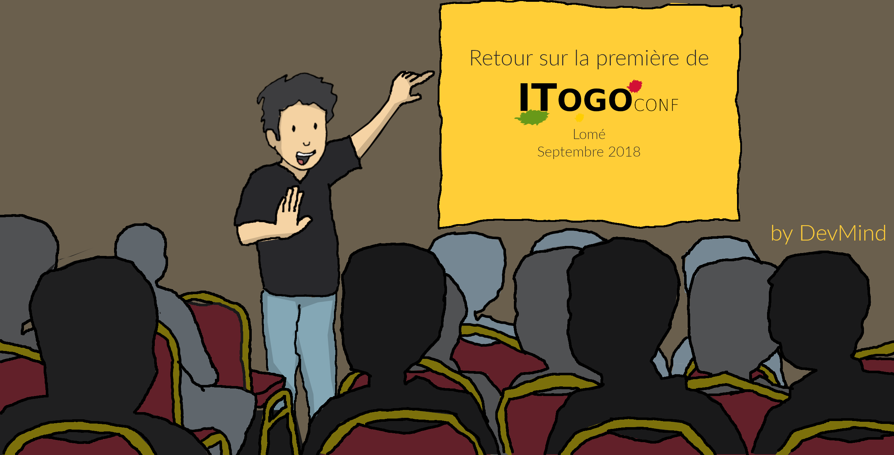
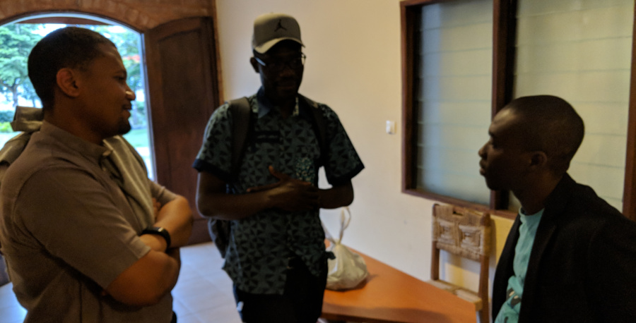
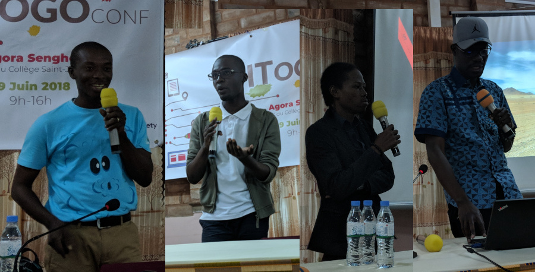
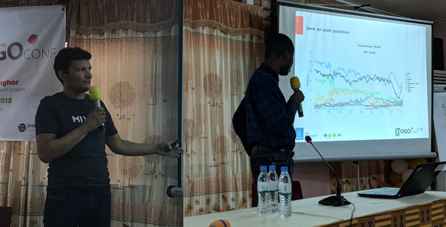
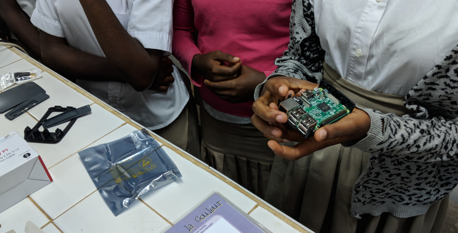
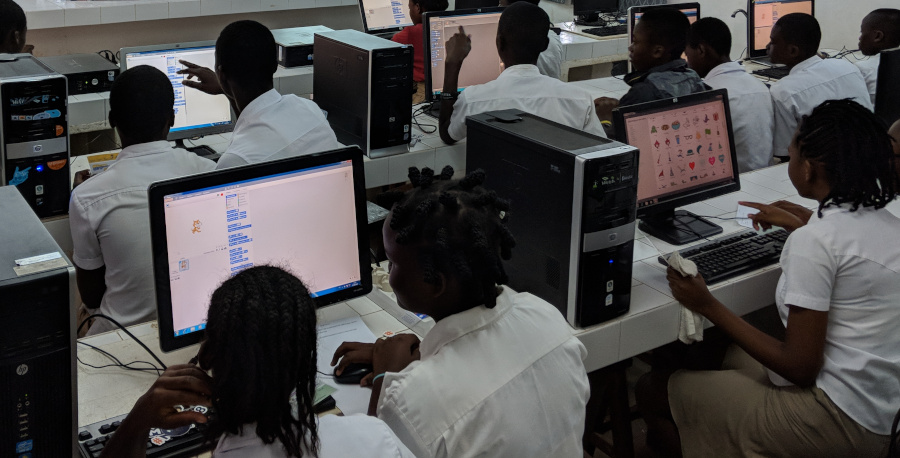
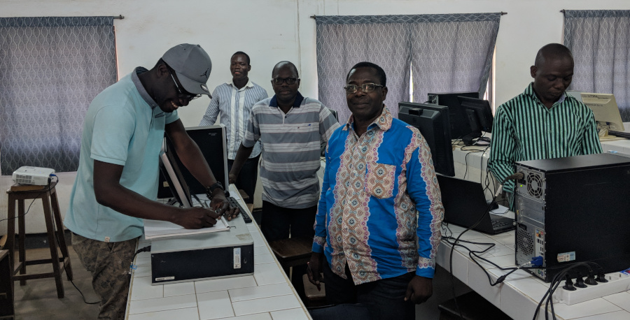
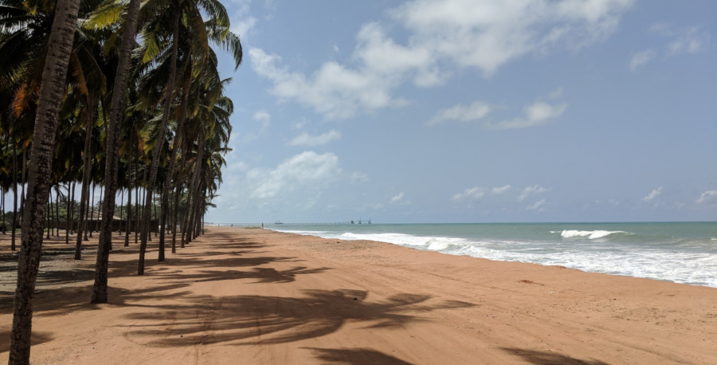
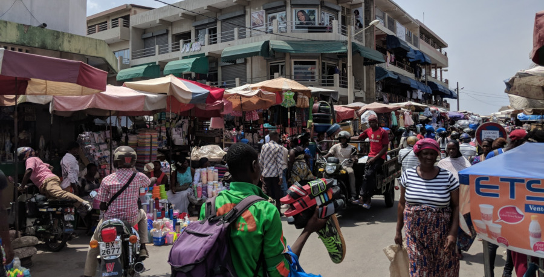
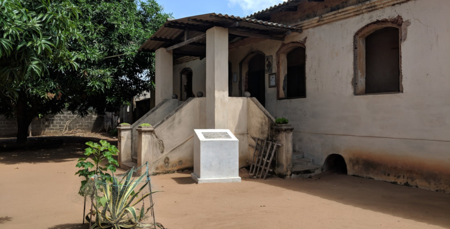

:doctitle: Première édition de ITogo.conf à Lomé au Togo
:description: Première édition de ITogo.conf à Lomé au Togo les 7 et 9 juin 2018
:keywords: Web, Conference, Android
:author: Guillaume EHRET - Dev-Mind
:revdate: 2018-06-11
:category: Conference
:teaser: ITogo.conf est une conférence née d'un rêve fait il y a plusieurs années par 3 amis développeurs togolais. Retour sur cette conférence hors du commun
:imgteaser: ../../img/blog/2018/itogo_00.png

La première édition de http://itogo.cleverapps.io[ITogo.conf] s'est déroulée le 9 juin 2017 à Lomé au Togo. Je ne connaissais pas ce petit pays de la corne de l'Afrique avant de connaître Horacio, un des organisateurs de la conférence. Je vais donc vous parler de cette conférence et un peu de ce petit pays.

== La petite histoire de la conférence

La conférence est née d'un rêve fait par trois potes informaticiens de Lomé il y a plusieurs années. Même s'ils se sont croisés au début de leur parcours professionnel et associatif, leur avenir professionnel les a éloigné

* https://www.twitter.com/deovince[Déwo Atsu] travaille chez le deuxième opérateur de téléphonie du Togo, https://www.moov.tg/[Moov]. Il a quitté par la force des choses le développement mais il est toujours passionné par le code.
* https://www.twitter.com/horalass[Horacio Lassey] a pour passion de triturer de la donnée. Il est aujourd'hui spécialisé à Paris dans le décisionnel et le big data.
* https://www.twitter.com/samgolchi[Sam Mawusee Komla Foli-Awli] est un développeur qui a fondé sa propre strucure au Togo,  http://www.macedilleplus.com[macedilleplus]. Ses passions tournent autour du développement Web et de la transmission de son savoir

Ces trois comparses se sont beaucoup cotôyés lors des meetups qu'ils essayaient d'organiser à Lomé. Alors comment passe t-on d'un rêve à une conférence ? Le plus gros problème dans cette région d'Afrique est d'attirer des speakers reconnus. C'est pour eux le seul moyen de trouver des sponsors qui financent ce genre d'événement. Il faut donc avoir un réseau qui permet de les toucher.

Tout à basculer le jour ou Horacio a eu un contact sur Twitter avec https://twitter.com/agnes_crepet[Agnès Crepet]. Elle donnait à cette période des formations en Côte d'Ivoire, avec son conjoint https://twitter.com/clacote[Cyril Lacote]. Agnes et Cyril sont venus à Lomé animer une session au JUG (géré à l'époque par Horacio).

Il se trouve que nous faisons partie Agnès, Cyril et moi même, de l'organisation de la conférence https://mixitconf.org/[MiXiT]. En 2014 Agnès a eu la très bonne idée d'inviter Horacio pour venir parler de la vie des informaticiens en Afrique de l'ouest. Cette conférence est accessible sur le https://www.infoq.com/fr/presentations/communautes-monde-it-sous-autres-cieux?utm_source=presentations_about_mix-it2014&utm_medium=link&utm_campaign=mix-it2014[site d'infoQ].

Horacio a profité de https://mixitconf.org[MiXiT] et de https://www.devoxx.fr/[Devoxx], pour nouer des contacts avec des speakers. Lors de notre rencontre, j'ai été frappé par le fait qu'il connaissait déjà beaucoup de personnes. Il les suivait tous sur Twitter ou lisait leurs blogs. Je pense que c'est la seule personne que j'ai rencontrée qui connaissait autant mes articles de blogs.

Horacio, après avoir travaillé au Togo et au Bénin, est venu faire des études en France pour compléter ses compétences. Il a ensuite été embauché par une ESN sur Paris. C'est lors d'une discussion que nous avons eu début 2017, qu'il m'a parlé de son rêve de conférence. J'ai décidé de lui donner un coup de main pour trouver des speakers. Malheureusement je n'ai pas été très bon... A la fin je n'étais plus que le seul européen sur la liste. Mais la petite graine avait germé et les trois amis se sont coordonnés à distance pour monter la conférence ITogo.conf.

Cette première édition était à mes yeux un succès. Même si le public n'était pas très nombreux, elle a permis de faire avancer les choses. Des speakers sont venus du Bénin, du Burkina Faso, du Togo pour prendre la parole. L'antenne locale de l'Internet Society a sponsorisé la conférence. Clever Cloud en France a apporté sa petite part en hébergeant le site web.

Si vous êtes speakers, l'Afrique a besoin de vous. Les événements sur ce continent sont trop rares et les personnes sont avides d'apprendre. C'est la première conférence où j'ai eu autant d'échange avec les participants et les autres speakers. Je ne regrette à aucun moment d'être venu ici et j'en garderai un très bon souvenir. A tel point que je redonnerai certainement un coup de main  à cette conférence à l'avenir.

Par contre, si vous voulez venir parler, la conférence ne pourra certainement pas prendre en charge vos frais de transports. Ce n'est pas une question de volonté mais de moyens. Il faut d'abord, qu'ils arrivent à trouver des sponsors avant de pouvoir le faire. Personnellement je suis passé freelance pour avoir plus de temps à donner à la communauté en France ou ailleurs et ce projet de conférence en Afrique correspondait pleinement à ma philosophie.

Vous pouvez consulter le site web à l'adresse suivante http://itogo.cleverapps.io pour avoir le résumé des différentes sessions que nous avons eu.

Par rapport aux deux conférences que j'ai animées, vous trouverez les ressources aux adresses suivantes

* Créer une application Android en 50 minutes : https://speakerdeck.com/javamind/mettre-en-place-une-application-android-en-50-minutes[slides], https://github.com/Dev-Mind/kotlinInAction[kotlinInAction], https://github.com/Dev-Mind/androidInAction[androidInAction]
* Améliorer les performances de votre webapp : https://speakerdeck.com/javamind/itogo-conf-optimiser-les-performances-d-une-webapp[slides]

== Mixteen

C'est pour moi, le moment le plus marquant de mon séjour ici.  Celui qui m'a laissé le plus d'ondes positives. Le jeudi 7 mai, nous avons organisé avec Horacio, le premier Mixteen délocalisé dans un collège de la banlieue de Lomé, à Agbodrafo. Malheureusement https://twitter.com/titimoby[Thierry Chantier] (autre membre de la team Mixteen), n'a pu se joindre à cette aventure cette fois ci, mais il était tout de même présent par la pensée.

Horacio a été contacté, il y a plus d'un an par son ancien proviseur de collège monsieur Daroux. Ce proviseur essaie depuis une trentaine d'années, de pousser son collège et les enfants vers le haut, en essayant de renouveler les enseignements. Le constat est le suivant. En Afrique comme ailleurs dans le monde la révolution du numérique et de l'Internet est en marche. Tout le monde veut aussi accéder à la toile.

Sauf qu'il est compliqué pour les étudiants de faire des métiers du numérique.  Ils ne touchent des ordinateurs qu'à partir du lycée ou plus tard. L'utilisation du numérique en Afrique se fait essentiellement par le biais du mobile. Le réseau filaire n'est pas bon et le mobile est parfois la seule porte d'entrée sur la toile.

Monsieur Daroux pousse pour essayer de combler ce manque. Les anciens élèves ont financé une salle informatique et il restait à l'inaugurer et voir comment transmettre des éléments aux enseignants. Le but n'était pas de faire un seul événement mais d'essayer de rendre autonome les enseignants. Notre souhait le plus profond est de simplement offrir une chance aux enfants de comprendre le monde autour d'eux et d'être acteur de leur avenir.

Nous avons monté un atelier en deux parties et le matériel et les supports a été laissé à léquipe enseignante.

=== Comment marche un ordinateur

La première partie consistait à expliquer aux enfants comment fonctionnait un ordinateur, un téléphone, un écran, un clavier... Nous leur avons fait assembler un ordinateur via des http://www.raspberrypi-france.fr/[Raspberry Pi]. Au départ nous pensions avoir une quinzaine d'enfants, mais nous avons essayé de donner une chance à plus d'enfants en doublant les participants.

Malheureusement nous n'avons touché que la moitié des 4èmes. Les enfants ont été sélectionnés au mérite en fonction de leurs notes et de leurs capacités en mathémtiques et physiques. Une chose qui est devenue inconcevable en France, mais qui est ici en Afrique tout à fait naturel.

La rencontre a été brève mais j'ai beaucoup aimé la discussion sur l'enseignement  en Afrique avec le proviseur.

Vous pouvez trouver le support de la présentation https://speakerdeck.com/javamind/comment-marche-un-ordinateur[ici] et n'hésitez pas à me contacter ou à contacter l'association MixTeen pour plus d'informations.

=== Utiliser un ordinateur

Dans la deuxième partie les élèves se sont répartis par binomes ou trinomes et nous leur avons présenté https://scratch.mit.edu/[Scratch]. Scratch permet de faire de la programmation par blocs et permet de programmer des actions déclenchées par des événements : événement sur le clavier, sur un des personnages importés dans l'outil....

Une chose qui était assez marquante c'est que la plupart des élèves n'avaient jamais touché un ordinateur de leur vie. La découverte de la souris est toujours particulier mais c'est assez dingue, de voir à quelle vitesse ils ont capté le truc. Beaucoup sont partis avec la peur de l'échec.

A part la période de mise en route pour comprendre comment utiliser la souris, et où était disposé les choses, les enfants ont mis la même ferveur à dévorer les exercices que l'on retrouve dans les ateliers que nous organisons dans la région lyonnaise.

Il existe des milliers d'exercices ou exemples disponibles sur le site de Scratch. Pour cet atelier nous avons choisi d'utiliser ce http://scratchfr.free.fr/Scratchfr_v2014/Scratch_Cards_v2.0frA4_January27th.pdf[jeu de cartes].

=== Et après ?

Faire ce genre d'atelier est super pour les enfants que nous avons sensibilisés. Mais il faut que cette démarche perdure dans le temps. Nous avons essayé d'expliquer ce que nous avons fait aux professeurs mais comme les enfants certains d'entre eux n'ont jamais manipulé aucun ordinateur.

Le directeur de l'école en a pris conscience et va essayer de les former. En attendant Horacio et peut être d'autres anciens élèves du collège vont essayer d'apporter leur soutien pour entretenir cette flemme, et faire en sorte, que chaque enfant qui sorte du collège puisse avoir manipuler un ordinateur auparavant.

D'autres associations sur place essaient de faire la même chose et montent aussi des ateliers avec Scratch. Croisons les doigts pour que ces mouvements se généralisent et s'étendent bien plus loin que la capitale Lomé.

== Le Togo

Je ne peux pas, ne pas parler du Togo dans cet article. Certes je ne peux pas le décrire précisément, car je ne suis resté qu'une semaine et j'ai beaucoup navigué dans le sud du Pays. Mais voici ce que j'en ai retenu.

La côte maritime ne fait que 50km et le Togo est l'équivalent en surface à la région Rhône Alpes (sans l'Auvergne). Le Togo n'est pas un pays sec et la végétation est vraiment riche. La richesse historique du Togo est le phosphate mais cette denrée ne rapporte plus autant qu'avant, les structures ont tendance a se dégrader. Le gros problème du Togo comme de l'Afrique est qu'ils vendent des matières premières, mais qu'ils sont obligés d'acheter et d'importer les produits finis. La balance commerciale leur est donc défavorable.

L'autre richesse du Togo est son port en eaux profondes. C'est le seul sur cette partie de l'Afrique. Malheureusement ce dernier est géré par une entreprise française, Bolloré et d'ailleurs les conditions d'attribution de ce marché https://togotribune.com/news/togo-la-mafia-bollore-fait-perdre-plusieurs-milliards-au-budget-de-letat/[sont plutôt douteuses].

Les personnes ici sont très sympatiques et ce qui m'a marqué c'est que les Togolais ne sont pas une seule nation mais un ensemble de peuples, de cultures, de langues, de traditions et de religions différentes. Tout le monde se côtoie de manière cordiale et le français est la langue qui lie les personnes. Malheureursement ce ne sont que les personnes qui ont pu aller à l'école qui savent parler français. Une bonne partie de la population ne parle que les dialectes locaux.

Au niveau des visites je vous partage quelques photos : de la plage, du marché de Lomé, de la maison des esclaves à Agbodrafo (lieu où était enfermé les esclaves avant leur envoi vers les antilles ou l'amérique)

== Conclusion

Voila je souhaite bon vent à cette nouvelle conférence http://itogo.cleverapps.io[ITogo.conf] et j'espère que d'autres éditions auront lieu. Merci encore aux organisateurs pour avoir créer ce moment. Au delà de l'informatique le Togo est un pays qui vaut le détour notamment pour rencontrer les togolais qui sont très accueillants.