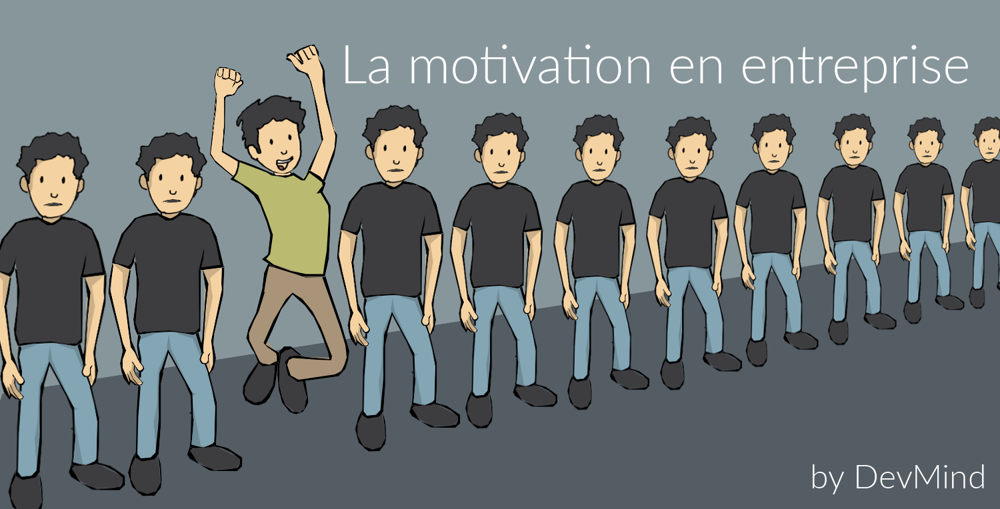
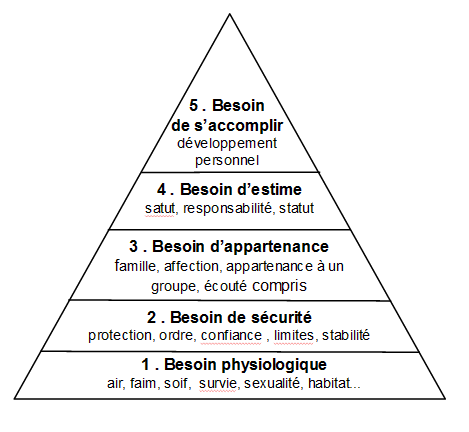
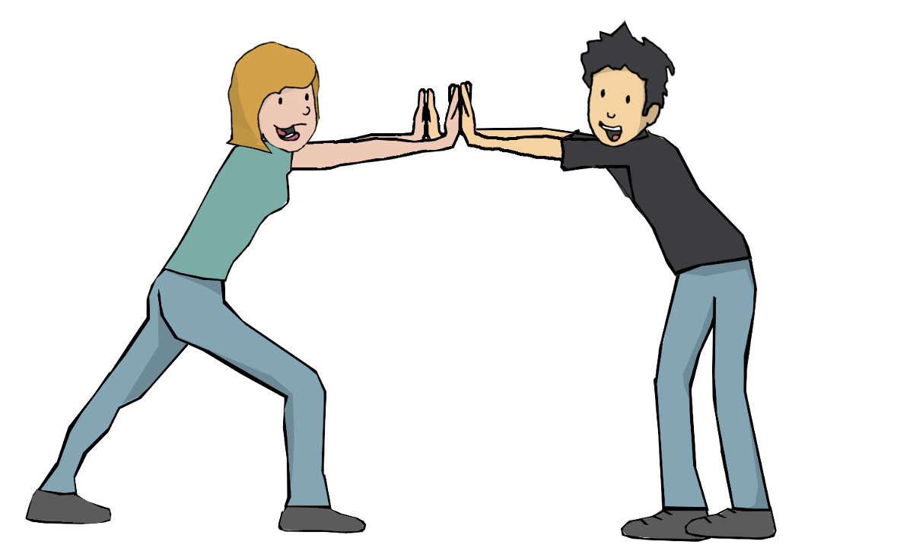

:doctitle: La motivation en entreprise
:description: Quelles sont les secrets pour avoir des équipes motivées
:keywords: Agilité, Motivation
:author: Guillaume EHRET - Dev-Mind
:revdate: 2018-04-05
:category: Agilité
:teaser: Quand nous commençons à travailler pour un nouvel employeur nous sommes tous remplis de motivation et de bonnes ondes. Comment peut on arriver quelques mois plus tard à être complétement démotivé ?
:imgteaser: ../../img/blog/2018/motivation_00.png

Quand nous commençons à travailler pour un nouvel employeur nous sommes tous remplis de motivation et de bonnes ondes. Comment peut on arriver quelques mois plus tard à être complétement démotivé ? Est ce un problème personnel, est ce un problème de management, de contexte ? Peut être les 3 à la fois.

== Satisfaction ou insatisfaction

http://fr.wikipedia.org/wiki/Frederick_Herzberg[Frederick Herzberg], psychologue américain s’est penché sur les conditions de travail et les relations humaines en milieu industriel (livre Le travail et la nature de l’homme, 1978). Son travail a débouché sur la théorie de la motivation.

Quand on travaille au contact des autres, la compréhension de sa personnalité ou de celles de ses collaborateurs est la clé pour développer les qualités humaines de chacun comme le leadership, la motivation, l’empathie…

Mieux se connaître permet de comprendre comment les autres nous perçoivent et comment ils peuvent réagir à notre personnalité ou à notre style. Ainsi il est plus facile d’adapter sa façon d’être pour travailler plus facilement avec les autres.

La satisfaction et l’insatisfaction au travail découle de plusieurs facteurs. Généralement les facteurs amenant de la satisfaction sont liés à l’exécution du travail alors que les facteurs d’insatisfaction sont plutôt liés à un contexte. Le contraire de la satisfaction pour Herzberg n’est pas l'insatisfaction mais l’absence de satisfaction. De même pour l'insatisfaction, son contraire est l’absence d’insatisfaction.

Il distingue deux catégories de facteurs :

* ceux apportant de la satisfaction et dit facteurs de motivations
** la reconnaissance
** l’accomplissement ou la sensation d’avoir bien réalisé son travail
** la responsabilisation
** l’autonomie accordée
** le plan de carrière
** ...

* ceux liés à l’insatisfaction dit facteurs d’hygiène.
** la relation avec ses supérieurs,
** le respect de la vie privée,
** les conditions de travail,
** le salaire
** les relations professionnelles
** la couverture sociale : mutuelle
** la sécurité du travai
** la vision de l’entreprise, d’un projet
** ...

Pour http://www.businessballs.com/herzberg.htm[Herzberg], la motivation vient de la satisfaction et de l’absence d’insatisfaction (http://fr.wikipedia.org/wiki/Th%C3%A9orie_des_deux_facteurs[théorie des deux facteurs]).

== Pyramide de Maslow

Quand on parle de motivation, on peut aussi évoquer les travaux de http://fr.wikipedia.org/wiki/Abraham_Maslow[Abraham Maslow] autre psychologue américain qui ont débouché sur la pyramide des besoins.

Maslow estime qu’une personne cherche à bâtir la pyramide ci dessous

Il commence par satisfaire les besoins élémentaires et gravir ensuite les échelons pour arriver à son accomplissement personnel. Un besoin d'ordre supérieur ne peut être satisfait que si les précédents le sont.

Pour faire un parallèle avec le monde professionnel, rien ne sert de vouloir motiver les salariés au niveau de l'estime, si des menaces de licenciements portent atteinte à la sécurité, ou si les salaires sont insuffisants pour satisfaire les besoins physiologiques.

Au cours de la vie des événemnts peuvent venir ébranler cette pyramide. A chaque fois ces chamboulements peuvent conduire à des baisses de motivation.

== Les secrets de la motivation

Nous allons maintenant nous focaliser sur la gestion de la motivation au sein d'une équipe. Qu'est ce que je dois faire ou ne pas faire pour avoir des équipes motivées ?

Je vais pour celà m'appuyer sur la très bonne présentation de Matthew Richter, faite entre autre à Agile Lyon 2018. Les slides sont disponibles sur son http://www.thiagi.com/agilelyon[site]. Sa manière de présenter en faisant interagir la salle est très efficace. Le principe était simple : faire émerger les secrets de la motivation via des jeux simples.

=== Secret n°1 : exemplarité

Ce n'est pas simple de reproduire un jeu par écrit mais nous allons tout de même le faire afin de vous remettre dans l'ambiance. Ce premier jeu est le http://chrisdeniaud.com/wikiAGFr/index.php?title=1_2_3_GO_![1, 2, 3 go]... Si vous animez ce jeu vous devez

1. demander aux participants de se lever et de se tenir face à vous bras tendus
2. leur expliquer "Je vais compter jusqu'à 3 et ensuite je dirai "go". A ce moment là tout le monde devra taper une fois dans ses mains".
3. débuter le jeu, en comptant 1, 2, 3 et en tapant dans vos mains
4. faire une pause de 2, 3 secondes et dire "go". La majorité des personnes ont normalement frappé dans leurs mains avant le "go". Faites leur remarquer qu'ils n'ont pas suivi les consignes
5. rejouer le jeu et contaster qu'encore une fois, bon nombre de personnes n'ont pas suivi

Ce jeu montre que les personnes reproduisent ce que vous leur montrez, pas ce que vous dites. En tant que manager il est important de faire ce que vous dites pour que votre message soit clair et compris.

=== Secret n°2 : mettre du sens

En tant que manager vous devez mettre du sens dans votre discours. Si les personnes qui vous écoutent ne vous comprennent pas ou ne comprennent pas l'intérêt de ce que vous dites, elles ne seront pas motivées pour effectuer vos dires.

Inversement si vos collaborateurs donnent du sens et de la valeur à ce qu'ils font, ils seront motivés. La motivation est quelque chose qui vient de soi mais qui peut s'effriter facilement. Faites leur confiance et laissez les faire.

Plus ils seront maternés moins ils seront motivés.

=== Secret n°3 : évitez la frustration

Dans le jeu numéro 2, vous demandez

1. de répéter les jours de la semaine aussi vite que vous : Lundi, mardi, mercredi, jeudi, vendredi, samedi, dimanche... Normalement l'assistance répète la même chose
2. de dire aussi vite que possible les jours classés dans l'ordre inverse : dimanche, samedi, vendredi, jeudi, mercredi, mardi, lundi
3. puis de dire les jours en les classant par nombre de lettres décroissantes : dimanche, vendredi, mercredi, samedi, jeudi, mardi, lundi
4. normalement l'assistance décroche à la deuxième question, non par manque de compétence mais par manque de préparation

Matthew avait demandé à sa fille de venir. Comme elle ne parle pas français, la frustration de ne pas arriver à faire l'exercice était encore renforcée. Mettre ces collaborateurs dans des situations indélicates, non anticipées amène de la frustration et de la démotivation.

La clé est de trouver la balance entre comment bouger vos collaborateurs de leur zone de confort pour les aider à progresser et les rassurer pour ne pas aller vers de la frustration.

=== Secret n°4 : compétition ou collaboration

Pour illustrer ce point, les participants devaient constituer des binômes. Chaque personne se met face à face, main contre main. Une personne n'a pas le droit de bouger les pieds. Le but est de déstabilliser l'autre par la force des bras. Les gagnants sont ceux qui déstabilisent leur adversaire.

Le jeu commence. Si tout le monde joue le jeu vous pouvez voir des personnes qui sont prêtes à tout pour y arriver...

Au final on pourrait penser que la compétition motive certaines personnes. Mais dans le cas du jeu, la personne qui ne gagne pas, reste frustrée. En fait les règle du jeu étaient "Les gagnants sont ceux qui déstabilisent leur adversaire". Pourquoi personne n'a collaboré pour bouger en même temps et au final gagner à 2 ?

La compétition peut être stimulante et amusante mais sur le long terme la collaboration est beaucoup plus productive. Faites collaborer les personnes plutôt que de les mettre en compétition.

=== Secret n°5 : la parole et l'engagement

Dans une équipe, les personnes qui parlent le plus sont les personnes qui vont fédérer le plus.  Elles se sentent le plus concernées. Vous devez vous appuyer sur ces personnes, et les laisser prendre la parole.

Mais vous devez aussi donner la parole à ceux qui ne la prennent pas, afin de les impliquer. Essayez de faire parler les personnes entre elles.

=== Secret n°6 : la passion

Quand une personne fait quelque chose par passion, elle va être actrice. Quand on demande de faire quelque chose à une personne, elle va plutôt être passive.
L'autonomie est donc la cible à atteindre. Essayez de déléguer les tâches et laisser de l'autonomie à vos équipes.

La passion peut être contagieuse. Essayez de transmettre la votre.

=== Secret n°7 : flexibilité

Pour illustrer ce nouveau secret, Matthew a voulu faire un "tour de magie" en devinant la carte choisie par une personne prise au hasard dans la salle. Si vous voulez réaliser ce jeu, cachez une carte quelque part : par exemple la dame de coeur. Le principe est d'orienter la personne pour la faire converger vers cette carte. Vous pouvez poser ce type de questions

* Quelle couleur préférez vous ? Si la personne dit rouge vous lui demandez de garder les rouges, sinon si elle dit noir vous lui demandez d'enlever les noirs. 2 actions différentes pour un même résultat
* Quelle type de carte préfère t'elle dans les cartes restantes ? Coeur ou carreau ? Pareil le but est de lui faire garder les coeurs en main
* Préfère t'elle les carte des habillés ou les cartes numérotées ?
* A ce moment il ne doit lui rester que le roi, le valet et la dame de coeur.
* Vous pouvez maintenant lui demander s'il préfère les habillés typés masculins (valet, roi) ou féminin
* Il ne doit rester que la dame de coeur et à ce moment vous pouvez révéler que vous le saviez dès le départ.

En fait tout au long de ce jeu, vous devez changer les questions en fonction des personnes en face de vous. Le but est d'arriver à l'objectif de départ. Quand ce dernier est clair il existe plusieurs chemins pour y arriver. Tout dépend des personnes qui doivent le réaliser. En tant que manager, vous devez rester flexible sur le chemin pour arriver à l'objectif. Encore une fois le principe est de laisser de l'autonomie aux personnes, tout en les guidant.

=== Secret n°8 : bannir les récompenses individuelles

Nouvelle expérience qui cette fois a coûté quelques euros à l'animateur.

* Demandez dans l'assistance si une personne est motivée pour venir chanter sur scène. Dans un contexte où les gens ne se connaissent pas, généralement personne n'est motivée. Si une personne est motivée laissez là faire
* Proposez 10 euros pour venir chanter pour encourager les personnes. Une personne va se dévouer plus vite
* Retentez l'expérience en proposant cette fois 40 euros. Les volontaires vont venir encore plus vite

Au premier abord on peut penser que les primes sont motivantes, car plus on propose d'argent plus les gens sont volontaires pour remplir le défi. Mais que ressent la personne qui est venue chanter pour rien, ou pour un plus petit montant ? Comment se sent la personne qui sait chanter mais qui n'osait pas le faire en public ?

Les récompenses individuelles, les distinctions individuelles (comme l'employé du mois aux Etats Unis) nuisent à la motivation intrinsèque de l'équipe. Elles montent les gens les uns contre les autres, et créent de la jalousie et de la démotivation. Les récompenses doivent être collectives et équitables, pas forcément pécunières.

=== Secret n°9 : réflexion sur l'expérience

Pour illustrer ce secret, le jeu était une variante du http://www.wilderdom.com/games/descriptions/HeliumStick.html[bâton d'hélium]. Le principe est de poser un baton (assez léger) sur le doigt tendu de plusieurs participants. Le but du jeu est d'amener le bâton au sol en gardant toujours le contact entre le bâton et le doigt. Ce jeu demande de la collaboration. Si les gens ne s'entendent pas le bâton aura tendance à monter plutôt qu'à descendre.

Les personnes ne peuvent se sortir du défi qu'en collaborant, en essayant différentes stratégies. On n'apprend pas d'une expérience, on apprend de la réflexion sur une expérience que nous avons faite. Il est important dans une équipe de se poser et de réfléchir sur les actions qui ont été réalisées. On parle à la fois des expériences positives et négatives. Car l'échec n'est pas important si on en tire des leçons pour ne pas le reproduire.

=== Secret n°10 : perspective

Les personnes ne perçoivent pas la réalité de la même manière. Nos sens envoient des informations à notre cerveau, et ce dernier fait des interprétations pour reconstiuer sa réalité. Il se base sur son vécu, sur les informations reçues pour envoyer l'information la plus fiable possible.

Il faut en avoir conscience et accepter que ces collaborateurs n'interprètent pas les choses de la même manière que vous. Encore une fois s'ils se sentent incompris il perdront de leur motivation.

Quand on travaille au contact des autres, la compréhension de sa personnalité ou de celles de ses collaborateurs est la clé pour développer les qualités humaines de chacun.

