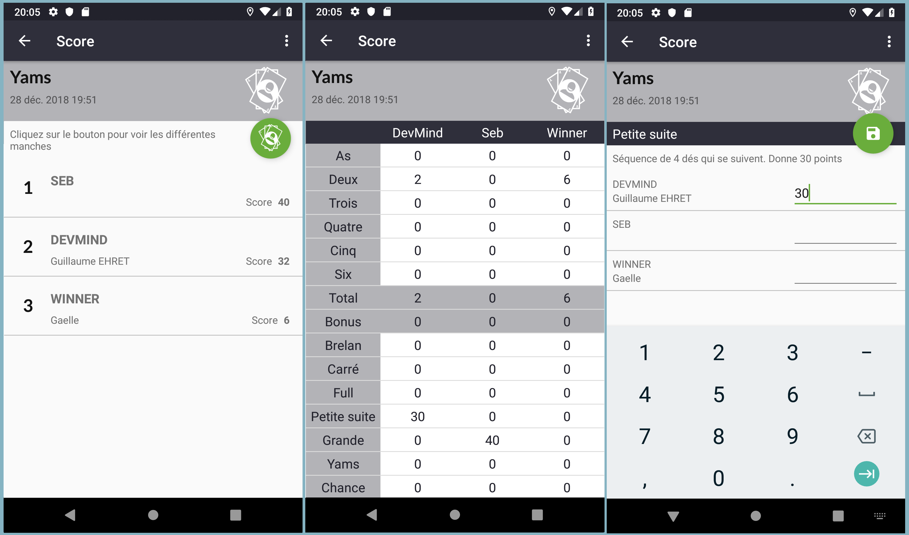

:doctitle: Application pour saisir les scores
:description: Score jeu de société permet de saisir les scores quand vous jouez entre amis à un jeu de société
:keywords: Android
:author: Guillaume EHRET - Dev-Mind
:revdate: 2019-01-01
:category: Android
:teaser: Pour commencer 2019, DevMibnd offre une application Android pour les amateurs de jeu en société possédant un téléphone Android.
:imgteaser: :../../img/blog/2019/score_00.png

Les dernières évolutions de la plateforme Android et l'adoption du langage Kotlin m'ont donné envie de créer une https://play.google.com/store/apps/details?id=com.devmind.score[application disponible] à tous sur le store Google. Vous pouvez tester l'application et me faire des retours si vous le souhaitez.

== Pourquoi une application ?

Cette application est en fait la réécriture d'une ancienne application, que j'avais écrite en 2013. Comme je me suis replongé dans le développement Android depuis quelques mois j'ai décidé d'apporter les changements qui m'avaient été demandés.

En ce début d'année 2019, DevMind vous fait donc cadeau de cette application gratuite. Elle est destinée aux joueurs qui préfèrent utiliser leur téléphone ou tablette, plutôt qu'une feuille de papier pour marquer les scores d'un jeu de société.

== Comment utiliser l'application ?

Vous pouvez télécharger l'application sur le store Google

Une fois installée, vous pouvez créer des joueurs. Seul le surnom est obligatoire

Sur la liste des parties, vous pouvez utiliser le bouton *+* pour ajouter une nouvelle partie. Vous pouvez choisir le type de la partie. Par exemple vous pouvez choisir une partie de Yams. Vous devez ensuite sélectionner les joueurs qui vont jouer

A tout moment vous pouvez supprimer une partie, en recommencer une en utilisant le menu contextuel en haut à droite

Quand vous sélectionnez une partie vous avez un résumé des scores. Vous pouvez accéder à la grille des scores pour voir le détail des différentes manches, des différents tours. Par exemple pour le Yams la grille est préremplie, les totaux et bonus sont calculés automatiquement. Quand vous cliquez sur un élément de la grille vous pouvez mettre à jour le score des personnes. Pour le Yams par exemple les règles pour compter les points sont rappelées

Il ne vous reste plus qu'à jouer... Si vous avez besoin d'avoir plus de types de jeux vous pouvez me contacter via le menu et la page "A propos".

