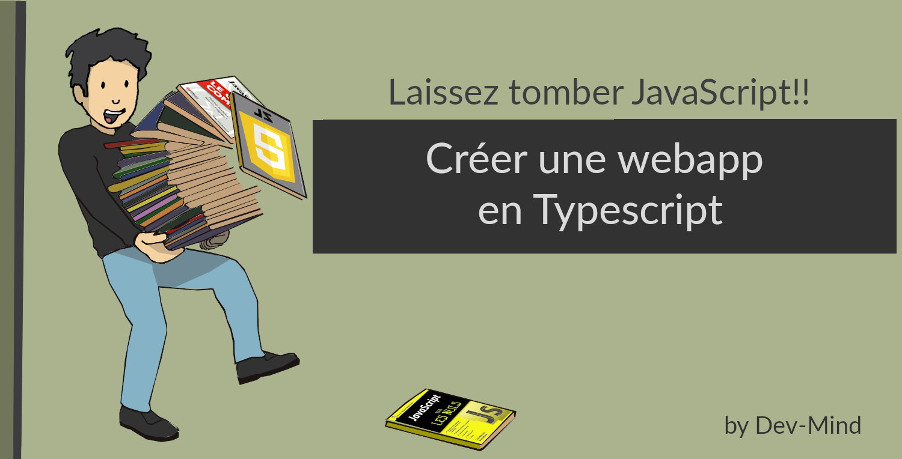
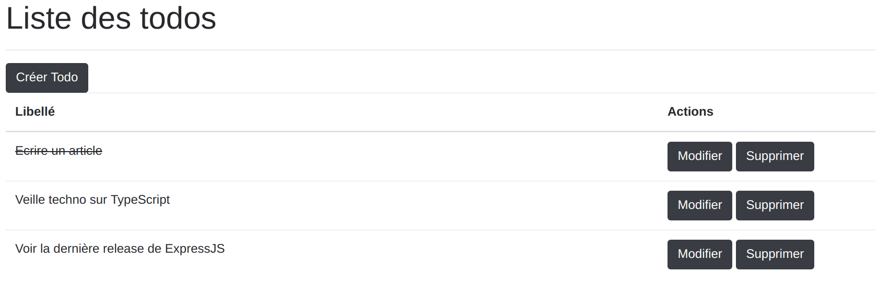
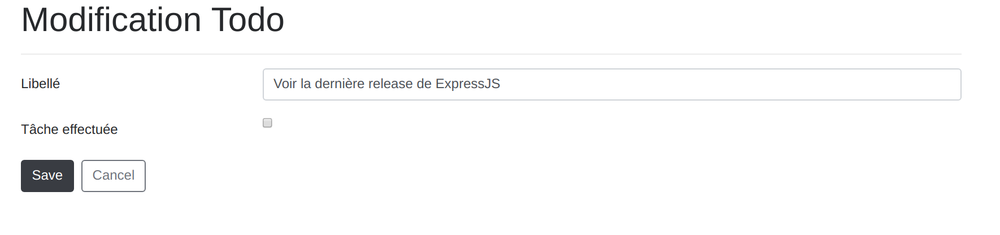

:doctitle: Créer une application web en TypeScript
:description: Créer une application web en TypeScript
:keywords: Web, Typescript
:author: Guillaume EHRET - Dev-Mind
:revdate: 2019-10-08
:category: Web
:teaser: Comment aller plus loin avec TypeScript et écrire une application web
:imgteaser: :../../img/blog/2019/web_typescript0.png
:toc:

Nous avons vu dans l'https://dev-mind.fr/blog/2019/start_typescript_project_and_test_with_jest.html[article précédent], comment démarrer un nouveau projet en TypeScript et le tester avec Jest. Essayons d'aller plus loin et de mettre en place une application web.

Pour illustrer cet article, nous allons mettre en place une application permettant de gérer une liste de tâches à faire (todo list). Le code illustrant cet article est disponible sous https://gitlab.com/javamind/typescript-web[Gitlab].

== Etape 1 : Mettre en place un serveur web

Ma solution se base sur https://expressjs.com/fr/[ExpressJS]. Pour plus d'informations, vous pouvez lire https://dev-mind.fr/blog/2018/objectif_clever_cloud_js.html[mon article], dans lequel j'explique comment démarrer avec https://expressjs.com/fr/[ExpressJS], comment le configurer pour la production et comment déployer votre application sur https://www.clever-cloud.com/en/[Clever Cloud]. Aujourd'hui le but est de reprendre la même chose mais en TypeScript.

Commençons par le début : créons un serveur ExpressJs et créons un handler de requête qui affichera un message `Hello Worldè.

On initie le projet en créant l'arborescence, et en lançant le client `npm` pour configurer notre nouveau projet https://nodejs.org/en/[NodeJS]

[source, shell, subs="none"]
----
mkdir -p myproject/src/main/typescript
mkdir -p myproject/src/test/typescript
cd myproject
npm init
----

Nous pouvons maintenant installer les dépendances avec `npm`.

[source, shell, subs="none"]
----
npm install typescript
npm install express @types/express serve-static
npm install errorhandler @types/errorhandler express-handlebars @types/express-handlebars
----

Pour information nous chargeons aussi les fichiers descriptor TypeScript (`@types/...`) qui permettent d'utiliser des sources JavaScript dans votre projet. Ces fichiers décrivent les types, les classes et les méthodes utilisées dans un fichier JavaScript. Ainsi le compilateur peut trouver les différents types définis dans les librairies JS, les IDEs peuvent proposer de la complétion...

Configurons maintenant TypeScript. Lançons la commande `./node_modules/.bin/tsc --init` pour initialiser un fichier `tsconfig.json`. Le contenu du fichier peut être recopié de l'https://dev-mind.fr/blog/2019/start_typescript_project_and_test_with_jest.html[article précédent].

Nous allons créer une classe qui représentera notre application Express dans le fichier `express.ts` et le répertoire `src/main/typescript`. Nous créons aussi une interface qui décrit les paramètres attendus par notre classe

[source, typescript, subs="none"]
----
import * as express from 'express';
import errorHandler = require("errorhandler");

export interface ServerOptions {
    // Path contenant toutes les ressources statiques (css, js...)
    static: string;
    // Port de votre serveur
    port: number;
}

export class Express {

    public app: express.Application;

    constructor(public options: ServerOptions) {
        //create expressjs application
        this.app = express();
        //configure application
        this.config();
        this.app.set('port', this.options.port);
    }

    /**
     * Configure application
     */
    public config() {
        this.app
            .get('/', (req, res) => res.send('Hello World!'))
            .use(errorHandler());
    }

    /**
     * Bootstrap the application.
     */
    public static bootstrap(options: ServerOptions): Express {
        console.log("Try to start server");
        return new Express(options);
    }

}
----

Pour le moment le contenu de cette classe est simplifiée et le but est d'enrichir la méthode `config()` au fur et à mesure de l'avancée de cet article. Dans ce premier exemple, nous avons défini un handler http associé à l'URL `/` et retournant `Hello World`.

Nous pouvons maintenant créer un fichier `app.ts` qui sera utilisé pour démarrer notre serveur (le mettre au même niveau)

[source, typescript, subs="none"]
----
import {Express, ServerOptions} from './express';
import * as http from 'http';

const options = {
    static: `src/main/static`,
    port: 8081
} as ServerOptions;

const server = Express.bootstrap(options).app;

http.createServer(server)
    .listen(options.port)
    .on("listening", () => console.debug('Listening on ' + options.port));
----

Pour simplifier le lancement de l'application, la propriété `script` du fichier `package.json` peut contenir une entrée `start` qui lancera la compilation TypeScript via `tsc` et exécutera le fichier JS compilé

[source, json, subs="none"]
----
{
  "name": "devmind-typescript",
  "scripts": {
    "start": "tsc; node ./build/app.js"
  },
  "dependencies": {
    // ...
  }
}
----

Gràce à ce nouveau paramétrage, l'application peut être lancée via la commande `npm run start`. Vous pouvez tester : un message `Listening on 8081` doit s'afficher dans la concole et l'URL `http://localhost:8081/` retourne un message `Hello world`.

== Etape 2 : Servir des ressources statiques

Un site web a souvent besoin de servir des ressources statiques : des fichiers HTML, JavaScript, CSS... Nous allons modifier la configuration de notre serveur pour que les ressources du répertoire `src/main/static` soient exposées. Notez que nous avons défini plus haut ce chemin dans l'interface de configuration `ServerOptions`.

Modifions la méthode `config()` de notre classe Express

[source, typescript, subs="none"]
----
this.app
  .use(express.static(this.options.static))
  .get('/', (req, res) => res.send('Hello World!'))
  .use(errorHandler());
----

Pour améliorer la mise en forme des pages de l'application, nous téléchargeons https://getbootstrap.com/docs/4.3/getting-started/download/[Bootstrap] dans `src/main/static`. Ces ressources CSS peuvent être utilisées dans une page `hello.html`

[source, html]
----
<html>
<head>
    <link rel="stylesheet" href="css/bootstrap.min.css">
</head>
<body>
    <h1>Hello TypeScript</h1>
</body>
</html>
----

== Etape 3 : Une classe pour gérer nos données

Dans un futur article je vous expliquerai comment utiliser une base de données. Pour le moment nous allons gérer les données d'une manière triviale et proposer un DAO qui gérera une liste de données en mémoire

Créons un fichier `todo.dao.ts` qui contiendra le type `Todo` (tâche à faire), objet de base de notre application. Les données seront stockées pour notre exemple en mémoire dans un tableau `TODO_DATA`

[source, typescript, subs="none"]
----
export interface Todo {
    id: number;
    label: string;
    checked: boolean;
}

let sequence = 1;
const TODO_DATA: Array<Todo> = [
    {id: sequence++, label: 'Ecrire un article', checked: true},
    {id: sequence++, label: 'Veille techno sur TypeScript', checked: false},
    {id: sequence++, label: 'Voir la dernière release de ExpressJS', checked: false}
];
----

La classe permettant de manipuler les données peut avoir cette forme

[source, typescript, subs="none"]
----
export class TodoDao {

    findAll(): Array<Todo> {
        return TODO_DATA;
    }

    findById(id: number): Todo {
        const todos = TODO_DATA.filter(elt => elt.id === id);
        return todos.length > 0 ? todos[0] : undefined;
    }

    save(todo: Todo): Todo {
        const updated: Todo = this.findById(todo.id) || {id: ++sequence} as Todo;
        updated.label = todo.label;
        updated.checked = todo.checked !== undefined;
        if (!TODO_DATA.find(elt => elt.id === todo.id)){
            TODO_DATA.push(updated);
        }
        return updated;
    }

    deleteById(id: number) {
        const index = TODO_DATA.map(elt => elt.id).indexOf(id);
        if (index >= 0) {
            TODO_DATA.splice(index, 1);
        }
    }
}
----

== Etape 4 : Mettre en place des règles de routage et un système de templating

Il est temps d'aller plus loin et de paramétrer des routes et des templates de page.

=== Template de pages

Quand nous créons une application nous ne voulons pas dupliquer la structuration des pages HTML (headers, footer, mise en forme générale....). Nous voulons aussi par exemple passer des valeurs dynamiques : par exemple envoyer une liste d'éléments à une page pour afficher le détail.

La solution est d'utiliser un sytème de template. Dans cet exemple nous utiliserons https://handlebarsjs.com/[handlebars].

=== Routes

Nous allons aussi mettre en place un sytème de routage "intelligent" permettant de naviguer dans l'application. Le système de routage est aussi capable d'aller récupérer des arguments dans les URL. Pour chaque route vous pouvez donner la méthode HTTP (GET, POST...) qui l'active.

Dans notre exemple, nous allons mettre en place ce sytème de routes.

* GET `/todos` renverra la liste des todos
* GET `/todos/:id` affichera le détail du todo ayant l'identifiant `id`
* POST `/todos/:id/delete` supprimera le todo ayant l'identifiant `id`
* GET `/todos/create` affichera
* POST `/todos` permettra de créer un nouveau todo

Nous n'utilisons que les méthodes GET et POST car nous n'allons faire que des formulaires HTML et en HTML, ce sont les seules méthodes acceptées par la balise `<form>`.

=== Mise à jour de la configuration

Modifions notre configuration Express (la classe TodoRoute sera créée plus tard)

[source, typescript, subs="none"]
----
import * as express from 'express';
import * as handlebars from 'express-handlebars';
import errorHandler = require("errorhandler");
import {TodoRoute} from "./todo.route";
import bodyParser = require("body-parser");

export class Express {

  // ...
  public config() {
    const router = express.Router();

    TodoRoute.create(router);

    this.app
        .engine('handlebars', handlebars())
        .set('view engine', 'handlebars')
        .enable('view cache')
        .enable('trust proxy')
        .set('views', `${__dirname}/../src/main/views/`)
        .use(bodyParser())
        .use(router)
        .use(express.static(this.options.static))
        .get('/', (req, res) => res.send('Hello World!'))
        .use(errorHandler());
  }
}
----

* `handlebars` est configurer pour aller chercher les templates de pages dans le répertoire `src/main/views`.
* bodyParser() permet à Express de parser les requêtes HTTP pour lire les paramètres envoyés dans le corps de la requête

=== Créer TodoRoute

Nous devons maintenant créer nos premières routes. Elle seront définies dans le fichier `todo.route.ts` dans le répertoire `src/main/typescript`

[source, typescript, subs="none"]
----
import {Request, Response, Router} from "express";
import {Todo, TodoDao} from "./todo.dao";

export class TodoRoute{

    dao:TodoDao;

    constructor(dao: TodoDao) {
        this.dao = dao;
    }

    public static create(router: Router) {
        const route = new TodoRoute(new TodoDao());
        router.get("/todos", (req: Request, res: Response) => route.findAll(req, res));
        router.get("/todos/:id", (req: Request, res: Response) => route.findById(req, res, (req.params as any).id));
        router.post("/todos/:id/delete", (req: Request, res: Response) => route.deleteById(req, res, (req.params as any).id));
        router.get("/todos/create", (req: Request, res: Response) => route.findById(req, res, undefined));
        router.post("/todos", (req: Request, res: Response) => route.save(req, res, req.body));
    }

    private viewOne(req: Request, res: Response, todo:Todo){
        res.locals['title'] = todo.id ? 'Modification Todo' : 'Ajout Todo';
        res.locals['todo'] = this.dao.findById(todo.id) || {} as Todo;
        res.render('todo_view');
    }

    private viewAll(req: Request, res: Response, todos:Array<Todo>){
        res.locals['title'] = 'Liste des todos';
        res.locals['todos'] = todos;
        res.render('todo_list_view');
    }

    private findAll(req: Request, res: Response) {
        this.viewAll(req, res, this.dao.findAll());
    }

    private findById(req: Request, res: Response, id: number) {
        this.viewOne(req, res, this.dao.findById(id) || {} as Todo);
    }

    private deleteById(req: Request, res: Response, id: number) {
        this.dao.deleteById(id);
        this.findAll(req, res);
    }

    private save(req: Request, res: Response, todo: Todo) {
        if(!todo.label){
            res.locals['errors'] = {
                has: true,
                label: 'Le libellé est obligatoire'
            };
            this.viewOne(req, res, todo);
        }
        else{
            this.dao.save(todo);
            this.findAll(req, res);
        }
    }
}
----

Dans la première partie, nous créons les associations entre les méthodes HTTP, les chemins et les méthodes qui vont gérér l'affichage.

Les méthodes `view...` permettent d'afficher un template `handlebar` via la méthode render. Pour envoyer des paramètres à ce template nous ajoutons des valeurs dans le tableau `res.locals` de l'objet `response` (correspond à la réponse HTTP qui sera retournée par le serveur).

Les autres méthodes font simplement appel à notre DAO défini plus haut.

=== Les templates handlebars

Dans la classe définie dans le paragraphe précédent, deux templates sont appelés : `todo_view` et `todo_list_view`. Les extensions des fichiers (`.handlebars`) n'ont pas besoin d'être précisées dans la classe `TodoRoute`.

Pour configurer `handlebars` un premier template `main.handlebars` définissant la structure générale de la page doit être créé dans le répertoire `src/main/views/layouts`.

[source, html]
----
<!DOCTYPE html>
<html>
<head>
  <title>{{ title }}</title>
  <link rel="stylesheet" href="/css/bootstrap.min.css">
</head>
<body>
  

    <h1>{{ title }}</h1>
    

    {{{body}}}
  

</body>
</html>
----

`handlebars` utilise des moustaches `{{ ... }}` pour afficher le contenu de variables quand le template est compilé en HTML. `{{ title }}` est passé dans le code du routeur plus haut et `{{ body }}` fait référence au template à afficher. Par exemple quand on veut gérer la liste des todos, nous allons créer un fichier `todo_list_view.handlebars` dans le répertoire `src/main/views`.

Ce template peut avoir cette forme

* un lien pour créer un nouveau todo
* une itération sur la liste des todos passée en paramètre `{{#todos}}...{{/todos}}`
* vérifier si une valeur est valorisée `{{#checked}}...{{/checked}}` ou non valorisée `{{^checked}}...{{/checked}}`
* des liens pour modifier ou supprimer des todos existants

[source, html]
----
<a href="/todos/create" class="btn btn-dark">Créer Todo</a>
 
<table class="table">

    <thead>
    <tr>
        <th>Libellé</th>
        <th width="25%">Actions</th>
    </tr>
    </thead>
    <tbody>
    {{#todos}}
        <tr>
            <td>
                {{#checked}}<s>{{label}}</s>AAA{{/checked}}
                {{^checked}}{{label}}{{/checked}}
            </td>
            <td>
                <form action="/todos/{{id}}/delete" method="post" onsubmit="return confirm('Voulez vous vraiment supprimer ce todo ? ')">
                    <a href="/todos/{{id}}" class="btn btn-dark">
                        Modifier
                    </a>
                    <button class="btn btn-dark">
                        Supprimer
                    </button>
                </form>
            </td>
        </tr>
    {{/todos}}
    </tbody>
</table>
----

Et le template pour modifier ou créer un nouveau Todo aura cette forme

[source, html]
----
<form action="/todos" method="post">
{{#errors.has}}

Vous avez une erreur dans votre formulaire
{{/errors.has}}

    <input type="hidden" name="id" value="{{todo.id}}">

    

        <label for="label" class="col-sm-3 col-form-label">Libellé</label>
        

            <input type="text" placeholder="Libellé du todo" name="label" id="label" value="{{todo.label}}"
                   class="form-control {{#errors.label}}is-invalid{{/errors.label}}">
            <small class="invalid-feedback">{{errors.label}}</small>
        

    

    

        <label for="checked" class="col-sm-3 col-form-label">Tâche effectuée</label>
        

            

                <input class="form-check-input" type="checkbox"  id="checked" name="checked"
                       {{#todo.checked}}checked{{/todo.checked}}>
            

        

    

    

        <button class="btn btn-dark">Save</button>&nbsp;&nbsp;
        <a class="btn btn-outline-secondary" href="/todos">Cancel</a>
    

</form>
----

Vous pouvez relancer votre serveur pour tester l'application.

== Conclusion

Cet article était un peu long mais j'ai essayé de vous montrer beaucoup de code. Comme je le disais plus haut, le code est disponible sous https://gitlab.com/javamind/typescript-web[Gitlab].

J'espère vous avoir donné les bases pour démarrer une application web rapidement en TypeScript. Personnellement j'ai utilisé cette techno pour gérer ce site web. Le code est d'ailleurs libre si vous voulez vous en inspirer https://github.com/Dev-Mind/dev-mind.fr
