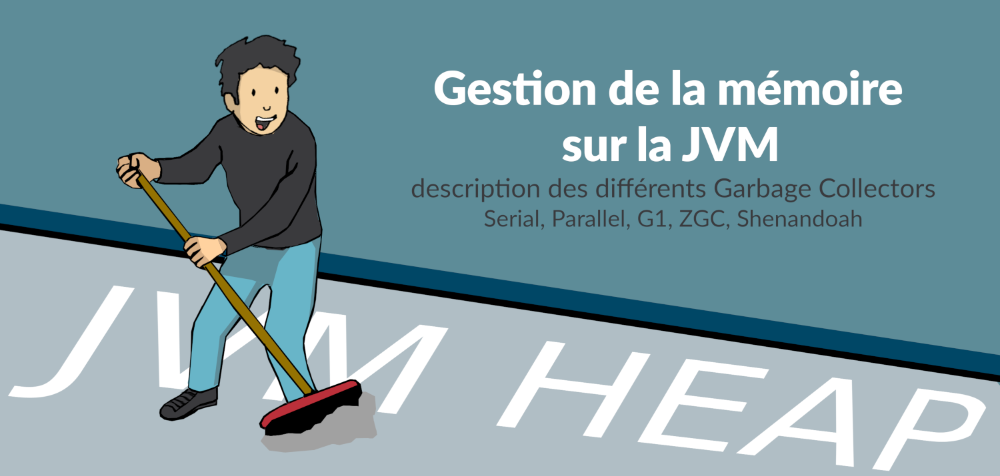
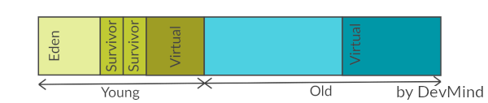
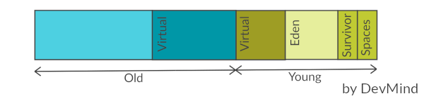
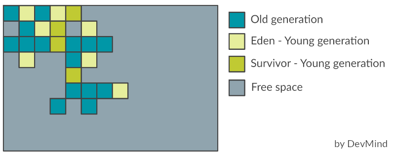
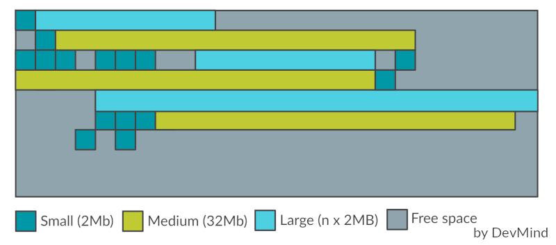
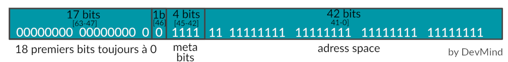
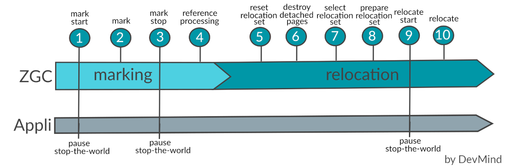
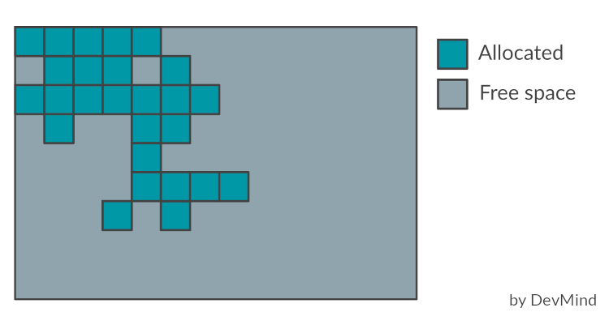
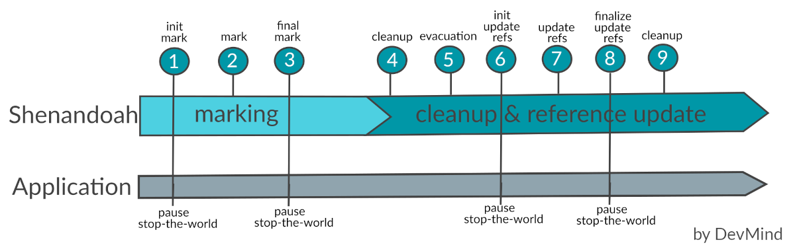

:doctitle: La mémoire en Java
:description: Comprendre comment la mémoire Java est gérée pour identifier des problèmes (Serial, Paralell, G1, ZGC, Epsilon, Shenandoah)
:keywords: Java mémoire
:author: Guillaume EHRET - Dev-Mind
:revdate: 2021-02-20
:category: Java
:teaser: Comprendre comment les garbages collectors gère la mémoire d'une machine virtuelle Java (Serial, Paralell, G1, ZGC, Epsilon, Shenandoah).
:imgteaser: :../../img/blog/2021/jvm_memory.png
:toc:
:toclevels: 4

Nous allons voir dans cet article, comment la mémoire est gérée sur une machine virtuelle (Java HotSpot VM).
En tant que développeur Java ou Kotlin la gestion de la mémoire est transparente et automatique, mais il existe plusieurs stratégies qui peuvent influer sur les performances de votre application.

Ces différentes stratégies ont évolué au fur et à mesure du temps et des versions.
Mon article se base sur Java 11, la https://en.wikipedia.org/wiki/Java_version_history[version LTS (Long term support) actuelle].

Plusieurs termes ne seront pas traduits en français dans cet article, car la traduction a peu d'intérêt à mon sens.
J'éviterai par exemple de parler de ramasse-miettes et conserverai le terme Garbage collector :-).
Cet article est long (au moins 30 min) mais je trouvais important de décrire les différents GC au même endroit pour voir comment ils ont évolué.

== Le garbage collector

Le garbage collector (GC) est l'outil qui va gérer les allocations dynamiques et de la mémoire.

* Lorsque l'application démarre, le garbage collector va réserver de la mémoire du système d'exploitation, et la restituer lors de son arrêt.
Les différents objets sont stockés dans un espace que l’on appelle la `heap`.
* Quand l'application a besoin de créer des objets, le garbage collector va leur allouer des zones dédiées
* La mémoire n'est pas infinie sur une machine.
Le garbage collector doit être capable de recycler les zones mémoires qui ne sont plus utilisées, pour pouvoir les réallouer.
Il le fait généralement en deux phases
** `Mark`: il identifie les objets qui sont utilisés ou non
** `Sweep`: il supprime les objets identifiés comme non utilisés lors de la phase précédente.

Comme je l'ai dit en introduction il existe plusieurs https://medium.com/@hasithalgamge/seven-types-of-java-garbage-collectors-6297a1418e82[garbages collectors] qui vont se comporter différemment.

* https://docs.oracle.com/en/java/javase/11/gctuning/available-collectors.html[Serial Garbage Collector] utilise un seul thread.
C'est le mieux adapté aux machines mono processeur.
C'est une très bonne solution pour les petites applications n'utilisant pas plus de 100Mo de mémoire.
* https://docs.oracle.com/en/java/javase/11/gctuning/parallel-collector1.html[Parallel Garbage Collector] est similaire au `Serial Collector` mais il est lui capable d'utiliser plusieurs threads pour essayer d'optimiser la phase de vérification des objets à supprimer.
Ce collecteur est destiné à des applications avec un ensemble de données moyen s'exécutant sur une machine multiprocesseur ou multithread.
* https://docs.oracle.com/en/java/javase/11/gctuning/concurrent-mark-sweep-cms-collector.html[CMS Garbage Collector] (déprécié depuis Java 9) on s'attardera plus sur son successeur le `Garbage-First (G1)`
* https://docs.oracle.com/en/java/javase/11/gctuning/garbage-first-garbage-collector.html[G1 Garbage Collector] a été créé pour les serveurs multi multiprocesseurs avec une grande quantité de mémoire.
* https://openjdk.java.net/jeps/333[Z garbage collector] (expérimental en Java 11 et amené à remplacer le G1 à partir de JDK15) ZGC effectue tous les travaux coûteux simultanément, sans arrêter l'exécution des threads d'application.
Le ZGC est destiné aux applications qui nécessitent une faible latence (moins de 10ms de pauses) et/ou utilisent une très grosse `heap` (plusieurs téraoctets).
* http://openjdk.java.net/jeps/318[Epsilon Garbage Collector] (expérimental en Java 11) gère l'allocation de mémoire mais n'implémente aucun mécanisme de récupération de mémoire.
Une fois que le tas Java disponible est épuisé, la machine virtuelle Java s'arrête (OutOfMemory).
C'est forcément celui qui a le temps de latence le plus faible.
Il est destiné à des jobs qui vont avoir une durée de vie très courte.
* https://openjdk.java.net/jeps/189[Shenandoah Garbage Collector] (apparu en Java 12) a pour but de réduire les temps de pause GC en effectuant le nettoyage en même temps que les threads Java sont en cours d'exécution.
Les temps de pause avec Shenandoah sont indépendants de la taille du tas, ce qui signifie que vous aurez les mêmes temps de pause, que votre tas soit de 200Mo ou 200Go.
Par contre forcément vu que le travail est en continu le débit peut être impacté

La JVM essaie de s'adapter à votre environnement et votre application.
Dans la majorité des cas, elle fera les bons choix.
Mais si vous constatez des ralentissements, vous pouvez vous poser des questions et affiner éventuellement les paramètres ou le GC utilisé.

Par défaut, la JVM fait ce choix là

* `G1 Garbage Collector`
* Le nombre de threads utilisables par le GC est déterminé en fonction des ressources CPU disponible et de la taille de la `heap`
* Taille initiale de la `heap` : 1/64 de la mémoire physique
* Taille maximale de la `heap` : 1/4 de la mémoire physique

== Fonctionnement

Scanner la mémoire (`mark`) et recycler des zones (`sweep`) a un coût non négligeable.

Chaque objet instancié dans la JVM peut être lié à un ou plusieurs autres.
Ce lien est appelé une référence.

* un objet ayant une ou plusieurs références est considéré comme vivant
* quand il n'existe plus aucune référence vers un objet, ce dernier est considéré comme mort et le GC peut le supprimer et réutiliser l'espace mémoire utilisé.

Si on voulait implémenter un garbage collector simple, on pourrait mettre en place l'algorithme suivant.

1. l'application est mise en pause pour analyser chaque objet, pour éviter de recréer des objets pendant que nous essayons de faire du ménage.
2. notre GC itère sur chaque objet accessible pour voir si il est reférencé par d'autres.
3. on supprime tous les objets morts pour réutiliser leur espace mémoire
4. si on voulait bien faire, il faudrait défragmenter pour que les tous les objets utilisés soient au début de la mémoire.

Niveau performance cette approche va dépendre du nombre d'objets et de la taille de la mémoire.
Il deviendra vite inefficace pour une grosse application.

Les différents garbage collectors vont faire des hypothèses sur votre application (ces hyppothèses peuvent variées en fonction des paramètres que vous pouvez utiliser).
Le but est de minimiser le travail requis pour récupérer les objets inutilisés.

=== Collecte genérationnelle

Le GC se base sur des hypothèses (générationnelles)

* la majorité des objets ne survivent que pendant une courte période de temps, l'exécution d'une méthode par exemple.
* d'autres objets beaucoup moins nombreux vont vivre tout au long de la vie d'une application jusqu'à ce que la VM se termine (exemple des objets statiques, des singletons...).
* entre ces deux extrêmes on va retrouver quelques objets, qui vont avoir une durée de vie variant entre la jeunesse et l'éternité.

Bien évidemment une application peut se comporter différemment, mais la très grosse majorité suivent ces hypothèses.

La `heap` (mémoire totale) va être découpée en différentes zones (générations) qui contiendront des objets d'âges différents.
Par exemple pour le `Serial Garbage Collector` nous avons le découpage suivant

Le GC se lance sur une génération lorsque la zone est remplie.
Come nous avons des zones plus petites, le travail sera plus rapide.

Un objet nouvellement créé (via un new) est placé dans la `jeune génération` et plus précisément dans la sous zone `Eden`.
Lorque cet espace est plein, le GC tente de nettoyer les objets.
Cette opération est appelée une collecte mineure (Minor collection) car elle implique un nombre limité d'objets.

Il existe deux zones Survivor, et sur les deux nous en avons toujours au moins une des deux qui reste vide.
Quand le GC parcourt tous les objets des zones `Eden` et `Survivor` (celle occupée),

* un objet non utilisé est supprimé
* un objet encore en vie aura son âge incrémenté de 1 et sera copié dans la zone `Survivor` restée vide.
* un objet du survivor qui a un âge assez grand est transféré dans la `vieille génération`.
Cet âge (seuil) est calculé par le GC

Quand le GC doit nettoyer la vieille génération, il lance une collecte majeure sur toute la `heap` (Major collection).
Cette collecte est bien plus coûteuse qu'une collecte mineure de la jeune génération.

Sur mon image les zones virtuelles correspondent aux zones disponibles mais non encore allouées.

=== Logguer ce que fait le garbage collector

Si vous suspectez des problèmes de GC, vous devez savoir ce qu'il fait.
Pour activer des logs, vous pouvez ajouter des options comme `-verbose:gc` lorsque vous lancez votre JVM. Par exemple

----
[1,733s][info][gc] GC(4) Pause Young (Normal) (G1 Evacuation Pause) 149M->23M(258M) 8,546ms
[1,760s][info][gc] GC(5) Pause Young (Concurrent Start) (Metadata GC Threshold) 25M->23M(258M) 12,065ms
[1,760s][info][gc] GC(6) Concurrent Cycle
[1,769s][info][gc] GC(6) Pause Remark 24M->24M(258M) 1,524ms
[1,772s][info][gc] GC(6) Pause Cleanup 24M->24M(258M) 0,034ms
[1,773s][info][gc] GC(6) Concurrent Cycle 13,448ms
----

Le format est

----
[timestamp][niveau log][processus gc] GC(numéro identification GC) [message avec information sur la mémoire libérée]
----

Par exemple `149M->23M(258M)` siginifie que 149M étaient utilisés avant l'exécution du GC et qu'il reste 23M encore utilisé après l'exécution sur une taille de heap de 258M

Pour avoir encore plus de détail vous pouvez utiliser l'option `-Xlog:gc*`

----
[3,526s][info][gc,start      ] GC(9) Pause Young (Concurrent Start) (Metadata GC Threshold)
[3,526s][info][gc,task       ] GC(9) Using 10 workers of 10 for evacuation
[3,534s][info][gc,phases     ] GC(9)   Pre Evacuate Collection Set: 0,1ms
[3,534s][info][gc,phases     ] GC(9)   Evacuate Collection Set: 7,3ms
[3,534s][info][gc,phases     ] GC(9)   Post Evacuate Collection Set: 0,5ms
[3,534s][info][gc,phases     ] GC(9)   Other: 0,1ms
[3,534s][info][gc,heap       ] GC(9) Eden regions: 53->0(141)
[3,534s][info][gc,heap       ] GC(9) Survivor regions: 15->12(20)
[3,534s][info][gc,heap       ] GC(9) Old regions: 23->29
[3,534s][info][gc,heap       ] GC(9) Humongous regions: 0->0
[3,534s][info][gc,metaspace  ] GC(9) Metaspace: 58647K->58647K(307200K)
[3,534s][info][gc            ] GC(9) Pause Young (Concurrent Start) (Metadata GC Threshold) 88M->39M(258M) 8,056ms
[3,534s][info][gc,cpu        ] GC(9) User=0,06s Sys=0,00s Real=0,01s
[3,534s][info][gc            ] GC(10) Concurrent Cycle
[3,534s][info][gc,marking    ] GC(10) Concurrent Clear Claimed Marks
[3,534s][info][gc,marking    ] GC(10) Concurrent Clear Claimed Marks 0,120ms
[3,534s][info][gc,marking    ] GC(10) Concurrent Scan Root Regions
[3,537s][info][gc,marking    ] GC(10) Concurrent Scan Root Regions 3,396ms
[3,537s][info][gc,marking    ] GC(10) Concurrent Mark (3,537s)
[3,537s][info][gc,marking    ] GC(10) Concurrent Mark From Roots
[3,537s][info][gc,task       ] GC(10) Using 3 workers of 3 for marking
[3,551s][info][gc,marking    ] GC(10) Concurrent Mark From Roots 13,685ms
[3,551s][info][gc,marking    ] GC(10) Concurrent Preclean
[3,551s][info][gc,marking    ] GC(10) Concurrent Preclean 0,111ms
[3,551s][info][gc,marking    ] GC(10) Concurrent Mark (3,537s, 3,551s) 13,821ms
[3,551s][info][gc,start      ] GC(10) Pause Remark
[3,553s][info][gc,stringtable] GC(10) Cleaned string and symbol table, strings: 33455 processed, 61 removed, symbols: 177525 processed, 231 removed
[3,553s][info][gc            ] GC(10) Pause Remark 43M->43M(258M) 2,309ms
[3,553s][info][gc,cpu        ] GC(10) User=0,02s Sys=0,00s Real=0,00s
[3,553s][info][gc,marking    ] GC(10) Concurrent Rebuild Remembered Sets
[3,561s][info][gc,marking    ] GC(10) Concurrent Rebuild Remembered Sets 7,794ms
[3,561s][info][gc,start      ] GC(10) Pause Cleanup
[3,561s][info][gc            ] GC(10) Pause Cleanup 44M->44M(258M) 0,046ms
[3,561s][info][gc,cpu        ] GC(10) User=0,00s Sys=0,00s Real=0,00s
[3,561s][info][gc,marking    ] GC(10) Concurrent Cleanup for Next Mark
[3,562s][info][gc,marking    ] GC(10) Concurrent Cleanup for Next Mark 0,093ms
[3,562s][info][gc            ] GC(10) Concurrent Cycle 27,936ms
----

Pour éviter de polluer vos logs applicatives, vous pouvez réorienter ces logs dans un fichier à part en utilisant l'option `-Xlog:gc*:garbage-collection.log`

== Métriques

Les paramétrages du garbage collector permettent soit de limiter les temps de pause de l'application (maximum pause-time) soit priviligier le débit de l'application (throughput).

=== Maximum Pause-Time

Quand le garbage collector doit analyser la mémoire pour libérer de l'espace, l'application est mise en pause (ce qui peut être génant pour des applications pseudo temps réel).
On parle de mode `stop-the-world`

Définir un temps de pause maximal permet de fixer des limites au garbage collector.
On peut se poser la question de comment est calculé ce temps ?

Une moyenne des temps d'exécution est calculée, mais elle pondérée pour que les pauses les plus récentes comptent le plus.
Au démarrage votre mémoire est peu remplie et le passé récent est beaucoup plus intéressant.

L'objectif de temps de pause maximum est spécifié en millisecondes avec l'option `-XX: MaxGCPauseMillis=<nnn>`.
Si la moyenne plus la variation du temps de pause est supérieure à l'objectif de temps de pause maximum, alors le GC considère que l'objectif n'est pas atteint.

Le GC ajuste la taille de la `heap` ainsi que d'autres paramètres pour tenter de maintenir cet objectif de pause maximale.

Si on réduit le temps alloué à la collecte, le garbage collector sera lancé plus souvent, réduisant ainsi le débit global (throughput) de l'application.

=== Débit de l'application (throughput)

Un débit est un ratio entre 2 valeurs.
Le débit de l'application (throughput) est calculé en divisant le temps passé à collecter les déchets (Garbage collection overhead) et le temps passé en dehors du GC (temps réservé à l'application).

Comme pour le temps de pause maximal, vous pouvez définir un objectif pour limiter le throughput global `-XX: GCTimeRatio=nnn`.

Par exemple, si ce ratio est défini à `19`, le rapport entre le temps de garbage collection et le temps d'application est de `1 / (1 + 19)` soit 1/20eme soit 5% du temps total.

Si l'objectif de débit n'est pas atteint, le garbage peut augmenter la taille de la `heap` pour que le temps passé dans l'application puisse être plus long.

== Performances

Nous pouvons voir que l'augmentation de la mémoire peut dans les 2 cas améliorer le temps de pause maximal et le throughput.
Mais ce n'est pas magique car plus il y a de l'espace allouable plus le boulot de recyclage est important.

=== Taille de la heap (espace mémoire global)

Le facteur le plus important affectant les performances du GC est la mémoire totale disponible (la `heap`).
Étant donné que les collectes se produisent lorsque les générations se remplissent, le débit est inversement proportionnel à la quantité de mémoire disponible.

Les tailles de `heap` minimale et maximale que le garbage collector peut utiliser peuvent être définies à l'aide des paramètres

* `-Xms=<nnn>` taille minimale
* `-Xmx=<mmm>` taille maximale

Si la valeur minimale est inférieure à la valeur maximale, tout l'espace réservé n'est pas immédiatement validé par la machine virtuelle.
Si vous regardez l'image plus haut décrivant la répartition générationnelle de la mémoire, cet espace non validé correspond aux zones virtuelles.

La machine virtuelle essaye de conserver une proportion d'espace libre définie par les paramètres

* `-XX:MinHeapFreeRatio = <nnn>` (n = 40 par défaut) si le pourcentage d'espace libre dans une génération tombe en dessous de 40%, alors elle essaie d'utiliser plus d'espace pour maintenir 40% d'espace libre, jusqu'à la taille maximale autorisée de la génération.
* `-XX:MaxHeapFreeRatio = <nnn>` (n = 70 par défaut) si l'espace libre dépasse 70%, alors la génération libère de l'espace pour ne pas utiliser plus de 70%, sous réserve de la taille minimale de la génération.

Les recommandations faites par Oracle sur cette `heap` sont les suivantes

* Essayez d'allouer autant de mémoire que possible à la machine virtuelle.
La taille par défaut est souvent trop petite.
Bien sur ceci est vrai si vous ne rencontrez pas de problèmes avec les pauses.
* Si vous avez des `OutOfMemoryException` (plus d'espace) vous avez certainement une fuite mémoire mais vous pouvez compenser en augmentant la taille mémoire
* Respecter les limites de la machine pour ne pas avoir de swap et éviter les exceptions page faults
* Définir -Xms et -Xmx avec la même valeur est une bonne pratique et limite le travail de la JVM car elle n'aura pas besoin de re-dimensionner.
Mais quand vous le faites, la machine virtuelle est alors incapable de compenser si vous avez choisi des mauvaises valeurs.
* En général, il faut augmenter la mémoire au fur et à mesure que vous augmentez le nombre de processeurs, car l'allocation peut être effectuée en parallèle.
* Quand vous avez un espace mémoire limité (embarqué) vous pouvez minimiser la taille de la `heap` mais aussi jouer les ration `MinHeapFreeRatio` et `MaxHeapFreeRatio`

=== Taille de la jeune génération

Après la mémoire totale disponible, le deuxième facteur le plus influent sur les performances, est la proportion de la `heap` consacrée à la jeune génération: plus cet espace est grand, moins les collectes mineures sont fréquentes.
Mais, si la taille maximale de la `heap` est limitée, la vieille génération sera moins grande et donc la fréquence des collectes majeures sera plus haute.

Le choix optimal dépend un peu de la nature de l'application.
Les paramètres pour jouer sur cette taille sont les suivants

* `-XX:NewRatio=<nnn>` si nnn=3 ce ratio permet de dire que la jeune génération utilisera 1 et la vieille génération 3 (soit 1/4 de la `heap`)
* `-XX:NewSize=<nnn>` taille minimale jeune génération
* `-XX:MaxNewSize=<nnn>` taille maximale jeune génération

La jeune generation est sous découpée en une zone Eden et deux zones Survivor.
L'option

* `-XX:SurvivorRatio=<nnn>` permet de régler la taille des zones Survivor.
Si vous choisissez un ratio à 8 la taille d'un Survivor sera 1/8 de la zone Eden et donc 1/10 de la jeune génération (nous avons 2 zones Survicor).

Si ces espaces Survivor sont trop petits, le GC transfert plus vite les objets vers la vieille génération.
Si ces espaces sont trop grands, ils sont inutilement vides.

Les recommandations faites par Oracle sur cette `jeune génération` sont les suivantes

* N'affinez cet espace que lorsque vous avez définis une taille maximale de la `heap` (`-Xmx = <mmm>`)
* Augmenter la taille de la jeune génération nécessite de réduire la taille de la vieille génération.
Faite attention que la zone vieille génération garde suffisamment d'espace pour contenir toutes les données de l'application à un instant t, plus une certaine marge de manoeuvre (10 à 20% ou plus).
* Augmentez la taille de la jeune génération à mesure que vous augmentez le nombre de processeurs, car l'allocation peut être parallélisée.

== Serial Collector

En fait nous avons déjà décrit son comportement plus haut avec le comportement des générations et les différentes options disponibles

Pour l'activer utilisez l'option `-XX:+UseSerialGC`

== Parallel Collector

Le fonctionnement est très similaire au link:java-memoire.html#_serial_collector[Serial Collector].
La différence est que la phase de collecte est répartie sur plusieurs threads.
Sur une machine mono processeur, le collecteur parallèle ne fonctionnera probablement pas aussi bien que le Serial Collector en raison de la surcharge requise pour l'exécution parallèle (par exemple, la synchronisation).

Mais plus vous aurez de processeur plus ce garbage collector deviendra avantageux.
L'exécution en parallèle, devrait raccourcir les temps de pauses des collectes.

Dans les collectes mineures, cette exécution multi thread peut amener une certaine fragmentation lors de la copie dans la vieille génération.
Réduire le nombre de threads de ramasse-miettes et augmenter la taille de l'ancienne génération réduira cet effet de fragmentation.

Vous pouvez ajuster le nombre de thread ou d'autres options avec les paramètres suivants

* `-XX:+UseParallelGC` activation du `Parallel Collector`
* `-XX:ParallelGCThreads=<N>` nombre de thread utilisé
* `-XX:YoungGenerationSizeIncrement=<N>` pourcentage utilisé quand la jeune génération doit être augmentée (par défaut 20%)
* `-XX:TenuredGenerationSizeIncrement=<N>` pourcentage utilisé quand la vielle génération doit être augmentée (par défaut 20%)
* `-XX:AdaptiveSizeDecrementScaleFactor=<N>` pourcentage utilisé quand une génération doit être réduite (par défaut 5%)

Les générations sont organisées légérement différement.
Par défaut la jeune géneration fait un tiers de la taille totale du tas.
Si vous n'avez pas surchargé les paramètres de la taille maximale ou minimale les valeurs par défaut sont les suivantes

* `-Xms 1/64e de la mémoire physique` taille minimale
* `-Xmx 1/4 de la mémoire physique` taille maximale

Une exception de type `OutOfMemoryError` sera levée si plus de 98% du temps total est passé dans la phase de collecte et que moins de 2% du tas est récupéré.
Si nécessaire, cette fonctionnalité peut être désactivée en ajoutant l'option `-XX: -UseGCOverheadLimit` à la ligne de commande mais ce n'est pas conseillé.

== Garbage-First (G1)

`Garbage-First (G1)` et `Concurrent Mark Sweep (CMS)` avant lui, vont réaliser une partie de leur travail en même temps que l'application (mode concurrent, simultané).
Le `Serial collector` et le `Parallel collector` fonctionnent en mode `stop-the-world`, c'est à dire que l'exécution de l'application est complètement suspendue pendant la collecte.
En mode concurrent le débit de l'application est forcément impacté mais les temps de pause sont considérablement réduit.

Le G1 a été créé pour les applications qui utilisent un grand espace mémoire (plusieurs giga).
C'est très souvent le garbage utilisé par défaut par la JVM. S'il n'est pas activé vous pouvez utiliser l'option `-XX:+UseG1GC`.

=== Fonctionnement

Le G1 découpe la heap en un ensemble de petites zones de même taille.
A tout moment, chacune de ces régions peut être vide (gris clair), ou attribuée à une génération particulière (eden, survivor, old).
Au fur et à mesure que les demandes de mémoire arrivent, le gestionnaire de mémoire distribue des régions libres.
Comme pour les autres GC, les efforts de récupération d'espace se concentrent sur la jeune génération là où il est le plus efficace de le faire, avec parfois bien évidemment des récupérations d'espace dans les anciennes générations.

Lors de la phase de marquage, le G1 va identifié les zones qui contiennent le moins d'objets vivants et les traiter en premier (d'où son nom Garbage First!).
A chaque fois qu'il va nettoyer une zone il va la vider et recopier les objets restants dans une nouvelle zone disponible.
Cette copie peut être une copie

* de Eden à Survivor,
* de Survivor à une zone ancienne génération
* d'une zone ancienne génération à une nouvelle zone ancienne génération

Ceci permet de limiter la fragmentation et de recompacter les données en mémoire.
De plus il ne traite pas toute la mémoire d'un coup, il va procéder en mode incrémental pour respecter ses objectifs de temps de pause quelque soit la taille de la `heap`.

G1 alterne entre deux phases.

* une phase avec des collectes des jeunes générations qui remplissent progressivement les zones d'ancienne génération.
* une phase de récupération d'espace où le G1 récupère progressivement l'espace de l'ancienne génération, en plus de gérer la jeune génération.
* ensuite le cycle redémarre en ne traitant que des zones de type Eden

Si la taille d'un objet est supérieure à 50% d'une zone, il est considéré comme gigantesque et alloué directement dans une ou plusieurs zones continues de l'ancienne génération en fonction de la taille.
Ces objets ne passent pas par les jeunes générations pour limiter les copies.

=== Principales options

Voici les principales options du G1 avec leur valeur par défaut.
Quand la valeur est `ergonomics`, la JVM va ajuster la valeur au cours de l'exécution de l'application en fonction de son comportement.
Si vous surchargé cette valeur vous perdrez ce paramètrage dynamique

* `-XX:MaxGCPauseMillis=200` objectif pour le temps de pause
* `-XX:GCPauseTimeInterval=<ergonomics>` objectif pour l'intervalle de temps de pause maximal.
* `-XX:ParallelGCThreads=<ergonomics>` nombre maximum de threads utilisés pour le parallélisme pendant les pauses de récupération.
* `-XX:ConcGCThreads=<ergonomics>` nombre maximum de threads utilisés pour le travail en cours (normalement 1/4 de `ParallelGCThreads`)
* `-XX:+G1UseAdaptiveIHOP -XX:InitiatingHeapOccupancyPercent=45` IHOP (Initiating Heap Occupancy Percent) est le seuil à partir duquel un marquage est déclenché et il est défini comme un pourcentage de la taille de l'ancienne génération.
Ces paramétres indiquent que la détermination adaptative de cette valeur est activée, et que pour les premiers cycles de collecte, G1 utilisera un seuile fixé à 45%
* `-XX:G1HeapRegionSize=<ergonomics>` taille des régions.
Cette taille dépend des tailles initiales et maximales de la heap.
* `-XX:G1NewSizePercent=5 -XX:G1MaxNewSizePercent=60` taille de la jeune génération qui varie entre ces deux valeurs (qui sont un pourcentage de la heap en cours d'utilisation)
* `-XX:G1HeapWastePercent=5` quantité acceptable d'espace non récupéré lors d'une collecte.
* `-XX:G1MixedGCCountTarget=8` longueur attendue de la phase de récupération d'espace
* `-XX:G1MixedGCLiveThresholdPercent=85` les régions de l'ancienne génération avec plus de 85% d'objets encore vivants ne sont pas collectés dans cette phase

=== Améliorer les performances du G1

Nous allons nous attarder sur le G1 qui est le GC par défaut.
Dans cette section je me base sur les https://docs.oracle.com/en/java/javase/11/gctuning/garbage-first-garbage-collector-tuning.html[recommandations] faites par Oracle.

G1 est conçu pour être efficace sans qu'il soit nécessaire de spécifier des options supplémentaires.
Cependant, il existe des cas où les configurations par défaut peuvent être améliorées.
Pour constater les problèmes activer les logs comme indiqué dans le chapitre dédié plus haut.

==== Full GC

Une collecte majeure (Full GC) prend souvent beaucoup de temps.
Elles sont provoquées par une occupation de la `heap` trop élevée.
Si vous avez trop de full GC, les mots `Pause Full (Allocation Failure)` sont visibles dans les logs.

Les full GC se produisent quand l'application alloue trop d'objets qui ne peuvent pas être récupérés assez rapidement.
Souvent, la phase de marquage n'a pas le temps de se terminer à temps pour démarrer une phase de récupération d'espace.
La probabilité de se heurter à un Full GC peut être aggravée par l'attribution de nombreux objets gigantesques.
En raison de la façon dont ces objets sont alloués dans G1, ils peuvent prendre beaucoup plus de mémoire que prévu.
Pour laisser plus de temps à la phase de marquage, vous pouvez diminuer le taux d'allocation dans l'ancienne génération ou vous pouvez accorder plus de temps au marquage simultané.

* pour voir le nombre de régions occupées par des objets gigantesques dans la `heap`, augmentez le niveau de log `-Xlog:gc=debug`.
Les lignes `Humongous regions: X->Y` vous donne la quantité de régions occupées par des objets gigantesques.
Si ce nombre est élevé par rapport au nombre d'anciennes régions, la meilleure option est d'essayer de réduire ce nombre d'objets, en augmentant la taille des régions à l'aide de l'option `-XX: G1HeapRegionSize`.
Pour connaître La taille de région actuelle, reportez vous au au début des logs
* augmenter la taille du tas Java permet d'augmenter le temps accordé au marquage
* augmenter le nombre de threads de marquage simultanés `-XX: ConcGCThread` est aussi une option.
* une autre option est de forcer G1 à commencer le marquage plus tôt.
Le seuil IHOP (Initiating Heap Occupancy Percent) est déterminé automatiquement en fonction du comportement antérieur de l'application.
Si le comportement de l'application change, ces prédictions peuvent être erronées.
Vous pouvez désactiver le calcul adaptatif de l'IHOP en le définissant manuellement à l'aide de -XX: -G1UseAdaptiveIHOP et-XX: InitiatingHeapOccupancyPercent.

==== Utilisation temps système incohérent

Chaque pause du GC (`stop-the-world`), peut se retrouver dans les logs.
Vous trouverez une ligne similaire à celle ci

----
[3,553s][info][gc,cpu        ] GC(10) User=0,19s Sys=0,00s Real=0,01s
----

* le temps utilisateur est le temps passé dans le code dans la VM.
* le temps système est le temps passé dans le système d'exploitation.
* le temps réel est le temps absolu passé pendant la pause

Il peut y avoir plusieurs causes si le temps système est relativement élevé

* La VM qui alloue ou restitue de la mémoire à partir de la mémoire du système d'exploitation peut entraîner des retards inutiles.
Faites en sorte de fixer le dimensionnement au démarrage de la VM en utilisant les options `-Xms` et `-Xmx` et utilisez l'option `-XX:+AlwaysPreTouch` pour allouer toute la mémoire physique utilisé par la `heap` à l’initialisation.
* Sous Linux, https://www.kernel.org/doc/html/latest/admin-guide/mm/transhuge.html[Transparent Huge Pages (THP)] peut bloquer les processus aléatoirement.
Comme la VM alloue et conserve beaucoup de mémoire, il existe un risque que le processus de la VM se bloque pendant une longue période.
Reportez-vous à la documentation de votre système d'exploitation pour savoir comment désactiver cette fonctionnalité.
* L'écriture des logs peut aussi être un souci si des tâches bloquent les I/0

Si le temps réel est démesurément grand, cela peut indiquer que la VM n'a pas eu assez de temps CPU pour faire son travail (peut arriver sur un machine surchargée)

==== Problème sur les collectes mineures

Les collectes mineures sur les jeunes générations doivent prendre un temps proportionnel à la taille de ces générations, ou plus précisément au nombre d'objets vivants qui doivent être copiés ans une zone Survivor.

Si cette copie est trop longue vous pouvez diminuez la taille minimale de la jeune génération avec le paramètre `-XX:G1NewSizePercent`.
Vous aurez normalement des pauses potentiellement plus courtes.

Si les performances de l'application, et en particulier la quantité d'objets survivant à une collecte, changent soudainement, vous pouvez avoir des pics dans les temps de pause du GC. Il peut être utile de réduire la taille maximale de la jeune génération en utilisant `-XX:G1MaxNewSizePercent` afin de limiter le nombre d'objets à traiter pendant une pause.

==== Problème sur les collectes mixtes

Les collectes mixtes sont faites durant la phase 2 du G1 quand les anciennes et les jeunes générations sont traitées en parallèle.
Elles permettent au final de récupérer de l'espace dans l'ancienne génération.

Vous pouvez obtenir des informations sur les temps d'évacuation des zones (jeunes ou vieilles) en activant le mode verbose lors de la configuration des logs.
Nous avons vu dans le chapitre précédent comment améliorer les choses pour les jeunes générations.
Pour réduire la contribution des zones de l'ancienne génération au temps de pause, G1 propose trois options:

* augmenter `-XX:G1MixedGCCountTarget` (nombre de collectes mixtes lancées après un cycle de marquage) pour répartir la récupération des régions de l'ancienne génération sur plus de collectes.
* jouer sur `-XX:G1MixedGCLiveThresholdPercent` (limite supérieure sur le nombre d'anciennes régions à collecter pendant une collecte mixte).
Dans de nombreux cas, les régions très occupées prennent beaucoup de temps à nettoyer.
* arrêter plus tôt la récupération de l'espace sur les anciennes générations en augmentant `-XX:G1HeapWastePercent` pour que G1 récupère moins de régions surchargées.

Ces deux dernièrs paramètres vont diminuer la quantité de régions candidates aux collectes.
Il ne faut pas aller trop loin pour que G1 puisse être en mesure de récupérer suffisamment d'espace dans l'ancienne génération.

==== Référence interrégionale

Une référence interrégionale est une référence entre 2 objets qui sont dans 2 régions différentes.
Chaque région possède un sous ensemble de ces références (on parle de remembered set RS) qui sera mis à jour lors du déplacement du contenu vers une autre région.
Cette mise à jour se fait en simultané.

Pour des raisons de performance, G1 ne met met pas immédiatement à jour l'ensemble mémorisé d'une région lorsque l'application crée une nouvelle référence interrégionale entre deux objets.
Ces demandes de mise à jour sont retardées et regroupées pour plus d'efficacité.

L'ajustement de la taille des régions à l'aide de l'option `-XX:G1HeapRegionSize` affecte le nombre de références interrégionales ainsi que la taille de l'ensemble mémorisé.
La gestion des ensembles mémorisés pour les régions peut être une partie importante du travail du GC, ce qui a donc un effet direct sur le temps de pause maximal réalisable.
Les grandes régions ont tendance à avoir moins de références interrégionales, ce qui limite le temps consacré à leur traitement, même si en même temps, des régions plus grandes peuvent signifier plus d'objets vivants à évacuer, augmentant le temps pour les autres phases.

G1 essaie de planifier le traitement simultané des mises à jour de l'ensemble mémorisé afin que la phase de mise à jour RS respecte le pourcentage `-XX:G1RSetUpdatingPauseTimePercent` du temps de pause maximal autorisé.
En diminuant cette valeur, G1 effectuera plus de mises à jour de l'ensemble mémorisé en simultané.

Des temps de mise à jour de l'ensemble mémorisé élevés peuvent être causés par une optimisation qui tente de réduire le travail de mise à jour simultanée des ensembles mémorisés en les regroupant.
Si trop de mise à jour sont reportées et qu'une collecte se produit, cette phase va être allourdie car on a besoin de connaître ces références.
Utilisez `-XX:-ReduceInitialCardMarks` pour désactiver ce comportement.

G1 essaie de compresser les références mémorisées pour maintenir une taille de stockage faible.
Plus l'ensemble mémorisé est compacté en mémoire, plus il faut de temps pour récupérer les valeurs stockées.
Activez l'option `-XX:G1SummarizeRSetStatsPeriod` en combinaison avec `gc+remset=trace` au niveau des logs pour voir si vous avez ce problème.
Vous devez avoir une section `Before GC Summary` avec une ligne `Did <X> coarsenings`.
Si la valeur de X est élevée, vous pouvez être dans ce cas.
Augmenter significativement `-XX:G1RSetRegionEntries` peut diminuer ce phénomène.
Une fois résolu, revenez à un niveau de log normal, car la collecte de ces données peut prendre un temps considérable.

== Z Garbage Collector

https://wiki.openjdk.java.net/display/zgc[Garbage Collector Z (ZGC)] est un garbage collector évolutif à faible latence.
Il est le successeur programmé de G1 (JDK15).
ZGC effectue tous les travaux coûteux en simultané, en limitant au maximum les pauses (arrêt exécution des threads d'application)

Pour l'activer vous devez utiliser les paramètres `-XX:+UseZGC -XX:+UnlockExperimentalVMOptions`

Les principaux objectifs de ZGC sont:

* ne pas avoir de temps de pause du GC supérieur à 10 ms.
* être capable de gérer une `heap` allant de quelques kilooctets à une mémoire de plusieurs téraoctets sans augmenter les temps de pause
* les petits temps de pause sont limités à l'analyse des données racines (voir description plus loin)

ZGC exécute les les tâches suivantes simultanément

* Marquage
* Traitement des références
* Sélection du jeu de relocalisation
* Relocalisation / Compactage

Deux nouveaux concepts les pointeurs colorés (`colored pointers`) et les barrières de charge (`load barriers`) sont introduits pour pouvoir exécuter ces tâches en parallèle de l'application.
La tâche n'est pas simple.
Le GC doit copier des objets vers d'autres emplacements mémoire en même temps qu'un autre thread pourrait lire ou écrire dans l'ancien objet.
Si la copie réussit, il peut avoir encore de nombreuses références arbitraires quelque part dans la `heap` vers l'ancienne adresse d'objet qui doivent être mises à jour vers la nouvelle adresse.

=== Découpage de la mémoire

G1 sépare la `heap` en différentes régions de taille égale (Eden, Survivor, Old).
Un objet ne s'étend généralement pas sur plusieurs régions, à l'exception des grands objets qui ne rentrent pas dans une seule région.

ZGC reprend ce principe mais les régions sont appelées des pages.
Elles ne se basent pas sur des hypothèses générationnelles mais sur la taille des objets.
Les pages peuvent avoir des tailles différentes (mais toujours un multiple de 2 Mo) :

* petite (taille 2 Mo) qui contient les petits objets (jusqu'à 256 Ko)
* moyenne (taille 32 Mo) qui contient les objets allant jusqu'à 4 Mo
* grande (taille > 4Mo, multiple de 2 Mo) qui contient les objets de plus de 4 Mo.
Une grande page ne peut stocker qu'un seul objet, contrairement aux autres (une grande page peut au final être plus petite qu'une page moyenne).

Quand ZGC essaie de recycler une page, il va recopier les objets toujours en vie dans une nouvelle page.
Ce mécanisme évite d'avoir une trop grosse fragmentation de la mémoire.

=== Coloration de référence (colored pointer)

ZGC a une phase appelée marquage, où le principe est toujours le même, identifier les objets qui ne sont plus utilisés (les objets n'ayant plus de référence).

G1 stocke ces références dans chaque zone dans un ensemble appelé remembered set (RS).
Mais le maintien des données à jour dans cet ensemble est très coûteux en temps et nécessite souvent des pauses.

ZGC utilise une approche différente en stockant l'état dans un bit de référence : on parle de coloration de référence (`colored pointer`).
Une partie de la mémoire utilisée pour stocker l'objet est utilisée pour stocker l'état.
Voici un bloc mémoire de 64 bits (ZGC n'est pas utilisable sur des architectures 32 bits).
Le matériel actuel limite une référence à 48 bits pour les https://en.wikipedia.org/wiki/X86-64#Virtual_address_space_details[adresses de mémoire virtuelle].

.http://hg.openjdk.java.net/zgc/zgc/file/59c07aef65ac/src/hotspot/os_cpu/linux_x86/zGlobals_linux_x86.hpp#l59[source]

ZGC réserve les 42 premiers bits pour l'adresse réelle de l'objet.
Les bits restants sont utilisés pour spécifier des metadata :

* 0001 = `Marked0`  (utilisé pour marquer les objets accessibles)
* 0010 = `Marked1`  (utilisé pour marquer les objets accessibles)
* 0100 = `Remapped`  (la référence est à jour et pointe vers l'emplacement actuel de l'objet)
* 1000 = `Finalizable` (objet est uniquement accessible via un finaliseur)

=== Barrières GC (GC barrier)

Quand on fait de la programmation parallèle, une https://en.wikipedia.org/wiki/Barrier_(computer_science)[barrière] signifie que tout thread ou processus doit s'arrêter à ce stade et ne peut pas continuer tant que tous les autres threads ou processus n'ont pas atteint cette barrière (c'est un type de méthode de synchronisation).

Une https://en.wikipedia.org/wiki/Memory_barrier[barrière de mémoire] est un type d'instruction qui oblige un CPU ou un compilateur à appliquer une contrainte sur les opérations de mémoire émises avant et après l'instruction de barrière (lecture ou écriture).

Cela signifie généralement que les opérations émises avant la barrière sont garanties d'être exécutées avant les opérations émises après la barrière.

ZGC s'appuie sur les barrières de lecture (`load barrier`) pour la lecture d'une référence dans la `heap`.
En gros quand l'application a besoin d'accéder à un objet (chargement d'une référence), elle déclenche une barrière de lecture, qui suit les étapes suivantes pour renvoyer la référence correcte:

* Vérifie si le bit de référence a la valeur `Remapped`.
Si tel est le cas, cela signifie que la référence est à jour, nous pouvons donc la renvoyer en toute sécurité.
* Si on est dans la phase de déplacement des objets (`relocation`), l'ensemble contenant les données à déplacer est analysé.
Si l'objet n'est pas concerné le bit de référence prend la valeur `Remapped` (pour ne pas refaire ce contrôle) et la référence est renvoyée
* Nous savons ici que l'objet auquel nous voulons accéder a été la cible d'un déplacement.
La seule question est de savoir si ce dernier est effectué ou non ?
Si l'objet n'a pas été déplacé, la barrière de lecture va le déplacer et mettre à jour une table de transfert pour stocker la nouvelle adresse de l'objet déplacé.
Après cela, nous passons à l'étape suivante.
* Nous savons maintenant que l'objet a été déplacé.
Nous mettons à jour cette référence au nouvel emplacement de l'objet en fonction de la valeur dans la table de transfert, le bit de référence prend la valeur `Remapped` et la référence est retournée

Avec ce mécanisme, nous sommes assurés que chaque fois que nous essayons d'accéder à un objet, nous obtenons la référence la plus récente.
L'opération peut diminuer les performances lorsqu'on essaie d'accéder la première fois à un objet déplacé.
Mais c'est le prix à payer pour pouvoir réaliser les opérations de déplacement sans stopper l'exécution de l'application.

=== Cycle de vie

Un cycle GC est découpé en 2 phases majeures : le marquage et la relocalisation (déplacement des objets encore en vie).
Ces phases sont en fait elle même découpées en plusieurs étapes décrites dans les http://hg.openjdk.java.net/zgc/zgc/file/59c07aef65ac/src/hotspot/share/gc/z/zDriver.cpp#l301[sources du ZGC].
Même si la majorité des étapes sont faites en parallèle de l'application, 3 étapes nécessitent encore des pauses

Un cycle GC commence par la phase de marquage, qui marque tous les objets accessibles.
À la fin de cette phase, nous savons quels objets sont encore vivants et lesquels sont des déchets.
ZGC stocke ces informations si l'objet à l'index donné est fortement accessible et / ou final (pour les objets avec une méthode finalize), dans un ensemble propre à chaque page.

Pendant la phase de marquage, la barrière de lecture dans les threads d'application pousse les références non marquées dans un buffer local au thread.
Dès que ce buffer est plein, les threads GC se l'approprient et parcourent de manière récursive tous les objets accessibles.
Le marquage dans un thread d'application pousse simplement la référence dans un buffer, les threads GC sont responsables de parcourir le graphe des objets et de mettre à jour les informations.

Une fois le marquage fini, ZGC détermine quelles pages vont être évacuées en fonction de certains critères (comme par exemple, les pages contenant le plus de déchets).
Ces pages définissent l'ensemble de relocalisation.
Un objet est déplacé par un thread GC ou un thread d'application (voir le chapitre précédent).
ZGC crée une table de transfert pour chaque page concernée par une relocalisation.
Cette table contient la nouvelle adresse de chaque objet déplacé.

Les threads GC parcourent parcourent les objets de l'ensemble de relocalisation et déplacent tous les objets qui n'ont pas encore été déplacés.
Si un thread d'application et un thread GC essaient de déplacer le même objet en même temps, le premier thread à déplacer l'objet l'emporte.

Il existe 2 bits de marquage (Marked0 et Marked1).
Après la phase de relocalisation, il se peut qu'il y ait encore des références dans l'ensemble de relocalisation qui n'ont pas été remappées et qui ont donc toujours le bit du dernier cycle de marquage défini.
Chaque cycle alterne entre ces 2 bits.
Si la nouvelle phase de marquage utilise le même bit de marquage, la barrière de lecture détecte cette référence comme déjà marquée

=== Principales options

Voici les options principales

* `-XX:ConcGCThreads=<number>` définit la quantité de temps processeur à affecter aux threads ZGC. Ce paramètre permet de contrôler la fréquence à laquelle le GC va rentrer en action.
Une valeur plus élevée laissera moins de temps CPU pour votre application.
Une valeur trop basse peut être problématique car votre application peut générer plus de déchets que ce qui est collecté par ZGC.
* `-XX:+UseLargePages` active la gestion de grandes pages
* `-XX:+UseNUMA` est capable d'utiliser NUMA (Non-uniform memory access) un moyen de configurer un cluster de microprocesseurs afin que la mémoire puisse être partagée localement et que les performances puissent être améliorées et la capacité du système étendue.
* ...

== Epsilon Garbage Collector

Ce chapitre va être très rapide car l'idée de https://openjdk.java.net/jeps/318[Epsilon Garbage Collector] est de proposé un GC qui gère l'allocation de mémoire mais n'implémente aucun mécanisme de récupération de mémoire.
Une fois que la `heap` est pleine et n'a plus de place, la JVM s'arrête avec un `OutOfMemoryError`.

Ce GC a été mis à disposition pour avoir un débit applicatif optimal sur une période limitée.
Il est destiné à différents tests mais également aux applications qui sont utilisées très peu de temps.
Nous pouvons prendre l'exemple de https://www.jbang.dev/[jbang] la solution pour écrire simplement vos scripts en Java plutôt qu'en shell.
Un script est amené a être exécuté qu'une seule fois et la récupération de la mémoire peut ne pas être importante

Pour l'activer vous devez utiliser les paramètres `-XX:+UseEpsilonGC -XX:+UnlockExperimentalVMOptions`

== Shenandoah Garbage Collector

En introduction, j'ai précisé que je ne m'attardais que sur la version LTS de Java, la version 11. Mais comme la prochaine version LTS n'est plus très loin, je vais tout de même abordé le GC https://wiki.openjdk.java.net/display/shenandoah[Shenandoah].
La particularité de ce dernier est de ne pas avoir été poussé par Oracle mais par RedHat.
Au final Shenandoah est un projet OpenJDK qui est devenu une partie de la distribution OpenJDK 12 et comme RedHat est beaucoup impliqué dans la maintenance des versions LTS, il a été rétroporté https://wiki.openjdk.java.net/display/shenandoah/Main#Main-JDKSupport[vers JDK 8 et 11].

Il été conçu

* en reprenant le concept des régions introduites avec le G1 (sans reprendre les générations),
* utilise comme G1 un marquage en mode concurrent,
* mais contrairement à G1, Shenandoah relocalise (déplacement + compactage) les données en mode concurrent afin de pouvoir traiter plus de zones.
Pour respecter des temps de pause correct, G1 recycle une sous sélection des zones en essayant de traiter celles qui permettent de libérer le plus de mémoire.
Shenandoah n'a pas cette limite.

Le concept des link:java-memoire.html#_barrières_gc_gc_barrier[barrières de lecture], et des link:java-memoire.html#_coloration_de_référence_colored_pointer[réferences colorées] introduites dans le chapitre ZGC ont été repris dans Shenandoah depuis les mises à jour https://developers.redhat.com/blog/2019/06/27/shenandoah-gc-in-jdk-13-part-1-load-reference-barriers/[JDK13] et https://developers.redhat.com/blog/2020/03/04/shenandoah-gc-in-jdk-14-part-1-self-fixing-barriers/[JDK14].

Pour l'activer vous devez utiliser les paramètres `-XX:+UseShenandoahGC -XX:+UnlockExperimentalVMOptions`

=== Fonctionnement

Shenandoah découpe la heap en différentes régions de même taille mais ne reprend pas les générations (jeune ou vieille).

La plupart des phases sont non bloquantes mais il reste des étapes qui nécessite d'arrêter l'application

* `Init Mark` prépare la `heap` et les threads d'application pour le marquage, puis analyse l'ensemble des données racines.
Cette analyse des objets de base du graphe des objets de l'application a besoin de se faire en mode stop-the-world.
L'ensemble des données racines comprend: les variables locales, les références intégrées dans le code généré, les chaînes de caractères, les références issues du class loader, les références finales statiques, les références JNI, les références JVMTI...
* `Mark` Le marquage parcourt la `heap` et identifie les objets vivants.
Cette phase se déroule parallèlement à l'application et sa durée dépend du nombre d'objets vivants et de la structure du graphe d'objets.
Puisque l'application est libre d'allouer de nouvelles données pendant cette phase, l'occupation de la `heap` augmente pendant le marquage simultané.
* `Final Mark` termine le marquage en vidant toutes les files d'attente de marquage et en réanalysant l'ensemble des données racine.
C'est aussi dans cette phase que les régions à évacuer (ensemble de collecte) sont déterminées.
Shenandoah sélectionne toutes les régions les plus fructueuses, c'est-à-dire les régions qui ont très peu d'objets vivants ou, au contraire, beaucoup d'espace mort.
* `Concurrent Cleanup` récupère les régions où plus aucun objet actif n'est présent
* `Concurrent Evacuation` copie les objets de l'ensemble de collecte vers d'autres régions sans interrompre l'application qui est donc libre d'allouer.
Les objets sont alloués avec un espace réservé pour un pointeur d'indirection.
Lorsque les threads Java accèdent à l'objet, ils lisent d'abord le pointeur d'indirection pour voir si l'objet s'est déplacé.
Lorsque le garbage collector déplace un objet, il met à jour le pointeur d'indirection pour qu'il pointe vers le nouvel emplacement.
Les nouveaux objets sont alloués avec un pointeur d'indirection qui pointe vers eux-mêmes.
Ce pointeur d'indirection n'est pas gratuit.
La lecture du pointeur et la recherche de l'emplacement actuel de l'objet ont un coût en temps et en espace.
* `Init Update Refs` initialise la phase de mise à jour des références en s'assurant que tous les threads du GC et les threads de l'application ont terminé l'évacuation.
Cette étape de synchronisation se fait en mode stop-the-world mais cette phase est très courte.
* `Update Refs` le GC parcourt la `heap` et met à jour les références des objets qui ont été déplacés.
* `Finalize Update Refs` remet à jour les données racines.
Il recycle également les régions de l'ensemble de collecte, car la `heap` ne contient désormais plus de références aux objets plus utilisés.
Il s'agit de la dernière pause du cycle et sa durée dépend de la taille des données racines.
* `Cleanup` récupère les régions de l'ensemble de collecte, qui n'ont maintenant plus de référence.

=== Principales options

Les principales options JVM recommandées sont:

* `-XX:+AlwaysPreTouch` : active la mise en mémoire des pages dans la `heap` permet de réduire la latence
* `-Xms` et `-Xmx`: rendre la `heap` non redimensionnable avec `-Xms=-Xmx` réduit les temps lié au redimensionnement.
* `-XX:+UseLargePages` l'utilisation de grandes pages améliore considérablement les performances sur les grandes `heap`. `-XX:+UseTransparentHugePages` l'active de manière transparente.
* ...

== Conclusion

Les GC sont de plus en plus performants mais aussi de plus en plus complexes.
Si vous avez des problèmes de performance vous devez

1. Activer les logs du GC
2. Mesurer et identifier ce qui bloque
3. Expérimenter les paramétrages du GC sélectionné par la JVM. Si ce dernier n'est pas satisfaisant vous pouvez en utiliser un autre
4. Gardez à l'esprit que la JVM s'adapte au runtime à votre application.
Si vous fixez des paramètres vous pouvez empêcher cette adaptation car la JVM essaiera de remplir le contrat que vous lui avez spécifier

Très souvent quand une application a des problèmes de performance, on incrimine très (trop) vite la base de données, le GC... alors que le problème est dans le code de l'application.

Je n'ai pas non plus été exhaustif sur tous les paramètres disponibles pour chaque GC. Consultez la documentation liée à la JVM que vous utilisez.

== Références

Voici un résumé des liens que j'ai utilisés dans les différents chapitre et qui m'on servi de références pour écrire cet article

* https://en.wikipedia.org/wiki/Java_version_history[Les différentes versions de Java]
* https://medium.com/@hasithalgamge/seven-types-of-java-garbage-collectors-6297a1418e82[Les différents GC] article écrit sur medium
* https://docs.oracle.com/en/java/javase/11/gctuning/available-collectors.html[Doc Oracle sur Serial Collector]
* https://docs.oracle.com/en/java/javase/11/gctuning/parallel-collector1.htm[Doc Oracle sur Parallel Collector]
* https://docs.oracle.com/en/java/javase/11/gctuning/concurrent-mark-sweep-cms-collector.html[Doc Oracle sur CMS]
* https://docs.oracle.com/en/java/javase/11/gctuning/garbage-first-garbage-collector.html[Doc Oracle sur G1]
* https://www.oracle.com/technetwork/java/javase/tech/memorymanagement-whitepaper-1-150020.pdf[Memory whitepaper] un vieux document Oracle qui parle des ergonomics (chap13)
* https://openjdk.java.net/jeps/333[JEP introduisant Z garbage collector]
* https://wiki.openjdk.java.net/display/zgc[Garbage Collector Z (ZGC)] : wiki Open JDK
* https://openjdk.java.net/jeps/318[JEP introduisant Epsilon garbage collector]
* https://openjdk.java.net/jeps/189[JEP introduisant Shenandoah garbage collector]
* https://wiki.openjdk.java.net/display/shenandoah[Garbage Collector Shenandoah] : wiki Open JDK
* https://www.kernel.org/doc/html/latest/admin-guide/mm/transhuge.html[Transparent Hugepage Support]
* https://en.wikipedia.org/wiki/X86-64#Virtual_address_space_details[Virtual address space details]
* http://hg.openjdk.java.net/zgc/zgc/file/59c07aef65ac/src/hotspot/os_cpu/linux_x86/zGlobals_linux_x86.hpp#l59[Colored pointer] : fichier en AsciiArt dispo sur OpenJDK (ZGC)
* http://hg.openjdk.java.net/zgc/zgc/file/59c07aef65ac/src/hotspot/share/gc/z/zDriver.cpp#l301[Code source ZGC] décrit les phases de ZGC
* Les https://en.wikipedia.org/wiki/Barrier_(computer_science)[barrières] et https://en.wikipedia.org/wiki/Memory_barrier[Barrière de mémoire] utilisées dans ZGC et Shenandoah
* https://developers.redhat.com/blog/2019/06/27/shenandoah-gc-in-jdk-13-part-1-load-reference-barriers/[Blog Redhat] amélioration shenandoah dans JDK13
* https://developers.redhat.com/blog/2020/03/04/shenandoah-gc-in-jdk-14-part-1-self-fixing-barriers/[Blog Redhat] amélioration shenandoah dans JDK14

