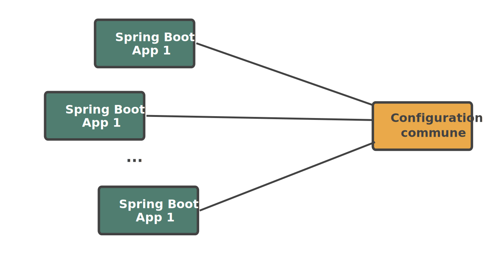

:doctitle: Comprendre l'auto-configuration Spring Boot
:description: Comment initialiser le schema et user d'un microservice via un starter Spring juste avant l'initialisation de la datasource gérée par Spring, Liquibase ou Flyway. Pour celà il faut comprendre l'auto-configuration Spring Boot
:keywords: Kotlin Spring Liquibase Flyway
:author: Guillaume EHRET - Dev-Mind
:revdate: 2022-10-13
:category: Spring
:teaser: Comment rajouter un bean de configuration Spring Boot à votre application tout en l'intégrant correctement pour qu'il s'exécute au moment où vous le souhaitez au milieu des multitudes des beans d'auto configuration.
:imgteaser: :../../img/blog/2022/sb_starter.png
:toc:

Le but de cet article est d'expliquer comment rajouter un bean de configuration Spring Boot à votre application, tout en l'intégrant correctement pour qu'il s'exécute au moment où vous le souhaitez, au milieu de la multitudes des autres beans d'auto configuration.

== Un use case réel

Un besoin technique est (ou devrait être) lié à un réel besoin.

Nous allons donc parler d'un exemple concret avec une application qui a une base de données commune à différents micro services. Chaque microservice a un utilisateur et un schéma qui lui sont propres.

Les tables du schéma peuvent être générées soit par https://hibernate.org/tools/[HibernateTools] , soit gérée par des librairies comme https://flywaydb.org/[Flyway] ou https://www.liquibase.org/[Liquibase]. Mais ces outils travaillent avec un user et un schema existants.

Je souhaiterai pouvoir initialiser le schéma et le user de cette base de données automatiquement. Il existe bien sûr plusieurs solutions mais dans mon cas je veux que chaque application puisse le faire au démarrage avant l'initialisation de la datasource et son utilisation par des librairies externes comme Hibernate, Flyway ou Liquibase.....

== Qu'est ce qu'une auto configuration Spring Boot ?

Spring Boot a été mis en place pour faciliter le développement d'une application en privilégiant la convention plutôt que la configuration. En gros, vous installez des librairies tierces dans votre application, et Spring Boot essaie de les configurer automatiquement en appliquant un paramétrage par défaut poussé par les équipes Spring pour les briques de base, ou par les concepteurs des autres briques.

Vous pouvez surcharger certains paramètres de ces configuration. D'ailleurs quand on écrit un nouveau starter Spring c'est une bonne chose de rendre configurable et personnalisable le maximum de choses.

Prenons les cas cités plus haut (Hiberante, Flyway et Liquibase) qui sont assez courants et pour lesquels Spring Boot propose des beans d'autoconfiguration.

* si vous utilisez Jpa vous pouvez ajouter Hibernate dans vos dépendances ou mieux le starter `spring-boot-starter-data-jpa` et la classe `org.springframework.boot.autoconfigure.orm.jpa.HibernateJpaAutoConfiguration` fera le reste.
* si vous ajoutez Flyway dans le classpath automatiquement `org.springframework.boot.autoconfigure.flyway.FlywayAutoConfiguration` prendra le pas pour configurer cette librairie
* ...

Chaque bean d'auto configuration géré par la team Spring est défini dans le projet https://github.com/spring-projects/spring-boot/tree/v2.7.4/spring-boot-project/spring-boot-autoconfigure/src/main/java/org/springframework/boot/autoconfigure[spring-boot-autoconfigure]. Tous ces beans sont déclarés dans un fichier `META-INF/spring/org.springframework.boot.autoconfigure.AutoConfiguration.imports`

Vous pouvez reproduire cette mécanique mais personnellement je ne suis pas fan de cette magie noire et je préfère clairement les déclarations explicites pour activer les différents beans des applications tierces. C'était un peu la philisophie derrière le projet expérimental https://github.com/spring-projects-experimental/spring-fu[Spring-fu] et https://github.com/spring-projects-experimental/spring-fu/tree/main/kofu[KoFu].

C'est pourquoi je ne vais pas m'étendre sur ce point, et je vous montrerai plus loin comment créer une méta annotation pour activer votre bean de configuration simplement. Si vous n'êtes pas d'accord avec ma vision, vous pouvez suivre les https://docs.spring.io/spring-boot/docs/2.7.4/reference/htmlsingle/#features.developing-auto-configuration.locating-auto-configuration-candidates[explications de Spring] pour appliquer une auto configuration.

== Ce que j'aimerai faire

Du coup si je reviens à mon besoin j'aimerai paramétrer un bout de code qui viendrait s'intégrer dans le cycle de vie de mon application Spring Boot et qui viendrait s'exécuter avant les beans d'auto configurations utilisés pour paramétrer la datasource ou des librairies comme Liquibase ou Flyway.

Pour rappel ce code permettrait de créer le user et le schéma de mon application.

Mais comment faire pour être sûr que ma configuration sera appliquée au moment où je le veux ?

== Les conditions sur les beans de configuration

Quand votre configuration doit s'intégrer avant ou après d'autres configuration, vous pouvez utiliser les annotations  `@AutoConfigureBefore` et `@AutoConfigureAfter`. Dans notre cas

[source, kotlin]
----
@Configuration(proxyBeanMethods = false)
@AutoConfigureBefore(DataSourceAutoConfiguration::class, LiquibaseAutoConfiguration::class)
class DatabaseSchemaInitializerAutoConfiguration
----

Mais ceci n'agit que sur l'ordre des classes de configuration et non sur les beans qui sont définis à l'intérieur. *L'ordre dans lequel les beans sont créés n'est pas affecté. L'ordre des beans de configuration est déterminé par les dépendances de chaque bean et des relations explicites définies aves l'annotation @DependsOn.*

Donc dans mon cas rien ne me garantit que mon bean `DatabaseSchemaInitializer` sera lancé avant les autres.

Spring Boot fournit différentes annotations `@Conditional` que l'on peut appliquer sur les beans de configurations ou n'importe quel autre bean. Je ne présenterai ici que les principales

* Class Conditions +
** le bean annoté avec `@ConditionalOnClass` ne sera initialisé que si une classe est présente dans le classpath
** le bean annoté avec `@ConditionalOnMissingClass` ne sera initialisé que si une classe n'est pas présente dans le classpath
* Bean Conditions +
** le bean annoté avec  `@ConditionalOnBean` ne sera initialisé que si un bean est présent dans le contexte Spring
** le bean annoté avec  `@ConditionalOnMissingBean` ne sera initialisé que si un bean n'est pas présent dans le contexte Spring (ou pas encore...). Pour que votre auto configuration puisse être facilement surchargé il est préférable de mettre cette annotation sur la classe de configuration
* Property Conditions : le bean annoté avec  `@ConditionalOnProperty` ne sera activé que sur la présence d'une propriété. Pratique pour mettre en place un garde fou
* Resource Conditions : `@ConditionalOnResource` permet de n'activer un bean que si une resource (un fichier par exemple) est présente

Notre bean de configuration peut devenir

[source, kotlin]
----
@Configuration(proxyBeanMethods = false)
@ConditionalOnProperty(prefix = PROPERTIES_PREFIX, name = ["enabled"], matchIfMissing = true)
@AutoConfigureBefore(DataSourceAutoConfiguration::class, LiquibaseAutoConfiguration::class)
class DatabaseSchemaInitializerAutoConfiguration {

    companion object {
        const val PROPERTIES_PREFIX = "app.database.initializer"
    }

    @Configuration
    @ConditionalOnClass(DataSource::class)
    class DatabaseSchemaInitializerConfiguration {
        @Bean
        @ConditionalOnMissingBean(DataSource::class, SpringLiquibase::class, Flyway::class)
         fun databaseSchemaInitializer() =
             DatabaseSchemaInitializer()
    }
}
----

Notre `DatabaseSchemaInitializer` doit maintenant s'exécuter avant la mise en place de la datasource de Flyway ou Liquibase. Votre code marche en Java 8 mais pas avec les versions supérieures où les modules ont été introduits. Sur Java > 9 avec une configuration par défaut où les modules dont fermés, `SpringLiquibase` et `Flyway` ne sont pas accessible.

Si on maitrisait le code, nous pourrions ajouter une annotation @DependsOn() vers `DatabaseSchemaInitializer` sur les beans `SpringLiquibase` et `Flyway`, mais ce n'est pas le cas.

Avec Spring il y a toujours des solutions. Nous pouvons faire hériter notre bean de configuration de `AbstractDependsOnBeanFactoryPostProcessor`. Cette classe de configuration permet de déclarer ces dépendances entre beans. Je peux donc résoudre mon problème en spécifiant que le bean Datasource (utilisé par `SpringLiquibase` et `Flyway`) ne peut être instancié que si mon bean `DatabaseSchemaInitializer` est instancié.

[source, kotlin]
----
@Configuration(proxyBeanMethods = false)
@ConditionalOnProperty(prefix = PROPERTIES_PREFIX, name = ["enabled"], matchIfMissing = true)
@AutoConfigureBefore(DataSourceAutoConfiguration::class, LiquibaseAutoConfiguration::class)
class DatabaseSchemaInitializerAutoConfiguration {

    companion object {
        const val PROPERTIES_PREFIX = "app.database.initializer"
    }

    @Configuration
    @ConditionalOnClass(DataSource::class)
    class DatabaseSchemaInitializerDependencyPostProcessor : AbstractDependsOnBeanFactoryPostProcessor(
        // Ma datasource ne peut pas être instanciée avant ...
        DataSource::class.java,
        // le bean suivant
        DatabaseSchemaInitializer::class.java
    ) {
        @Bean
        @ConditionalOnMissingBean(DataSource::class, SpringLiquibase::class, Flyway::class)
         fun databaseSchemaInitializer() =
             DatabaseSchemaInitializer()
    }
}
----

Avec ce code, mon code pour initilialiser ue user et un schema de base de données sera exécuté avant que l'application cherche à initialiser la base de données et donc Hibernate, Flyway ou Liquibase.

== Utiliser votre code

Le but de ce code est d'être partagé par mes différentes applications.

Dans la philosophie Spring Boot nous devrions https://docs.spring.io/spring-boot/docs/current/reference/htmlsingle/#features.developing-auto-configuration.custom-starter[créer notre propre starter]. Mais dans mon cas où tous mes micro services sont dans un mono repository, je peux juste partager mon code via par exemple Gradle

[source, kotlin]
----
    // ...
    dependencies {
        implementation project(':database-initializer')
        // ...
    }
    // ...
----

Plus haut je vous ai dit que je préférai des configurations explicites plutôt que des auto configurations qui s'appliquent automatiquement.

Vous pouvez créer par exemple une meta annotation `EnableDatabaseSchemaInitializer` que vous pourrez ajouter sur vos applications qui ont besoin de cette nouvelle fonctionnalité

[source, kotlin]
----
@Retention(AnnotationRetention.RUNTIME)
@Target(AnnotationTarget.CLASS, AnnotationTarget.TYPE)
@MustBeDocumented
@Import(DatabaseSchemaInitializerAutoConfiguration::class)
annotation class EnableDatabaseSchemaInitializer
----

== Conclusion

Je vous ai présenté un use case mais au final vous n'avez pas le code de mon `DatabaseSchemaInitializer`. Je peux le partager si il y a des intéressés.

Le but de cet article était plutôt de comprendre les mécanismes de Spring Boot et de l'autoconfiguration. Nous avons vu comment intégrer du code au milieu de cette magie noire qui est très pratique quand on débute mais qu'il faut connaître lorsque nous avons des besoins plus pointus.

N'hésitez pas à me contacter sur Twitter si vous avez des questions ou des remarques sur cet article.

