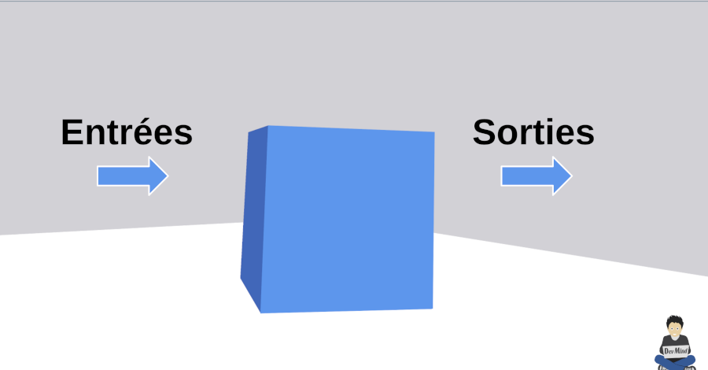

Depuis que j'ai essayé le langage Kotlin pour développer des applications Android je suis devenu amoureux de ce langage. Beaucoup moins verbeux que le langage Java, Kotlin met en avant le pragmatisme et la simplicité.

Au delà du développement Android, vous pouvez aussi utiliser Kotlin dans des applications Spring. Kotlin est reconnu comme langage de référence de Spring et la documentation Spring Framework propose ses exemple à la fois en Java et en Kotlin.

Je ne vais pas revenir sur le langage en tant que tel car j'ai présenté ces atouts dans cet https://dev-mind.fr/blog/2019/kotlin_et_android.html[article]. Aujourd'hui je voulais plutôt me focaliser sur les tests et comment utiliser des implémentations bouchons (mocks) dans les tests d'une application SpringBoot.

== Terminologie

Revenons au basique et la terminologie de https://martinfowler.com/testing/[Martin Folwer] sur les tests. Quand nous voulons tester une application, une partie de l'application, une classe, une méthode... L'élément testé appelé sera appelé `System Under Test` (SUT). Le test va permettre de vérifier le comportement de ce `Système à Tester`. On lui soumet un état, des paramètres en entrée et nous allons vérifier les données ou l'état en sortie

Le `Système à Tester` doit être considéré au maximum comme une boite noire. Bien évidement ce système peut interagir avec d'autres éléments. Ces éléments sont appelés des collaborateurs. Par exemple si votre test vérifie le comportement d'une méthode d'une classe, cette méthode peut faire appel à d'autres méthodes d'autres classes.

image::../../img/blog/2020/test_collaborateur.png[System under test & collaborateurs]

Pour faciliter les tests nous devons pouvoir simuler le comportement des collaborateurs. Si nous nous plaçons dans le cadre des tests unitaires nous devons pouvoir

* Simuler le comportement de vraies classes en capturant les appels et en surchargeant les résultats
* Simuler le comportement de classes mais en utilisant de fausses implémentations. Généralement, chaque collaborateur définit un contrat (en Java ou Kotlin une classe peut par exemple implémentée une interface).

Pour aider à réaliser ces simulations nous utilisons des librairies permettant de faire des mocks. Ces librairies permettent de

* générer des implémentations bouchons à partir d'une classe ou d'une interface
* offrir des fonctionnalités pour défnir les retours des méthodes invoquées sur ces objets bouchons
* vérifier le comportement de ces objets

Si vous vous rendez compte que votre application ou qu'une classe est dure à tester, c'est généralement du à un problème de conception. Pour faciliter la mise en place des tests les principes https://martinfowler.com/bliki/InversionOfControl.html[d'inversion de contrôle] et https://martinfowler.com/articles/injection.html#FormsOfDependencyInjection[d'injection de dépendance] sont primordiaux. Gardez le reflexe de reprendre votre code si ce dernier est compliqué à tester.

== Mockk

testImplementation "io.mockk:mockk:{version}" pour Kotlin > 1.3

A relaxed mock is the mock that returns some simple value for all functions. This allows to skip specifying behavior for each case, while still allowing to stub things you need. For reference types, chained mocks are returned.

testImplementation 'io.mockk:mockk:1.9.3'
pour Kotlin > 1.3

Error >

Caused by: org.gradle.api.internal.artifacts.ivyservice.resolveengine.graph.conflicts.VersionConflictException: Conflict(s) found for the following module(s):
- org.objenesis:objenesis between versions 3.0.1 and 2.6

testImplementation 'org.objenesis:objenesis:3.0.1'

class SiteControllerTest {

    @Test
    fun `should say Hello`(){
       Assertions.assertThat("Hello").isNotNull()
    }
}

@ExtendWith(MockKExtension::class)
class SiteControllerKtTest {

    @MockK
    lateinit var siteLoader: SiteLoader

    @RelaxedMockK
    lateinit var measurementSourceService: MeasurementSourceService

    @InjectMockKs
    lateinit var siteController: SiteController

    @Test
    fun `should say Hello`() {
        val siteId = "siteId"

        every { siteLoader.loadAndCheckAccess(siteId) }.returns(Site().apply {
            name = "mysite"
            consumer = Consumer()
        })

        val site = siteController.get(siteId);

        Assertions.assertThat(site?.identification?.name).isEqualTo("mysite")
    }
}

>>>>>>>>>>>>>>>>>>> testImplementation 'com.ninja-squad:springmockk:2.0.0'

@ExtendWith(SpringExtension::class)
@WebMvcTest(SiteController::class)
class SiteControllerKtTest2(@Autowired val siteController: SiteController) {
@SpykBean
lateinit var siteLoader: SiteLoader

    @SpykBean
    lateinit var measurementSourceService: MeasurementSourceService

    @Test
    fun `should say Hello`() {
        val siteId = "siteId"

        every { siteLoader.loadAndCheckAccess(siteId) }.returns(Site().apply {
            name = "mysite"
            consumer = Consumer()
        })

        every { measurementSourceService.getMeasurementSourceById(any()) }.returns(ScadaMeasurementSourceDTO())

        val site = siteController.get(siteId)

        Assertions.assertThat(site?.identification?.name).isEqualTo("mysite")
    }
}

Spring boot 2.2.2.RELEASE

     implementation("org.springframework.boot:spring-boot-starter-webflux")

    testImplementation 'io.projectreactor:reactor-test'
    testImplementation 'org.apache.httpcomponents:httpclient:4.3.4'

Commenter la sécurite dans SiteController
//    @Allow({
//        @Right(bcsPermission = Permission.CONSUMER_REFERENTIAL),
//        @Right(bcsPermission = Permission.PROSPECT)
//    })

Le code qui marche

@SpringBootTest(webEnvironment = SpringBootTest.WebEnvironment.RANDOM_PORT)
@ActiveProfiles("test")
class SiteControllerKtTest(@Autowired val webClient: WebTestClient,
@Autowired val objectMapper: ObjectMapper) {

    @SpykBean
    lateinit var tokenManager: JwtTokenManager;

    @SpykBean
    lateinit var siteLoader: SiteLoader

    @SpykBean
    lateinit var measurementSourceService: MeasurementSourceService

    @Test
    fun `should say Hello`() {
        val siteId = "siteId"

        every { siteLoader.loadAndCheckAccess(siteId) }.returns(Site().apply {
            name = "mysite"
            consumer = Consumer()
        })

        every { measurementSourceService.getMeasurementSourceById(any()) }.returns(ScadaMeasurementSourceDTO())

        every { tokenManager.parse(any()) }.returns(DefaultClaims().apply {
            subject = "test@@ENERGYPOOL"
            put("marketId", listOf("FR"))
        })

        val siteJson = webClient.get()
            .uri("/app/bcs/sites/$siteId")
            .header(HttpHeaders.AUTHORIZATION, Jwts.builder().setSubject("test@@ENERGYPOOL").toString())
            .exchange()
            .expectStatus()
            .isOk
            .expectBody(String::class.java)
            .returnResult()
            .responseBody

        val site = objectMapper.readValue(siteJson, SiteDTO::class.java)

        Assertions.assertThat(site?.identification?.name).isEqualTo("mysite")
    }
}
