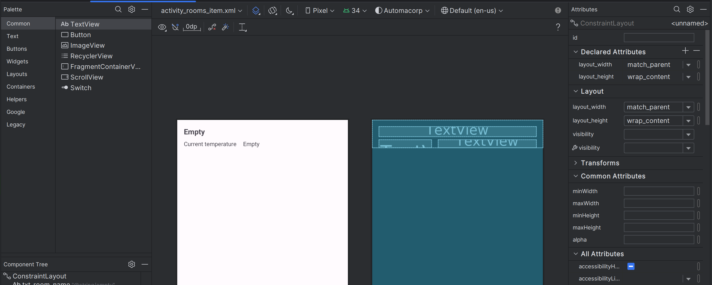
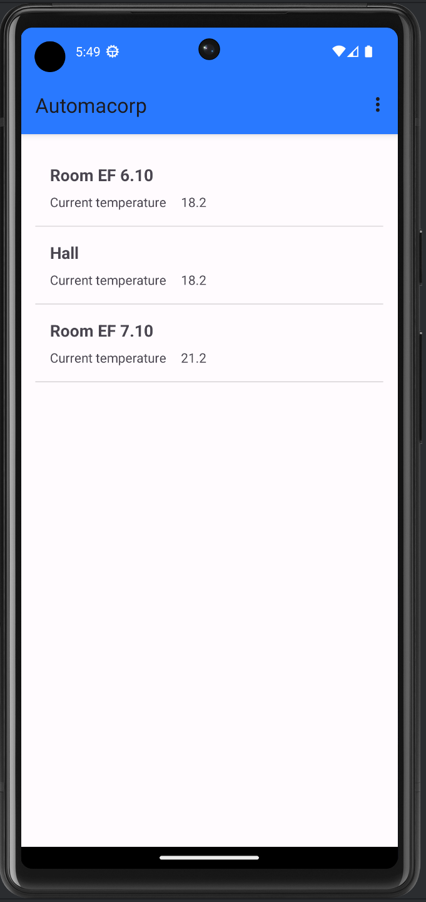

:doctitle: Add a list activity in your app
:description: In this lesson you will learn how add an activity to list elements
:keywords: Android
:author: Guillaume EHRET - Dev-Mind
:revdate: 2023-10-10
:category: Android
:teaser: In this lesson you will learn how add an activity to list elements
:imgteaser: ../../img/training/android/android-activity-list.png
:toc:
:icons: font

In this lesson, you will learn how to populate a list of room in our empty rooms screen.

image::../../img/training/android/android-activity-list.png[Create an activity list, width=800]

== RecyclerView

When you want to create a list view you should use a *RecyclerView* widget. This widget is able to manage a large data sets and scrool between elements.

The overall container for your user interface is a *RecyclerView* object that you add to your layout. The RecyclerView fills itself with views provided by a layout manager that you provide. The views in the list (used to display items) are represented by view holder objects. Each view holder is in charge of displaying a single item with a view.

image::../../img/training/android/android-listview.png[Android RecyclerView]

For example, if your list shows music collection, each view holder might represent a single album. The RecyclerView creates only as many view holders as are needed to display the on-screen portion of the dynamic content, plus a few extra. As the user scrolls through the list, the RecyclerView takes the off-screen views and rebinds them to the data which is scrolling onto the screen.

The view holder objects are managed by an adapter (create by extending *RecyclerView.Adapter*). This adapter creates view holders as needed. The adapter also binds the view holders to their data. It does this by assigning the view holder to a position.

[source,kotlin,subs="specialchars"]
----
class RoomsAdapter : RecyclerView.Adapter<RoomsAdapter.RoomsViewHolder>() { // (1)

    inner class RoomsViewHolder(view: View) : RecyclerView.ViewHolder(view) { // (2)
        val name: TextView = view.findViewById(R.id.txt_room_name)
        val currentTemperature: TextView = view.findViewById(R.id.txt_current_temperature)
    }

    private val items = mutableListOf<RoomDto>() // (3)

    fun update(rooms: List<RoomDto>) {  // (4)
        items.clear()
        items.addAll(rooms)
        notifyDataSetChanged()
    }

    override fun getItemCount(): Int = items.size // (5)

    override fun onCreateViewHolder(parent: ViewGroup, viewType: Int): RoomsViewHolder { // (6)
        val view = LayoutInflater.from(parent.context)
            .inflate(R.layout.activity_rooms_item, parent, false)
        return RoomsViewHolder(view)
    }

    override fun onBindViewHolder(holder: RoomsViewHolder, position: Int) {  // (7)
        val roomDto = items[position]
        holder.apply {
            name.text = roomDto.name
            currentTemperature.text = roomDto.currentTemperature?.toString() ?: "?"
        }
    }
}
----

* (1) an adapter must implement *RecyclerView.Adapter* wich manage a *RecyclerView.ViewHolder*
* (2) we create a *RoomsViewHolder* which is able to hold fields defined in layout *activity_rooms_item.xml*. When you scroll through the list view, system does not recreate these fields. It will update the values via method (7)
* (3) adapter has a mutable list to store elements to display
* (4) method used to update the list content. This method will be called when data will be ready
* (5) *RecyclerView.Adapter* abstract class asks you to implement a first method that returns the number of records
* (6) *RecyclerView.Adapter* abstract class asks you to implement a second method used to initialize a *ViewHolder*
** we inflate *activity_rooms_item.xml* layout
** we send it to  *ViewHolder* constructor
* (7) *RecyclerView.Adapter* abstract class asks you to implement a last method to define what to do when position in the list changes

== icon:flask[] : Display the room list

=== Update room list activity

We will update the empty component created in link:android-add-menu.html#_create_a_new_activity[last session] called room list. We will add a Recycler view inside

1. Open *res > layout > activity_rooms.xml* and delete the TextView
2. In *Containers palette* select a *RecyclerView* widget and drag into your layout below your welcome message.
3. This *RecyclerView* widget should have these properties
+
* *id* : _list_rooms_
* *margins* : _16dp_ Apply a top, right and left margin
* *layout_width* : widget should take all the width (0dp or match_parent)
* *layout_height* : widget should take all the height (0dp or match_parent)

=== Create a layout for a list item

Each line in the `RecyclerView` is displayed in its own layout.

1. Select *res > layout* right click and choose *New > Layout resource file*
2. Name your future layout *activity_rooms_item.xml*
3. In *Component Tree* panel (below Palette panel) select ConstraintLayout (the main viewgroup) *and update property* *layout_height* to _wrap_content_. If you don't, the view will always fill all the available height on its parent (our recyclerview) and you will still only see one element in your list and others will be hidden.
4. Add 3 *Textviews* : one for the room name, one for the current temperature label and a last one for the current temperature value

You should have this rendering

You can use these properties on your TextFields

*Room name*

* *id* : _txt_room_name_
* *marginStart* : _16dp_
* *marginTop* : _16dp_
* *marginEnd* : _16dp_
* *layout_width* : _0dp_ to have the name on all the width
* *textStyle* : _bold_
* *textAppearance* : _@style/TextAppearance.AppCompat.Large_
* *text* : _empty_

*Current temperature label* put this element under the room name on the left

* *id* : _txt_current_temperature_label_
* *marginStart* : _16dp_
* *marginBottom* : _16dp_
* *marginTop* : _8dp_
* *marginEnd* : _16dp_
* *layout_width* : _wrap_content_
** *text* : _@string/room_current_temperature_

*Current temperature value* put this element under the room name on the right of the label

* A last TextView to display window room
** *id* : _txt_current_temperature_value_
** *marginStart* : _16dp_
** *marginTop* : _8dp_
** *marginEnd* : _16dp_
** *layout_width* : _0dp_
** *text* : _empty_

=== Create an adapter class

As we have seen in link:android-add-activity-list.html#_recyclerview[previous chapter], an adapter manages the view holder objects. The adapter also binds the view holders to their data. It does this by assigning the view holder to a position.

1. Create a new package _com.automacorp.adapter_
2. Create inside a new class called *RoomsAdapter*
3. You can copy the example done higher in the first chapter

=== Update RoomsActivity class

We need to initialize the recycler view

[source,kotlin,subs="specialchars"]
----
class RoomsActivity : BasicActivity() {
    override fun onCreate(savedInstanceState: Bundle?) {
        super.onCreate(savedInstanceState)
        setContentView(R.layout.activity_rooms)

        findViewById<RecyclerView>(R.id.list_rooms).also { recyclerView -> // (1)
            recyclerView.layoutManager = LinearLayoutManager(this) // (2)
            recyclerView.addItemDecoration(DividerItemDecoration(this, DividerItemDecoration.VERTICAL)) // (3)
            recyclerView.setHasFixedSize(true) // (4)
            recyclerView.adapter = roomsAdapter // (5)
        }

        roomsAdapter.setItems(WindowService.ROOMS)  // (6)
    }
}
----

* (1) we find the recycler view defined in layout by its id `list_rooms`
* (2) we have to define the default layout manager (the object which will be used to display a layout on each line)
* (3) you can add a line between each line
* (4) this indicator help the RecyclerView to optimize the display when all lines have the same size
* (5) the adapter is linked to the RecyclerView
* (6) data are sent to the adapter to display the lines

You can now launch your app. You should be able to see the default rooms

== icon:flask[] : Open a list item

At this step we have a list of rooms. We would now open the detail of a room when the user clicks on an item in the list.

=== Declare an interface to define a contract

You need to define an interface which defines a method called when a user clicks on an element

[source,kotlin,subs="specialchars"]
----
interface OnRoomClickListener {
    fun selectRoom(id: Long)
}
----

* *RoomsActivity* will implement this interface and it will able to call `Roomctivity` and send it the given id
* *RoomsAdapter* will receive an instance of this interface (ie RoomsActivity) and call the method when a user will click on a line

=== Update RoomsActivity

[source,kotlin,subs="specialchars"]

We will implement the contract and create an Intent to open a `RoomActivity`

----
class RoomsActivity : BasicActivity(), OnRoomClickListener {
   //...

   override fun selectRoom(id: Long) {
        val intent = Intent(this, RoomActivity::class.java).putExtra(MainActivity.ROOM_ID_PARAM, id)
        startActivity(intent)
    }
}
----

=== Update the let adapter

An instance of our interface `OnRoomClickListener` is sent in the adapter constructor, and we can call the method in a Click Event listener. In Android, you can interact with different all user events, each object has its own events....

[source,kotlin,subs="specialchars"]
----
class RoomsAdapter(val listener: OnRoomClickListener): RecyclerView.Adapter<RoomsAdapter.RoomsViewHolder>() {
    // ...
    override fun onBindViewHolder(holder: RoomsViewHolder, position: Int) {
        val roomDto = items[position]
        holder.apply {
            name.text = roomDto.name
            currentTemperature.text = roomDto.currentTemperature?.toString() ?: "?"
            itemView.setOnClickListener { listener.selectRoom(roomDto.id) } // (1)
        }
    }

    override fun onViewRecycled(holder: RoomsViewHolder) { // (2)
        super.onViewRecycled(holder)
        holder.apply {
            itemView.setOnClickListener(null)
        }

    }
}
----
* (1) listener is called when someone clicks on an item
* (2) *it's very important to clear OnClickListener when a view holder is recycled to prevent memory leaks*

Don't forget to update `RoomsAdapter` constructor `val adapter = RoomsAdapter(this)` in `RoomsActivity`

You can also update the `android:parentActivityName` of the `RoomActivity` to return on the list after a back button

== More...

If you want more explanations about RecyclerView you can read this https://codelabs.developers.google.com/codelabs/kotlin-android-training-recyclerview-fundamentals/index.html?index=..%2F..android-kotlin-fundamentals#2[codelabs] made by Google
