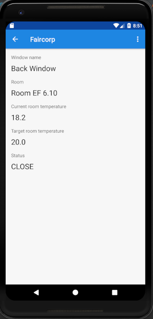

:doctitle: Add a list activity in your app
:description: In this lesson you will learn how add an activity to list elements
:keywords: Android
:author: Guillaume EHRET - Dev-Mind
:revdate: 2022-10-05
:category: Android
:teaser: In this lesson you will learn how add an activity to list elements
:imgteaser: ../../img/training/android/android-activity-list.png
:toc:

In this lesson, you will learn how to create a new View in your app to list data.

== Modelisation

We want to display room window information in our app.

A room is defined by several properties

* an id
* a name
* a current temperature (this property can be nullable if no data is available)
* a target temperature (this property can be nullable if no data is available)

A Window is defined by several properties

* an id
* a room
* a status (OPEN, CLOSED)

We are going to create classes to represent windows and rooms.

1. In the *Project window*, right-click the package _com.faircorp_ and select *New > package*.
2. New package will be called *model*. Select this package, redo a right-click and select *New > Kotlin File/Class*.
3. Fill a name. For example *RoomDto* (dto = data transfer object) and create window properties. You can copy this code
+
[source,kotlin,subs="specialchars"]
----

data class RoomDto(val id: Long,
                   val name: String,
                   val currentTemperature: Double?,
                   val targetTemperature: Double?)
----
+
Note: when a value is nullable you need to suffix type with ?. In our example currentTemperature can be null, so type is Double? and not Double
+
4. Redo same steps to create *WindowDto*
+
[source,kotlin,subs="specialchars"]
----
enum class Status { OPEN, CLOSED}

data class WindowDto(val id: Long, val name: String, val room: RoomDto, val status: Status)
----
+
5. We will now create a service class to manage these windows. We will write 2 methods : one to find all building windows and a second to load only one window by its id. For the moment we will use fake data. In a next lesson we will learn how call a remote service to load real data.
+
[source,kotlin,subs="specialchars"]
----
class WindowService {

    companion object {
        // Fake rooms
        val ROOMS: List<RoomDto> = listOf(
            RoomDto(1, "Room EF 6.10", 18.2, 20.0),
            RoomDto(2, "Hall", 18.2, 18.0),
            RoomDto(3, "Room EF 7.10", 21.2, 20.0)
        )

        // Fake lights
        val WINDOWS: List<WindowDto> = listOf(
            WindowDto(1, "Entry Window", ROOMS[0], Status.CLOSED),
            WindowDto(2, "Back Window", ROOMS[0], Status.CLOSED),
            WindowDto(3, "Sliding door", ROOMS[1], Status.OPEN),
            WindowDto(4, "Window 1", ROOMS[2], Status.CLOSED),
            WindowDto(5, "Window 2", ROOMS[2], Status.CLOSED),
        )
    }

    fun findById(id: Long) = WINDOWS.firstOrNull { it.id == id}

    fun findAll() = WINDOWS.sortedBy { it.name }
}
----

== RecyclerView

When you want to create a list view you will use a *RecyclerView* widget. This widget is able to manage a large data sets and scrool between elements.

The overall container for your user interface is a *RecyclerView* object that you add to your layout. The RecyclerView fills itself with views provided by a layout manager that you provide. The views in the list (used to dispaly items) are represented by view holder objects. Each view holder is in charge of displaying a single item with a view.

For example, if your list shows music collection, each view holder might represent a single album. The RecyclerView creates only as many view holders as are needed to display the on-screen portion of the dynamic content, plus a few extra. As the user scrolls through the list, the RecyclerView takes the off-screen views and rebinds them to the data which is scrolling onto the screen.

The view holder objects are managed by an adapter (create by extending *RecyclerView.Adapter*). This adapter creates view holders as needed. The adapter also binds the view holders to their data. It does this by assigning the view holder to a position.

== Update window list activity

In link:android-add-menu.html#_create_a_new_activity[last session] you added an activity with just a TextView inside.

1. Open *res > layout > activity_windows.xml* and delete the TextView
2. In *common palette* select a *RecyclerView* widget and drag into your layout below your welcome message. A dialog should ask you if you want to add lib *androidx.recyclerview:recyclerview:+* in your app. Click on *OK* button to let Android Studio add this dependency in your Gradle config file (_build.gradle (Module app)_)
3. This *RecyclerView* widget should have these properties
+
* *id* : _list_windows_
* *margins* : _16dp_ Apply a top, right and left margin
* *layout_width* : widget should take all the width (0dp or match_parent)
* *layout_height* : widget should take all the height (0dp or match_parent)
+
video::yflnKerjG0Q[youtube, width=600, height=330]

== Create a layout for a list item

1. Select *res > layout* right click and choose *New > Layout resource file*
2. Name your future layout *activity_windows_item.xml*
3. In *Component Tree* panel (below Plaette panel) select ConstraintLayout (the main viewgroup) *and update property* *layout_height* to _wrap_content_. If you don't, the view will always fill all the available height on its parent (our recyclerview) and you will still only see one element in your list and others will be hidden.
4. Add 3 *Textviews*
+
* A TextView on the left to display window status
** *id* : _txt_status_
** *marginStart* : _16dp_
** *marginTop* : _16dp_
** *marginBottom* : _16dp_
** *textStyle* : _bold_
** *textAppearance* : _@style/TextAppearance.AppCompat.Large_
** *capitalize* : _characters_
* A TextView on the right to display window name
** *id* : _txt_window_name_
** *marginStart* : _16dp_
** *marginTop* : _8dp_
** *marginEnd* : _16dp_
** *marginEnd* : _16dp_
** *layout_width* : _0dp_
* A last TextView to display window room
** *id* : _txt_window_room_
** *marginStart* : _16dp_
** *marginTop* : _8dp_
** *marginBottom* : _8dp_
** *marginEnd* : _16dp_
** *layout_width* : _0dp_
** *textAppearance* : _@style/TextAppearance.AppCompat.Small_
** *capitalize* : _characters_
+

== Create an adapter class

As we see in link:android-add-activity-list.html#_recyclerview[previous chapter], an adapter manages the view holder objects. The adapter also binds the view holders to their data. It does this by assigning the view holder to a position.

1. In the *Project window*, right-click the package _com.faircorp.model_ and right-click and select *New > Kotlin File/Class*. We will create a new class called *WindowsAdapterView*
2. You can copy this code inside
+
[source,kotlin,subs="specialchars"]
----
class WindowAdapter : RecyclerView.Adapter<WindowAdapter.WindowViewHolder>() { // (1)

    inner class WindowViewHolder(view: View) : RecyclerView.ViewHolder(view) { // (2)
        val name: TextView = view.findViewById(R.id.txt_window_name)
        val room: TextView = view.findViewById(R.id.txt_window_room)
        val status: TextView = view.findViewById(R.id.txt_status)
    }

    private val items = mutableListOf<WindowDto>() // (3)

    fun update(windows: List<WindowDto>) {  // (4)
        items.clear()
        items.addAll(windows)
        notifyDataSetChanged()
    }

    override fun getItemCount(): Int = items.size // (5)

    override fun onCreateViewHolder(parent: ViewGroup, viewType: Int): WindowViewHolder { // (6)
        val view = LayoutInflater.from(parent.context)
            .inflate(R.layout.activity_windows_item, parent, false)
        return WindowViewHolder(view)
    }

    override fun onBindViewHolder(holder: WindowViewHolder, position: Int) {  // (7)
        val window = items[position]
        holder.apply {
            name.text = window.name
            status.text = window.status.toString()
            room.text = window.room.name
        }
    }
}
----
+
* (1) an adapter must implement *RecyclerView.Adapter* wich manage a *RecyclerView.ViewHolder*
* (2) we create a *WindowViewHolder* which is able to hold fields defined in layout *activity_windows_item.xml*. When you scroll through the list view, system does not recreate these fields. It will update the values via method (7)
* (3) adapter has a mutable list to store elements to display
* (4) method used to update the list content. This method will be called when data will be ready
* (5) *RecyclerView.Adapter* abstract class asks you to implement a first method that returns the number of records
* (6) *RecyclerView.Adapter* abstract class asks you to implement a second method used to initialize a *ViewHolder*
** we inflate *activity_windows_item.xml* layout
** we send it to  *ViewHolder* constructor
* (7) *RecyclerView.Adapter* abstract class asks you to implement a last method to define what to do when position in the list changes

== Update activity WindowsActivity (Activity for list of windows)

We need to update *WindowsActivity* to initialize the recycler view

[source,kotlin,subs="specialchars"]
----
class WindowsActivity : BasicActivity() {

    val windowService = WindowService() // (1)

    override fun onCreate(savedInstanceState: Bundle?) {
        super.onCreate(savedInstanceState)
        setContentView(R.layout.activity_windows)

        val recyclerView = findViewById<RecyclerView>(R.id.list_windows) // (2)
        val adapter = WindowAdapter() // (3)

        recyclerView.layoutManager = LinearLayoutManager(this)
        recyclerView.addItemDecoration(DividerItemDecoration(this, DividerItemDecoration.VERTICAL))
        recyclerView.setHasFixedSize(true)
        recyclerView.adapter = adapter

        adapter.update(windowService.findAll()) // (4)
    }
}
----

* (1) we instantiate service created in link:android-add-activity-list.html#_modelisation[first chapter] of this lesson
* (2) we find the recycler view defined in layout by its id `list_windows`
* (3) adapter is created and recycler view properties are defined
* (4) on the last step we update adapter data

You can now open a list screen as this screenshot

== Add a link on a list item

At this step we have a list of windows. We would now like to open the detail of a window when the user clicks on an item in the list.

You need to define an interface which defines a method called when a user clicks on an element

[source,kotlin,subs="specialchars"]
----
interface OnWindowSelectedListener {
   fun onWindowSelected(id: Long)
}
----

* *WindowsActivity* will implement this interface and it will able to call *WindowActivity* and send it the given id
* *WindowAdapter* will receive an instance of this interface (ie WindowsActivity) and call the method when a user will click on a line

[source,kotlin,subs="specialchars"]
----
class WindowAdapter(val listener: OnWindowSelectedListener): RecyclerView.Adapter<WindowAdapter.WindowViewHolder>() {
   // ...

    override fun onBindViewHolder(holder: WindowViewHolder, position: Int) {
        val window = items[position]
        holder.apply {
            name.text = window.name
            status.text = window.status.toString()
            room.text = window.room.name
            itemView.setOnClickListener { listener.onWindowSelected(window.id) } // (1)
        }
    }

    override fun onViewRecycled(holder: WindowViewHolder) { // (2)
        super.onViewRecycled(holder)
        holder.apply {
            itemView.setOnClickListener(null)
        }

    }
}
----
* (1) listener is called when someone clicks on an item
* (2) *it's very important to clear OnClickListener when a view holder is recycled to prevent memory leaks*

You can now update *WindowsActivity*

[source,kotlin,subs="specialchars"]
----
class WindowsActivity : BasicActivity(), OnWindowSelectedListener {
   //...

   override fun onWindowSelected(id: Long) {
      val intent = Intent(this, WindowActivity::class.java).putExtra(WINDOW_NAME_PARAM, id)
      startActivity(intent)
   }
}
----

Don't forget to update *WindowAdapter* constructor `val adapter = WindowAdapter(this)` in *WindowsActivity*

== Update window activity (Activity used for window detail)

For the moment window activity only display a name sent by *MainActivity*

1. Update *MainActivity* and delete *Button* View and *EditText* widget used to send a name
2. Update *WindowActivity* to read a given id in intent and use it to load and update your view. For example
+
[source,kotlin,subs="specialchars"]
----
val id = intent.getLongExtra(WINDOW_NAME_PARAM, 0)
val window = windowService.findById(id)

if (window != null) {
    findViewById<TextView>(R.id.txt_window_name).text = window.name
    findViewById<TextView>(R.id.txt_room_name).text = window.room.name
    findViewById<TextView>(R.id.txt_window_current_temperature).text = window.room.currentTemperature?.toString()
    findViewById<TextView>(R.id.txt_window_target_temperature).text = window.room.targetTemperature?.toString()
    findViewById<TextView>(R.id.txt_window_status).text = window.status.toString()
}
----
+
3. Update layout *activity_window.xml* to display 5 *TextView* identified by _txt_window_name_, _txt_room_name_, _txt_window_current_temperature_, _txt_window_target_temperature_, _txt_window_status_
4. Remember to use labels with strings defined in *res> values> strings.xml*
+
[source,xml,subs="specialchars"]
----
<string name="act_window_name">Window name</string>
<string name="act_window_room">Room</string>
<string name="act_window_room_target_temp">Target room temperature</string>
<string name="act_window_room_current_temp">Current room temperature</string>
<string name="act_window_status">Status</string>
----
+
5. When you launch your app you should see a screen as this one
+

== More...

If you want more explanations about RecyclerViewq you can read this https://codelabs.developers.google.com/codelabs/kotlin-android-training-recyclerview-fundamentals/index.html?index=..%2F..android-kotlin-fundamentals#2[codelabs] made by Google
