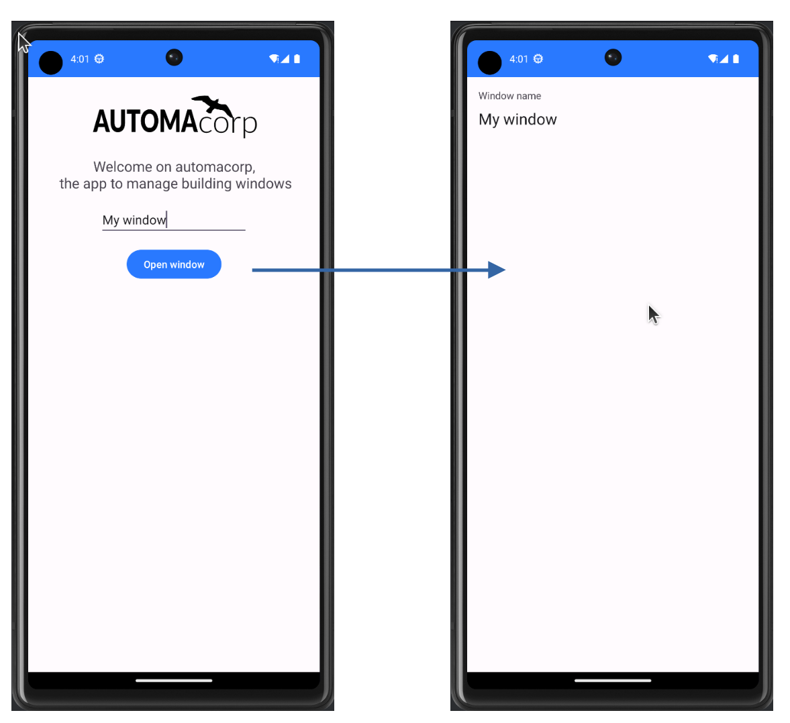
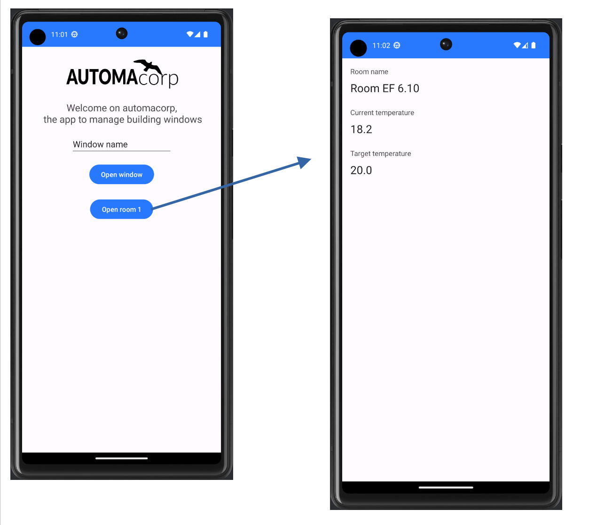
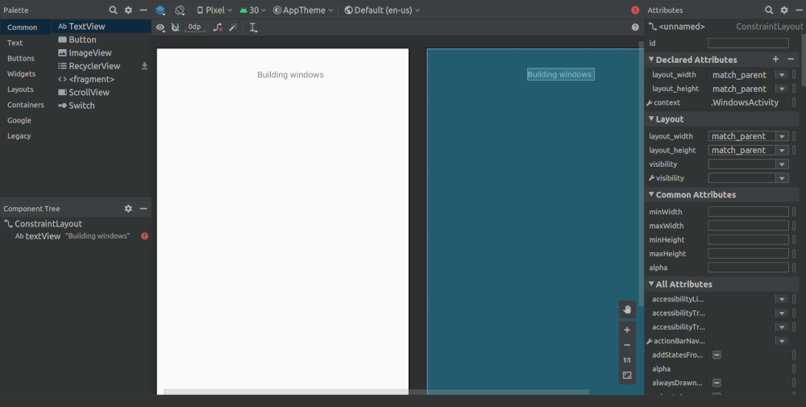

:doctitle: Add an activity
:description: In this lesson you will learn how add a new activity in your project and call it
:keywords: Android
:author: Guillaume EHRET - Dev-Mind
:revdate: 2023-10-12
:category: Android
:teaser: In this lesson you will learn how add a new activity in your project and call it
:imgteaser: ../../img/training/android/android-add-activity.png
:toc:
:icons: font

In this lesson, you will learn how to create a new View in your app and how to launch it with an Intent

[.text-center]

== icon:flask[] : Create a new activity

1. In the *Project window*, right-click the app folder and select *New > Activity > Empty Activity*.You can also use menu *File > New > Activity > Empty Activity*
+
video::f-X8EXSsRYk[youtube, width=600, height=330]
+
2. In the *Configure Activity window*, enter a name for our new activity : _WindowActivity_. Leave all other properties set to their defaults and click Finish.
+
Android Studio automatically does three things:
+
* Creates the *WindowActivity* file.
* Creates the layout file *activity_window.xml*, which corresponds with the *WindowActivity* file.
* Adds the required *<activity>* element in *AndroidManifest.xml*.
+
3. We will now update *activity_window.xml* to display a window name and a label. Open this file
4. Add a new TextView to display a label name with these properties
+
* *text* : _Window name_ (should be defined in strings.xml)
* *margin top* 16dp
* *margin left* 16dp
5. Add a new TextView below the first one with these properties
+
* *text* : empty
* *textAppearance* : _@style/TextAppearance.AppCompat.Large_
* *margin top* 8dp
* *margin left* 16dp
* *id* txt_window_name
+
video::ppyIYuRpNWk[youtube, width=600, height=330]

== Intent : how communicate with other component ?

An https://developer.android.com/reference/android/content/Intent[Intent] is an object that provides runtime binding between separate components, such as two activities. These activities can be in the same app or not.

For example if you need to open a web page you won't develop a new browser. You will open this web page in installed browser as Firefox or Chrome.

The https://developer.android.com/reference/android/content/Intent[Intent] represents an app’s intent to do something. You can use intents for a wide variety of tasks, but in this lesson, your intent starts another activity in the same app.

When you create an Intent you define a context, a target and you can send zero, one or more informations to the target.

An Intent can carry data types as key-value pairs called extras. In this lab you will open *WindowActivity* when a user will click on *MainActivity* button *Open Window*

== icon:flask[] : Build an intent to open an activity

Update method *openWindow* in *MainActivity* to

1. define an Intent
2. target *WindowActivity*
3. put the window name filled in *MainActivity* in the sent attributes (extra). Each extra is identified by a string. It's a good practice to define keys for intent extras with your app's package name as a prefix. This ensures that the keys are unique, in case your app interacts with other apps.

[source,kotlin,subs="specialchars"]
----
class MainActivity : AppCompatActivity() {

    companion object {
        const val WINDOW_NAME_PARAM = "com.automacorp.windowname.attribute"
    }

    override fun onCreate(savedInstanceState: Bundle?) {
        super.onCreate(savedInstanceState)
        setContentView(R.layout.activity_main)
    }

    fun openWindow(view: View) {
        // Extract value filled in editext identified with txt_window_name id
        val windowName = findViewById<EditText>(R.id.txt_window_name).text.toString()

        val intent = Intent(this, WindowActivity::class.java).apply {
            putExtra(WINDOW_NAME_PARAM, windowName)
        }
        startActivity(intent)
    }
}
----

On the other side on *WindowActivity* you have to

1. read the name sent in intent
2. find Textview to update in Layout (this widget is identified by an id)
3. update this Textview with the name

[source,kotlin,subs="specialchars"]
----
class WindowActivity : AppCompatActivity() {
    override fun onCreate(savedInstanceState: Bundle?) {
        super.onCreate(savedInstanceState)
        setContentView(R.layout.activity_window)

        val param = intent.getStringExtra(MainActivity.WINDOW_NAME_PARAM)
        val windowName = findViewById<TextView>(R.id.txt_window_name)
        windowName.text = param
    }
}
----

It's time to test yours changes.

Click *Apply Changes*   in the toolbar to run the app. Type a window name in the text field and click on the button to see the message in the second activity

== icon:flask[] : Create model to manage room and windows

A room is defined by several properties

* an id
* a name
* a current temperature (this property can be nullable if no data is available) : in the backend app this value is read by a sensor, but here we just need the value of the current temperature
* a target temperature (this property can be nullable if no data is available)
* a list of window : for the moment we won't display these data but we will

A Window is defined by several properties

* an id
* a room
* a status : : in the backend app this value is read by a sensor, but here we just need the value OPENED or CLOSED

We are going to create classes to represent windows and rooms.

1. In the *Project window*, right-click the package _com.automacorp_ and select *New > package*.
2. New package will be called *model*. Select this package, redo a right-click and select *New > Kotlin File/Class*.
3. Fill a name. For example *RoomDto* (dto = data transfer object) and create window properties. You can copy this code
+
[source,kotlin,subs="specialchars"]
----

data class RoomDto(
    val id: Long,
    val name: String,
    val currentTemperature: Double?,
    val targetTemperature: Double?,
    val windows: List<WindowDto>
)
----
+
Note: when a value is nullable you need to suffix type with ?. In our example currentTemperature can be null, so type is Double? and not Double
+
4. Redo same steps to create *WindowDto*
+
[source,kotlin,subs="specialchars"]
----
enum class WindowStatus { OPENED, CLOSED}

data class WindowDto(
    val id: Long,
    val name: String,
    val roomName: String,
    val roomId: Long,
    val windowStatus: WindowStatus
)
----
+
5. We will now create a service class to manage these windows. We will write 2 methods : one to find all building windows and a second to load only one window by its id. For the moment we will use fake data. In a next lesson we will learn how call a remote service to load real data. This class can be created in the package `com.automacorp.service`
+
[source,kotlin,subs="specialchars"]
----
object RoomService {
    val ROOMS_NAME = listOf("Room EF 6.10", "Hall", "Room EF 7.10")

    // Fake windows
    val WINDOWS: List<WindowDto> = listOf(
        WindowDto(
            id = 1,
            name = "Entry Window",
            roomId = 1,
            roomName = ROOMS_NAME[0],
            windowStatus = WindowStatus.CLOSED
        ),
        WindowDto(
            id = 2,
            name = "Back Window",
            roomId = 1,
            roomName = ROOMS_NAME[0],
            windowStatus = WindowStatus.CLOSED
        ),
        WindowDto(
            id = 3,
            name = "Sliding door",
            roomId = 2,
            roomName = ROOMS_NAME[1],
            windowStatus = WindowStatus.OPENED
        ),
        WindowDto(
            id = 4,
            name = "Window 1",
            roomId = 3,
            roomName = ROOMS_NAME[2],
            windowStatus = WindowStatus.OPENED
        WindowDto(
            id = 5,
            name = "Window 2",
            roomId = 3,
            roomName = ROOMS_NAME[2],
            windowStatus = WindowStatus.CLOSED
        )
    )

    // Fake rooms
    val ROOMS: List<RoomDto> = listOf(
        RoomDto(1, "Room EF 6.10", 18.2, 20.0, WINDOWS.filter { it.roomId == 1L }),
        RoomDto(2, "Hall", 18.2, 18.0, WINDOWS.filter { it.roomId == 2L }),
        RoomDto(3, "Room EF 7.10", 21.2, 20.0, WINDOWS.filter { it.roomId == 3L })
    )
}
----

== icon:flask[] : Create a new activity to display the room detail

You can reproduce the firsts steps to create a new activity called `RoomActivity`.

Follow the same steps to create a page to display all the room property.

Create a new button on the home page and a method to open the room with the id equals to 1

The method to add on the `MainActivity` can be this one

[source,kotlin,subs="specialchars"]
----
fun openRoom(view: View) {
   val intent = Intent(this, RoomActivity::class.java).apply {
       putExtra(ROOM_ID_PARAM, 1L)
   }
   startActivity(intent)
}
----

The code of the `RoomActivity` can be this one

[source,kotlin,subs="specialchars"]
----
class RoomActivity : AppCompatActivity() {

    override fun onCreate(savedInstanceState: Bundle?) {
        super.onCreate(savedInstanceState)
        setContentView(R.layout.activity_room)

        val roomId = intent.getLongExtra(MainActivity.ROOM_ID_PARAM, -1)
        val room = RoomService.ROOMS.firstOrNull {it.id == roomId}

        val roomName = findViewById<TextView>(R.id.txt_room_name)
        roomName.text = room?.name ?: ""

        val roomCurrentTemperature = findViewById<TextView>(R.id.txt_room_current_temperature)
        roomCurrentTemperature.text = room?.currentTemperature?.toString() ?: ""

        val roomTargetTemperature = findViewById<TextView>(R.id.txt_room_target_temperature)
        roomTargetTemperature.text = room?.targetTemperature?.toString() ?: ""
    }
}
----

Note that the Kotlin code `room?.targetTemperature?.toString() ?: ""` is equivalent to

[source,kotlin,subs="specialchars"]
----
if (room !=null && room.targetTemperature != null) room.targetTemperature.toString() else ""
----

This image below show you an implementation example

== icon:flask[] : Create a new activity to list rooms

You need to create an empty activity with just a TextView with a label "Rooms".

