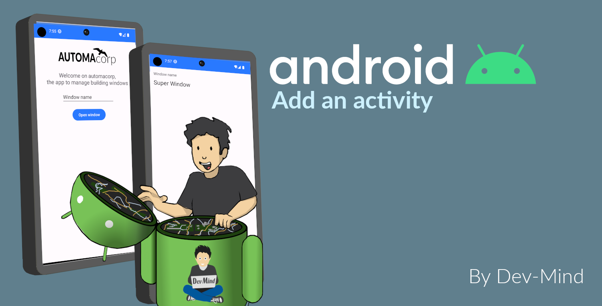

:doctitle: Add an activity
:description: In this lesson you will learn how add a new activity in your project and call it
:keywords: Android
:author: Guillaume EHRET - Dev-Mind
:revdate: 2023-10-12
:category: Android
:teaser: In this lesson you will learn how add a new activity in your project and call it
:imgteaser: ../../img/training/android/android-add-activity.png
:toc:

In this lesson, you will learn how to create a new View in your app and how to launch it with an Intent

[.text-center]

== Create a new activity

1. In the *Project window*, right-click the app folder and select *New > Activity > Empty Activity*.You can also use menu *File > New > Activity > Empty Activity*
2. In the *Configure Activity window*, enter a name for our new activity : _WindowActivity_.Leave all other properties set to their defaults and click Finish.
+
Android Studio automatically does three things:
+
* Creates the *WindowActivity* file.
* Creates the layout file *activity_window.xml*, which corresponds with the *WindowActivity* file.
* Adds the required *<activity>* element in *AndroidManifest.xml*.
+
3. We will now update *activity_window.xml* to display a window name and a label. Open this file
4. Add a new TextView to display a label name with these properties
+
* *text* : _Window name_ (should be defined in strings.xml)
* *margin top* 16dp
* *margin left* 16dp
5. Add a new TextView below the first one with these properties
* *text* : empty
* *textAppearance* : _@style/TextAppearance.AppCompat.Large_
* *margin top* 8dp
* *margin left* 16dp
* *id* txt_window_name
+
video::ppyIYuRpNWk[youtube, width=600, height=330]

== Build an intent to open an activity

An https://developer.android.com/reference/android/content/Intent[Intent] is an object that provides runtime binding between separate components, such as two activities. These activities can be in the same app or not. For example if you need to open a web page you won't develop a new browser. You will open this web page in installed browser as Firefox or Chrome.

The https://developer.android.com/reference/android/content/Intent[Intent] represents an app’s intent to do something. You can use intents for a wide variety of tasks, but in this lesson, your intent starts another activity in the same app.

image::../../img/training/android/android-intent.png[Intent]

When you create an Intent you define a context, a target and you can send zero, one or more informations to the target.  An Intent can carry data types as key-value pairs called extras. In this lab you will open *WindowActivity* when a user will click on *MainActivity* button *Open Window*

Update method *openWindow* in *MainActivity* to

1. define an Intent
2. target *WindowActivity*
3. put the window name filled in *MainActivity* in the sent attributes (extra). Each extra is identified by a string. It's a good practice to define keys for intent extras with your app's package name as a prefix. This ensures that the keys are unique, in case your app interacts with other apps.

[source,kotlin,subs="specialchars"]
----
class MainActivity : AppCompatActivity() {

    companion object {
        const val WINDOW_NAME_PARAM = "com.automacorp.windowname.attribute"
    }

    override fun onCreate(savedInstanceState: Bundle?) {
        super.onCreate(savedInstanceState)
        setContentView(R.layout.activity_main)
    }

    fun openWindow(view: View) {
        // Extract value filled in editext identified with txt_window_name id
        val windowName = findViewById<EditText>(R.id.txt_window_name).text.toString()

        val intent = Intent(this, WindowActivity::class.java).apply {
            putExtra(WINDOW_NAME_PARAM, windowName)
        }
        startActivity(intent)
    }
}
----

On the other side on *WindowActivity* you have to

1. read the name sent in intent
2. find Textview to update in Layout (this widget is identified by an id)
3. update this Textview with the name

[source,kotlin,subs="specialchars"]
----
class WindowActivity : AppCompatActivity() {
    override fun onCreate(savedInstanceState: Bundle?) {
        super.onCreate(savedInstanceState)
        setContentView(R.layout.activity_window)

        val param = intent.getStringExtra(MainActivity.WINDOW_NAME_PARAM)
        val windowName = findViewById<TextView>(R.id.txt_window_name)
        windowName.text = param
    }
}
----

It's time to test yours changes.

Click *Apply Changes* image:../../img/training/android/android-studio-apply.svg[Apply changes]  in the toolbar to run the app. Type a window name in the text field and click on the button to see the message in the second activity

== Manage back button to return on main activity

When you are on *WindowActivity* we want to add a button to go back on  *MainActivity*. To do that you need to update *WindowActivity* and add a line to activate option in action bar `supportActionBar?.setDisplayHomeAsUpEnabled(true)`

[source,kotlin,subs="specialchars"]
----
class WindowActivity : AppCompatActivity() {

    override fun onCreate(savedInstanceState: Bundle?) {
        super.onCreate(savedInstanceState)
        setContentView(R.layout.activity_window)
        supportActionBar?.setDisplayHomeAsUpEnabled(true)
        //...
    }
}
----

You also need to define your activity parent. This definition is made in AndroidManifest.xml with property `parentActivityName`

[source,xml,subs="specialchars"]
----
<activity android:name=".WindowActivity" android:parentActivityName=".MainActivity"></activity>
----

Click *Apply Changes* image:../../img/training/android/android-studio-apply.svg[Apply changes]  in the toolbar to run the app and test back button.
