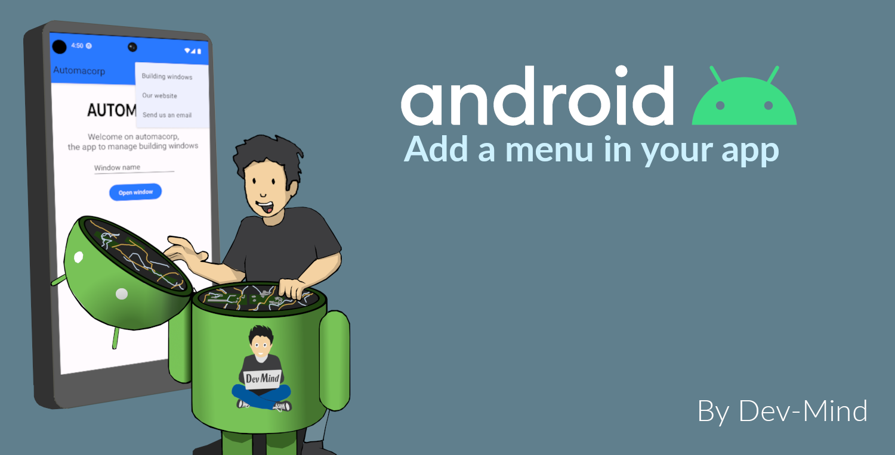
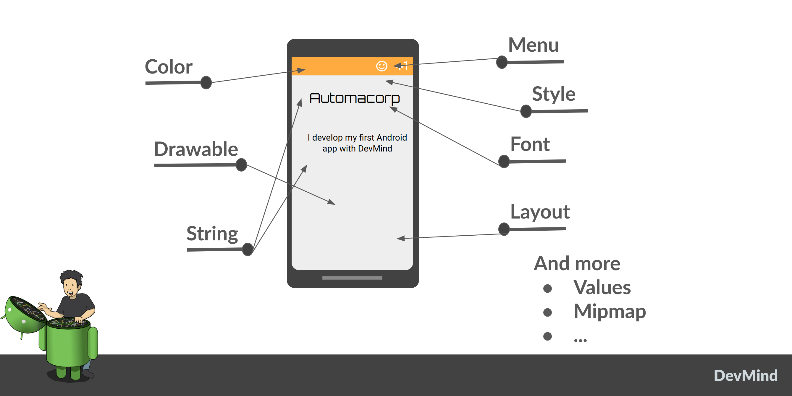
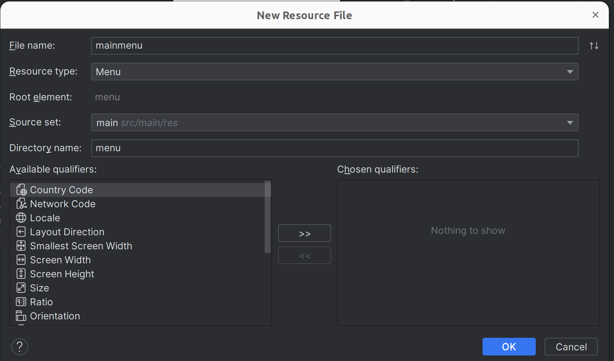
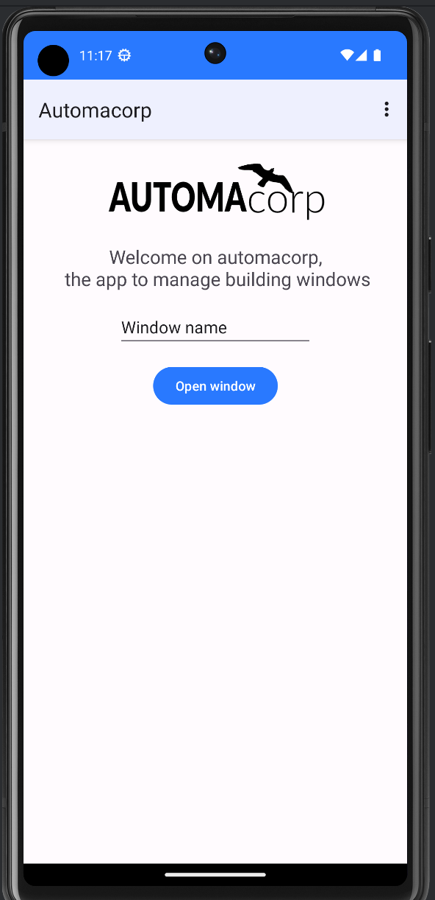

:doctitle: Add a menu in your app
:description: In this lesson you will learn how add a menu and launch intent to open internal or external activities
:keywords: Android
:author: Guillaume EHRET - Dev-Mind
:revdate: 2023-10-11
:category: Android
:teaser: In this lesson you will learn how add a menu and launch intent to open internal or external activities
:imgteaser: ../../img/training/android/android-add-menu.png
:toc:
:icons: font

In this lesson you will learn how add a menu and launch intent to open internal or external activities

== Menus

Menus are a common user interface component in many types of applications. A https://developer.android.com/guide/topics/resources/menu-resource[menu] is a resource as style, color, layout...

Remember, you can provide alternative resources for specific device configurations, by grouping them in specially-named resource directories.
At runtime, Android uses the appropriate resource based on the current configuration.

It exists different types of menus (top, bottom...). In this lesson we will implement a menu on the top the in app bar. It's where you should place actions that have a global impact on the app, such as "Compose email", "Settings"...

For all menu types, Android provides a standard XML format to define menu items. Instead of building a menu in your activity's code, you should define a menu and all its items in an XML file.

Using a menu resource is a good practice for a few reasons:

* It's easier to visualize the menu structure
* It separates the content for the menu from your application's behavioral code.
* It allows you to create alternative menu configurations for different platform versions, screen sizes, and other configurations by leveraging the app resources framework.

A menu will have different options (an option is a menu item).

It's time to test by yourself. We want to add a menu in app bar with different options

* a link to open your corporate website (we will open an URL in favorite browser)
* a link to send you an email (we will open a window to write a new mail in favorite mail app)
* a link to open the activity used to list building windows

A menu is linked to an activity, and you can use a different menu on 2 activities of your app.

== icon:flask[] : Create the menu

1. Create an XML file inside your project's *res/menu/* directory. For that in the *Project window*, right-click the app folder and select *New > Android resource file*. You can also use menu *File > New > Android resource file*
2. In window "New resource File" choose
+
* **File name** : main_menu
* **Resource type** : menu
* **Source set** : main
* **Directory name** : menu
+

3. File *res/menu/menu.xml* is opened in menu editor. You can use *palette* to add elements. We will add 3 *Menu Items*. Item element supports several attributes to define an item's appearance and behavior. The main ones are :
+
* *id* : an unique resource ID, which allows the application to recognize the item when the user wants to manipulate it in code.
* *icon* : a reference to an optional drawable to use as the item's icon.
* *title* : a reference to a string to use as the item's title.
* *showAsAction* : specifies when and how this item should appear as an action item in the app bar. Possible values are
+
** *ifRoom* : place this item in the app bar if there is room for it. If there is not room for all the items marked "ifRoom", last items are displayed in the overflow menu.
** *withText*: also include the title text (defined by android:title) with the action item
** *never* : place this item in the app bar's overflow menu.
* you have more options. You can find them https://developer.android.com/guide/topics/resources/menu-resource[here]
4. You can copy these string definitions in  *res/values/string.xml*
+
[source,xml,subs="none"]
----
<resources>
    <!-- ... -->
    <string name="menu_windows">Building windows</string>
    <string name="menu_website">Our website</string>
    <string name="menu_email">Send us an email</string>
    <!-- ... -->
</resources>
----
5. Add 3 menu entries with an *id*, a *title* and option *showAsAction* to the value *never*
+
video::AgvtSl7GNiM[youtube, width=600, height=330]
+
6. We will attach this menu to activities  *MainActivity*, *WindowActivity* and *WindowsActivity*. To prevent the add on each activity, we will create a parent activity and each activities will inherit from this parent activity. Select package *com.automacorp*, right-click and select *New > Activity > Kotlin File/Class*, fill *BasicActivity*
+
7. In this file you can copy this code
+
[source,kotlin,subs="specialchars"]
----
open class BasicActivity : AppCompatActivity()
----
+
8. Update *MainActivity*, *WindowActivity* and *WindowsActivity* and replace _AppCompatActivity_ by _BasicActivity_
+
9. We will now activate the menu. Override *onCreateOptionsMenu()* in *BasicActivity*. In this method, you can inflate your menu resource in the Menu provided in the callback
+
[source,kotlin,subs="specialchars"]
----
open class BasicActivity : AppCompatActivity() {
    override fun onCreateOptionsMenu(menu: Menu): Boolean {
        val inflater: MenuInflater = menuInflater
        inflater.inflate(R.menu.main_menu, menu)
        return true
    }
}
----
+
10. When the user selects an item from the options menu (including action items in the app bar), the system calls your activity's *onOptionsItemSelected()* method. This method passes the MenuItem selected. We will handle each possible values in *BasicActivity* class
+
[source,kotlin,subs="specialchars"]
----
override fun onOptionsItemSelected(item: MenuItem): Boolean {
    when(item.itemId){
        R.id.menu_windows -> startActivity(
            Intent(this, WindowsActivity::class.java)
        )
        R.id.menu_website -> startActivity(
            Intent(Intent.ACTION_VIEW, Uri.parse("https://dev-mind.fr"))
        )
        R.id.menu_email -> startActivity(
            Intent(Intent.ACTION_SENDTO, Uri.parse("mailto://guillaume@dev-mind.fr"))
        )

    }
    return super.onContextItemSelected(item)
}
----

To understand the last code you can read the next chapter.

== Intent : new use case

I introduced the Intent concept in https://dev-mind.fr/training/android/android-add-activity.html#_intent_how_communicate_with_other_component[this chapter]. In the first menu item we call another activity in our app, as we already done in the lab https://dev-mind.fr/training/android/android-add-activity.html["Add a new activity"].

An https://developer.android.com/reference/android/content/Inten[intent] is an abstract description of an operation to be performed. It can be used to launch an Activity, a background Service... And you can call one activity in your app or in another app installed on the device. In this case you ask to the system to find the best application to resolve an action.

The first argument for the Intent is the expected action, such as `ACTION_VIEW`, `ACTION_SENDTO`, `ACTION_EDIT`, `ACTION_MAIN`, etc.
The second one is the data to operate on, such an URL, an email, expressed as a Uri.

Some examples of action/data pairs :

* `ACTION_VIEW` content://contacts/people/1 : Display information about the person whose identifier is "1".
* `ACTION_DIAL` tel:0642434445 : Display the phone dialer with the given number filled in.
* `ACTION_EDIT` content://contacts/people/1 : Edit information about the person whose identifier is "1".
* ...

== icon:flask[] : Test your menu

Last version of Android Studio uses Material 3 and the theme `Theme.Material3.DayNight.NoActionBar` so with no action bar by default.

So when you launch your app you have no action bar and no menu displayed on the top. Open the files `res/values/themes` (one for the default mode and one for the dark mode).

Update

[source,xml,subs="specialchars"]
----
 
----

and use

[source,xml,subs="specialchars"]
----
 
----

If you launch your app you will be able to test your menu

You can personalize the bar color for that you need to override the toolbarStyle property

[source,xml,subs="specialchars"]
----
 
 
----

== icon:flask[] : Manage back button to return on main activity

When you are on `WindowActivity` we want to add a button to go back on `MainActivity`. To do that you need to update `WindowActivity` and add a line to activate option in action bar `supportActionBar?.setDisplayHomeAsUpEnabled(true)`

[source,kotlin,subs="specialchars"]
----
class WindowActivity : AppCompatActivity() {

    override fun onCreate(savedInstanceState: Bundle?) {
        super.onCreate(savedInstanceState)
        setContentView(R.layout.activity_window)
        supportActionBar?.setDisplayHomeAsUpEnabled(true)
        //...
    }
}
----

You also need to define your activity parent. This definition is made in AndroidManifest.xml with property `parentActivityName`

[source,xml,subs="specialchars"]
----
<activity android:name=".WindowActivity" android:parentActivityName=".MainActivity"></activity>
----

Click *Apply Changes* image:../../img/training/android/android-studio-apply.svg[Apply changes]  in the toolbar to run the app and test back button. You will be able to add this feature on your other screens.
