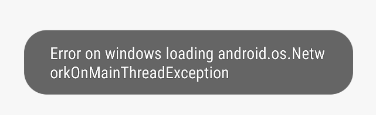
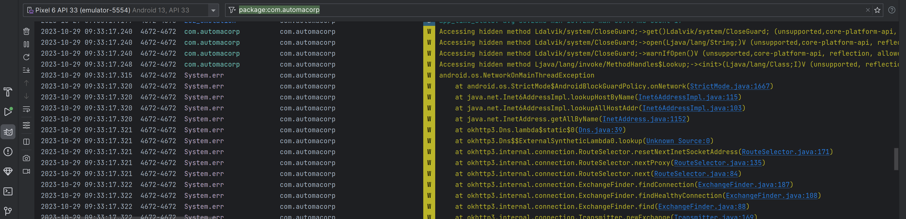
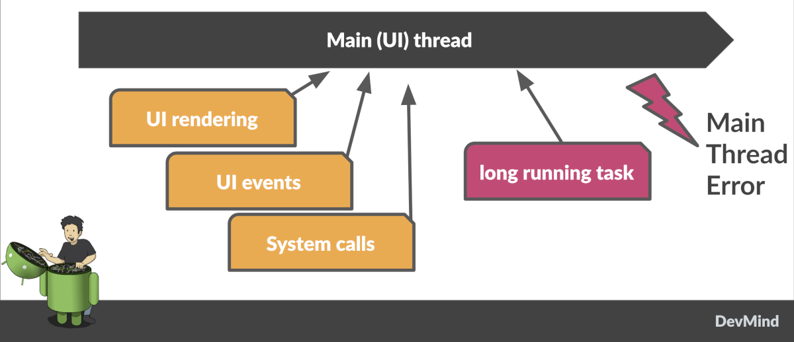
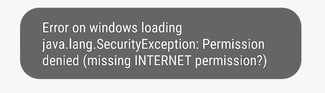
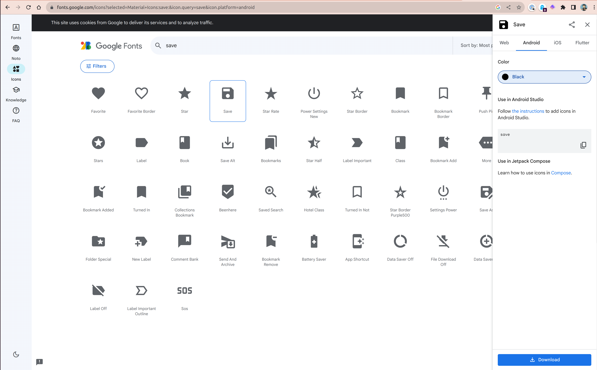
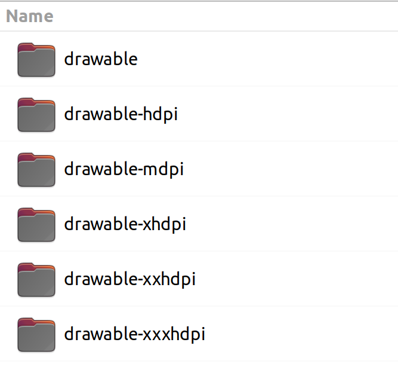
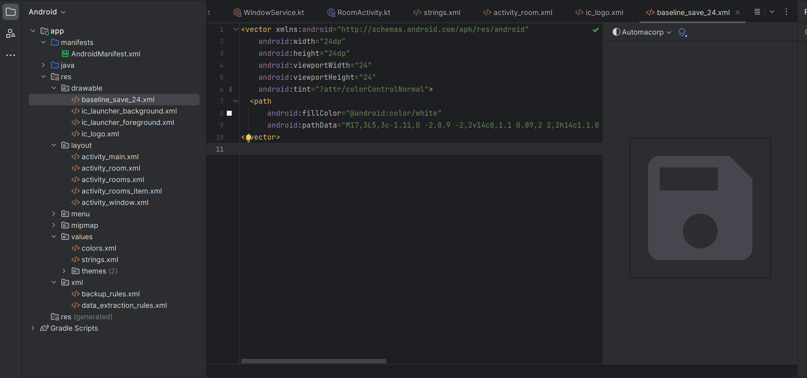

:doctitle: Call a remote API in Android
:description: In this lesson, you will learn how to call a remote API to synchronously read data.
:keywords: Android
:author: Guillaume EHRET - Dev-Mind
:revdate: 2023-10-09
:category: Android
:teaser: In this lesson, you will learn how to call a remote API to synchronously read data.
:imgteaser: ../../img/training/android/android-call-remote.png
:toc:
:icons: font

In this lesson, we will see how to call a remote HTTP API with an external library called https://square.github.io/retrofit/[Retrofit]. https://square.github.io/retrofit/[Retrofit] was not done by Google. But when a library created by the community is widely used, well designed, the Android team does not hesitate to encourage its use.

== Explore API

If you followed the previous code labs to build a Spring application, you will be able to use your own app. You should have an API to list building rooms and other to load detailed information on a room.

For the moment data are static in `com.automacorp.model.RoomService`. Now we will update this service to read data stored on a web server, as a REST web service.

Dev-Mind website expose simple non secured URLs to read Rooms ans their windows or heaters. This simple API can be used for the first exercices of this lab.

* https://dev-mind.fr/training/android/rooms
* https://dev-mind.fr/training/android/rooms/id (id must be replaced by the value of a room id)
* https://dev-mind.fr/training/android/windows
* https://dev-mind.fr/training/android/windows/id (id must be replaced by the value of a window id)

You can also used your own Spring API if you followed Spring course or my implementation available on https://automacorp.devmind.cleverapps.io/swagger-ui/index.html. This app is secured by basic auth and you can the username `user` and his password `password`.

== icon:flask[] : Install Retrofit

As I said we need to install Retrofit to call a remote API and we also need another library to serialize/deserialize our Kotlin objects in/from JSON.

1. Open *build.gradle.kts (Module: automacorp.app)*.
2. In the dependencies block, add 2 lines to load Retrofit and the Moshi converter (versions are available https://github.com/square/retrofit/tags[here])
+
[source,groovy,subs="specialchars"]
----
implementation "com.squareup.retrofit2:retrofit:2.9.0"
implementation "com.squareup.retrofit2:converter-moshi:2.9.0"
----
3. As you updated your gradle configuration, Android Studio display a message to synchronize your projet. Click on *Sync now*
+
image:../../img/training/android/android-gradle-sync.png[Sync Gradle project]

== Retrofit

To interact with a remote HTTP API in Android app, your app needs to

* establish a network connection to remote server which exposes your REST service and
* communicate with that server, and then
* receive its response data and
* parse the data to be usable in your code.

Retrofit was made to do all these steps easily. For the last one, we need a converter to deserialize HTTP body. Several converters are available. We will use https://github.com/square/moshi/[Moshi] library

The mains goal of Retrofit is to turn your HTTP API into a Java interface. For example

[source,kotlin,subs="specialchars"]
----
interface RoomsApiService {
    @GET("rooms")
    fun findAll(): Call<List<RoomDto>>

    @GET("rooms/{id}")
    fun findById(@Path("id") id: Long): Call<RoomDto>

    @PUT("rooms/{id}")
    fun updateRoom(@Path("id") id: Long, @Body room: RoomCommandDto): Call<RoomDto>

    //...
}
----

Annotations (GET, POST, PUT, DELETE,...) on the interface methods and its parameters indicate how a request will be handled.

A request URL can be updated dynamically using replacement blocks and parameters on the method. A replacement block is an alphanumeric string surrounded by { and }.

You can bind a parameter in path
[source,kotlin,subs="specialchars"]
----
@GET("rooms/{id}")
fun findById(@Path("id") id: Long): Call<RoomDto>
----

or a parameter in query
[source,kotlin,subs="specialchars"]
----
@GET("rooms")
fun findAll(@Query("sort") sort: String): Call<List<RoomDto>>
----

An object can be specified for POST or PUT HTTP requests @Body annotation. In this case, Retrofit will use converter defined in your conf to serialize body object in JSON

[source,kotlin,subs="specialchars"]
----
@PUT("rooms/{id}")
fun updateRoom(@Path("id") id: Long, @Body room: RoomCommandDto): Call<RoomDto>
----

In my example RoomCommandDto is different than RoomDto. If you use my remote API available on on https://automacorp.devmind.cleverapps.io you could define these objects in your code

[source,kotlin,subs="specialchars"]
----
data class RoomDto(
    val id: Long,
    val name: String,
    val currentTemperature: Double?,
    val targetTemperature: Double?,
    val windows: List<WindowDto>
)

data class RoomCommandDto(
    val name: String,
    val currentTemperature: Double?,
    val targetTemperature: Double?,
    val floor: Int = 1,
    // Set to the default building ID (useful when you have not created screens to manage buildings)
    val buildingId: Long = -10
)
----

These 2 objects are 2 projections of a Room: one for the read, one for the update.
You will find more information on https://square.github.io/retrofit/[Retrofit] website

It is the time to test by yourself.

== icon:flask[] :  Configure Retrofit

Now you are ready to write the code to call your API.

1. In package `com.automacorp.service` create a new interface called `RoomsApiService`
2. You can apply the examples given above. In this interface we declare methods used to launch a remote call to
+
* read all rooms
* read one room by its id
* update a room
* create a room
* delete a room by its id
+
3. We need to create an implementation of this interface. This implementation will be created by the Retrofit Builder. In package `com.automacorp.service` create a new class called *ApiServices*. This class will use a Retrofit builder to return an instance of interface `RoomsApiService`
+
[source,kotlin,subs="specialchars"]
----
object ApiServices {
    val roomsApiService : RoomsApiService by lazy {
        Retrofit.Builder()
                .addConverterFactory(MoshiConverterFactory.create()) // (1)
                .baseUrl("http://automacorp-client-for-android.cleverapps.io/api/") // (2)
                .build()
                .create(RoomsApiService::class.java)
    }
}
----
+
*(1)* a converter factory to tell Retrofit what do with the data it gets back from the web service.
+
*(2)* an URL of the remote service (In this example I use an URL on my website but you can use your own API)

When an API is secured by a basic authentication, we need to adapt the settings. For that we can add 2 constant in object `ApiServices`

[source,kotlin,subs="specialchars"]
----
const val API_USERNAME = "user"
const val API_PASSWORD = "password"
----

As often, when we have to manage credential in an HTTP request, we will create an interceptor to intercept the outgoing requests and add the authentication credential inside.

[source,kotlin,subs="specialchars"]
----
class BasicAuthInterceptor(val username: String, val password: String): Interceptor {
    override fun intercept(chain: Interceptor.Chain): Response {
        val request = chain
            .request()
            .newBuilder()
            .header("Authorization", Credentials.basic(username, password))
            .build()
        return chain.proceed(request)
    }
}
----

When your interceptor is created,  you can adapt the Retrofit builder.

[source,kotlin,subs="specialchars"]
----
val roomsApiService : RoomsApiService by lazy {
    val client = OkHttpClient.Builder()
            .addInterceptor(BasicAuthInterceptor(API_USERNAME, API_PASSWORD))
            .build()

    Retrofit.Builder()
        .addConverterFactory(MoshiConverterFactory.create())
        .client(client)
        .baseUrl("https://automacorp.devmind.cleverapps.io/api/")
        .build()
        .create(RoomsApiService::class.java)
}
----

If your application is served over HTTPS (this is the default on Clever Cloud), you also need to customize the OkHttpClient. In the real life we use a real certificate. In our dev we just check the hostname of our remote server

[source,kotlin,subs="specialchars"]
----
val roomsApiService : RoomsApiService by lazy {
    val client = getUnsafeOkHttpClient()
            .addInterceptor(BasicAuthInterceptor(API_USERNAME, API_PASSWORD))
            .build()

    // ...
}

private fun getUnsafeOkHttpClient(): OkHttpClient.Builder =
  OkHttpClient.Builder().apply {
      val trustManager = object : X509TrustManager {
          @Throws(CertificateException::class)
          override fun checkClientTrusted(chain: Array<X509Certificate>, authType: String) {
          }

          @Throws(CertificateException::class)
          override fun checkServerTrusted(chain: Array<X509Certificate>, authType: String) {
          }

          override fun getAcceptedIssuers(): Array<X509Certificate> {
              return arrayOf()
          }
      }
      val sslContext = SSLContext.getInstance("SSL").also {
          it.init(null, arrayOf(trustManager), SecureRandom())
      }
      sslSocketFactory(sslContext.socketFactory, trustManager)
      hostnameVerifier { hostname, _ -> hostname.contains("cleverapps.io") }
      addInterceptor(BasicAuthInterceptor(API_USERNAME, API_PASSWORD))
  }
----

== icon:flask[] : Use Retrofit

We can now adapt our code to use this API when we want to display the room list or a room detail.

=== Room list

For the moment, the list of rooms is populated with this code `roomsAdapter.setItems(WindowService.ROOMS)` in your `RoomsActivity`

We can replace this line by this code

[source,kotlin,subs="specialchars"]
----
 runCatching { // (1)
     ApiServices.roomsApiService.findAll().execute() // (2)
 }
    .onSuccess { roomsAdapter.setItems(it.body() ?: emptyList()) }  // (3)
    .onFailure {
        it.printStackTrace() (4)
        Toast.makeText(this, "Error on rooms loading $it", Toast.LENGTH_LONG).show()  // (5)
    }
----

* *(1)* we use *runCatching* to manage successes and failures. This block is like a try/catch block in Java
* *(2)* `ApiServices.roomsApiService` return an implementation of our object written to call a remote API. We call the method *execute* to run a synchronous call
* *(3)* On success we update adapter with the result contained in body property. If this response is null the list is empty.
* *(4)* We use this line to have the real stack trace in your device log file
* *(4)* on error we display a message in a https://developer.android.com/guide/topics/ui/notifiers/toasts[Toast notation]

Run your app to see the changes when and open the room list.

Unfortunately you should have a toast notification with the following error message :

To analyse the errors you can open the LogCat tab and filter on Error level. In my example below, we can see the same error

To resolve the problem we have to understand the next chapters

== Main thread

When the system launches your application, that application runs in a thread called *Main thread*. This main thread manages user interface operations (rendering, events ...), system calls...

Calling long-running operations from this main thread can lead to freezes and unresponsiveness.

Making a network request on the main thread forces it to wait, or block, until it receives a response.

When the thread is blocked, the OS isn't able to manage UI events, which causes your app to freeze and potentially leads to an Application Not Responding (ANR) dialog. To avoid these performance issues, Android throws a *MainThreadException* and kills your app if you try to block this main thread.

The solution is to run your network call, your long-running task in another thread, and when the result is available you can reattach the main thread to display the result. Only the main thread can update the interface.

If you develop in Java, Thread development can be difficult. With Kotlin and https://kotlinlang.org/docs/coroutines-guide.html[coroutines], the development is really simple.

== Coroutines

A https://kotlinlang.org/docs/coroutines-guide.html[coroutine] is a concurrency design pattern that you can use on Android to simplify code that executes asynchronously tasks as an HTTP request. Coroutines help to manage long-running tasks that might otherwise block the main thread and cause your app to become unresponsive.

In Kotlin, all coroutines run inside a https://kotlinlang.org/api/kotlinx.coroutines/kotlinx-coroutines-core/kotlinx.coroutines/-coroutine-scope/[CoroutineScope]. A scope controls the lifetime of coroutines through its job. When you cancel the job of a scope, it cancels all coroutines started in that scope.

On Android, you can use a scope to cancel all running coroutines when, for example, the user navigates away from an Activity or Fragment. Scopes also allow you to specify a default dispatcher. A dispatcher controls which thread runs a coroutine.

Each object in Android which has a https://developer.android.com/topic/libraries/architecture/lifecycle[lifecycle] (Activity, Fragment...), has a `CoroutineScope`.

== icon:flask[] : Use coroutines to resolve main thread error

We need to add the coroutine library i your project. Open *build.gradle.kts (Module: automacorp.app)* to add the following dependency (in dependencies block)

[source,kotlin,subs="specialchars"]
----
implementation("androidx.lifecycle:lifecycle-runtime-ktx:2.6.2")
----

Android Studio display a message to synchronize your projet. Click on *Sync now*

image:../../img/training/android/android-gradle-sync.png[Sync Gradle project]

We can now adapt the code used in `RoomsActivity` to load the room list.

1. Open *com.automacorp.RoomsActivity*
2. Update code to call roomsApiService as follows
+
[source,kotlin,subs="specialchars"]
----
lifecycleScope.launch(context = Dispatchers.IO) { // (1)
    runCatching { ApiServices.roomsApiService.findAll().execute() }
        .onSuccess {
            withContext(context = Dispatchers.Main) { // (2)
                roomsAdapter.setItems(it.body() ?: emptyList()) }
            }
        .onFailure {
            withContext(context = Dispatchers.Main) {
                it.printStackTrace()
                Toast.makeText(applicationContext, "Error on rooms loading $it", Toast.LENGTH_LONG)
                    .show()  // (3)
            }
        }
}
----
* *(1)* method `lifecycleScope.launch` open a new directive. You must specify a context other than Dispatchers. `Main` (Main thread) for the code to be executed. `Dispatchers.IO` is dedicated to Input/Output tasks
* *(2)* You cant' interact with the view outside the main thread. When we receive the data we use `withContext` to reattach your code to another thread
* *(3)* You cant' interact with the view outside the main thread. When we receive an error we use `withContext` to reattach your code to another thread

Relaunch your app to test your Room list screen.

Unfortunately you should have another toast notification with another error message. The error message tells you that your app might be missing the INTERNET permission.

== Android permission

The purpose of a permission is to protect the privacy of an Android user. Android apps must request permission to access sensitive user data or features such as contacts, SMS, Internet... Depending on the feature, the system might grant the permission automatically or might prompt the user to approve the request.

By default, an app has no permission to perform any operations that would adversely impact other apps, the operating system or the user.

To add a new permission we need to update the `AndroidManifest.xml` file (ie the id card of your app)

In the following example I add the INTERNET permission `<uses-permission>` tag (just before <application> tag)

[source,xml,subs="specialchars"]
----
<manifest xmlns:android="http://schemas.android.com/apk/res/android"
package="com.example.snazzyapp">

    <uses-permission android:name="android.permission.INTERNET" />
    <application ...
         android:usesCleartextTraffic="true">
        ...
    </application>
</manifest>
----

Each user can accept or reject an app permission request, when this app is installed or when the user update the app settings in the device setting. So generally, you must handle this case and ask the user to reactivate the rights if he wants to use your application. In our case we will not test the authorization and we will consider that the user has accepted this permission.

You can now relaunch your app and you will be able to open the room list without error.For more informations about permissions you can read this https://developer.android.com/guide/topics/permissions/overview[page].

== icon:flask[] : Update the screen to display and update the detail

=== Call API to display detail and transform view screen in edit screen

1. Update `RoomActivity` to replace `val room = WindowService.ROOMS.firstOrNull {it.id == roomId}` by a call to your remote API
2. Check your screen to validate that the screen call the API to display detail
3. For the moment, you created the view with TextView components. You can follow this video to convert them in EditText
+
video::rGVizyhUAzo[youtube, width=700, height=330]
+
4. For the temperature EditTexts, you can update the input type to force user to fill a decimal number
+
video::3NQbvostJhc[youtube, width=700, height=330]

Don't forget to update the type of the objects used in `RoomActivity` (`EditText` in place of `TextView`)

[source,kotlin,subs="specialchars"]
----
val roomName = findViewById<EditText>(R.id.txt_room_name)
roomName.setText(room?.name ?: "")

val roomCurrentTemperature = findViewById<EditText>(R.id.txt_room_current_temperature)
roomCurrentTemperature.setText(room?.currentTemperature?.toString() ?: "")

val roomTargetTemperature = findViewById<EditText>(R.id.txt_room_target_temperature)
roomTargetTemperature.setText(room?.targetTemperature?.toString() ?: "")
----

=== Create a button with an icon

In https://m3.material.io/[Material design] specification, Google recommends using floating buttons with images.

If you search free icons, you can use the https://fonts.google.com/icons[Google library]. For example we will search a Save button

On the right side you can choose the Android target, a color and download the icon via the bottom button.

You can unzip the file downloaded. You have one image for each device resolution

But in our case we only keep the vector image available in file `baseline_save_24.xml`, present in folder called `drawable`. Copy this file in your Android resource folder `res/drawable`

Now you can go back in the layout `activity_room.xml` and

* add a FloatingActionButton
* add layout constraint to put the button on the bottom right
* add a contentDescription
* add a specific id to the button

video::STNEdiyPNPA[youtube, width=700, height=330]

You can now create the code to populate your form, add an event listener to the button or to save or update a room.

[source,kotlin,subs="specialchars"]
----
private fun populateScreen(room: RoomDto?) {
    val roomName = findViewById<EditText>(R.id.txt_room_name)
    roomName.setText(room?.name ?: "")

    val roomCurrentTemperature = findViewById<EditText>(R.id.txt_room_current_temperature)
    roomCurrentTemperature.setText(room?.currentTemperature?.toString() ?: "")

    val roomTargetTemperature = findViewById<EditText>(R.id.txt_room_target_temperature)
    roomTargetTemperature.setText(room?.targetTemperature?.toString() ?: "")

    findViewById<FloatingActionButton>(R.id.saveButton).setOnClickListener {
        saveRoom()
    }
}

override fun onDestroy() {
    super.onDestroy()
    findViewById<FloatingActionButton>(R.id.saveButton).setOnClickListener(null)
}

fun saveRoom() {
    val roomId = intent.getLongExtra(MainActivity.ROOM_ID_PARAM, -1)
    val roomDto = RoomCommandDto(
        name = findViewById<EditText>(R.id.txt_room_name).text.toString(),
        currentTemperature = findViewById<EditText>(R.id.txt_room_current_temperature).text.toString()
            .toDoubleOrNull(),
        targetTemperature = findViewById<EditText>(R.id.txt_room_target_temperature).text.toString()
            .toDoubleOrNull()
    )
    lifecycleScope.launch(context = Dispatchers.IO) { // (1)
        runCatching {
            if (roomId == null || roomId == -1L) {
                ApiServices.roomsApiService.save(roomDto).execute()
            } else {
                ApiServices.roomsApiService.updateRoom(roomId, roomDto).execute()
            }
        }
            .onSuccess {
                withContext(context = Dispatchers.Main) {
                    startActivity(Intent(applicationContext, RoomsActivity::class.java))
                }
            }
            .onFailure {
                withContext(context = Dispatchers.Main) {
                    it.printStackTrace()
                    Toast.makeText(applicationContext, "Error on room saving $it", Toast.LENGTH_LONG).show()  // (3)
                }
            }
    }
}
----

Now you can call all your remote API.
