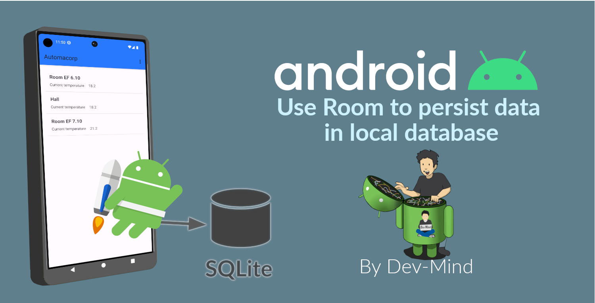
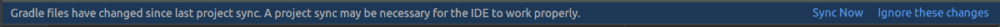

:doctitle: Interact with a database in your project
:description: You'll learn about the fundamentals of using Room, including the database class, the DAO, entities, and view models.
:keywords: Android, database, room
:author: Guillaume EHRET - Dev-Mind
:revdate: 2018-09-24
:category: Android, Kotlin
:teaser:  You'll learn about the fundamentals of using Room, including the database class, the DAO, entities, and view models.
:imgteaser: ../../img/training/environnement.png
:toc:

In this lesson, we will learn how to use a database in our application.
For the moment we need an Internet connection to display data on our screens but we want to be able to display something when a user is offline or when the remote API is not able to answer.

Each Android phone has a local SQLite database.
The Jetpack Room persistence library provides an abstraction layer over SQLite to make the interaction easier.
Room is an ORM (Object Relational Mapping) library (as the Hibernate for the backend development).
You have other libraries to do the same but Room has the advantage of being provided by the Google team.

== Configure Room in your project

1. Open *build.gradle (Module: automacorp.app)*.
2. As Room uses annotations we need to configure Gradle to launch the kotlin annotation processor.
For that you just have to add a new plugin id `kotlin-kapt`
+
[source,groovy,subs="specialchars"]
----
plugins {
    id 'com.android.application'
    id 'org.jetbrains.kotlin.android'
    id 'kotlin-kapt'
}
----
+
3. In the dependencies block, declare new libraries
+
[source,groovy,subs="specialchars"]
----
implementation "androidx.room:room-runtime:2.4.3"
implementation "androidx.room:room-ktx:2.4.3"
kapt "androidx.room:room-compiler:2.4.3"

implementation "androidx.lifecycle:lifecycle-viewmodel-ktx:2.5.1"
implementation "androidx.lifecycle:lifecycle-livedata-ktx:2.5.1"
implementation "androidx.activity:activity-ktx:1.6.0"
----
+
4. As you updated your gradle configuration, Android Studio display a message to synchronize your projet.
Click on *Sync now*
+

== Create your first entity

An entity is a Kotlin class binded to a database table.
With Room, each table is represented by a class

For the moment we will define only one entity to start, the Window Entity.
The window table includes some basic information about a room window.

SQLite database has very few types :

- *NULL*.
The value is a NULL value.
- *INTEGER*.
The value is a signed integer, stored in 0, 1, 2, 3, 4, 6, or 8 bytes depending on the magnitude of the value.
- *REAL*.
The value is a floating point value, stored as an 8-byte IEEE floating point number.
- *TEXT*.
The value is a text string, stored using the database encoding (UTF-8, UTF-16BE or UTF-16LE).
- *BLOB*.
The value is a blob of data, stored exactly as it was input.

When working with Room, however, you should only be concerned with the Kotlin types when defining your model classes.
Mapping the data types in your model class to the ones used in the database is handled automatically.

Create a new class in the package `com.automacorp.model` called `Window`

We have to define several things

* to be an entity the class must be annotated with @Entity.
This annotation accept a property `tableName` to personalize the name
* each table need a unique id.
You can mark it with the @PrimaryKey annotation and tell if the value will be generated by the database
* each column must be declared with a @ColumnInfo annotation.
The column name can be overridden.
Typically, SQL column names will have words separated by an underscore, as opposed to the lowerCamelCase used by Kotlin properties.

[source,kotlin,subs="specialchars"]
----
@Entity(tableName = "rwindow")
data class Window(
    @PrimaryKey(autoGenerate = true) val id: Int,
    @ColumnInfo val name: String,
    @ColumnInfo(name = "room_id") val roomId: Int,
    @ColumnInfo(name = "room_name") val roomName: String,
    @ColumnInfo(name = "window_status") val windowStatus: WindowStatus
) {
    fun toDto(): WindowDto =
        WindowDto(id.toLong(), name, RoomDto(roomId.toLong(), roomName, null, null), windowStatus)
}
----

In this code we used an enum `WindowStatus`, but this enum is not a known type in the database. We should help Rooms to serialize and deserialize this enum value.Create in the package `com.automacorp.model` a new class `EnumConverters`.

[source,kotlin,subs="specialchars"]
----
class EnumConverters {

    // A first method to convert enum in string when the data will be stored in the database
    @TypeConverter
    fun fromWindowStatus(value: WindowStatus?): String? {
        return value?.toString()
    }

    // A second one to do the inverse operation
    @TypeConverter
    fun toWindowStatus(value: String?): WindowStatus? {
        return value?.let { WindowStatus.valueOf(it) }
    }

}
----

== Define the DAO linked to your entity

A DAO (Data Access Object) is a Kotlin class that provides access to the data.
We will define functions for reading or manipulating data.
Each function call will perform a SQL command on the database.

Create a new interface called WindowDao in the package `com.automacorp.dao`.

If you followed the https://dev-mind.fr/training/spring/spring-data.html[Spring Data] labs, Room is like Spring and it will generate the interface implementation at compile time.

To activate this mechanism you need to add the annnotation @Dao on your class

[source,kotlin,subs="specialchars"]
----
@Dao
interface WindowDao {
}
----

In the class `WindowApiService` we have for the moment 2 HTTP requests to find all windows or load only one by its id.
We will define these queries in our DAO.

A query is specified as a string passed into a `@Query` annotation.
**Contrary to Hibernate for backend developpers, we won't manipulate objets in these queries but we have to use SQL request with the database model.**

Room provides also different annotations `@Insert`, `@Update`, `@Delete` to manipulate an entity.

[source,kotlin,subs="specialchars"]
----
@Dao
interface WindowDao {
    @Query("select * from rwindow order by name")
    fun findAll(): List<Window>

    @Query("select * from rwindow where id = :windowId")
    fun findById(windowId: Int): Window

    @Insert
    suspend fun create(window: Window)

    @Update
    suspend fun update(window: Window): Int

    @Delete
    suspend fun delete(window: Window)

    @Query("delete from rwindow")
    suspend fun clearAll()
}
----

In the second example we use a function argument in the request.

==  Create database

We now need to configure the database in our project. With Room library we have to initialize a RoomDatabase and configure the different entities, the converters and their DAOs.

For that create a new class automacorpDatabase in `com.automacorp.dao`

* `@Database` annotation is used to declare all entities. The version number is incremented each time you make a schema change. The app checks this version with the one in the database to determine if and how a migration should be performed.
* `@TypeConverters` annotation is used to declare all type converters.

[source,kotlin,subs="specialchars"]
----
@Database(entities = [Window::class], version = 1)
@TypeConverters(EnumConverters::class)
abstract class automacorpDatabase : RoomDatabase() {
    abstract fun windowDao(): WindowDao
}
----

When using an automacorpDatabase class, you want to ensure that only one instance of the database exists to prevent race conditions or other potential issues. This is the same thing for all technical objects as yours DAOs. To resolve this problem you can use a dependency injection libray as https://developer.android.com/jetpack/androidx/releases/hilt[Hilt].

We will use a simpler solution in this lab. Create you own instance of Android `Application` in package `com.automacorp`. When your application is launched, this class will live until the application is terminated.

[source,kotlin,subs="specialchars"]
----
class AutomacorpApplication : Application() {}
----

You need to declare this new class in `AndroidManifest.xml` to launch you own implementation in place of the default one, when your app will be started.

[source,xml,subs="specialchars"]
----
<manifest xmlns:android="http://schemas.android.com/apk/res/android"
xmlns:tools="http://schemas.android.com/tools">
    <application
        android:name=".AutomacorpApplication"
     ...
----

Now we will declare ou database in this `AutomacorpApplication` class. The database creation can be done with the room builder. You need to declare the global context, your Database class and the db name.

[source,kotlin,subs="specialchars"]
----
class AutomacorpApplication : Application() {

    val database: automacorpDatabase by lazy {
        Room.databaseBuilder(this, automacorpDatabase::class.java, "automacorpdb")
            .build()
    }
}
----

If you need to use a DAO in you code you will be able to use

[source,kotlin,subs="specialchars"]
----
val windowDao = AutomacorpApplication.database.windowDao()
----

== Use ViewModel object

=== Why use a ViewModel ?

The Android framework manages the lifecycle of UI controllers, such as activities and fragments. The framework may decide to destroy or re-create a UI controller in response to certain user actions or device events that are completely out of your control.

If the system destroys or re-creates an UI controller, any transient UI-related data you store in them is lost. For example, your app may include a list of users in one of its activities. When the activity is re-created for a configuration change, the new activity has to re-fetch the list of users.

For simple data, the activity can use the `onSaveInstanceState()` method and restore its data from the bundle in `onCreate()`, but this approach is only suitable for small amounts of data that can be serialized then deserialized, not for potentially large amounts of data like a list of users or bitmaps.

Another problem is that UI controllers frequently need to make asynchronous calls that may take some time to return. The UI controller needs to manage these calls and ensure the system cleans them up after it's destroyed to avoid potential memory leaks.

ViewModels were created to resolve these problems and separate out view data ownership from UI controller logic. UI controllers such as activities and fragments should only display UI data, react to user actions, or handle operating system communication, such as permission requests. The data should be now managed by a ViewModel.

Using a view model helps enforce a clear separation between the code for your app's UI and its data model.

The ViewModel class is used to store data related to an app's UI, and is also lifecycle aware, meaning that it responds to lifecycle events much like an activity or fragment does. If lifecycle events such as screen rotation cause an activity or fragment to be destroyed and recreated, the associated ViewModel won't need to be recreated.

=== Create a ViewModel

To create a view model class, create a new class called `WindowViewModel` in a new package called `com.automacorp.viewmodel`. It should only use the `WindowDao` and for the moment we can implment inside the method used to load data

[source,kotlin,subs="specialchars"]
----
class WindowViewModel(private val windowDao: WindowDao) : ViewModel() {
    fun findAll(): LiveData<List<WindowDto>> = liveData {
        viewModelScope.launch(Dispatchers.IO) {
            emit(windowDao.findAll().map { it.toDto() })
        }
    }

    fun findById(windowId: Int): LiveData<WindowDto> = liveData {
        viewModelScope.launch(Dispatchers.IO) {
            emit(windowDao.findById(windowId).toDto())
        }
    }
}
----

As we have to access to the DB we must do that outside the main thread. Coroutine `viewModelScope.launch(Dispatchers.IO)` is used to do that

LiveData is an observable data holder class. Unlike a regular observable, LiveData is lifecycle-aware, meaning it respects the lifecycle of other app components, such as activities, fragments, or services. This awareness ensures LiveData only updates app component observers that are in an active lifecycle state.

A ViewModel class must be lifecycle aware, it should be instantiated by an object that can respond to lifecycle events and an object made to handle all memory managements. For that we will use a `ViewModelProvider.Factory`. This object should be defined in a compagnon object

[source,kotlin,subs="specialchars"]
----
class WindowViewModel(private val windowDao: WindowDao) : ViewModel() {

     companion object {
        val factory: ViewModelProvider.Factory = object : ViewModelProvider.Factory {
            override fun <T : ViewModel> create(modelClass: Class<T>, extras: CreationExtras): T {
                val windowDao = (extras[APPLICATION_KEY] as AutomacorpApplication).database.windowDao()
                return WindowViewModel(windowDao) as T
            }
        }
    }

    // ...
}
----

== Use the view model in activity

You can update the `WindowsActivity` used to list all the windows.

1. Add a new global property to define your viewmodel
+
[source,kotlin,subs="specialchars"]
----
private val viewModel: WindowViewModel by viewModels {
    WindowViewModel.factory
}
----
+
2. Comment or delete the existing code used to populate the view adapter
+
[source,kotlin,subs="specialchars"]
----
//lifecycleScope.launch(context = Dispatchers.IO) { // (1)
//    runCatching { ApiServices.windowsApiService.findAll().execute() } // (2)
//        .onSuccess {
//            withContext(context = Dispatchers.Main) { // (3)
//                adapter.update(it.body() ?: emptyList())
//            }
//        }
//        .onFailure {
//            withContext(context = Dispatchers.Main) { // (3)
//                Toast.makeText(
//                    applicationContext,
//                    "Error on windows loading $it",
//                    Toast.LENGTH_LONG
//                ).show()
//            }
//        }
//}
----
+
3. To replace this code, add a new block to observe our livedata returned by the view model.
+
[source,kotlin,subs="specialchars"]
----
viewModel.findAll().observe(this) { windows ->
    adapter.update(windows)
}
----

You can start your application and as we have nothing in database you sould have an empty list when you want to display the window list.

== Synchronize our database

We want to only use this database when the remote API is not accessible. To do that we will refactor our ViewModel to

1. call the remote API by default
2. remove the last data if call is OK
3. store the last received data
4. call the database if remote API is not available (no network, service deny...)

Update the viewModel

[source,kotlin,subs="specialchars"]
----
fun findAll(): LiveData<List<WindowDto>> = liveData {
    val elements: List<WindowDto> = withContext(Dispatchers.IO) {
        try {
            val response = ApiServices.windowsApiService.findAll().execute() // (1)
            val windows: List<WindowDto> = response.body() ?: emptyList()
            windows.apply {
                    windowDao.clearAll() // (2)
                    forEach { // (3)
                        windowDao.create(
                            Window(
                                id = it.id.toInt(),
                                name = it.name,
                                roomId = it.room.id.toInt(),
                                roomName = it.room.name,
                                windowStatus = it.windowStatus
                            )
                        )
                    }
            }
        } catch (e: Exception) {
           windowDao.findAll().map { it.toDto() } // (4)
        }
    }
    emit(elements)
}
----

This code should work but it should be nice to know when we are in the fallback mode. For that we can expose a new live data in your code.

1. Create a new enum called `State` in `WindowViewModel`
+
[source,kotlin,subs="specialchars"]
----
enum class State { ONLINE, OFFLINE }
----
+
2. Create a property in `WindowViewModel` to expose this state. By default the state is ONLINE
+
[source,kotlin,subs="specialchars"]
----
val networkState: MutableLiveData<State> by lazy {
    MutableLiveData<State>().also { it.value = State.ONLINE }
}
----
+
3. You can add a new Observable in your activity `WindowsActivity` to display a message when the data will be loaded from the local database
+
[source,kotlin,subs="specialchars"]
----
viewModel.networkState.observe(this) { state ->
    if(state == State.OFFLINE) {
        Toast.makeText(this,"Offline mode, the last known values are displayed", Toast.LENGTH_LONG)
            .show()
    }
}
----
+
4. Update the state in the method `findAll` in `WindowViewModel` when you use the API or the database. Be careful you need to do this update on the main thread and you have to use this coroutine scope (`Dispatcher.Main`).
+
[source,kotlin,subs="specialchars"]
----
val elements: List<WindowDto> = withContext(Dispatchers.IO) {
    try {
        val response = ApiServices.windowsApiService.findAll().execute()
        withContext(Dispatchers.Main) {
            networkState.value = State.ONLINE
        }
        val windows: List<WindowDto> = response.body() ?: emptyList()
        windows.apply {
            windowDao.clearAll()
            forEach {
                windowDao.create(
                    Window(
                        id = it.id.toInt(),
                        name = it.name,
                        roomId = it.room.id.toInt(),
                        roomName = it.room.name,
                        windowStatus = it.windowStatus
                    )
                )
            }
        }
    } catch (e: Exception) {
        withContext(Dispatchers.Main) {
            networkState.value = State.OFFLINE
        }
        windowDao.findAll().map { it.toDto() }
    }
}
----

You can now do the same thing on the WindowActivity.
