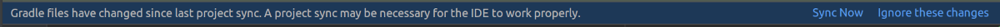

:doctitle: Interact with a database in your project
:description: You'll learn about the fundamentals of using Room, including the database class, the DAO, entities, and view models.
:keywords: Android, database, room
:author: Guillaume EHRET - Dev-Mind
:revdate: 2018-09-24
:category: Android, Kotlin
:teaser:  You'll learn about the fundamentals of using Room, including the database class, the DAO, entities, and view models.
:imgteaser: ../../img/training/environnement.png

In this lesson, we will learn how to use a database in our application. For the moment we need an Internet connection to display data on our screens but we want to be able to display something when a user is offline or when the remote API is not able to respond.

image::../../img/training/android/android-use-room.png[width=800, align="center"]

Each Android phone has a local SQLite database. The Jetpack Room persistence library provides an abstraction layer over SQLite to make the interaction easier. Room can be viewed as the Hibernate of the Android platform. You have other libraries to do the same but Room has the advantage of being provided by the Google team.

== Configure Room in your project

1. Open *build.gradle (Module: Faircorp.app)*.
2. As Room uses annotations we need to configure Gradle to launch the kotlin annotation processor. For that you just have to add a new plugin id `kotlin-kapt`
+
[source,groovy,subs="specialchars"]
----
plugins {
    id 'com.android.application'
    id 'org.jetbrains.kotlin.android'
    id 'kotlin-kapt'
}
----
+
3. In the dependencies block, add 2 lines to load these given libraries
+
[source,groovy,subs="specialchars"]
----
implementation "androidx.room:room-runtime:2.4.3"
implementation "androidx.room:room-ktx:2.4.3"
kapt "androidx.room:room-compiler:2.4.3"
----
+
4. As you updated your gradle configuration, Android Studio display a message to synchronize your projet. Click on *Sync now*
+

