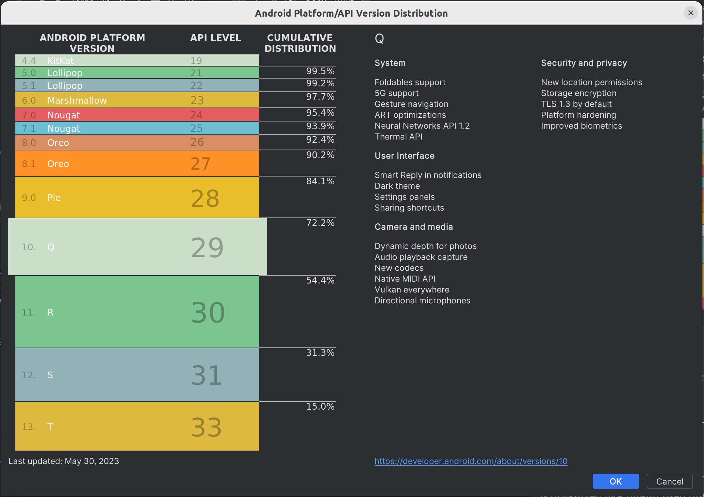

:doctitle: A first application in Android
:description: A tutorial to start Android development. In this example we develop an Hello World app
:keywords: Android
:author: Guillaume EHRET - Dev-Mind
:revdate: 2023-08-27
:category: Android
:teaser: A tutorial to start Android development. In this example we develop an Hello World app (EN)
:imgteaser: ../../img/training/android/android-course1.png
:toc:
:icons: font

The aim of this course is to learn you, how write a simple application for Android and how to run it on your phone.
To do that, we will develop with Kotlin language.
If you know Java, everything will be easier with Kotlin.

image::../../img/training/android/android-course1.png[Android course step1,width=800]

We have a limited number of lesson hours.
We will therefore quickly go over some concepts.
If you want to go deeper, you will find more informations in link:android-first-app.html#_resources[resource chapter]

The aim is to be able to develop a simple application to call a REST API developed in Java (Spring) to display building rooms and manage windows in these rooms. It is necessary to ventilate as much as possible rooms, but as winter approaches it will become important to heat the buildings to ensure user comfort .Windows should be open during and after classes, closed at night or in case of heavy rain or severe cold.

== Android studio

Android studio is the tool we use to write Android code.
You need to install it on your computer (installation requires 900MB) on https://developer.android.com/studio.

=== Installation

For a Linux installation you have to go in the installation directory (for me ~/appli) with a terminal and launch script `launch.sh`

[source,shell]
----
cd ~/appli/android-studio/bin
sh ./studio.sh
----

Follow the wizard and choose a standard installation.
It's important to do that to download the last version of Android SDK, recent images for Emulator...

After the installation, you should have this screen

If you want to cutomize the display and use the new UI you can

1. click on the customize section on the left
2. click on the link "All settings..."

image::../../img/training/android/firstapp/android-studio2.png[Follow wizard,width=700, align="center"]

=== Update

If you already have a version of Android Studio on your laptop, you should update Android Sdk.
For that go on menu *Tools > SDK manager*

Below on my example, I have 2 versions installed : Android 13.0 Tiramisu. Here I can choose the last version of the API

When you develop in Android you should always do it on the last SDK version.
Google requires you to always target this latest version when you publish apps to the official store. In our case we have to target the Tiramisu version (API level 34)

== Fundamental concepts

Android apps are built as a combination of components that can be invoked individually.
We have several kind of components

* *Activity* : an activity is the entry point for interacting with the user.
It represents a single screen with a user interface
* *Service* : a service is an entry point for keeping an app running in the background (app data synchronization, media player...)
* *Broadcast provider* : A broadcast receiver is a component that enables the system to deliver events to the app (low battery, screen rotation, dark mode...).
* *Content provider* : A content provider manages a shared set of app data that you can store in the file system, in a SQLite database, on the web, or on any other persistent storage location that your app can access.

In this course we will only manipulate activities.

After you will finish your first app, you can learn more about the other app components on the https://developer.android.com/guide/components/fundamentals[Google developper website].

Let's focus on activities.

When you click on your app's icon on your phone, you will launch the "main" activity.
This activity is often your home activity from which you will launch other activities.

An activity interact with an XML resource file where your view content is defined.
Android allows you to provide different resources for different devices.
For example, you can create different layouts for different screen sizes.
The system determines which layout to use based on the screen size of the current device.

Note that there is also another important concept in Android development with the https://developer.android.com/guide/fragments?hl=en[fragements]. A Fragment represents a reusable portion of your app's UI. A fragment defines and manages its own layout, has its own lifecycle, and can handle its own input events. Fragments can't live on their own. They must be hosted by an activity.

== icon:flask[] : A first example

In this lab, you will learn how create a new Android project with Android Studio

1. Launch Android Studio. If you need to install it see you on the http://localhost:8080/training/android/android-first-app.html#_android_studio[first chapter]
2. In the Welcome to Android Studio window, click Start a new Android Studio project. If you have a project already opened, select *File > New > New Project.*
+

+
3. Android Studio will initialize a new project with an activity.
It asks you to select a template for this activity.
In the *Select a Project Template window*, select *Empty Views Activity* and click Next.
+

+
4. In the `Configure your project` window, complete the following:
+

+
* Enter _automacorp_ in the *Name* field.
* Enter __com.automacorp __in the *Package name* field.
* If you'd like to place the project in a different folder, change its *Save location*.
* Select _Kotlin_ from the *Language* drop-down menu.
* Select the lowest version of Android your app will support in the Minimum SDK field.
A message indicates you on how many device your app will be available.
If you want to target more devices you can select a lower API version.
If you want to use last Android features you can select higher version.
You can click on *Help me choose* link to select the good API version
+

+
5. Click on *Finish* button.

After some processing time for code generation, the Android Studio main window appears.

== Most important files

Now take a moment to review the most important files.
https://developer.android.com/studio[Android Studio] is organized like https://www.jetbrains.com/idea/[IntelliJ], used during labs about Spring Framework. The core of these software are common and made by https://www.jetbrains.com/[Jetbrains].

First, be sure the Project window is open (select *View > Tool Windows > Project*) and the Android view is selected from the drop-down list at the top of that window.
This Android view let see you the main files of your Android project

You can then see the following files:

=== Manifest file

*File :* *_app > manifests > AndroidManifest.xml_*

Manifest file is a kind of id card for your project.

The manifest file describes essential information about your app to the Android build tools, the Android operating system, and Google Play.

All activities must be defined inside and one of them will be defined as entry point for your app (with an intent filter).

[source,xml,subs="none"]
----
 <activity android:name=".MainActivity" android:exported="true">
    <intent-filter>
        <action android:name="android.intent.action.MAIN" />
        <category android:name="android.intent.category.LAUNCHER" />
    </intent-filter>
</activity>
----

=== Activity

You can see 3 packages `com.automacorp` in Android view.

* The first one (not suffixed) contains all your Kotlin files used to write your app and our first activity
* The second (suffixed with androidTest) contains test files executed to test your app on a device or on an emulator.
* The last one (suffixed with test) contains unit test files used to control your code locally at each build

Unfortunately we don't have enough time to see how to write these tests during our labs.

But be aware that if you want to create a sustainable application, testing is the best way to limit regressions and make it easier to manage your application over time.

You can find more information about tests https://developer.android.com/training/testinghere[here].

*File :* *_app > java > com.automacorp > MainActivity_*

This is the main activity and it's the entry point for your app.

When you build and run your app, the system launches an instance of this Activity and loads its layout.

Each activity (as each components in Android) has a lifecyle and you can interact at each step (ie you can overload a method to add a behavior or some code in a lifecycle phase).

For example in `MainActivity`, we declare the XML resource file where your view content is defined (`R.layout.activity_main`)

[source,kotlin,subs="none"]
----
class MainActivity : AppCompatActivity() {
     override fun onCreate(savedInstanceState: Bundle?) {
          super.onCreate(savedInstanceState)
          setContentView(R.layout.activity_main)
     }
}
----

NOTE : directory is named java to assure compatibility with old projects or libs written in Java but don't be afraid we will use Kotlin :-)

=== Resource files

Resources are the additional files and static content that your code uses, such as images, screen definitions, strings used in interfaces, styles, animation instructions, and more.

image::../../img/training/android/firstapp/android-resource1.png[Android resource, width=800, align="center"]

You can provide alternative resources for specific device configurations, by grouping them in specially-named resource directories.

At runtime, Android uses the appropriate resource based on the current configuration.

For example, you might want to provide a different UI layout depending on the screen size or different strings depending on user language. In this case you will have a default file `app/src/main/res/values/string.xml` and a specific file for France `app/src/main/res/values-fr/string.xml`

*File :* *_app > res > layout > activity_main.xml_*

This XML file defines the layout for the activity's user interface (UI).

Defining the content of a view is like placing widgets (View) in layouts (ViewGroup)

In the following example, we use a constraint layout. It contains a TextView element with the text "Hello, World!"

[source,xml,subs="none"]
----
<?xml version="1.0" encoding="utf-8"?>
<androidx.constraintlayout.widget.ConstraintLayout xmlns:android="http://schemas.android.com/apk/res/android"
 xmlns:app="http://schemas.android.com/apk/res-auto"
 xmlns:tools="http://schemas.android.com/tools"
     android:layout_width="match_parent"
     android:layout_height="match_parent"
     tools:context=".MainActivity">

    <TextView
        android:layout_width="wrap_content"
        android:layout_height="wrap_content"
        android:text="Hello World!"
        app:layout_constraintBottom_toBottomOf="parent"
        app:layout_constraintLeft_toLeftOf="parent"
        app:layout_constraintRight_toRightOf="parent"
        app:layout_constraintTop_toTopOf="parent" />

</androidx.constraintlayout.widget.ConstraintLayout>
----

We will see later how to update or create a new layout and include inside widgets

=== Gradle file

*File :* *_Gradle Scripts > build.gradle_*

There are two files with this name:

* one for the project, *Project: automacorp*, and
* one for the app module, *Module: app*

Each module has its own *build.gradle.kts* file, but this first project currently has just one module.

If you need to use external libraries you can, and you need to declare them in *build.gradle.kts (Module: app)*.

You can also configure the `android` plugin (APi version, SDK version).The `defaultConfig` block is important. This is where you have to define

- the min sdk used by the phone that uses your app
- the target sdk used for the compilation. It's important to use the highest value
- your code version and the version name. If you need to publish your app on the Google store this number must be incremented at each release.

[source,kotlin,subs="none"]
----
android {
   namespace = "com.automacorp"
    compileSdk = 33

    defaultConfig {
        applicationId = "com.automacorp"
        minSdk = 29
        targetSdk = 33
        versionCode = 1
        versionName = "1.0"

        testInstrumentationRunner = "androidx.test.runner.AndroidJUnitRunner"
    }

    buildTypes {
        release {
            isMinifyEnabled = false
            proguardFiles(
                getDefaultProguardFile("proguard-android-optimize.txt"),
                "proguard-rules.pro"
            )
        }
    }

    compileOptions {
        sourceCompatibility JavaVersion.VERSION_1_8
        targetCompatibility JavaVersion.VERSION_1_8
    }
    kotlinOptions {
        jvmTarget = '1.8'
    }
}
----

== Launch your application

In this part you will be able to launch your application on you phone or tablet. If you don't have a device on Android operating system, you can use the emulator embedded in Android Studio.

=== Configure a real Android device

You need to set up your phone

1. Connect your device to your development machine with a USB cable. If you developed on Windows, you might need to install https://developer.android.com/studio/run/oem-usb[USB driver] for your device.
2. You need to update your device to activate "Developer options"
+
* Open the *Settings app* on your device
* Select item *About phone*.
* Go to the bottom to *Build number* item
* Tap on this *Build number* seven times. You should see a message which says that you are now a developer.
* If you go back on *Settings app* and in *System* section you should see a new entry *Developer options*
* Tap on *Developer options* and scroll down to find and *enable USB debugging*.

Since few versions of Android, you can also pair your phone via your Wifi connection. Your laptop and your phone must use the same Wifi.

- On your laptop go in Android Studio running devices select and choose *Pair devices using Wifi*

- On your phone, in *Developer options*,  select *Wireless debugging* and *Pair using QR code* and scan the QR code. If everything is OK you should see

Now you are ready to run your app

=== Configure a virtual device

When you install Android Studio the first time, an AVD (Android Virtual Device) is also installed to simulate a phone. A virtual device is a configuration that defines the characteristics of an Android phone, tablet, Wear OS, Android TV, or Automotive OS device. It's very useful to test an app for every kind of device.

You can add, update or delete your virtual devices on the AVD. Open menu  *Select Tools > Device Manager.*. You can also access this window through a side tab.

If you click on *Create Virtual Device*, at the bottom of the AVD Manager dialog you will be able to create a device. You can choose device type (TV, phone, auto...), its configuration (OS version, density, size...)
The Select Hardware page appears.

For more informations you can read https://developer.android.com/studio/run/managing-avds#createavd[this article]

=== Run your app

Everything is now ready to test your project.

1. In toolbar, select your app from the run/debug configurations drop-down menu.
2. From the target device drop-down menu, select the AVD or the device, that you want to run your app on.
3. Click on Run button

If everything is OK you should see your first app. It is very simple and not very pretty but we do better in the next chapter

To analyze errors you can open the run console on the bottom. This window contains messages send when app is launched with Gradle

You also can open Logcat view to see logs send by your device or the emulated device

== Resources

About Android you can read

* https://developer.android.com/[Android developer website] : you will find all resources about Android.
* https://developer.android.com/courses/kotlin-android-fundamentals/toc[Codelabs] : you can find more detailed examples in these codelabs created by Google training team

You can find resources on Kotlin

* https://dev-mind.fr/blog/2019/kotlin_et_android.html[Kotlin and android] : my blog post is in French but it explains why Google prefers today Kotlin to Java
* https://play.kotlinlang.org/byExample/overview[Learn Kotlin by examples] : you can read documentation and test your code online
* https://kotlinlang.org/[Official website] documentation about this language
* https://developer.android.com/kotlin[Google developpers site for kotlin]: several resources on how use Kotlin to create an Android application

