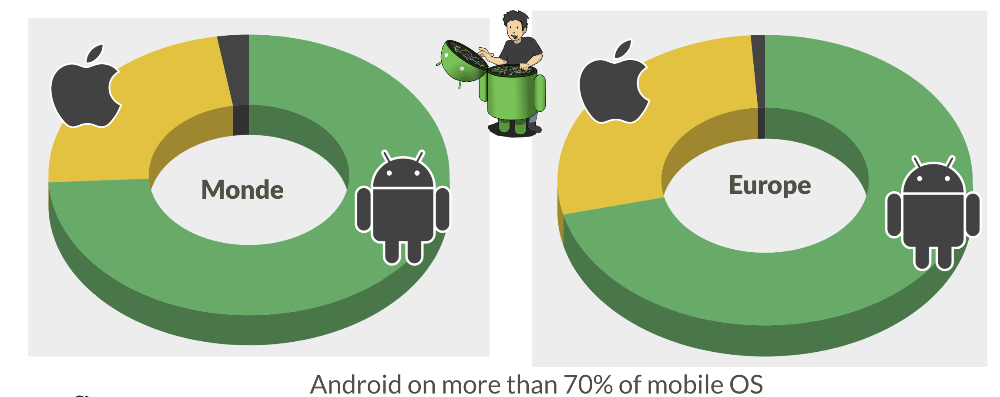
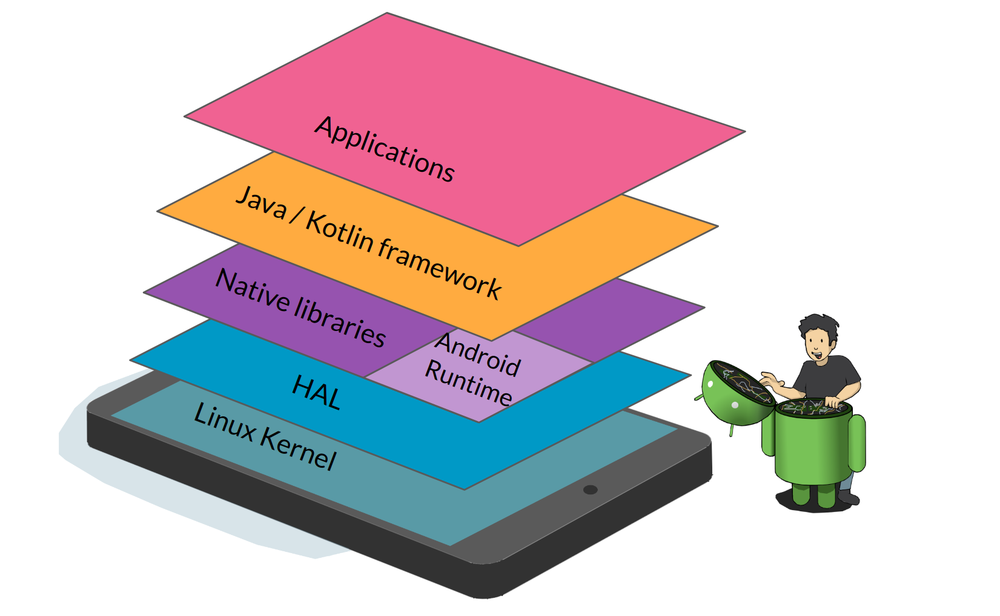
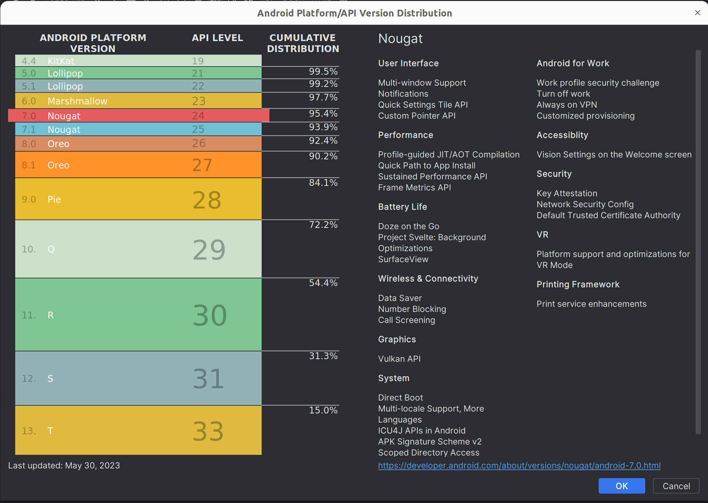
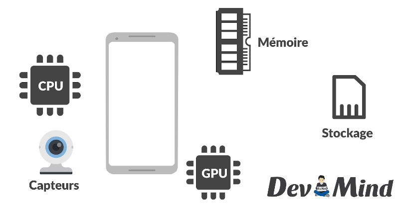

:doctitle: Android platform
:description: A tutorial to start Android development. In this example we develop an Hello World app
:keywords: Android
:author: Guillaume EHRET - Dev-Mind
:revdate: 2023-08-26
:category: Android
:teaser: A tutorial to start Android development. In this example we develop an Hello World app (EN)
:imgteaser: ../../img/blog/2019/android_pf_00.png
:toc:
:icons: font

To understand the specifics of Android development it is important to understand how the platform was built

== Android ecosystem

=== Android the most used OS

There are two major players in the mobile world: Apple (iOS) and Google (Android).

Android is today the most used mobile OS in the world.

Nearly https://gs.statcounter.com/os-market-share[70% of users] in Western countries use this platform. In Africa or Asia, Apple's pricing policy means that Android market shares are even stronger and continue to climb.

Doing mobile programming still has an interest. Access to IT (web or other) is increasingly done with https://gs.statcounter.com/platform-market-share/desktop-mobile-tablet[mobiles and tablets].

Android has become the https://gs.statcounter.com/os-market-share[most used OS] worldwide for all systems combined.

image::../../img/training/android/intro/os_market.png[Android vs other OS,width=800]

=== Principle of mobile programming

Mobility has transformed the devices we used. When you are on a desktop PC or a laptop you always have approximately the same components: CPU, graphics card, hard drive, photo card reader, input/output ports.

On a mobile you will have more components to help you in this context of mobility: GPS, camera, accelometer, pedometer... We have more and more sensors to interpret the context of use of the device

The price of a device depends on the number and quality of all these sensors. Today Android is present everywhere

And you have different versions of Android. One for each platform

==== When use native programming

The specificity of mobile programming is to offer applications that recover and aggregate the data emitted by the different sensors to meet a user need. When you want to interface with these sensors, bring responsiveness to your applications, native development is the solution.

==== When use web programming

Creating a mobile app to display static content doesn't make sense. For this need, we will prefer responsive web applications (PWA) which are much more optimal and less expensive. A native application must be dynamic and take advantage of the APIs and sensors exposed by the devices. And today web APIs offer solutions for interacting with a device's sensors.

==== Combine the two worlds

Today there are solutions to develop once and deploy either on the web or native code on Android or Ios. https://flutter.dev/[Flutter], for example, is widely used today. In the Android world Google is working with Jetbrains on https://developer.android.com/jetpack/compose[Jetpack compose] which will allow the same thing via a Kotlin API.

== Android platform

Here is a simplified image of the Android platform

=== Linux kernel

Android was built on a https://www.kernel.org/[Linux kernel]. But Android is not completely Open Source. Only a little https://source.android.com/[part] is free of rights.

Android draws on the strengths of Linux to provide a stable and reliable OS: memory management, process management, security, etc.

And thanks to Android, Linux is the most used OS in the world :-)

=== Hardware abstraction layer (HAL)

Android offers a virtual machine to execute bytecode. This is not a classic JVM. Google engineers tried to work on bytecode with a smaller memory footprint.

In Android the compiler will create `.dex` files (Dalvik executable). Dalvik was the first compiler used on the platform. Like current JVMs, Dalvik transformed bytecode into machine language at runtime: Just In Time (JIT) compilation.

Today this virtual machine has been replaced by ART (Android Runtime). The transformation into machine language is done when the application is installed: AOT (ahead of time) compilation. As the bytecode is compiled into machine language earlier, applications launch faster and the CPU is less required during execution (and therefore preserves your battery).

I deliberately misused language by indicating that the bytecode was transformed into machine language. This is not really the case. If we really had machine language we would no longer need a VM.

In fact during installation the bytecode is transformed into an intermediate format: .oat files (ahead of time). The VM is necessary because it will manage memory allocations and freeing up space with the Garbage collector. Even if compilation is no longer Just In Time, optimizations are still made at runtime so that the code executes as quickly as possible.

You can find more information in the https://source.android.com/docs/core/runtime[documentation].

=== Kotlin Language

In 2017 a big announcement was made at Google IO. The Kotlin language became the second reference language for developing applications. 2 years later 50% of developers use Kotlin and Google announced at Google I/O 2019 that the platform was becoming Kotlin-first. They recommend starting new developments in Kotlin.

Developing today on Android with the Java language is very painful, because you have a lot of tedious code to write.

=== Development tool and IDE

Initially the recommended development studio was Eclipse but the more features were enriched, the longer the IDE took and became unusable. Google therefore worked in partnership with JetBrains (publisher of Webstorm, IntelliJ, Kotlin) to adapt their Open Source version and create Android Studio .

You will find inside this IDE all the functionalities necessary for development. You have utilities for

* check your code
* manage different versions of the Android SDK
* launch a virtual device on your machine to manually or automatically test your code
* monitor and debug your application
* package your application in order to publish it on the Google store

=== Security

As Android is based on a Linux kernel, the platform benefits from security implemented at the kernel level.

When an application is installed, Android assigns it an user ID. Each application is launched in a separate process and uses its own ART virtual machine. Execution rights are specific to this application user. The application has no idea of ​​this ID. So an application cannot access the data of another application because everything is closed by this device. The same goes for native apps.

Each application is therefore isolated from the others and has its own CPU, memory, etc. resources.

On top of this "low level" security, Android has added a more "high level" level of security over time. Each external action that can be requested by your application must be declared in a manifest file. For example

* read contacts,
* to take a picture,
* access the Internet
* ...

A user can choose to leave the requested rights to the installation, but he can also choose to remove certain rights. Personally I limit the number of applications that can connect to the network, can use my contacts, my files, etc.

== Fragmentation

Fragmentation is a real problem on the platform and as a developer you will have to make choices based on your target user.

Android is an OS that can be used by any phone manufacturer. As I said above, the cost of adapting a version to a device is not negligible. This is why manufacturers limit these updates. Their interest is to sell new devices and not to maintain them.

Fragmentation is not only linked to OS versions but we also have fragmentation linked to devices and their components. Depending on the price range, each device may have different technical characteristics.

=== Fragmentation on the OS versions

For several years, Google has released a new version of Android per year. Typically developers can start testing and providing feedback in the second and third quarters and the release is made available in the last quarter of a calendar year.

Each new version is associated with a letter (which increments with each version) and a dessert (chosen by the Android team). The dessert is often a french dessert. Since the beginning, the Android team has included several French people.

When you start a new development you must make a version choice. In fact you have to make two choices

* define a target version: generally you should always choose the latest version of the OS
* define a minimum version: you define the minimum version of the OS supported. The compiler is able to alert you when you try to use an API that is not supported

Version usage statistics are published regularly on https://developer.android.com/about/dashboards[this dashboard], which compiles the data reported by Google Store (the official source of Android applications).

In the web world, you can use polyfills to use the latest features of the language in browsers that do not yet implement these features. In the Android world, Google also suggests using specific objects that manage this backward compatibility. The base class for developing a screen is `android.app.Activity`, but in practice we will always use `androidx.appcompat.app.AppCompatActivity`, which was developed to port the latest news to old Android releases. This is the same thing for all main objects.

=== Screen-level fragmentation

After versions, the biggest difference between devices concerns screen quality and size.

As a reminder

* The *resolution* of a screen represents the number of horizontal pixels multiplied by the number of vertical pixels. For example (800 x 600)
* the *size* of a screen is the number of inches of the diagonal of the screen

Android offers a classification linked to the width of a screen.

As in the web world, you must adapt your UI either by using components and resizable layouts, or by using different layouts depending on the size (in Android you can use fragments)

*Pixel density* is the number of dots per inch (dot per inch ⇒ dpi). Density is important on a device. For example, if you display an image expressed in pixels on 2 screens of different density, you will not have the same rendering.

If we display the same images expressed with the *dp* unit (density-independent pixels) you will have the following result

The rule is to *never express sizes in px in an application but always in dp* (in the web world we will use the em unit). To express the size of the fonts, you will instead use the unit sp (scalable pixels) which has the advantage of increasing depending on the user accessibility settings.

You will be able to create different resources depending on the size. When you have a nice screen with good resolution and high density, you will expect quality images. These same images have no interest on screens that are not capable of displaying them.

=== Fragmentation at the hardware level

We have focused on the 2 biggest differences between devices but we could go further because you also have a big difference in quality and performance in terms of the basic components of a mobile or tablet. You do not have the same components in entry-level devices and more luxurious ones

To provide a good user experience, you can apply a few simple rules

As your users can and most have limited resources try to

* limit network calls which consume a lot of resources and therefore use up the battery,
* ensure that you have a deliverable of a reasonable size. If you integrate a lot of images make several archives with different targets depending on the quality of the devices
* avoid storing too much data on your users' phone (either on disk or in the shared database). If you must store items, plan to purge unnecessary items
* favor dark UIs which preserve the battery
* apply the KISS principle (keep it simple, stupid)
* ...

== Conclusion

We have just seen how the platform was built and the problems related to fragmentation. In the next course we will get down to business and look at how to develop a first Android application.

If you are interested in the platform, I advise you to follow a few enthusiasts (Googlers or not): Chet Haase, Jake Wharton, Romain Guy, Cyril Mottier

If you want more information you can consult https://developer.android.com and if you are a fan of podcasts in French I advise you to follow http://androidleakspodcast.com/
