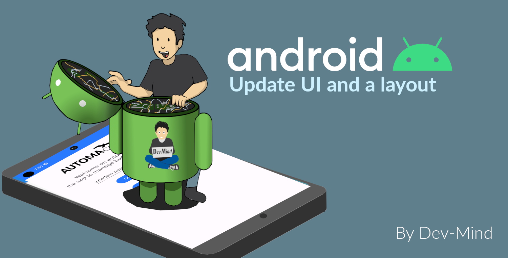

:doctitle: Update UI and refactor welcome layout (EN)
:description: In this lesson we will update the main layout to create a welcome screen (EN)
:keywords: Android
:author: Guillaume EHRET - Dev-Mind
:revdate: 2021-10-01
:category: Android
:teaser: In this lesson we will update the main layout to create a welcome screen  (EN)
:imgteaser: ../../img/training/android/android-course2.png
:toc:

In this lesson, you will learn how to update a layout with Android Studio

== User interface

User interface for an Android app is built as a hierarchy of layouts and widgets.

* The layouts are *ViewGroup objects*, containers that control how their child views are positioned on the screen.
* Widgets are *View objects*, UI components such as buttons and text boxes.

In this new codelab you will update the `hello world` page to create a home page with a welcome message, an image, an edit text and a button.

image::../../img/training/android/android-example.png[First view example]

Android provides an XML vocabulary for ViewGroup and View classes, and your UI is defined in XML files.Don't be afraid Android Studio provide a wysiwyg editor.

== Android Studio Layout Editor

In the Project window, open *app > res > layout > activity_main.xml*. Editor should be displayed

image::../../img/training/android/android-studio-layout.png[Android Studio Layout Editor]

1. View mode: View your layout in either code mode (XML editor), Design mode (design view and Blueprint view), or Split mode icon (mix between code and design view)
2. Palette: Contains various views and view groups that you can drag into your layout.
3. Design editor: Edit your layout in Design view, Blueprint view, or both.
4. Component Tree: Shows the hierarchy of components in your layout. It is sometimes useful to select a given widget
5. Constraint widget : Helps to place an item in relation to those around it
6. Attributes: Controls for the selected widget's attributes.
7. Layout Toolbar: Click these buttons to configure your layout appearance in the editor and change layout attributes as target phone, orientation, light, locale...
8. Widget Toolbar: Click these buttons to align your view. Button with red cross is useful to clear all widget constraints

== Update home page

For the moment our page contains only one readonly text field.

1. Select it and delete it with *Suppr* key
2. We will add an image. Copy this xml file link:../../ic_logo.xml[ic_logo.xml] in your directory *_res > drawable*. This file is a vector drawable image. Directory *drawable* contains all your images. Several formats are available (png, jpg...) but the most optimized is a https://developer.android.com/guide/topics/graphics/vector-drawable-resources[Vector drawable]
3. In *Common Palette* on the left of the screen click on *ImageView* and drag into your layout. A window is opened to select an image. You will choose the imported image *ic_logo.xml*
4. Click on *OK* button to import image in your layout
5. We will use the *blueprint view* to add constraint to this image, to place it on the top of the screen and define a height. See video below for more detail
+
video::1ogCfYm9_DA[youtube, width=600, height=330]
+
6. We will add a new readonly text below image to introduce our app. In common palette select a *Textview* widget and drag into your layout.
7. In blueprint view you can add constraints to this textview
+
* *text* : _Welcome on faircorp\n the app to manage building windows_
* *layout_width* and *layout_height* : _wrap_content_
* *textSize*: _18 sp_
* *gravity* : _center_
* margin right and left 16dp, margin top 32dp
+
video::so6D7SFDYss[youtube, width=600, height=330]
+
8. In *text palette* select a *Plain Text* widget (editable text view) and drag into your layout below your welcome message. This widget should have these properties
+
* *hint* : _Window name_. This text will be displayed as long as the user has not entered anything else.
* *id* : _txt_window_name_ Android always generate a random name to each widget or layout. Id can be used later in your Kotlin code. It's a good practice to use an explicit name as id
* Apply a top, left margins and use constraint to place this widget below your welcome message
+
9. In *common palette* select a *Button* widget and drag into your layout below your welcome message. This button should have these properties
+
* *hint* : _Open window_.
* *id* : _btn_open_window_
* Apply a top, right and left margins and use constraint use constraint to place this widget below welcome message and on the right of your plain text widget
+
10. Click on Run button to test your app (see chapter link:android-first-app.html#_run_your_app[Run your app])
+
video::l4CyARSHtDQ[youtube, width=600, height=330]

== Layout errors and strings

When something is wrong, Android Studio add a warning or an error button on the right of the editor toolbar

image::../../img/training/android/layout_error.png[Layout error]

1. Click on this button to see different problems (a window is opened on the bottom of your screen).
2. You can double click on an item to see the problem and have an explaination. Android studio display also a Fix button to help you to resolve problem
3. You added a Text Field and a text inside. As your application can be used by different people who speak different languages, you should always use text internalization mechanisms provided by Android.

Open the Project window and open file *app > res > values > strings.xml*.
This is a string resources file, where you can specify all of your UI strings. It allows you to manage all of your UI strings in a single location, which makes them easier to find, update, and localize. For the moment you have only one text inside, your app name.

[source,xml,subs="none"]
----
<resources>
    <string name="app_name">Faircorp</string>
</resources>
----

You can launch https://developer.android.com/studio/write/translations-editor[Translations Editor], to add or edit text for different languages. In this lab we will use only one language. You can update this file to have a text description for our logo, and the text content for our welcome message

[source,xml,subs="none"]
----
<resources>
    <string name="app_name">Faircorp</string>
    <string name="app_logo_description">Faircorp logo</string>

    <string name="act_main_windowname_hint">Ligth name</string>
    <string name="act_main_welcome">Welcome on faircorp,\n the app to manage building windows</string>
    <string name="act_main_open_window">Open window</string>
</resources>
----

You can now update your layout and yours components to add a string reference for image description and welcome message. To make a reference to a String you have to use the prefix *@string/* followed by the string key

video::a_bwuQvKRTU[youtube, width=600, height=330]

== Launch action on button click

An activity is always associated with a layout file. In link:android-update-ui#_lab_2_update_home_page[Lab 2] we have updated our main activity layout with a logo, a welcome message and a button.  In this lesson, you add some code in *MainActivity* to interact with this button.

1. In the file *app > java > com.faircorp > MainActivity*, add the following openWindow() method stub:
+
[source,kotlin,subs="none"]
----
class MainActivity : AppCompatActivity() {
    override fun onCreate(savedInstanceState: Bundle?) {
        super.onCreate(savedInstanceState)
        setContentView(R.layout.activity_main)
    }

    /** Called when the user taps the button */
    fun openWindow(view: View) {
        // Extract value filled in editext identified with txt_window_name id
        val windowName = findViewById<EditText>(R.id.txt_window_name).text.toString()
        // Display a message
        Toast.makeText(this, "You choose $windowName", Toast.LENGTH_LONG).show()
    }
}
----
+
You might see an error because Android Studio cannot resolve *View*, *Toast* classes or *R*. To clear errors, click the *View* declaration, place your cursor on it, and then press *Alt+Enter*, or *Option+Enter* on a Mac, to perform a Quick Fix. If a menu appears, select *Import class*. Do the same thing for *Toast* and *R* classes. *R* class contains a link to all ressources defined in your app.
+
2. Return to the *activity_main.xml* file and select the button in the Layout Editor.  In Attributes window, locate *onClick* property and select *openLight [MainActivity]* from its drop-down list.
+
3. You can now relaunch your app,
+
* In window name editext fill a name
* Click on the button you a message should be displayed on the bottom of the screen with the ligt name filled

==  Update app color scheme [optional]

As for a web page, you can define a style theme when you develop an Android application. The main them is defined in **app > manifests > AndroidManifest.xml**

By default `@style/AppTheme` follow https://material.io/[material design] specification.
[source,xml,subs="none"]
----
<application android:allowBackup="true"  android:icon="@mipmap/ic_launcher"
             android:label="@string/app_name" android:roundIcon="@mipmap/ic_launcher_round"
             android:theme="@style/AppTheme">
</application>
----

This theme is based on 3 main colors defined in a color resource file

*File :* *_res > values > colors.xml_*

[source,xml]
----
<resources>
    <color name="colorPrimary">#6200EE</color>
    <color name="colorPrimaryDark">#3700B3</color>
    <color name="colorAccent">#03DAC5</color>
</resources>
----

1. Go on https://material.io/design/color/the-color-system.html#tools-for-picking-colors[Material color tool] to defined your own app color combination. You define your prmiary color and the tool  is able to compute complementary color
+

+
2. Use for example *1E88E5* for primary color. The new corresponding color scheme will be
+
[source,xml]
----
<resources>
    <color name="colorPrimary">#1E88E5</color>
    <color name="colorPrimaryDark">#0d47a1</color>
    <color name="colorAccent">#e57b1e</color>
</resources>
----
+
3. Run your app to see the new app rendering

