:doctitle: Deploy your webapp on Clever Cloud (EN)
:description: Deploy your webapp on Clever Cloud (EN)
:keywords: Gradle, Spring
:author: Guillaume EHRET - Dev-Mind
:revdate: 2018-11-18
:category: JAva
:teaser: Deploy your Spring Boot webapp on Clever Cloud (EN)
:imgteaser: ../../img/training/clever-cloud.png

== Clever Cloud

Clever cloud is a platform designed by developers for developers.

image::../../img/training/clever-cloud.png[]

You Write Code.They Run It.

When you write code, you push sources on Github.Clever Cloud is able to install your Github app

Sign in on https://github.com/ with your account.If you haven't an account you have to create one

When you are connected, you can create a new account on https://www.clever-cloud.com/en/

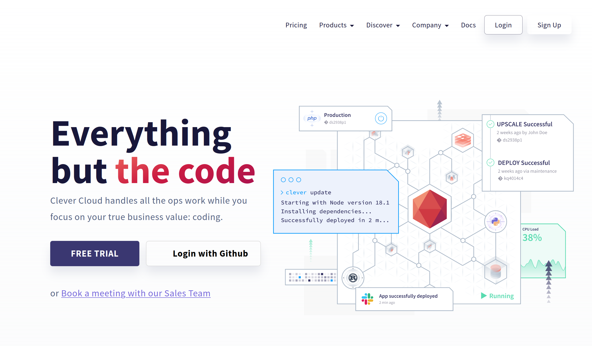

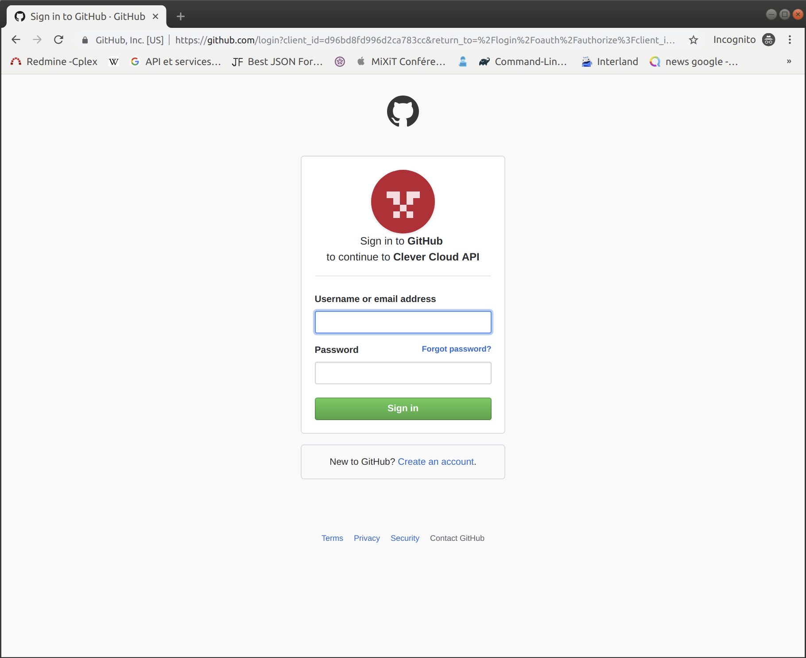

> It's important to create your account from your Github account.*When you account is created send me your email and I will add you on the common repository*.When you will receive a confirmation email, click on "Join CoursEmse2020" Button

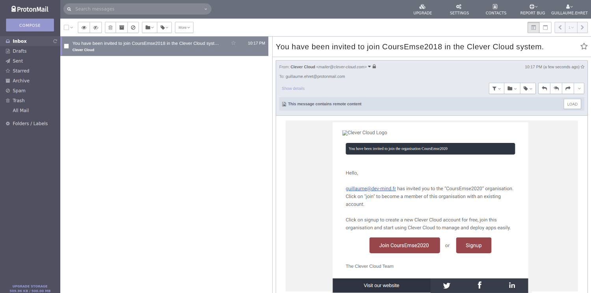

[.small]#EMSE space will be added on your clever cloud environment#

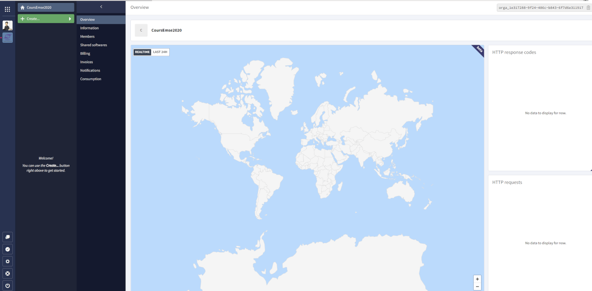

Before this deployment you have to create a folder called "*clevercloud*" in your Spring Boot project

Inside, add a file `gradle.json`.This file will contain

[source,java, subs="specialchars"]
----
{
  "build": {
    "type": "gradle",
    "goal": "assemble"
  },
  "deploy": {
    "jarName": "./build/libs/faircorp-0.0.1-SNAPSHOT.jar"
  }
}
----

To know the name of your jar go on folder `./build/libs/`.Push your last changes on your Github repository.Fot the moment, Clevercloud used only Github

You are ready to deploy your app in Clever Cloud.Open https://console.clever-cloud.com/organisations/orga_1e317288-9f24-486c-b843-6f7d6e311917[EMSE Clever Cloud space]

Click on button called *"Create..."* and select *"an application"*.This application will be generated from your Github repository.Select the project to deploy

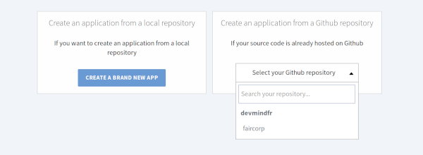

You have to choose the kind of your application.For a Spring Boot application it will be a *Java or Groovy + Gradle* application

The next step is to choose the type and the number of your server.With our free plan you must keep the default configuration and click on *Next* button.But in real life you can choose the power and the number of servers.More your server will be powerful more the price is expensive

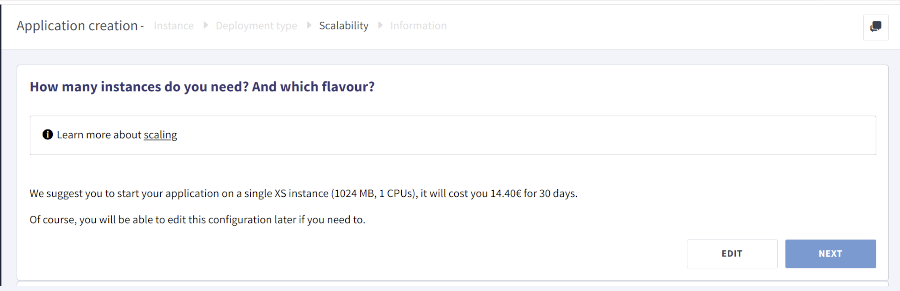

You have to use a specific name.It's important when you have several apps.In our case you have to use `*faircorp-firstname-lastname*`.You must also select in which zone of the world your application will be deployed (you can only select France in this lab).

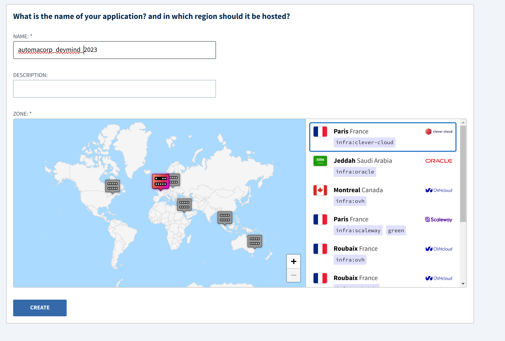

In the next step you can choose if you need a add-on as a database.We don't need to install a database because your app use an embedded H2 database.Click on *I don't need any add-ons* button

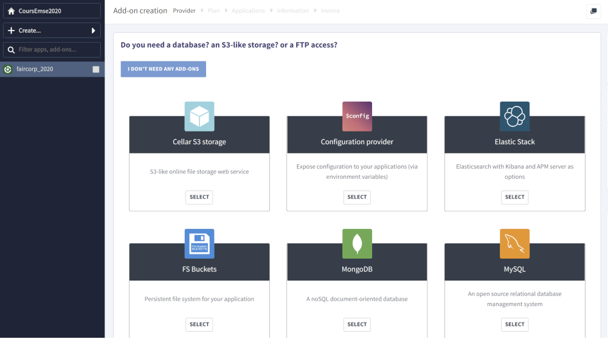

You can define environment variables.It's not very important in our example.You can click on the *Next* button

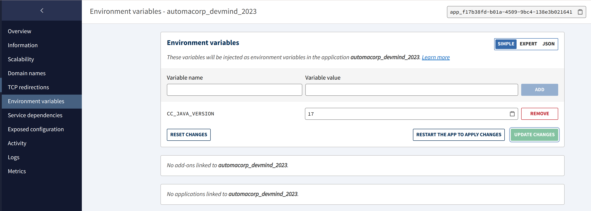

Installation starts and you have to wait several minutes.

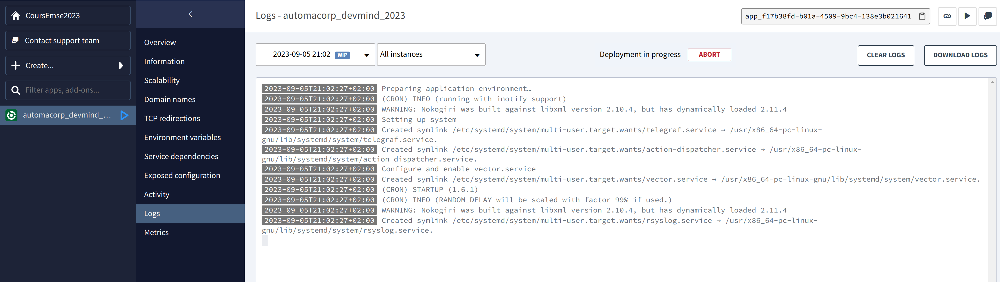

You can explore different section to update your parameters

* Overview : contains buttons to reinstall your app and the link to access to your app
* Information
* Scalability
* Domain names : helps to personalize the URL of its application or parameter its own domain main
* Environment variables
* Service dependencies
* Exposed configuration
* Activity
* Logs if deployment fail you have to go in this section to find the error
* Metrics

Define a custom URL to access to your application and click on the star to use it by default

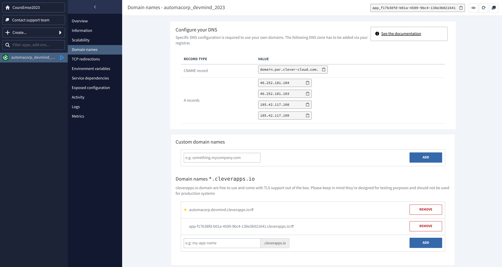
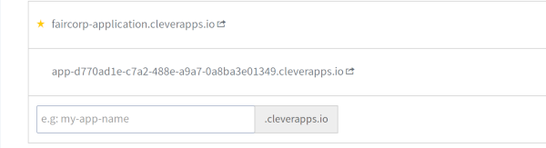

Now you can use your app deployed on the Internet.This app will be automatically redeployed, when you will push a new commit on Github.If you have done previous lessons, you should open http://[yourname].cleverapps.io/swagger-ui/index.html

If you are on Windows you can have this error

----
2020-11-23T13:58:00+01:00 A gradlew script has been found. Let's use it.
2020-11-23T13:58:01+01:00 /home/bas/rubydeployer/scripts/build-java.sh: line 9: ./gradlew: Permission denied
2020-11-23T13:58:01+01:00 Build failed
----

To fix it you can follow https://medium.com/@akash1233/change-file-permissions-when-working-with-git-repos-on-windows-ea22e34d5cee[this article].Or execute this command

----
git update-index --chmod=+x gradlew
git push origin main
----
