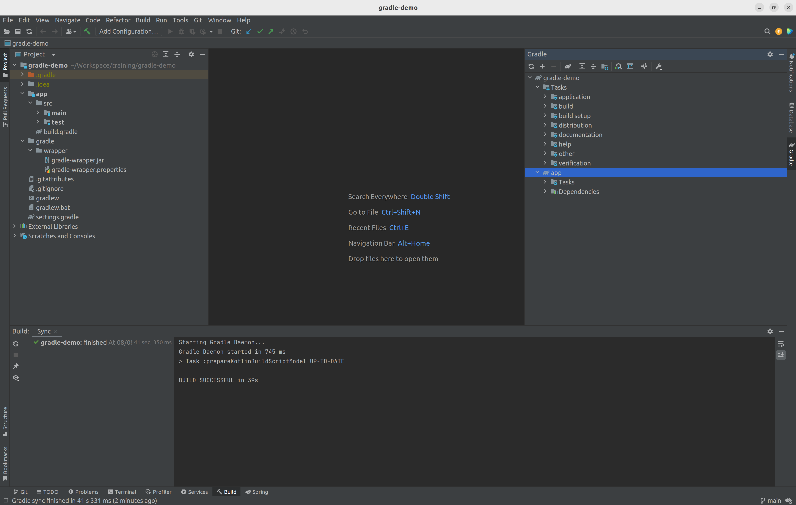
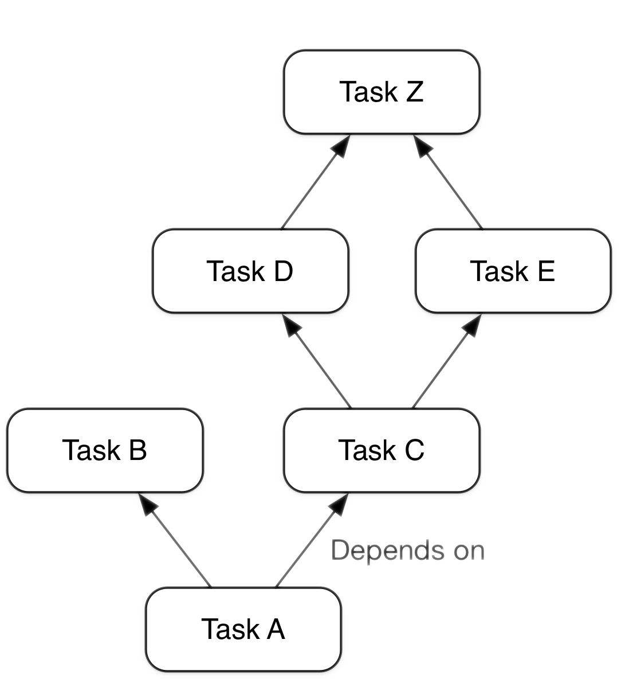
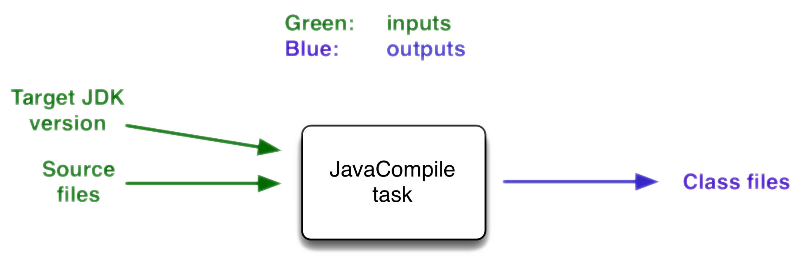
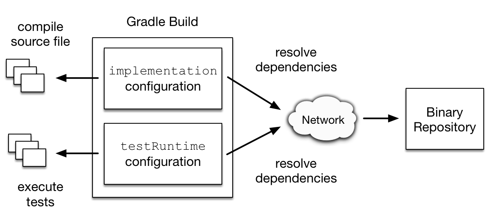
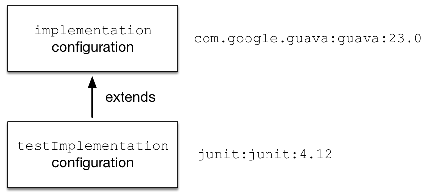

:doctitle: Gradle in practice (EN)
:description: Comment construire une application Java interfacée à une base de données et exposant des services REST
:keywords: Gradle
:author: Guillaume EHRET - Dev-Mind
:revdate: 2021-08-02
:category: Web
:teaser: In this training, we will learn how Gradle works and how use it in our projects. It's just a fast presentation of this tool and you will find more informations on official website.
:imgteaser: ../../img/training/gradle.png
:toc:

In this training, we will learn how Gradle works and how use it in our projects.
It's just a fast presentation of this tool, and you will find more informations on official website https://docs.gradle.org/current/userguide/userguide.html

image::../../img/training/gradle.png[Gradle by Dev-Mind, width=800, align="center"]

Gradle is an open source tool for automating the build of your Java, Kotlin, Android, Web projects... This tool is like Ant and Maven.

Gradle has the Ant flexibility and apply many Maven conventions.
Maven helps to build only one project.
But Gradle was created to be more flexible, you can build several artifacts.
That's why the Android community has chosen this tool.

== Introduction

*Highly customizable* +
you have a convention but everything is customizable.
You can write your scripts in Groovy (default) or in Kotlin (default in the future)

*Fast / Incremental build / Cache / Parallel*  +
Incremental build : Gradle completes reuses outputs from previous executions, processing only inputs that changed, and executing tasks in parallel.

*Powerful* +
Gradle build projects in several languages but its success is linked to Android developers.

*Useful* +
Based on Ivy and supports Maven, it simplifies the project dependencies (libraries).You can use transitive dependencies

*JVM foundation* +
Gradle runs on the JVM and you must have a Java Development Kit (JDK) installed to use it. You can also use Gradle for native projects (Spring native, Quarkus)

*Extensibility* +
You can extend Gradle to provide your own task types, your own plugins or even your own build model. Android added for example many new build concepts such as flavors and build types.

*IDE support* +
Major IDEs allow you to import Gradle builds

== Why a build tool?

Write once, run everywhere

Build automation is the act of scripting or automating a wide variety of *tasks* that software developers do in their day to day activities such as:

- compiling program source code into binary code
- packaging a compiled program for distribution
- running automated tests
- deploying to production systems
- generating documentation and/or release notes.
- ...

== Usage

* In command line in a terminal
* In your IDE (development tools to write and execute code) [.small]#NetBeans, Eclipse or IntelliJ (we will use IntelliJ)#
* Online documentation is very complete https://docs.gradle.org/current/userguide/userguide.html

== Principle

* Gradle was not the first build tool.In the past we used https://ant.apache.org/[Ant] and after https://maven.apache.org/[Maven]
* https://ant.apache.org/[Ant] is very powerful, but the configuration is not readable and difficult to use on a project with a lot of people
* https://maven.apache.org/[Maven] is
** very verbose (you have to write a lot of XML)
** not very flexible (governance and execution)

== Lab : Starting with Gradle

You can install the last version on https://gradle.org/install/

Gradle runs on all major operating systems and requires only a Java JDK version 8 or higher to be installed.

To check, run java -version in a terminal on your laptop:

[source%autofit,bash]
----
$ java -version
openjdk version "11.0.15" 2022-04-19
OpenJDK Runtime Environment (build 11.0.15+10-Ubuntu-0ubuntu0.22.04.1)
OpenJDK 64-Bit Server VM (build 11.0.15+10-Ubuntu-0ubuntu0.22.04.1, mixed mode, sharing)
----

Open a terminal on your laptop or computer to create and initialize a new Gradle project.
You will create a directory and link it to Gradle

[source,shell]
----
mkdir gradle-demo
cd gradle-demo
gradle init
----

If you use version >7 you will have to respond to few questions

[source,shell]
----
Select type of project to generate:
1: basic
2: application
3: library
4: Gradle plugin
Enter selection (default: basic) [1..4] 1

Select build script DSL:
1: Groovy
2: Kotlin
Enter selection (default: Groovy) [1..2] 1

Generate build using new APIs and behavior (some features may change in the next minor release)? (default: no) [yes, no]                                       yes

Project name (default: demo):
----

You should have this message after

[source,shell]
----
> Task :init
Get more help with your project: Learn more about Gradle by exploring our samples at https://docs.gradle.org/7.5/samples

BUILD SUCCESSFUL in 56s
2 actionable tasks: 2 executed

----

Gradle should have generated this tree

[source,shell]
----
|-- build.gradle  (1)
|-- gradle
|   | -- wrapper
|       | -- gradle-wrapper.jar  (2)
|       | -- gradle-wrapper.properties  (3)
|-- gradlew  (4)
|-- gradlew.bat
|-- settings.gradle (5)
----

(1). Gradle configuration script for the project +
(2). This jar contains Gradle Wrapper classes and libraries +
(3). Wrapper configuration file +
(4). These scripts are used to launch Gradle via the wrapper (2 scripts, one for Unix one for Windows) +
(5). general configuration file (used to declare Gradle sub modules, and global variables)

== Gradle wrapper

When you use a build tool, all team members must use the same version. From one project to another, you can have different versions of the tool (it's difficult to maintain on your computer).

Gradle wrapper resolves these problems. The recommended way to execute any Gradle build is with the help of the Gradle Wrapper (in short just “Wrapper”). The Wrapper is a script that invokes a declared version of Gradle (it fixes the version used in your project), downloading it beforehand if necessary.

As a result, developers can get up and running with a Gradle project quickly without having to follow manual installation.

image::../../img/training/gradle/wrapper.png[width=800, align="center"]

[.code-height]
[source,shell]
----
$ ./gradlew -v
Downloading https://services.gradle.org/distributions/gradle-7.2-bin.zip
..........10%...........20%...........30%...........40%...........50%...........60%...........70%...........80%...........90%...........100%

------------------------------------------------------------
Gradle 7.2
------------------------------------------------------------

Build time:   2021-08-17 09:59:03 UTC
Revision:     a773786b58bb28710e3dc96c4d1a7063628952ad

Kotlin:       1.5.21
Groovy:       3.0.8
Ant:          Apache Ant(TM) version 1.10.9 compiled on September 27 2020
JVM:          11.0.11 (Ubuntu 11.0.11+9-Ubuntu-0ubuntu2.20.10)
OS:           Linux 5.8.0-63-generic amd64
----

== Lab : First example

Clone the Github project https://github.com/Dev-Mind/gradle-demo.git

Go in IntelliJ in the menu `File` → `New` → `Project From Existing Sources` and select the Gradle model

image::../../img/training/gradle/idea1.png[width=800, align="center"]

When everything is finished you have your project opened in your IDE with the Gradle configuration loaded.

You can browse the gradle files as in the tree below

[source,shell]
----
|-- app
|   | -- src
|      | -- main
|          | -- java
|          | -- resources
|      | -- test
|          | -- java
|          | -- resources
|   | -- build.gradle
|-- gradle
|   | -- wrapper
|       | -- gradle-wrapper.jar
|       | -- gradle-wrapper.properties
|-- gradlew
|-- gradlew.bat
|-- settings.gradle
----

Open the main file called `build.gradle`.
This is a Java project.
So we use the plugin provided by Gradle to manage an application written in Java.

[source,groovy]
----
plugins {
    // Apply the application plugin to add support for building a CLI application in Java.
    id 'application'
}

repositories {
    // Use Maven Central for resolving dependencies.
    mavenCentral()
}

dependencies {
    // Use JUnit Jupiter for testing.
    testImplementation 'org.junit.jupiter:junit-jupiter:5.7.2'

    // This dependency is used by the application.
    implementation 'org.springframework:spring-context:5.2.21.RELEASE'
}

application {
    // Define the main class for the application.
    mainClass = 'com.devmind.gradle.MyApplication'
}

tasks.named('test') {
    // Use JUnit Platform for unit tests.
    useJUnitPlatform()
}
----

You can now launch this command

[source,shell]
----
$ ./gradlew build
BUILD SUCCESSFUL in 7s
8 actionable tasks: 8 executed
----

Gradle executes tasks and in our case Java plugin has launched 8 tasks to build the project. As this is the first build you should have 8 executed task.

If you try to relaunch the same command you should have this output

[source,shell]
----
$ ./gradlew build
BUILD SUCCESSFUL in 517ms
8 actionable tasks: 8 up-to-date
----

You can observe the execution time. The 8 tasks are now executed in 517ms. As you changed nothing Gradle does not relaunch each task. All task have the status UP-TO-DATE

You can launch the `run` task to execute your app

[source,shell]
----
$ ./gradlew :app:run
> Task :app:run
I want to learn Gradle

BUILD SUCCESSFUL in 503ms
3 actionable tasks: 1 executed, 2 up-to-date
----

With IntelliJ, we have a synthetic view of dependencies and tasks

image::../../img/training/gradle/idea3.png[width=600, align="center"]

Now try to list all available tasks in a command window. Run

[.code-height]
[source,shell]
----
$ ./gradlew tasks --all
----

You should have this output

[.small]
[.code-height]
[source,shell]
----
$ ./gradlew tasks --all

> Task :tasks

------------------------------------------------------------
Tasks runnable from root project 'gradle-demo'
------------------------------------------------------------

Application tasks
-----------------
app:run - Runs this project as a JVM application

Build tasks
-----------
app:assemble - Assembles the outputs of this project.
app:build - Assembles and tests this project.
app:buildDependents - Assembles and tests this project and all projects that depend on it.
app:buildNeeded - Assembles and tests this project and all projects it depends on.
app:classes - Assembles main classes.
app:clean - Deletes the build directory.
app:jar - Assembles a jar archive containing the main classes.
app:testClasses - Assembles test classes.

Build Setup tasks
-----------------
init - Initializes a new Gradle build.
wrapper - Generates Gradle wrapper files.

Distribution tasks
------------------
app:assembleDist - Assembles the main distributions
app:distTar - Bundles the project as a distribution.
app:distZip - Bundles the project as a distribution.
app:installDist - Installs the project as a distribution as-is.

Documentation tasks
-------------------
app:javadoc - Generates Javadoc API documentation for the main source code.

Help tasks
----------
buildEnvironment - Displays all buildscript dependencies declared in root project 'gradle-demo'.
app:buildEnvironment - Displays all buildscript dependencies declared in project ':app'.
dependencies - Displays all dependencies declared in root project 'gradle-demo'.
app:dependencies - Displays all dependencies declared in project ':app'.
dependencyInsight - Displays the insight into a specific dependency in root project 'gradle-demo'.
app:dependencyInsight - Displays the insight into a specific dependency in project ':app'.
help - Displays a help message.
app:help - Displays a help message.
javaToolchains - Displays the detected java toolchains.
app:javaToolchains - Displays the detected java toolchains.
outgoingVariants - Displays the outgoing variants of root project 'gradle-demo'.
app:outgoingVariants - Displays the outgoing variants of project ':app'.
projects - Displays the sub-projects of root project 'gradle-demo'.
app:projects - Displays the sub-projects of project ':app'.
properties - Displays the properties of root project 'gradle-demo'.
app:properties - Displays the properties of project ':app'.
tasks - Displays the tasks runnable from root project 'gradle-demo' (some of the displayed tasks may belong to subprojects).
app:tasks - Displays the tasks runnable from project ':app'.

Verification tasks
------------------
app:check - Runs all checks.
app:test - Runs the unit tests.

Other tasks
-----------
app:compileJava - Compiles main Java source.
app:compileTestJava - Compiles test Java source.
components - Displays the components produced by root project 'gradle-demo'. [deprecated]
app:components - Displays the components produced by project ':app'. [deprecated]
dependentComponents - Displays the dependent components of components in root project 'gradle-demo'. [deprecated]
app:dependentComponents - Displays the dependent components of components in project ':app'. [deprecated]
model - Displays the configuration model of root project 'gradle-demo'. [deprecated]
app:model - Displays the configuration model of project ':app'. [deprecated]
prepareKotlinBuildScriptModel
app:processResources - Processes main resources.
app:processTestResources - Processes test resources.
app:startScripts - Creates OS specific scripts to run the project as a JVM application.

BUILD SUCCESSFUL in 495ms
----

== How Gradle works ?

When you want to manage your project with Gradle, you will define a configuration file to declare

* how to download Gradle plugins (that provide a set of tasks)
* how to configure Gradle plugins (properties)
* how to download dependencies of our project (Java libraries)
* add or configure your own tasks

Everything is configured via a DSL (Domain Specific Language) written in Groovy or Kotlin

== Tasks

You have many predefined tasks (provided by plugins)

A task
* defines what to do on a set of resources
* may depend on one or more tasks.

Gradle models its builds as Directed Acyclic Graphs (DAGs) of tasks (units of work).

You can add your own tasks and let them depend on others

Task graph can be defined by both plugins and your own build scripts, with tasks linked together via the task dependency mechanism.

Tasks themselves consist of:

* *Actions* — pieces of work that do something, like copy files or compile source
* *Inputs* — values, files and directories that the actions use or operate on
* *Outputs* — files and directories that the actions modify or generate

== Incremental build

When inputs and outputs on a gradle tasks have no change, Gradle won't execute this task and will display *UP-TO-DATE*

.Example with JavaCompile task

== Lab : dependant tasks

Add these lines to your `build.gradle` file

[source,shell]
----
task hello {
    doLast {
        println 'Hello'
    }
}

task world(dependsOn: hello) {
    doLast {
        println 'World'
    }
}
----

Test by launching these tasks

[source,shell]
----
$ ./gradlew hello
$ ./gradlew world
----

== Life cycle

A Gradle build has 3 steps

*Initialization* +
Gradle determines which projects are involved in the build. A project can have subprojects. All of them have a build.gradle.

*Configuration* +
Gradle parses the `build.gradle` configuration file (or more if subprojects). After this step, Gradle has its Directed Acyclic Graphs (DAGs)

*Execution* +
Gradle executes one or several tasks (arguments added to `./gradlew`) according to this task graph. Gradle executes tasks one by one in the order defined in the graph.

== Plugins

A plugin provides a task set and entry points to configure this plugin. For example

[source,groovy]
----
plugins {
    id 'java'
}
----

The Java plugin has these tasks

image::../../img/training/gradle/pluginJava.png[Fonctionnement de Gradle,width=100%]
https://docs.gradle.org/current/userguide/img/javaPluginTasks.png

In the next TP we will use Spring and Spring Boot. We will use Gradle to manage our projects. We will use 2 more plugins

[.code-height]
[source,shell]
----
buildscript {
    plugins {  (1)
      id 'org.springframework.boot' version '2.5.4'
      id 'io.spring.dependency-management' version '1.0.11.RELEASE'
      id 'java'
    }

    group = 'com.devmind.faircorp'
    version = '0.0.1-SNAPSHOT'
    sourceCompatibility = '11'

    repositories { (2)
      mavenCentral()
    }

    dependencies {
      implementation 'org.springframework.boot:spring-boot-starter' (3)
      testImplementation 'org.springframework.boot:spring-boot-starter-test'
    }

    test {
      useJUnitPlatform() (4)
    }
}
----

(1). Gradle plugin used +
(2). repository used to download plugins or app libraries +
(3). Application dependencies (libraries used by the project) +
(4). Personalization of the plugin.

Each plugin has a documentation

== Lab : Customize tasks

Open your project `gradle-demo` in IntelliJ and add the following code in `build.gradle`

[.code-height]
[source,shell]
----
println 'This is executed during the configuration phase.'

task configured {
    println 'This (configured) is also executed during the configuration phase.'
}

task testWrite {
    doLast {
        println 'This (testWrite) is executed during the execution phase.'
    }
}

task testWriteBoth {
    doFirst {
        println 'This (testWriteBoth) is executed first during the execution phase.'
    }
    doLast {
        println 'This (testWriteBoth) is executed last during the execution phase.'
    }
    println 'This (testWriteBoth) is executed during the configuration phase as well.'
}
----

Launch
[source,shell]
----
$ ./gradlew tasks
----

Then
[source,shell]
----
$ ./gradlew testWrite
----

And
[source,shell]
----
$ ./gradlew testWriteBoth
----

Try to understand what happens ?

[.small]
[.code-height]
[source,shell]
----
$ ./gradlew tasks

> Configure project :
This is executed during the configuration phase.
This (configured) is also executed during the configuration phase.
This (testWriteBoth) is executed during the configuration phase as well.

...
----

== Dependency management

You have to define the project dependencies in the build.gradle.

Every dependency declared for a Gradle project applies to a specific scope. For example for a Java project, some dependencies should be used for compiling source code (scope `implementation`) whereas others only need to be available at runtime (scope `runtime`)...

[source%autofit,bash]
----
dependencies {
  implementation 'org.springframework:spring-context:5.2.16.RELEASE'
  testImplementation 'org.junit.jupiter:junit-jupiter:5.7.2'
  testRuntimeOnly 'org.junit.jupiter:junit-jupiter-engine:5.9.0'
}
----

<<<

Many Gradle plugins add pre-defined configurations to your project. The Java plugin, for example, adds configurations

.Source : https://docs.gradle.org

<<<

A configuration can extend other configurations to form an inheritance hierarchy. Child configurations inherit the whole set of dependencies declared for any of its parent.

.Source : https://docs.gradle.org

<<<

You can define a module dependency (reference to a library in a repository [maven central for example]).

[source, kotlin]
----
dependencies {
    implementation(group = "org.springframework", name = "spring-core", version = "2.5")
    implementation("org.hibernate:hibernate:3.0.5")
}
----

You can define a project dependency if you have a multiproject configuration

[source, kotlin]
----
dependencies {
    implementation(project(":shared"))
}
----

<<<

A module can have dependencies on other modules to work properly, so-called transitive dependencies.  By default, Gradle resolves transitive dependencies automatically.

In some case we can help Gradle to not use this mode, to exclude some dependencies or to force a specific version if we have a conflict

[source, kotlin]
----
dependencies {
    implementation('org.hibernate:hibernate:3.1') {
        //in case of versions conflict '3.1' version of hibernate wins:
        force = true

    exclude module: 'cglib' //by artifact name
    exclude group: 'org.jmock' //by group

    //disabling all transitive dependencies of this dependency
    transitive = false
  }
}
----

<<<

This schema resumes how Gradle download a dependency

image::../../img/training/gradle/dependencies.png[width=800, align="center"]
<1> Gradle looks in his cache if the dependency is present
<2> It parses the given remote repository(ies), downloads the dependency and stores it in his cache
<3> Dependency can be provided to project. If this dependency has another dependencies, Gradle loads them transitively

<<<

== Reference

- https://gradle.org/[Gradle web site]
- https://docs.gradle.org/current/userguide/userguide.html[Official documentation]
- https://melix.github.io/blog/2021/03/version-catalogs.html[Library version management]
