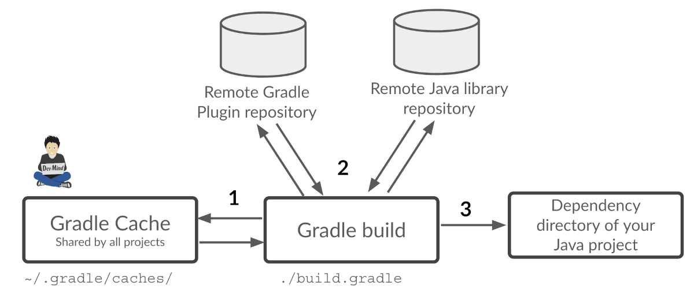

:doctitle: Gradle in practice
:description: Comment construire une application Java interfacée à une base de données et exposant des services REST
:keywords: Gradle
:author: Guillaume EHRET - Dev-Mind
:revdate: 2023-09-02
:category: Web
:teaser: In this training, we will learn how Gradle works and how use it in our projects. It's just a fast presentation of this tool and you will find more informations on official website.
:imgteaser: ../../img/training/gradle.png
:toc:
:icons: font

In this training, we will learn how Gradle works and how use it in our projects.

It's just a fast presentation of this tool, and you will find more informations on official website https://docs.gradle.org/current/userguide/userguide.html

image::../../img/training/gradle.png[Gradle by Dev-Mind, width=800, align="center"]

Gradle is an open source tool for automating the build of your Java, Kotlin, Android, Web projects... If you only have a web project, you don't need to use Gradle, but when all your projects are in a mono repository on Git, with heterogeneous languages, it's easier to use a same life cycle tool like Gradle.

Gradle is not the only solution in the ecosystem. You can also use Maven or older tool like Ant.

Gradle has the Ant flexibility and apply many Maven conventions.

Maven helps to build only one project. But Gradle was created to be more flexible, you can build several artifacts for example. That's why the Android community has chosen this tool. You can define different flavors and build 2 artifacts : one for the free version for example and another one for the paid version.

Java users use both Maven and Gradle. But I choose Gradle for you, because we will use this tool in our Java/Spring project, and in the Android project.

== Introduction

*Highly customizable* +
You have a convention to use the plugins but everything is customizable.
You can write your scripts in Kotlin (default) or in Groovy (the legacy solution)

*Fast / Incremental build / Cache / Parallel*  +
Incremental build : Gradle reuses outputs from previous executions, processing only inputs that changed. For a fastest build, you can also execute tasks in parallel and you can configure Gradle cache.

*Powerful* +
Gradle build projects in several languages but its success is linked to Android developers. Today

*Useful* +
Based on Ivy and supports Maven, it simplifies the project dependencies (libraries). By the default, the dependency resolution is transitive. If you declare one dependency and if this library depends from another ones, you don't need to declare all the libraries tree because Gradle is able to resolve this task for you.

*JVM foundation* +
Gradle runs on the JVM and you must have a Java Development Kit (JDK) installed to use it. You can also use Gradle for native projects like Spring native, Micronaut or Quarkus.

*Extensibility* +
You can extend Gradle to provide your own task types, your own plugins or even your own build model. Android added for example many new build concepts such as flavors and build types.

*IDE support* +
Major IDEs allow you to import Gradle builds

== Why a build tool?

*Write once, run everywhere*

Build automation is the act of scripting or automating a wide variety of *tasks* that software developers have to do in their day to day activities such as:

- compiling program source code into binary code
- packaging a compiled program for delivery
- running automated tests
- deploying to production systems
- generating documentation and/or release notes.
- ...

== Usage

You can execute Gradle
* In command line in a terminal
* In your IDE (development tools to write and execute code) [.small]#NetBeans, Eclipse or IntelliJ (we will use IntelliJ)#

Online documentation is very complete for the main usages https://docs.gradle.org/current/userguide/userguide.html. It's more difficult when you want to create your own plugins. But it's not a problem in our case.

== Principle

Gradle was not the first build tool. In the past we used https://ant.apache.org/[Ant] and after https://maven.apache.org/[Maven]

* https://ant.apache.org/[Ant] is very powerful, but you describe your build in an xml file, the configuration is not readable and difficult to use on a project with a lot of people, because you don't have conventions to use this tool.
* https://maven.apache.org/[Maven] is better but in my opinion Gradle is the best solution because Maven is
** very verbose (you have to write a lot of thing to configure a build)
** the project is not very flexible by its governance
** slower than Gradle: incremental build is present in the last version and the Gradle cache and parallel execution give an advantage to Gradle

== icon:flask[] Starting with Gradle

You can install the last version on https://gradle.org/install/. If you followed the installation of the package manager https://sdkman.io/[Sdk Man] in the https://dev-mind.fr/training/outil/install-development-environment.html[first lesson], you just have to launch

[source,shell]
----
sdk install gradle 8.2.1
----

Gradle runs on all major operating systems and requires only a Java JDK version 17 or higher to be installed.

To check, run java -version in a terminal on your laptop:

[source,shell]
----
$ java -version

java version "17.0.7" 2023-04-18 LTS
Java(TM) SE Runtime Environment Oracle GraalVM 17.0.7+8.1 (build 17.0.7+8-LTS-jvmci-23.0-b12)
Java HotSpot(TM) 64-Bit Server VM Oracle GraalVM 17.0.7+8.1 (build 17.0.7+8-LTS-jvmci-23.0-b12, mixed mode, sharing)
----

Open a terminal on your laptop or computer to create and initialize a new Gradle project.
You will create a directory and link it to Gradle

[source,shell]
----
mkdir gradle-demo
cd gradle-demo
gradle init
----

If you use a Gradle version > 7, you will have to respond to few questions

[source,shell]
----
Select type of project to generate:
1: basic
2: application
3: library
4: Gradle plugin
Enter selection (default: basic) [1..4] 1

Select build script DSL:
1: Kotlin
2: Groovy
Enter selection (default: Groovy) [1..2] 1

Project name (default: demo): demo

Generate build using new APIs and behavior (some features may change in the next minor release)? (default: no) [yes, no] no
----

You should have this message after

[source,shell]
----
> Task :init
Get more help with your project: Learn more about Gradle by exploring our samples at https://docs.gradle.org/7.5/samples

BUILD SUCCESSFUL in 56s
2 actionable tasks: 2 executed

----

Gradle should have generated this tree

[source,shell]
----
|-- build.gradle.kts  (1)
|-- .gitattributes (2)
|-- .gitignore (2)
|-- gradle
|   | -- wrapper
|       | -- gradle-wrapper.jar  (3)
|       | -- gradle-wrapper.properties  (4)
|-- gradlew  (5)
|-- gradlew.bat (5)
|-- settings.gradle.kts (6)
----

(1). Gradle configuration script for the project +
(2). A git init is automatically made on the project generation +
(3). This jar contains Gradle Wrapper classes and libraries +
(4). Wrapper configuration file (you find the Gradle version used by the project) +
(5). These scripts are used to launch Gradle via the wrapper (2 scripts, one for Unix one for Windows) +
(6). general configuration file (used to declare Gradle sub modules, and global variables)

== Gradle wrapper

Team members can have different versions of Gradle on their laptop. But on a project everybody must use the same version.

From one project to another, you can have different versions of the tool (it's difficult to switch the version on your computer).

Gradle wrapper resolves these problems. The recommended way to execute any Gradle build, is with the help of the Gradle Wrapper (in short just “Wrapper”). The Wrapper is a script that invokes a declared version of Gradle (it fixes the version used in your project), downloading it beforehand if necessary.

As a result, developers can get up and running with a Gradle project quickly without having to follow manual installation.

image::../../img/training/gradle/wrapper.png[width=800, align="center"]

[.code-height]
[source,shell]
----
$ ./gradlew -v
Downloading https://services.gradle.org/distributions/gradle-8.2.1-bin.zip
..........10%...........20%...........30%...........40%...........50%...........60%...........70%...........80%...........90%...........100%

------------------------------------------------------------
Gradle 8.2.1
------------------------------------------------------------

Build time:   2023-07-10 12:12:35 UTC
Revision:     a38ec64d3c4612da9083cc506a1ccb212afeecaa

Kotlin:       1.8.20
Groovy:       3.0.17
Ant:          Apache Ant(TM) version 1.10.13 compiled on January 4 2023
JVM:          17.0.7 (Oracle Corporation 17.0.7+8-LTS-jvmci-23.0-b12)
OS:           Linux 5.19.0-50-generic amd64
----

== icon:flask[] First example

Clone the Github project https://github.com/Dev-Mind/gradle-demo.git

Go in IntelliJ in the menu `File` → `New` → `Project From Existing Sources` and select the Gradle model

image::../../img/training/gradle/idea1.png[width=800, align="center"]

When everything is finished you have your project opened in your IDE with the Gradle configuration loaded.

You can browse the gradle files as in the tree below

[source,shell]
----
|-- app
|   | -- src
|      | -- main
|          | -- java
|          | -- resources
|      | -- test
|          | -- java
|          | -- resources
|   | -- build.gradle.kts
|-- gradle
|   | -- wrapper
|       | -- gradle-wrapper.jar
|       | -- gradle-wrapper.properties
|-- .gitattributes
|-- .gitignore
|-- gradle.properties
|-- gradlew
|-- gradlew.bat
|-- settings.gradle.kts
----

Open the main file called `build.gradle.kts`.
This is a Java project. So we use the plugin provided by Gradle to manage an application written in Java.

[source,groovy]
----
plugins {
    // Apply the application plugin to add support for building a CLI application in Java.
    application
}

repositories {
    // Use Maven Central for resolving dependencies.
    mavenCentral()
}

dependencies {
    // Use JUnit Jupiter for testing.
    testImplementation("org.junit.jupiter:junit-jupiter:5.10.0")

    // This dependency is used by the application.
    implementation("org.springframework:spring-context:6.0.11")
}

// Apply a specific Java toolchain to ease working on different environments.
java {
    toolchain {
        languageVersion.set(JavaLanguageVersion.of(17))
    }
}

application {
    // Define the main class for the application.
    mainClass.set("com.devmind.gradle.MyApplication")
}
----

You can now launch this command

[source,shell]
----
$ ./gradlew build

BUILD SUCCESSFUL in 7s
8 actionable tasks: 8 executed
----

Gradle executes tasks and in our case Java plugin has launched 8 tasks to build the project. As this is the first build you should have 8 executed task.

If you try to relaunch the same command you should have this output

[source,shell]
----
$ ./gradlew build
BUILD SUCCESSFUL in 517ms
8 actionable tasks: 8 up-to-date
----

You can observe the execution time. The 8 tasks are now executed in 517ms. As you changed nothing Gradle does not relaunch each task. All task have the status UP-TO-DATE

You can launch the `run` task to execute your app

[source,shell]
----
$ ./gradlew :app:run
> Task :app:run
I want to learn Gradle

BUILD SUCCESSFUL in 503ms
3 actionable tasks: 1 executed, 2 up-to-date
----

With IntelliJ, we have a synthetic view of dependencies and tasks

image::../../img/training/gradle/idea3.png[width=600, align="center"]

Now try to list all available tasks in a command window. Run

[.code-height]
[source,shell]
----
$ ./gradlew tasks

> Task :tasks

------------------------------------------------------------
Tasks runnable from root project 'gradle-demo'
------------------------------------------------------------

Application tasks
-----------------
run - Runs this project as a JVM application

Build tasks
-----------
assemble - Assembles the outputs of this project.
build - Assembles and tests this project.
buildDependents - Assembles and tests this project and all projects that depend on it.
buildNeeded - Assembles and tests this project and all projects it depends on.
classes - Assembles main classes.
clean - Deletes the build directory.
jar - Assembles a jar archive containing the classes of the 'main' feature.
testClasses - Assembles test classes.

Build Setup tasks
-----------------
init - Initializes a new Gradle build.
wrapper - Generates Gradle wrapper files.

Distribution tasks
------------------
assembleDist - Assembles the main distributions
distTar - Bundles the project as a distribution.
distZip - Bundles the project as a distribution.
installDist - Installs the project as a distribution as-is.

Documentation tasks
-------------------
javadoc - Generates Javadoc API documentation for the 'main' feature.

Help tasks
----------
buildEnvironment - Displays all buildscript dependencies declared in root project 'gradle-demo'.
dependencies - Displays all dependencies declared in root project 'gradle-demo'.
dependencyInsight - Displays the insight into a specific dependency in root project 'gradle-demo'.
help - Displays a help message.
javaToolchains - Displays the detected java toolchains.
kotlinDslAccessorsReport - Prints the Kotlin code for accessing the currently available project extensions and conventions.
outgoingVariants - Displays the outgoing variants of root project 'gradle-demo'.
projects - Displays the sub-projects of root project 'gradle-demo'.
properties - Displays the properties of root project 'gradle-demo'.
resolvableConfigurations - Displays the configurations that can be resolved in root project 'gradle-demo'.
tasks - Displays the tasks runnable from root project 'gradle-demo' (some of the displayed tasks may belong to subprojects).

Verification tasks
------------------
check - Runs all checks.
test - Runs the test suite.

To see all tasks and more detail, run gradlew tasks --all

To see more detail about a task, run gradlew help --task <task>

BUILD SUCCESSFUL in 1s
1 actionable task: 1 executed
----

== How Gradle works ?

When you want to manage your project with Gradle, you will define a configuration file to declare

* how to download Gradle plugins (that provide a set of tasks)
* how to configure Gradle plugins (properties)
* how to download dependencies of our project (Java libraries)
* add or configure your own tasks

Everything is configured via a DSL (Domain Specific Language) written in Kotlin (or Groovy)

== Tasks

You have many predefined tasks (provided by plugins)

A task

* defines what to do on a set of resources
* may depend on one or more tasks.

Gradle models its builds as Directed Acyclic Graphs (DAGs) of tasks (units of work).

image::../../img/training/gradle/1_dag.png[How Gradle works ?,width=500, align="center"]

You can add your own tasks and let them depend on others

Task graph can be defined by both plugins and your own build scripts, with tasks linked together via the task dependency mechanism.

Tasks themselves consist of:

* *Actions* — pieces of work that do something, like copy files or compile source
* *Inputs* — values, files and directories that the actions use or operate on
* *Outputs* — files and directories that the actions modify or generate

== Incremental build

When inputs and outputs on a gradle task have no change, Gradle won't execute this task and will display *UP-TO-DATE*

.Example with JavaCompile task
image::../../img/training/gradle/1_incremetal.png[Incremental build,width=700, align="center"]

== icon:flask[] Create your own tasks

Add these lines to your `build.gradle.kts` file

[source,shell]
----
tasks.create("hello") {
    doLast {
        println("Hello")
    }
}
tasks.create("world") {
    dependsOn("hello")
    doLast {
        println("World")
    }
}
----

Test by launching these tasks

[source,shell]
----
$ ./gradlew hello
$ ./gradlew world
----

== Gradle Life cycle

A Gradle build has 3 steps

1. *Initialization* +
Gradle determines which projects are involved in the build. A project can have subprojects. All of them have a `build.gradle.kts`.

2. *Configuration* +
Gradle parses the `build.gradle.kts` configuration file (or more if you have some subprojects). After this step, Gradle has built its Directed Acyclic Graphs (DAGs)

3. *Execution* +
Gradle executes one or several tasks (arguments added to `./gradlew`) according to this task graph. Gradle executes tasks one by one in the order defined in the graph.

== Plugins

A plugin provides a task set and entry points to configure this plugin. For example

[source,kotlin]
----
plugins {
    java
}
----

The Java plugin has these tasks

image::../../img/training/gradle/pluginJava.png[Fonctionnement de Gradle,width=100%]

In the next lab, we will use Spring and Spring Boot. We will use Gradle to manage our projects. We will use 2 more plugins

[.code-height]
[source,shell]
----
buildscript {
    plugins {  (1)
      java
      id("org.springframework.boot") version "3.1.2"
      id("io.spring.dependency-management") version "1.1.2"
    }

    repositories { (2)
      mavenCentral()
    }

    group = "com.devmind.faircorp"
    version = "0.0.1-SNAPSHOT"

    java { (3)
      sourceCompatibility = JavaVersion.VERSION_17
    }

    dependencies {
       implementation("org.springframework.boot:spring-boot-starter") (4)
       testImplementation("org.springframework.boot:spring-boot-starter-test")
    }

    tasks.withType<Test> {
      useJUnitPlatform()
    }
}
----

(1). Gradle plugin used +
(2). repository used to download plugins or app libraries +
(3). Personalization of the `java` plugin.
(4). Application dependencies (libraries used by the project)

You have a lot of free plugin to enrich your build. All of them are available on this URL https://plugins.gradle.org/

== icon:flask[] Custom tasks and their configurations

Open your project `gradle-demo` in IntelliJ and add the following code in `build.gradle`

[.code-height]
[source,shell]
----
println("This is executed during the configuration phase.")

tasks.create("configured") {
    description = "My own configured task"
    println("This (configured) is also executed during the configuration phase.")
}

tasks.create("testWrite") {
    description = "My own testWrite task"
    doLast {
        println("This (testWrite) is executed during the execution phase.")
    }
}

tasks.create("testWriteBoth") {
    description = "My own testWriteBoth task"
    doFirst {
        println("This (testWriteBoth) is executed first during the execution phase.")
    }
    doLast {
        println("This (testWriteBoth) is executed last during the execution phase.")
    }
    println("This (testWriteBoth) is executed during the configuration phase as well.")
}
----

Launch the following command to see new tasks
[source,shell]
----
$ ./gradlew tasks --all
----

Then you can test your new task
[source,shell]
----
$ ./gradlew testWrite
----

And
[source,shell]
----
$ ./gradlew testWriteBoth
----

Try to understand what happens ? If you are lost I can help you during face-to-face sessions

[.code-height]
[source,shell]
----
$ ./gradlew testWrite

> Configure project :
This is executed during the configuration phase.
This (configured) is also executed during the configuration phase.
This (testWriteBoth) is executed during the configuration phase as well.

...
----

== Dependency management

You have to define the project dependencies in the build.gradle.kts

Every dependency declared for a Gradle project applies to a specific scope. For example for a Java project, some dependencies should be used

* for compiling source code (scope `implementation`)
* for compiling test code (scope `testImplementation`)
* for running your code (scope `runtime`)
* for running your tests (scope `testRuntime`)
* ...

[source,kotlin]
----
dependencies {
    // Use JUnit Jupiter for testing.
    testImplementation("org.junit.jupiter:junit-jupiter:5.10.0")
    testRuntimeOnly("org.junit.jupiter:junit-jupiter-engine:5.10.0")

    // This dependency is used by the application.
    implementation("org.springframework:spring-context:6.0.11")
}
----

A scope correspond to a configuration in Gradle. A plugin can add pre-defined configurations to your project. The Java plugin, for example, adds several configurations

.Source : https://docs.gradle.org
image::../../img/training/gradle/5_dependencies.png[width=1000, align="center"]

A configuration can extend other configurations to form an inheritance hierarchy. Child configurations inherit the whole set of dependencies declared for any of its parent.

.Source : https://docs.gradle.org
image::../../img/training/gradle/5_dependencies_confiog.png[width=500, align="center"]

<<<

You can define a module dependency (reference to a library in a repository [maven central for example]).

[source, kotlin]
----
dependencies {
    implementation(group = "org.springframework", name = "spring-core", version = "2.5")
    implementation("org.hibernate:hibernate:3.0.5")
}
----

You can define a project dependency if you have a multi-project configuration

[source, kotlin]
----
dependencies {
    implementation(project(":shared"))
}
----

A module can have dependencies on other modules to work properly, so-called transitive dependencies.  By default, Gradle resolves transitive dependencies automatically.

In some case we can help Gradle to not use this mode, to exclude some dependencies or to force a specific version if we have a conflict

[source, kotlin]
----
dependencies {
    implementation("org.hibernate:hibernate:3.1") {
        exclude(module = "cglib") //by artifact name
        exclude(group = "org.jmock") //by group

        //disabling all transitive dependencies of this dependency
        isTransitive = false
    }
}
----

This schema resumes how Gradle download a dependency

(1) Gradle looks in his cache if the dependency is present +
(2) It parses the given remote repository(ies), downloads the dependency and stores it in his cache +
(3) Dependency can be provided to project. If this dependency has another dependencies, Gradle loads them transitively

<<<

== Reference

- https://gradle.org/[Gradle web site]
- https://docs.gradle.org/current/userguide/userguide.html[Official documentation]
- https://melix.github.io/blog/2021/03/version-catalogs.html[Library version management]
