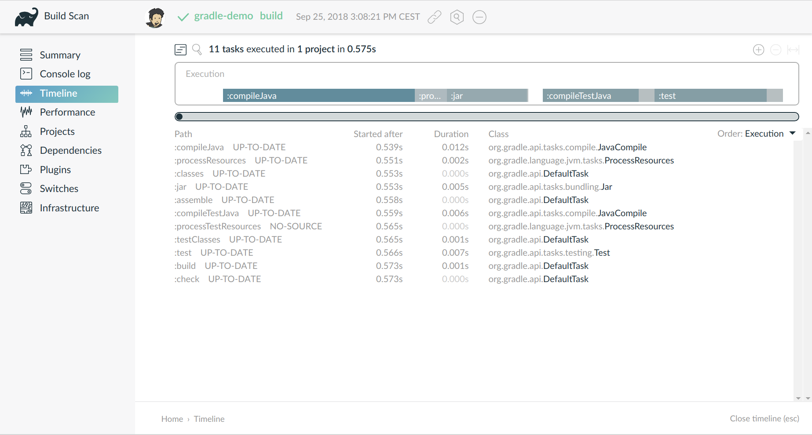
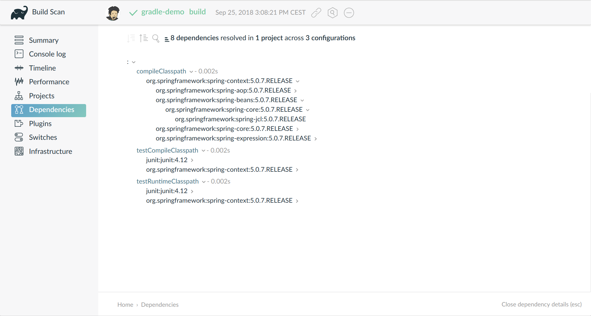
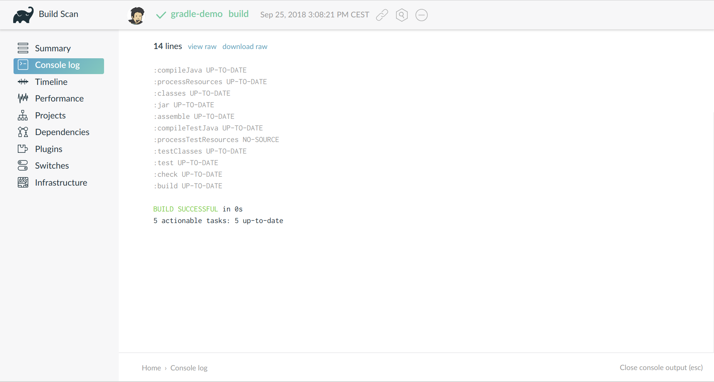

:doctitle: Gradle in practice (EN)
:description: Comment construire une application Java interfacée à une base de données et exposant des services REST
:keywords: Gradle
:author: Guillaume EHRET - Dev-Mind
:revdate: 2020-08-02
:category: Web
:teaser: In this training, we will learn how Gradle works and how use it in our projects. It's just a fast presentation of this tool and you will find more informations on official website.
:imgteaser: ../../img/training/gradle.png
:toc:

In this training, we will learn how Gradle works and how use it in our projects. It's just a fast presentation of this tool and you will find more informations on official website https://docs.gradle.org/current/userguide/userguide.html

image::../../img/training/gradle.png[Gradle by Dev-Mind]

Gradle is an open source tool for automating the build of your Java, Kotlin, Android, Web projects... This tool is like Ant and Maven. Gradle has the Ant flexibility and apply many Maven conventions.
Maven helps to build only one projetc. But Gradle was created to be more flexible, you can build several artifacts. That's why the Android community has chosen this tool.

== Introduction

*Highly customizable* +
[.small]#you have a convention but everything is customizable. You can write your scripts in Groovy (default) or in Kotlin (default in the future)#

*Fast*  +
[.small]#Incremental build : Gradle completes reuses outputs from previous executions, processing only inputs that changed, and executing tasks in parallel.#

*Powerful* +
[.small]#Gradle build projects in several languages but its success is linked to Android developers.#

*Useful* +
[.small]#Based on Ivy and supports Maven, it simplifies the project dependencies (libraries). You can use transitive dependencies#

== Why a build tool?

Write once, run everywhere

Build your project

* To generate your delivery packages of your app (apk, jar, war...)
* To run tests
* To generate documentation and reports
* To deploy your app

...

== Usage

* In command line in a terminal
* In your IDE (development tools to write and execute code) [.small]#NetBeans, Eclipse or IntelliJ (we will use IntelliJ)#
* Online documentation is very complete https://docs.gradle.org/current/userguide/userguide.html

== Principle

* Gradle was not the first build tool. In the past we used https://ant.apache.org/[Ant] and after https://maven.apache.org/[Maven]
* https://ant.apache.org/[Ant] is very powerful, but the configuration is not readable and difficult to use on a project with a lot of people
* https://maven.apache.org/[Maven] is
** very verbose (you have to write a lot of XML)
** not very flexible (governance and execution)

[NOTE.speaker]
--
For the governance Maven is managed by only one person, Jason Vanzyl and his society Sonatype. it's difficult to contribute to this project
For Gradle it's totally different. You can open projects on Github and see all the contributors.
--

== Starting with Gradle

Open a terminal on your laptop or computer to create and initialize a new Gradle project. You will create a directory and link it to Gradle

[source,shell]
----
mkdir gradle-demo
gradle init
----

In the console you should have the following output

[source,shell]
----
❯ gradle init
Starting a Gradle Daemon (subsequent builds will be faster)

BUILD SUCCESSFUL in 3s
2 actionable tasks: 2 executed
----

Gradle should have generated this tree

[source,shell]
----
|-- build.gradle  // <1>
|-- gradle
|   | -- wrapper
|       | -- gradle-wrapper.jar  // <2>
|       | -- gradle-wrapper.properties  // <3>
|-- gradlew  // <4>
|-- gradlew.bat  // <5>
|-- settings.gradle  // <6>
----

[.small]#1. Gradle configuration script for the project +
2. This jar contains Gradle Wrapper classes and libraries +
3. Wrapper configuration file +
4. and 5. these script are used to launch Gradle via the wrapper (2 scripts, one for Unix one for Windows) +
6. general configuration file (used to declare Gradle sub modules, and global variables)#

== Gradle wrapper

When you use a build tool, all team members must use the same version. From one project to another, you can have different versions of the tool (it's difficult to maintain on your computer).

Gradle wrapper resolves these problems. The recommended way to execute any Gradle build is with the help of the Gradle Wrapper (in short just “Wrapper”). The Wrapper is a script that invokes a declared version of Gradle (it fixes the version used in your project), downloading it beforehand if necessary. As a result, developers can get up and running with a Gradle project quickly without having to follow manual installation.

image::../../img/training/gradle/wrapper.png[width=60%]

[.code-height]
[source,shell]
----
$ ./gradlew -v
Downloading https://services.gradle.org/distributions/gradle-6.7.1-bin.z
ip......................................................................
........................................................................
........................................................................
Unzipping /home/devmind/.gradle/wrapper/dists/gradle-6.7.1-bin/dajvke9o8
kmaxbu0kc5gcgeju/gradle-6.7.1-bin.zip to /home/devmind/.gradle/wrapper/d
ists/gradle-6.7.1-bin/dajvke9o8kmaxbu0kc5gcgeju

Set executable permissions for: /home/devmind/.gradle/wrapper/dists/grad
le-6.7.1-bin/dajvke9o8kmaxbu0kc5gcgeju/gradle-6.7.1/bin/gradle

------------------------------------------------------------
Gradle 6.7.1
------------------------------------------------------------

Build time:   2017-10-02 15:36:21 UTC
Revision:     a88ebd6be7840c2e59ae4782eb0f27fbe3405ddf

Groovy:       2.4.12
Ant:          Apache Ant(TM) version 1.9.6 compiled on June 29 2015
JVM:          1.8.0_181 (Oracle Corporation 25.181-b13)
OS:           Linux 4.15.0-34-generic amd64
----

== An example

Clone the Github project https://github.com/Dev-Mind/gradle-demo.git

Go in IntelliJ in the menu `File` → `New` → `Project From Existing Sources`

image::../../img/training/gradle/idea1.png[size=30%]

[source,shell]
----
|-- build.gradle
|-- gradle
|   | -- wrapper
|       | -- gradle-wrapper.jar
|       | -- gradle-wrapper.properties
|-- src
|   | -- main
|       | -- java
|       | -- resources
|   | -- test
|       | -- java
|       | -- resources
|-- gradlew
|-- gradlew.bat
|-- settings.gradle
----

This is a Java project. So we use Java plugin provided by Gradle

[source,groovy]
----
// Apply the java plugin to add support for Java
apply plugin: 'java'

// In this section you declare where to find the dependencies of your
// project
repositories {
    // Use 'jcenter' for resolving your dependencies.
    // You can declare any Maven/Ivy/file repository here.
    jcenter()
}

dependencies {
    // Dependencies for production
    compile 'org.springframework:spring-context:5.0.7.RELEASE'

    // Dependencies for test
    testCompile 'junit:junit:4.12'
}
----

You can now launch this command

[source,shell]
----
$ ./gradlew build
Starting a Gradle Daemon (subsequent builds will be faster)

BUILD SUCCESSFUL in 4s
5 actionable tasks: 5 executed
----

Gradle execute tasks and in our case Java plugin has launched 5 tasks to build the projet

With IntelliJ, we have a synthetic view of dependencies and tasks

image::../../img/training/gradle/idea3.png[width=80%]

[.small]
[.code-height]
[source,shell]
----
$ ./gradlew tasks --all

------------------------------------------------------------
All tasks runnable from root project
------------------------------------------------------------

Build tasks
-----------
assemble - Assembles the outputs of this project.
build - Assembles and tests this project.
buildDependents - Assembles and tests this project and all projects that depend on it.
buildNeeded - Assembles and tests this project and all projects it depends on.
classes - Assembles main classes.
clean - Deletes the build directory.
jar - Assembles a jar archive containing the main classes.
testClasses - Assembles test classes.

Build Setup tasks
-----------------
init - Initializes a new Gradle build.
wrapper - Generates Gradle wrapper files.

Documentation tasks
-------------------
javadoc - Generates Javadoc API documentation for the main source code.

Help tasks
----------
buildEnvironment - Displays all buildscript dependencies declared in root project 'gradle-demo'.
components - Displays the components produced by root project 'gradle-demo'. [incubating]
dependencies - Displays all dependencies declared in root project 'gradle-demo'.
dependencyInsight - Displays the insight into a specific dependency in root project 'gradle-demo'.
dependentComponents - Displays the dependent components of components in root project 'gradle-demo'. [incubating]
help - Displays a help message.
model - Displays the configuration model of root project 'gradle-demo'. [incubating]
projects - Displays the sub-projects of root project 'gradle-demo'.
properties - Displays the properties of root project 'gradle-demo'.
tasks - Displays the tasks runnable from root project 'gradle-demo'.

Verification tasks
------------------
check - Runs all checks.
test - Runs the unit tests.

Other tasks
-----------
compileJava - Compiles main Java source.
compileTestJava - Compiles test Java source.
processResources - Processes main resources.
processTestResources - Processes test resources.

Rules
-----
Pattern: clean<TaskName>: Cleans the output files of a task.
Pattern: build<ConfigurationName>: Assembles the artifacts of a configuration.
Pattern: upload<ConfigurationName>: Assembles and uploads the artifacts belonging to a configuration.

BUILD SUCCESSFUL in 0s
1 actionable task: 1 executed

----

== How Gradle works ?

image::../../img/training/gradle/gradle.png[How Gradle works ?, width=80%]

1. Gradle connects to a remote plugin repository to load them. A plugin brings a task set +
2. Gradle connects to a remote library repository and retrieves those declared for execution and testing +
3. A task will act with our application +
4. A task has a result (OK, KO, directory deletion, packaging jar ...)

So, a project managed by Gradle is a configuration file that will indicate

* how to download Gradle plugins (that provide a set of tasks) +
* how to download dependencies of our project (Java libraries) +
* tasks define a life cycle +
* everything is configured via a DSL (Domain Specific Language) written in Groovy or Kotlin#

== Tasks

You have many predefined tasks (provided by plugins)

Defines what to do on a set of resources

A task may depend on one or more tasks.

Gradle creates a Directed Acyclic Graph (DAG) that defines a path to a task

== Dependant task

Add these lines to your `build.gradle` file

[.small]
[source,shell]
----
task hello {
    doLast {
        println 'Hello'
    }
}

task world(dependsOn: hello) {
    doLast {
        println 'World'
    }
}
----

Test by launching theses tasks

[source,shell]
----
$ ./gradlew hello
$ ./gradlew world
----

== Life cycle

A Gradle build has 3 steps

*Initialization* +
Gradle determines which projects are involved in the build. A project can have subprojects. All of them have a build.gradle.

*Configuration* +
Gradle parses the `build.gradle` configuration file (or more if subprojects). After this step, Gradle has his task tree

*Execution*
Gradle execute one or several tasks (arguments added to `./gradlew`) according to this task graph. Gradle execute tasks one by one in the order defined in the graph.

== Plugins

A plugin provide a task set and entry points to configure this plugin. For example

[source,groovy]
----
apply plugin : 'java'
----

Effect of this line :

image::../../img/training/gradle/pluginJava.png[Fonctionnement de Gradle, width=100%]
https://docs.gradle.org/current/userguide/img/javaPluginTasks.png

== Another example

In the next TP we will use Spring and Spring Boot. We will use Gradle to manage our projects

[.small]
[.code-height]
[source,shell]
----
buildscript {
    repositories {
        repositories { // <1>
            mavenCentral()
        }
        dependencies {
            classpath("org.springframework.boot:spring-boot-gradle-plugin:2.0.4.RELEASE") // <2>
        }
    }
    repositories {
        mavenCentral() // <1>
    }
    apply plugin: 'org.springframework.boot' // <3>
    apply plugin: 'io.spring.dependency-management' // <3>
    dependencies {
        compile('org.springframework.boot:spring-boot-starter-web')
        testCompile('org.springframework.boot:spring-boot-starter-test')
    }
    bootRun{ // <4>
        sourceResources sourceSets.main
    }
}
----
[.small]#1. Remote repository for the plugins +
2. We declare a dependancy to the Spring Boot Gradle plugin   +
3. We use this plugin +
4. Personnalization of the plugin +
Each plugin has a documentation https://docs.spring.io/spring-boot/docs/2.0.5.RELEASE/gradle-plugin/reference/html/#

== Customize tasks

Open your project `gradle-demo` in IntelliJ and add the following code

[.small]
[.code-height]
[source,shell]
----
println 'This is executed during the configuration phase.'

task configured {
    println 'This (configured) is also executed during the configuration phase.'
}

task testWrite {
    doLast {
        println 'This (testWrite) is executed during the execution phase.'
    }
}

task testWriteBoth {
    doFirst {
        println 'This (testWriteBoth) is executed first during the execution phase.'
    }
    doLast {
        println 'This (testWriteBoth) is executed last during the execution phase.'
    }
    println 'This (testWriteBoth) is executed during the configuration phase as well.'
}
----

Launch
[source,shell]
----
$ ./gradlew tasks
----

Then
[source,shell]
----
$ ./gradlew testWrite
----

And
[source,shell]
----
$ ./gradlew testWriteBoth
----

Try to understand what happens ?

[.small]
[.code-height]
[source,shell]
----
$ ./gradlew tasks

> Configure project :
This is executed during the configuration phase.
This (configured) is also executed during the configuration phase.
This (testWriteBoth) is executed during the configuration phase as well.

> Task :tasks

------------------------------------------------------------
All tasks runnable from root project
------------------------------------------------------------

Build tasks
-----------
assemble - Assembles the outputs of this project.
build - Assembles and tests this project.
buildDependents - Assembles and tests this project and all projects that depend on it.
buildNeeded - Assembles and tests this project and all projects it depends on.
classes - Assembles main classes.
clean - Deletes the build directory.
jar - Assembles a jar archive containing the main classes.
testClasses - Assembles test classes.

Build Setup tasks
-----------------
init - Initializes a new Gradle build.
wrapper - Generates Gradle wrapper files.

Documentation tasks
-------------------
javadoc - Generates Javadoc API documentation for the main source code.

Help tasks
----------
buildEnvironment - Displays all buildscript dependencies declared in root project 'gradle-demo'.
components - Displays the components produced by root project 'gradle-demo'. [incubating]
dependencies - Displays all dependencies declared in root project 'gradle-demo'.
dependencyInsight - Displays the insight into a specific dependency in root project 'gradle-demo'.
dependentComponents - Displays the dependent components of components in root project 'gradle-demo'. [incubating]
help - Displays a help message.
model - Displays the configuration model of root project 'gradle-demo'. [incubating]
projects - Displays the sub-projects of root project 'gradle-demo'.
properties - Displays the properties of root project 'gradle-demo'.
tasks - Displays the tasks runnable from root project 'gradle-demo'.

Verification tasks
------------------
check - Runs all checks.
test - Runs the unit tests.

Rules
-----
Pattern: clean<TaskName>: Cleans the output files of a task.
Pattern: build<ConfigurationName>: Assembles the artifacts of a configuration.
Pattern: upload<ConfigurationName>: Assembles and uploads the artifacts belonging to a configuration.

To see all tasks and more detail, run gradlew tasks --all

To see more detail about a task, run gradlew help --task <task>
----

== Dependencies

Several dependency types

Plugins
[.small]
[source,shell]
----
buildscript {
    repositories {
        dependencies {
            classpath("org.springframework.boot:spring-boot-gradle-plugin:2.0.4.RELEASE") // <2>
        }
    }
}
----

Java libraries for code and test
[.small]
[source,shell]
----
dependencies {
    compile('org.springframework.boot:spring-boot-starter-web:2.0.4.RELEASE')
    testCompile('org.springframework.boot:spring-boot-starter-test:2.0.4.RELEASE')
}
----

[.small]
[.code-height]
[source,shell]
----
$ ./gradlew dependencies

> Task :dependencies

------------------------------------------------------------
Root project
------------------------------------------------------------

apiElements - API elements for main. (n)
No dependencies

archives - Configuration for archive artifacts.
No dependencies

compile - Dependencies for source set 'main' (deprecated, use 'implementation ' instead).
\--- org.springframework:spring-context:5.0.7.RELEASE
     +--- org.springframework:spring-aop:5.0.7.RELEASE
     |    +--- org.springframework:spring-beans:5.0.7.RELEASE
     |    |    \--- org.springframework:spring-core:5.0.7.RELEASE
     |    |         \--- org.springframework:spring-jcl:5.0.7.RELEASE
     |    \--- org.springframework:spring-core:5.0.7.RELEASE (*)
     +--- org.springframework:spring-beans:5.0.7.RELEASE (*)
     +--- org.springframework:spring-core:5.0.7.RELEASE (*)
     \--- org.springframework:spring-expression:5.0.7.RELEASE
          \--- org.springframework:spring-core:5.0.7.RELEASE (*)

compileClasspath - Compile classpath for source set 'main'.
\--- org.springframework:spring-context:5.0.7.RELEASE
     +--- org.springframework:spring-aop:5.0.7.RELEASE
     |    +--- org.springframework:spring-beans:5.0.7.RELEASE
     |    |    \--- org.springframework:spring-core:5.0.7.RELEASE
     |    |         \--- org.springframework:spring-jcl:5.0.7.RELEASE
     |    \--- org.springframework:spring-core:5.0.7.RELEASE (*)
     +--- org.springframework:spring-beans:5.0.7.RELEASE (*)
     +--- org.springframework:spring-core:5.0.7.RELEASE (*)
     \--- org.springframework:spring-expression:5.0.7.RELEASE
          \--- org.springframework:spring-core:5.0.7.RELEASE (*)

compileOnly - Compile only dependencies for source set 'main'.
No dependencies

default - Configuration for default artifacts.
\--- org.springframework:spring-context:5.0.7.RELEASE
     +--- org.springframework:spring-aop:5.0.7.RELEASE
     |    +--- org.springframework:spring-beans:5.0.7.RELEASE
     |    |    \--- org.springframework:spring-core:5.0.7.RELEASE
     |    |         \--- org.springframework:spring-jcl:5.0.7.RELEASE
     |    \--- org.springframework:spring-core:5.0.7.RELEASE (*)
     +--- org.springframework:spring-beans:5.0.7.RELEASE (*)
     +--- org.springframework:spring-core:5.0.7.RELEASE (*)
     \--- org.springframework:spring-expression:5.0.7.RELEASE
          \--- org.springframework:spring-core:5.0.7.RELEASE (*)

implementation - Implementation only dependencies for source set 'main'. (n)
No dependencies

runtime - Runtime dependencies for source set 'main' (deprecated, use 'runtimeOnly ' instead).
\--- org.springframework:spring-context:5.0.7.RELEASE
     +--- org.springframework:spring-aop:5.0.7.RELEASE
     |    +--- org.springframework:spring-beans:5.0.7.RELEASE
     |    |    \--- org.springframework:spring-core:5.0.7.RELEASE
     |    |         \--- org.springframework:spring-jcl:5.0.7.RELEASE
     |    \--- org.springframework:spring-core:5.0.7.RELEASE (*)
     +--- org.springframework:spring-beans:5.0.7.RELEASE (*)
     +--- org.springframework:spring-core:5.0.7.RELEASE (*)
     \--- org.springframework:spring-expression:5.0.7.RELEASE
          \--- org.springframework:spring-core:5.0.7.RELEASE (*)

runtimeClasspath - Runtime classpath of source set 'main'.
\--- org.springframework:spring-context:5.0.7.RELEASE
     +--- org.springframework:spring-aop:5.0.7.RELEASE
     |    +--- org.springframework:spring-beans:5.0.7.RELEASE
     |    |    \--- org.springframework:spring-core:5.0.7.RELEASE
     |    |         \--- org.springframework:spring-jcl:5.0.7.RELEASE
     |    \--- org.springframework:spring-core:5.0.7.RELEASE (*)
     +--- org.springframework:spring-beans:5.0.7.RELEASE (*)
     +--- org.springframework:spring-core:5.0.7.RELEASE (*)
     \--- org.springframework:spring-expression:5.0.7.RELEASE
          \--- org.springframework:spring-core:5.0.7.RELEASE (*)

runtimeElements - Elements of runtime for main. (n)
No dependencies

runtimeOnly - Runtime only dependencies for source set 'main'. (n)
No dependencies

testCompile - Dependencies for source set 'test' (deprecated, use 'testImplementation ' instead).
+--- org.springframework:spring-context:5.0.7.RELEASE
|    +--- org.springframework:spring-aop:5.0.7.RELEASE
|    |    +--- org.springframework:spring-beans:5.0.7.RELEASE
|    |    |    \--- org.springframework:spring-core:5.0.7.RELEASE
|    |    |         \--- org.springframework:spring-jcl:5.0.7.RELEASE
|    |    \--- org.springframework:spring-core:5.0.7.RELEASE (*)
|    +--- org.springframework:spring-beans:5.0.7.RELEASE (*)
|    +--- org.springframework:spring-core:5.0.7.RELEASE (*)
|    \--- org.springframework:spring-expression:5.0.7.RELEASE
|         \--- org.springframework:spring-core:5.0.7.RELEASE (*)
\--- junit:junit:4.12
     \--- org.hamcrest:hamcrest-core:1.3

testCompileClasspath - Compile classpath for source set 'test'.
+--- org.springframework:spring-context:5.0.7.RELEASE
|    +--- org.springframework:spring-aop:5.0.7.RELEASE
|    |    +--- org.springframework:spring-beans:5.0.7.RELEASE
|    |    |    \--- org.springframework:spring-core:5.0.7.RELEASE
|    |    |         \--- org.springframework:spring-jcl:5.0.7.RELEASE
|    |    \--- org.springframework:spring-core:5.0.7.RELEASE (*)
|    +--- org.springframework:spring-beans:5.0.7.RELEASE (*)
|    +--- org.springframework:spring-core:5.0.7.RELEASE (*)
|    \--- org.springframework:spring-expression:5.0.7.RELEASE
|         \--- org.springframework:spring-core:5.0.7.RELEASE (*)
\--- junit:junit:4.12
     \--- org.hamcrest:hamcrest-core:1.3

testCompileOnly - Compile only dependencies for source set 'test'.
No dependencies

testImplementation - Implementation only dependencies for source set 'test'. (n)
No dependencies

testRuntime - Runtime dependencies for source set 'test' (deprecated, use 'testRuntimeOnly ' instead).
+--- org.springframework:spring-context:5.0.7.RELEASE
|    +--- org.springframework:spring-aop:5.0.7.RELEASE
|    |    +--- org.springframework:spring-beans:5.0.7.RELEASE
|    |    |    \--- org.springframework:spring-core:5.0.7.RELEASE
|    |    |         \--- org.springframework:spring-jcl:5.0.7.RELEASE
|    |    \--- org.springframework:spring-core:5.0.7.RELEASE (*)
|    +--- org.springframework:spring-beans:5.0.7.RELEASE (*)
|    +--- org.springframework:spring-core:5.0.7.RELEASE (*)
|    \--- org.springframework:spring-expression:5.0.7.RELEASE
|         \--- org.springframework:spring-core:5.0.7.RELEASE (*)
\--- junit:junit:4.12
     \--- org.hamcrest:hamcrest-core:1.3

testRuntimeClasspath - Runtime classpath of source set 'test'.
+--- org.springframework:spring-context:5.0.7.RELEASE
|    +--- org.springframework:spring-aop:5.0.7.RELEASE
|    |    +--- org.springframework:spring-beans:5.0.7.RELEASE
|    |    |    \--- org.springframework:spring-core:5.0.7.RELEASE
|    |    |         \--- org.springframework:spring-jcl:5.0.7.RELEASE
|    |    \--- org.springframework:spring-core:5.0.7.RELEASE (*)
|    +--- org.springframework:spring-beans:5.0.7.RELEASE (*)
|    +--- org.springframework:spring-core:5.0.7.RELEASE (*)
|    \--- org.springframework:spring-expression:5.0.7.RELEASE
|         \--- org.springframework:spring-core:5.0.7.RELEASE (*)
\--- junit:junit:4.12
     \--- org.hamcrest:hamcrest-core:1.3

testRuntimeOnly - Runtime only dependencies for source set 'test'. (n)
No dependencies

(*) - dependencies omitted (listed previously)

BUILD SUCCESSFUL in 0s
1 actionable task: 1 executed
----

image::../../img/training/gradle/dependencies.png[Dependances, width=100%]

1. Gradle looks in his cache if the dependency is present +
2. It parses the given remote repository(ies), downloads the dependency and stores it in his cache +
3. Dependency can be provided to project +
4. If this dependency has another dependencies, Gradle loads them transitively

When an dependency needs to be loaded

* The repositories are analyzed in the order of their definition.
* Maven or Ivy repositories can be used
* If the version number is dynamic like 1.+ Gradle will take the highest version [.small .small-block]#(For example if you have versions 1.1, 1.2, 1.3, 1.+ is the 1.3 version) => *bad practice*#
* If the target is a Maven repository and the pom.xml has a parent, Gradle tries to load them

== Build scan [optional]

Gradle provides a tool online to analyse your  builds.

This tool is optimized for Gradle Entreprise, but some features are available on the free version

To use this tool, you have to update your `build.gradle` file and add

[source,shell]
----
plugins {
    id 'com.gradle.build-scan' version '1.16'
}

buildScan {
    termsOfServiceUrl = 'https://gradle.com/terms-of-service';
    termsOfServiceAgree = 'yes'
}
----

You can now launch a scan

[source,shell]
----
$ ./gradlew build --scan

BUILD SUCCESSFUL in 0s
5 actionable tasks: 5 up-to-date

Publishing build scan...
https://gradle.com/s/cyyg2brvlolaa
----

Click on the link and type your email

