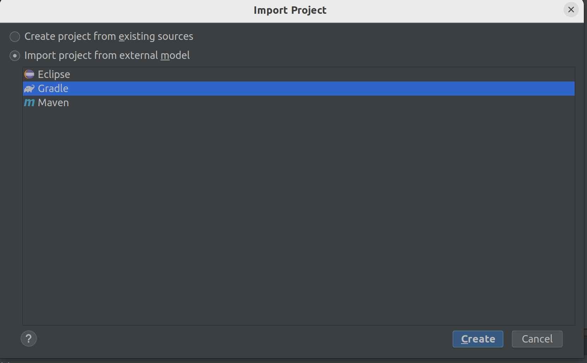
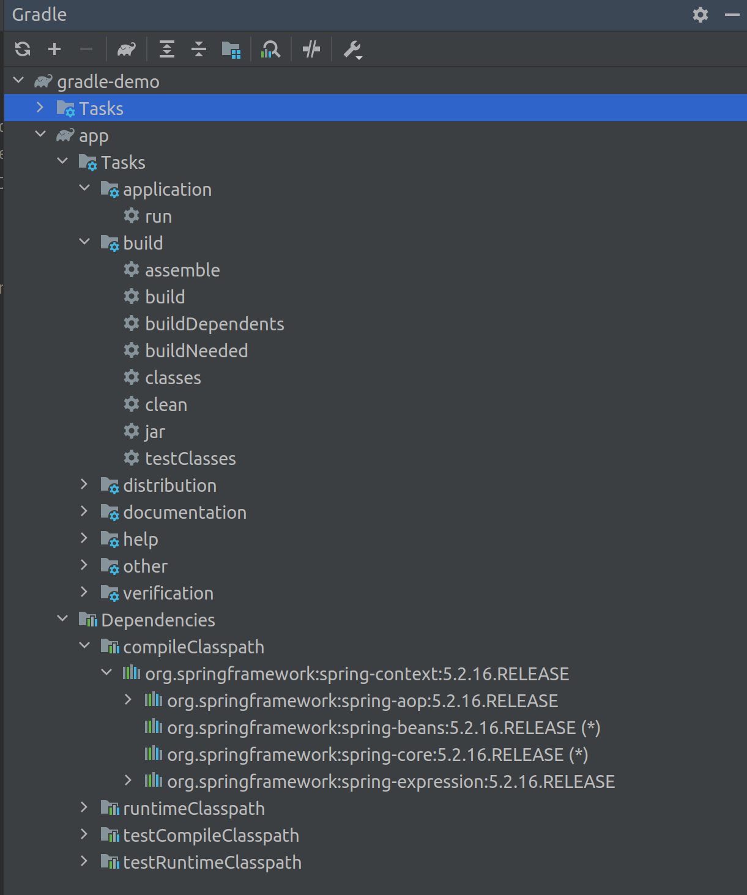
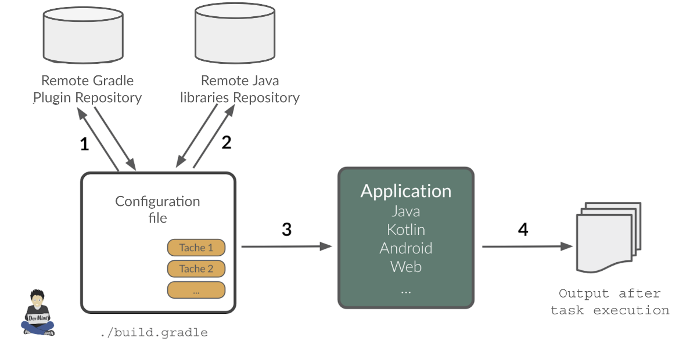
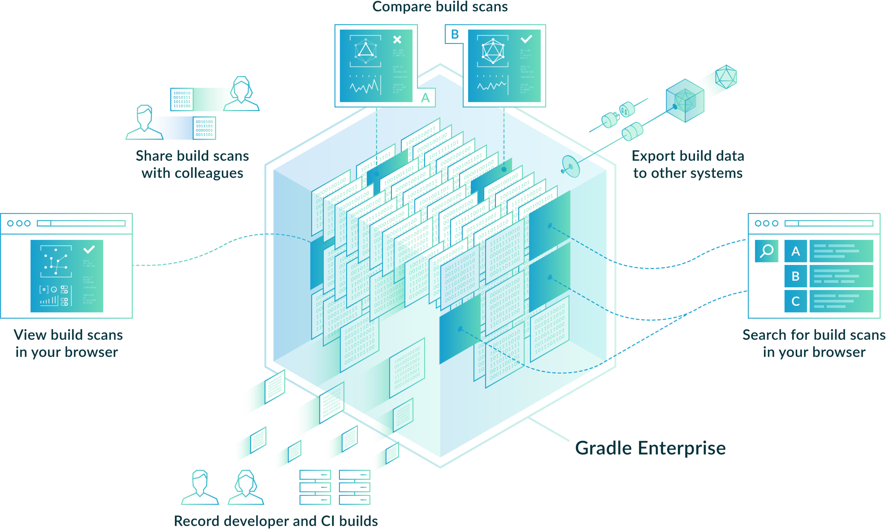
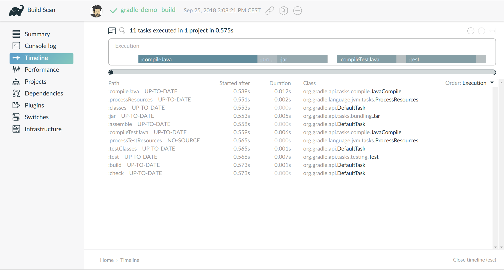

:doctitle: Gradle en pratique (FR)
:description: Comment construire une application Java interfacée à une base de données et exposant des services REST
:keywords: Gradle
:author: Guillaume EHRET - Dev-Mind
:revdate: 2018-10-02
:category: Web
:teaser: Dans ce cours nous allons voir ce qu'est Gradle et comment nous pouvons l'utiliser dans nos projets. Ce n'est qu'une présentation succinte des possibilités offertes par cet outil et vous trouverez plus de documentation sur le site officiel.
:imgteaser: ../../img/training/gradle.png
:toc:

Dans ce cours nous allons voir ce qu'est Gradle et comment nous pouvons l'utiliser dans nos projets. Ce n'est qu'une présentation succinte des possibilités offertes par cet outil et vous trouverez plus de documentation sur le site officiel https://docs.gradle.org/current/userguide/userguide.html

image::../../img/training/gradle.png[Gradle by Dev-Mind]

Gradle est un outil open-source permettant d'automatiser la construction de vos projets Java, Kotlin, Android, Web... Il est dans la même lignée que des outils comme Ant et Maven mais il a la souplesse de Ant tout en apportant de nombreuses conventions comme Maven.

Maven permet de construire un projet principal. Gradle a été pensé pour construire plusieurs projets sous projets en même temps et de construire plusieurs livrables. L'exemple le plus courant est sur Android où les projets proposant une partie gratuite et une payante sont gérés via Gradle. L'outil est capable de construire plusieurs livrables.

== Introduction

*Hautement personnalisable* +
[.small]#vous avez une convention par défaut mais tout est personnlisable. Les scripts sont écrits en Groovy ou en Kotlin#

*Rapide*  +
[.small]#Construction incrémentale : on ne relance que les parties qui ont été modifiées. Il est aussi capable de lancer des tâches en parallèle#

*Puissant* +
[.small]#Gradle supporte de nombreux langages mais il doit sa popularité aux bénéfices apportés aux développeurs Android#

*Pratique* +
[.small]#Basé sur Ivy il simplifie la gestion des dépendances des projets et permet de les gérer transitivement#

== Pourquoi un outil de build ?

Write once, run everywhere

Pour compiler votre projet

Pour générer le ou les livrables de votre application (apk, jar, war...)

Pour exécuter les tests

Pour générer de la documentation et des rapports

Pour déployer

...

== Utilisation

* En ligne de commande
* Dans votre IDE (outil de dev) comme NetBeans, Eclipse ou IntelliJ
* La documentation en ligne est très complète https://docs.gradle.org/current/userguide/userguide.html

== Principe

* Gradle n'est pas le premier outil. Maven était l'outil le plus utilisé avant
* Mais Maven
** est verbeux (utilise XML)
** n'est pas très souple (gouvernance et exécution)

== Démarrer avec Gradle

Une manière simple d'initialiser un projet

[source,shell]
----
mkdir gradle-demo
gradle init
----

Vous devez avoir le retour suivant

[source,shell]
----
❯ gradle init
Starting a Gradle Daemon (subsequent builds will be faster)

BUILD SUCCESSFUL in 3s
2 actionable tasks: 2 executed
----

Gradle a généré l'arborescence suivante

[source,shell]
----
|-- build.gradle  // <1>
|-- gradle
|   | -- wrapper
|       | -- gradle-wrapper.jar  // <2>
|       | -- gradle-wrapper.properties  // <3>
|-- gradlew  // <4>
|-- gradlew.bat  // <5>
|-- settings.gradle  // <6>
----

[.small]#1. Script de configuration de Gradle pour le projet +
2. Le jar permettant d'exécuter Gradle via le wrapper +
3. Le fichier de configuration du wrapper +
4. et 5. Script permettant de lancer Gradle via le wrapper pour Unix et Windows +
6. Configuration générale du build (permet de déclarer les sous modules par exemple)#

== Le wrapper Gradle

Quand vous utilisez un outil de build, tous les membres de l'équipe doivent utiliser la même version.

D'un projet à l'autre vous pouvez avoir des versions différentes de l'outil.

Le wrapper Gradle répond à cette problématique

Fixe une version de Gradle à un projet

Fournit les utilitaires pour se télécharger automatiquement, même si vous n'avez pas Gradle en local

image::../../img/training/gradle/wrapper.png[width=100%]

[.code-height]
[source,shell]
----
$ ./gradlew -v
Downloading https://services.gradle.org/distributions/gradle-5.6.2-bin.z
ip......................................................................
........................................................................
........................................................................
Unzipping /home/devmind/.gradle/wrapper/dists/gradle-5.6.2-bin/dajvke9o8
kmaxbu0kc5gcgeju/gradle-5.6.2-bin.zip to /home/devmind/.gradle/wrapper/d
ists/gradle-5.6.2-bin/dajvke9o8kmaxbu0kc5gcgeju

Set executable permissions for: /home/devmind/.gradle/wrapper/dists/grad
le-5.6.2-bin/dajvke9o8kmaxbu0kc5gcgeju/gradle-5.6.2/bin/gradle

------------------------------------------------------------
Gradle 5.6.2
------------------------------------------------------------

Build time:   2017-10-02 15:36:21 UTC
Revision:     a88ebd6be7840c2e59ae4782eb0f27fbe3405ddf

Groovy:       2.4.12
Ant:          Apache Ant(TM) version 1.9.6 compiled on June 29 2015
JVM:          1.8.0_181 (Oracle Corporation 25.181-b13)
OS:           Linux 4.15.0-34-generic amd64
----

== Un exemple

Faire un clone du projet Github https://github.com/Dev-Mind/gradle-demo.git

Aller dans IntelliJ dans le menu `File` → `New` → `Project From Existing Sources`

[source,shell]
----
|-- build.gradle
|-- gradle
|   | -- wrapper
|       | -- gradle-wrapper.jar
|       | -- gradle-wrapper.properties
|-- src
|   | -- main
|       | -- java
|       | -- resources
|   | -- test
|       | -- java
|       | -- resources
|-- gradlew
|-- gradlew.bat
|-- settings.gradle
----

Le projet est un projet Java et nous utilisons le plugin Java fournit par Gradle

[source,groovy]
----
// Apply the java plugin to add support for Java
apply plugin: 'java'

// In this section you declare where to find the dependencies of your
// project
repositories {
    // Use 'jcenter' for resolving your dependencies.
    // You can declare any Maven/Ivy/file repository here.
    jcenter()
}

dependencies {
    // Dependencies for production
    compile 'org.springframework:spring-context:5.0.7.RELEASE'

    // Dependencies for test
    testCompile 'junit:junit:4.12'
}
----

Vous pouvez maintenant lancer la commande

[source,shell]
----
$ ./gradlew build
Starting a Gradle Daemon (subsequent builds will be faster)

BUILD SUCCESSFUL in 4s
5 actionable tasks: 5 executed
----

Gradle exécute des tâches et ici via le plugin Java il en a lancé 5 pour construire le projet

Intelli J donne une vue synthétique des dépendances et des tâches dans l'IDE

[.small]
[.code-height]
[source,shell]
----
$ ./gradlew tasks --all

------------------------------------------------------------
All tasks runnable from root project
------------------------------------------------------------

Build tasks
-----------
assemble - Assembles the outputs of this project.
build - Assembles and tests this project.
buildDependents - Assembles and tests this project and all projects that depend on it.
buildNeeded - Assembles and tests this project and all projects it depends on.
classes - Assembles main classes.
clean - Deletes the build directory.
jar - Assembles a jar archive containing the main classes.
testClasses - Assembles test classes.

Build Setup tasks
-----------------
init - Initializes a new Gradle build.
wrapper - Generates Gradle wrapper files.

Documentation tasks
-------------------
javadoc - Generates Javadoc API documentation for the main source code.

Help tasks
----------
buildEnvironment - Displays all buildscript dependencies declared in root project 'gradle-demo'.
components - Displays the components produced by root project 'gradle-demo'. [incubating]
dependencies - Displays all dependencies declared in root project 'gradle-demo'.
dependencyInsight - Displays the insight into a specific dependency in root project 'gradle-demo'.
dependentComponents - Displays the dependent components of components in root project 'gradle-demo'. [incubating]
help - Displays a help message.
model - Displays the configuration model of root project 'gradle-demo'. [incubating]
projects - Displays the sub-projects of root project 'gradle-demo'.
properties - Displays the properties of root project 'gradle-demo'.
tasks - Displays the tasks runnable from root project 'gradle-demo'.

Verification tasks
------------------
check - Runs all checks.
test - Runs the unit tests.

Other tasks
-----------
compileJava - Compiles main Java source.
compileTestJava - Compiles test Java source.
processResources - Processes main resources.
processTestResources - Processes test resources.

Rules
-----
Pattern: clean<TaskName>: Cleans the output files of a task.
Pattern: build<ConfigurationName>: Assembles the artifacts of a configuration.
Pattern: upload<ConfigurationName>: Assembles and uploads the artifacts belonging to a configuration.

BUILD SUCCESSFUL in 0s
1 actionable task: 1 executed

----

== Fonctionnement de Gradle

[.small]#1. Gradle se connecte à un dépôt de plugin pour les charger. Un plugin amène un ensemble de tâches +
2. Gradle se connecte à un dépôt de librairies et récupère celles déclarées pour l'exécution et les tests  +
3. Une tâche va agir avec notre application +
4. Une tâche a un résultat (OK, KO, suppression répertoire, packaging jar...)#

Un projet managé par Gradle c'est donc un fichier de configuration qui va indiquer
[.small]#* comment charger des plugins Gradle qui amènent un ensemble de tâches +
* comment charger des dépendances de notre projet +
* les tâches définissent un cycle de vie +
* le tout se configure via un DSL (Domain Specific Language)#

== Tâche

Il existe de nombreuses tâches prédéfinies

Définit ce qu'il faut faire sur un ensemble de ressources

Une tâche peut dépendre d'une ou plusieurs tâches.

Gradle crée un DAG (Directed Acyclic Graph) qui définit un chemin pour arriver à une tâche

Ajoutez ces lignes à votre fichier `build.gradle`

[.small]
[source,shell]
----
task hello {
    doLast {
        println 'Hello'
    }
}

task world(dependsOn: hello) {
    doLast {
        println 'World'
    }
}
----

Testez en lançant ces tâches

[source,shell]
----
$ ./gradlew hello
$ ./gradlew world
----

== Cycle de vie

Un build Gradle a 3 phases distinctes

*Initialization* +
[.small]#Gradle détermine quels projets sont impliquées dans le build. Un projet peut avoir des sous projets qui ont tous un build.gradle.#

*Configuration* +
[.small]#Gradle parse le fichier de configuration `build.gradle` (ou plusieurs si des sous projets). Gradle a donc son arbre des tâches#

*Execution*
[.small]#Gradle exécute une ou plusieurs tâches (arguments passés à `./gradlew`) en fonction de ce graphe des tâches. Il détermine l'ensemble des tâches dont dépend la tâche ciblée. Il les exécute une à une dans l'ordre défini dans le graphe.#

== Plugins

Un plugin apporte un ensemble de tâches à un projet et des points d'entrée pour configurer le plugin

[source,groovy]
----
apply plugin : 'java'
----

Effect of this line :

image::../../img/training/gradle/pluginJava.png[Fonctionnement de Gradle, width=100%]
[.small]#https://docs.gradle.org/current/userguide/img/javaPluginTasks.png#

[%notitle]
== Autre exemple

[.small]
[.code-height]
[source,shell]
----
buildscript {
    repositories {
        repositories { // <1>
            mavenCentral()
        }
        dependencies {
            classpath("org.springframework.boot:spring-boot-gradle-plugin:2.0.4.RELEASE") // <2>
        }
    }
    repositories {
        mavenCentral() // <1>
    }
    apply plugin: 'org.springframework.boot' // <3>
    apply plugin: 'io.spring.dependency-management' // <3>
    dependencies {
        compile('org.springframework.boot:spring-boot-starter-web')
        testCompile('org.springframework.boot:spring-boot-starter-test')
    }
    bootRun{ // <4>
        sourceResources sourceSets.main
    }
}
----
[.small]#1. Déclaration des dépôts distants pour les plugins et les dépendances +
2. Déclaration d'une dépendance vers un plugin externe  +
3. Utilisation de ce plugin +
4. Personnalisation du plugin +
Chaque plugin est documenté https://docs.spring.io/spring-boot/docs/2.0.5.RELEASE/gradle-plugin/reference/html/#

== Tâches

Ouvrez le projet `gradle-demo` dans IntelliJ et ajouter le code suivant

[.small]
[.code-height]
[source,shell]
----
println 'This is executed during the configuration phase.'

task configured {
    println 'This (configured) is also executed during the configuration phase.'
}

task testWrite {
    doLast {
        println 'This (testWrite) is executed during the execution phase.'
    }
}

task testWriteBoth {
    doFirst {
        println 'This (testWriteBoth) is executed first during the execution phase.'
    }
    doLast {
        println 'This (testWriteBoth) is executed last during the execution phase.'
    }
    println 'This (testWriteBoth) is executed during the configuration phase as well.'
}
----

Lancez successivement
[source,shell]
----
$ ./gradlew tasks
----

Puis
[source,shell]
----
$ ./gradlew testWrite
----

Et
[source,shell]
----
$ ./gradlew testWriteBoth
----

Essayez de comprendre ce qu'il se passe ?

[.small]
[.code-height]
[source,shell]
----
$ ./gradlew tasks

> Configure project :
This is executed during the configuration phase.
This (configured) is also executed during the configuration phase.
This (testWriteBoth) is executed during the configuration phase as well.

> Task :tasks

------------------------------------------------------------
All tasks runnable from root project
------------------------------------------------------------

Build tasks
-----------
assemble - Assembles the outputs of this project.
build - Assembles and tests this project.
buildDependents - Assembles and tests this project and all projects that depend on it.
buildNeeded - Assembles and tests this project and all projects it depends on.
classes - Assembles main classes.
clean - Deletes the build directory.
jar - Assembles a jar archive containing the main classes.
testClasses - Assembles test classes.

Build Setup tasks
-----------------
init - Initializes a new Gradle build.
wrapper - Generates Gradle wrapper files.

Documentation tasks
-------------------
javadoc - Generates Javadoc API documentation for the main source code.

Help tasks
----------
buildEnvironment - Displays all buildscript dependencies declared in root project 'gradle-demo'.
components - Displays the components produced by root project 'gradle-demo'. [incubating]
dependencies - Displays all dependencies declared in root project 'gradle-demo'.
dependencyInsight - Displays the insight into a specific dependency in root project 'gradle-demo'.
dependentComponents - Displays the dependent components of components in root project 'gradle-demo'. [incubating]
help - Displays a help message.
model - Displays the configuration model of root project 'gradle-demo'. [incubating]
projects - Displays the sub-projects of root project 'gradle-demo'.
properties - Displays the properties of root project 'gradle-demo'.
tasks - Displays the tasks runnable from root project 'gradle-demo'.

Verification tasks
------------------
check - Runs all checks.
test - Runs the unit tests.

Rules
-----
Pattern: clean<TaskName>: Cleans the output files of a task.
Pattern: build<ConfigurationName>: Assembles the artifacts of a configuration.
Pattern: upload<ConfigurationName>: Assembles and uploads the artifacts belonging to a configuration.

To see all tasks and more detail, run gradlew tasks --all

To see more detail about a task, run gradlew help --task <task>
----

== Dépendances

Comme nous l'avons vu précédemment il existe plusieurs types de dépendances

Plugins
[.small]
[source,shell]
----
buildscript {
    repositories {
        dependencies {
            classpath("org.springframework.boot:spring-boot-gradle-plugin:2.0.4.RELEASE") // <2>
        }
    }
}
----

Librairies Java pour le code ou les tests
[.small]
[source,shell]
----
dependencies {
    compile('org.springframework.boot:spring-boot-starter-web:2.0.4.RELEASE')
    testCompile('org.springframework.boot:spring-boot-starter-test:2.0.4.RELEASE')
}
----

[.small]
[.code-height]
[source,shell]
----
$ ./gradlew dependencies

> Task :dependencies

------------------------------------------------------------
Root project
------------------------------------------------------------

apiElements - API elements for main. (n)
No dependencies

archives - Configuration for archive artifacts.
No dependencies

compile - Dependencies for source set 'main' (deprecated, use 'implementation ' instead).
\--- org.springframework:spring-context:5.0.7.RELEASE
     +--- org.springframework:spring-aop:5.0.7.RELEASE
     |    +--- org.springframework:spring-beans:5.0.7.RELEASE
     |    |    \--- org.springframework:spring-core:5.0.7.RELEASE
     |    |         \--- org.springframework:spring-jcl:5.0.7.RELEASE
     |    \--- org.springframework:spring-core:5.0.7.RELEASE (*)
     +--- org.springframework:spring-beans:5.0.7.RELEASE (*)
     +--- org.springframework:spring-core:5.0.7.RELEASE (*)
     \--- org.springframework:spring-expression:5.0.7.RELEASE
          \--- org.springframework:spring-core:5.0.7.RELEASE (*)

compileClasspath - Compile classpath for source set 'main'.
\--- org.springframework:spring-context:5.0.7.RELEASE
     +--- org.springframework:spring-aop:5.0.7.RELEASE
     |    +--- org.springframework:spring-beans:5.0.7.RELEASE
     |    |    \--- org.springframework:spring-core:5.0.7.RELEASE
     |    |         \--- org.springframework:spring-jcl:5.0.7.RELEASE
     |    \--- org.springframework:spring-core:5.0.7.RELEASE (*)
     +--- org.springframework:spring-beans:5.0.7.RELEASE (*)
     +--- org.springframework:spring-core:5.0.7.RELEASE (*)
     \--- org.springframework:spring-expression:5.0.7.RELEASE
          \--- org.springframework:spring-core:5.0.7.RELEASE (*)

compileOnly - Compile only dependencies for source set 'main'.
No dependencies

default - Configuration for default artifacts.
\--- org.springframework:spring-context:5.0.7.RELEASE
     +--- org.springframework:spring-aop:5.0.7.RELEASE
     |    +--- org.springframework:spring-beans:5.0.7.RELEASE
     |    |    \--- org.springframework:spring-core:5.0.7.RELEASE
     |    |         \--- org.springframework:spring-jcl:5.0.7.RELEASE
     |    \--- org.springframework:spring-core:5.0.7.RELEASE (*)
     +--- org.springframework:spring-beans:5.0.7.RELEASE (*)
     +--- org.springframework:spring-core:5.0.7.RELEASE (*)
     \--- org.springframework:spring-expression:5.0.7.RELEASE
          \--- org.springframework:spring-core:5.0.7.RELEASE (*)

implementation - Implementation only dependencies for source set 'main'. (n)
No dependencies

runtime - Runtime dependencies for source set 'main' (deprecated, use 'runtimeOnly ' instead).
\--- org.springframework:spring-context:5.0.7.RELEASE
     +--- org.springframework:spring-aop:5.0.7.RELEASE
     |    +--- org.springframework:spring-beans:5.0.7.RELEASE
     |    |    \--- org.springframework:spring-core:5.0.7.RELEASE
     |    |         \--- org.springframework:spring-jcl:5.0.7.RELEASE
     |    \--- org.springframework:spring-core:5.0.7.RELEASE (*)
     +--- org.springframework:spring-beans:5.0.7.RELEASE (*)
     +--- org.springframework:spring-core:5.0.7.RELEASE (*)
     \--- org.springframework:spring-expression:5.0.7.RELEASE
          \--- org.springframework:spring-core:5.0.7.RELEASE (*)

runtimeClasspath - Runtime classpath of source set 'main'.
\--- org.springframework:spring-context:5.0.7.RELEASE
     +--- org.springframework:spring-aop:5.0.7.RELEASE
     |    +--- org.springframework:spring-beans:5.0.7.RELEASE
     |    |    \--- org.springframework:spring-core:5.0.7.RELEASE
     |    |         \--- org.springframework:spring-jcl:5.0.7.RELEASE
     |    \--- org.springframework:spring-core:5.0.7.RELEASE (*)
     +--- org.springframework:spring-beans:5.0.7.RELEASE (*)
     +--- org.springframework:spring-core:5.0.7.RELEASE (*)
     \--- org.springframework:spring-expression:5.0.7.RELEASE
          \--- org.springframework:spring-core:5.0.7.RELEASE (*)

runtimeElements - Elements of runtime for main. (n)
No dependencies

runtimeOnly - Runtime only dependencies for source set 'main'. (n)
No dependencies

testCompile - Dependencies for source set 'test' (deprecated, use 'testImplementation ' instead).
+--- org.springframework:spring-context:5.0.7.RELEASE
|    +--- org.springframework:spring-aop:5.0.7.RELEASE
|    |    +--- org.springframework:spring-beans:5.0.7.RELEASE
|    |    |    \--- org.springframework:spring-core:5.0.7.RELEASE
|    |    |         \--- org.springframework:spring-jcl:5.0.7.RELEASE
|    |    \--- org.springframework:spring-core:5.0.7.RELEASE (*)
|    +--- org.springframework:spring-beans:5.0.7.RELEASE (*)
|    +--- org.springframework:spring-core:5.0.7.RELEASE (*)
|    \--- org.springframework:spring-expression:5.0.7.RELEASE
|         \--- org.springframework:spring-core:5.0.7.RELEASE (*)
\--- junit:junit:4.12
     \--- org.hamcrest:hamcrest-core:1.3

testCompileClasspath - Compile classpath for source set 'test'.
+--- org.springframework:spring-context:5.0.7.RELEASE
|    +--- org.springframework:spring-aop:5.0.7.RELEASE
|    |    +--- org.springframework:spring-beans:5.0.7.RELEASE
|    |    |    \--- org.springframework:spring-core:5.0.7.RELEASE
|    |    |         \--- org.springframework:spring-jcl:5.0.7.RELEASE
|    |    \--- org.springframework:spring-core:5.0.7.RELEASE (*)
|    +--- org.springframework:spring-beans:5.0.7.RELEASE (*)
|    +--- org.springframework:spring-core:5.0.7.RELEASE (*)
|    \--- org.springframework:spring-expression:5.0.7.RELEASE
|         \--- org.springframework:spring-core:5.0.7.RELEASE (*)
\--- junit:junit:4.12
     \--- org.hamcrest:hamcrest-core:1.3

testCompileOnly - Compile only dependencies for source set 'test'.
No dependencies

testImplementation - Implementation only dependencies for source set 'test'. (n)
No dependencies

testRuntime - Runtime dependencies for source set 'test' (deprecated, use 'testRuntimeOnly ' instead).
+--- org.springframework:spring-context:5.0.7.RELEASE
|    +--- org.springframework:spring-aop:5.0.7.RELEASE
|    |    +--- org.springframework:spring-beans:5.0.7.RELEASE
|    |    |    \--- org.springframework:spring-core:5.0.7.RELEASE
|    |    |         \--- org.springframework:spring-jcl:5.0.7.RELEASE
|    |    \--- org.springframework:spring-core:5.0.7.RELEASE (*)
|    +--- org.springframework:spring-beans:5.0.7.RELEASE (*)
|    +--- org.springframework:spring-core:5.0.7.RELEASE (*)
|    \--- org.springframework:spring-expression:5.0.7.RELEASE
|         \--- org.springframework:spring-core:5.0.7.RELEASE (*)
\--- junit:junit:4.12
     \--- org.hamcrest:hamcrest-core:1.3

testRuntimeClasspath - Runtime classpath of source set 'test'.
+--- org.springframework:spring-context:5.0.7.RELEASE
|    +--- org.springframework:spring-aop:5.0.7.RELEASE
|    |    +--- org.springframework:spring-beans:5.0.7.RELEASE
|    |    |    \--- org.springframework:spring-core:5.0.7.RELEASE
|    |    |         \--- org.springframework:spring-jcl:5.0.7.RELEASE
|    |    \--- org.springframework:spring-core:5.0.7.RELEASE (*)
|    +--- org.springframework:spring-beans:5.0.7.RELEASE (*)
|    +--- org.springframework:spring-core:5.0.7.RELEASE (*)
|    \--- org.springframework:spring-expression:5.0.7.RELEASE
|         \--- org.springframework:spring-core:5.0.7.RELEASE (*)
\--- junit:junit:4.12
     \--- org.hamcrest:hamcrest-core:1.3

testRuntimeOnly - Runtime only dependencies for source set 'test'. (n)
No dependencies

(*) - dependencies omitted (listed previously)

BUILD SUCCESSFUL in 0s
1 actionable task: 1 executed

----

image::../../img/training/gradle/dependencies.png[Dependances, width=100%]

[.small]#1. Gradle regarde dans son cache si la dépendance est présente +
2. Il analyse le ou les dépôts distants donnés, télécharge la dépendance et la stocke dans le cache  +
3. La dépendance peut être fournie au projet +
4. Si cette dépendance Gradle les charge de manière transitive#

Quand une dépendance doit être chargée

* Les répertoires sont analysés dans l'ordre de définition.
* On peut utiliser des dépôts Maven ou Ivy
* Si le numéro de version est dynamique comme 1.+ Gradle prendra la version 1 la plus haute (par exemple 1.3) => mauvaise pratique
* Si la cible est un dépôt Maven et que le pom.xml a un parent, Gradle essaie de charger ces derniers

== Build scan

Gradle fournit un outil en ligne pour pouvoir analyser ses builds.

Cet outil prend toute sa puissance avec Gradle Entreprise mais des informations sont mises à disposition librement

Vous devez modifier votre fichier `build.gradle` et ajouter

[source,shell]
----
plugins {
    id 'com.gradle.build-scan' version '1.16'
}

buildScan {
    termsOfServiceUrl = 'https://gradle.com/terms-of-service';
    termsOfServiceAgree = 'yes'
}
----

Vous pouvez maintenant lancer un build scan

[source,shell]
----
$ ./gradlew build --scan

BUILD SUCCESSFUL in 0s
5 actionable tasks: 5 up-to-date

Publishing build scan...
https://gradle.com/s/cyyg2brvlolaa
----

Cliquez sur le lien et renseignez un email

image::../../img/training/gradle/build-scan-report2.png[Raport build scan, width=100%]

image::../../img/training/gradle/build-scan-report3.png[Raport build scan, width=100%]

