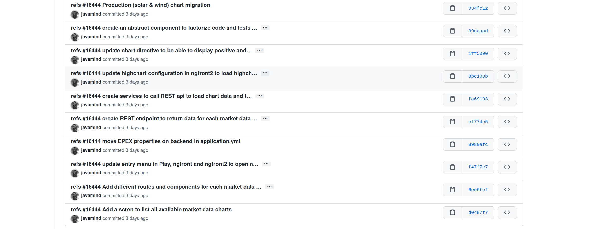

:doctitle: Managing your sources with Git
:description: Quels sont les outils à installer pour être un développeur full stack, Java Android et Web
:keywords: Développement, Source
:author: Guillaume EHRET - Dev-Mind
:revdate: 2022-02-01
:category: Git
:teaser:  This course presents Git and Github. Git is used to centralize and log the changes on your code.
:imgteaser: ../../img/training/git.png
:toc:

This course presents Git & Github.Git is used to centralize and log the changes on your code.

image::../../img/training/git.png[Comprendre Git, width=800, align="center"]

For information about Git you can find

* a summary of the main instructions  https://education.github.com/git-cheat-sheet-education.pdf
* official documentation https://git-scm.com/docs

== For who, why ?

A version control system (VCS: version control system) helps to *manage the history* of the changes made by people, teams, or only one person who collaborate on a project.

When the project evolves people can at any time find an old version of the code.

Git answers these questions quickly

* What changes have been made?
* Who made the changes?
* When were the changes made?
* Why were the changes made?

> Git is a decentralized source management software (DVCS) created in 2005 by Linus Torvald (creator of the Linux kernel).
The sources are stored both on the computer of each contributor of the project, but also on a centralized server.

.logo Git

Today, most of the open source or commercial projects developed use Git (90% of developers, according last https://insights.stackoverflow.com/survey/2018#work-_-version-control[stackoverflow] insights).

Git allows access to all files, branches, versions (releases) or tags of a project to authorized people.

Basically you don't need a centralized solution with Git, but online solutions have emerged like https://github.com[Github] or https://about.gitlab.com/[Gitlab].

.logo Github

.logo Gitlab
image::../../img/training/outil/gitlab.svg[Gitlab]

This services extend Git and they offer more features like pull requests, code reviews... https://github.com[Github] was the precursor but today https://about.gitlab.com/[Gitlab] is equivalent, and you can use the one you prefer.
As I had to make a choice for our course I went to Github.

== What did we ever do before ?

Without Git it was difficult to follow the history, we had multiple copies of project

Early solutions, like CSV or SVN (Subversion) were quickly limited.
It was often awful to refactor your code because of their limitations

== What's a repository ?

> A Git repository contains all the files and directories associated with your project but you they contain also all the history of the modifications made on each one.

Publishing changes is called a commit.Each commit is linked to another (this is a chained list).Commits can be organized into several parallel branches

Projects are stand-alone units, and anyone with a copy of the repository can access the entire code and its history.You can do different operations like logging, cloning, branch creation, commit, merging ...

.Centralized repository, local repository

Generally on a project we have a main branch `main`.And we open different branches in parallel to fix bugs, add new features.These branches are merged on this main branch when they are completes

.Branch Principle
image::../../img/training/outil/git-branch.png[Github, width=800, align="center"]

== Install Git

If you use Windows, you can download Git here https://git-scm.com/downloads

On a Linux (Fedora)

[source,shell]
----
sudo yum install git
----

On Linux (Debian, Ubuntu) use
[source,shell]
----
sudo apt-get install git
----

To check your install, display the git version in terminal

[source,shell]
----
~$ git --version

git version 2.32.0
----

It's important to provide some information to Git, especially when you push your changes to a centralized repository.

[source,shell,subs="specialchars"]
----
~$ git config --global user.name "Guillaume EHRET Dev-Mind"
~$ git config --global user.email "guillaume@dev-mind.fr"
----

=== Recover a Git project

Go in your working directory, and in a terminal type

[source,shell]
----
~$ git clone https://github.com/Dev-Mind/git-demo.git
----
The remote project `git-demo` is downloaded on your computer. You get all the history, all the files, all the branches ...

===  Initialize a Git repository

It's better to start from 0. Delete the directory to recreate it

[source,shell]
----
~$ cd ..
~$ rm -rf git-demo
~$ mkdir git-demo
----

To link this directory to Git, launch

[source,shell]
----
~$ git init

Initialized empty Git repository in /home/devmind/Workspace/java/git-demo/.git/
----
A `.git` directory has been added and it contains the different files, logs, traces

[source,shell]
----
~$ cd git-demo/
~$ ls -la
total 28
drwxr-xr-x  3 devmind devmind  4096 sept. 26 22:46 .
drwxr-xr-x 10 devmind devmind  4096 sept. 26 22:46 ..
drwxr-xr-x  8 devmind devmind  4096 sept. 26 22:46 .git
----

=== Linking files to Git
Let's start by creating files in this `git-demo` directory

[source,shell,subs="specialchars"]
----
~$ echo "Hello world" > hello.txt
~$ echo "<html><body><h1>Hello World</h1></body></html>" > hello.html
~$ echo "Hello world" > hello.md
~$ ls
hello.html  hello.txt  hello.md
----

Use the `git add` command to indicate that a new or multiple files will be handled by git.

[source,shell]
----
~$ git add hello.txt (1)
~$ git add .         (2)
----

[.small]#1. Adds hello.txt file +
2. Adds all the files#

At this moment, our files are not saved in Git.They are in a staging area.We have only a snapshot of the changes

=== Saving modifications

The following command saves the snapshot in the project history and completes the change tracking process.In short, a commit works like taking a photo.We freeze in time what we have done.

[source,shell]
----
~$ git commit -m "First commit"     (1)

[main a7d5b84] First commit       (2)
 3 files changed, 3 insertions(+)
 create mode 100644 hello.html
 create mode 100644 hello.md
 create mode 100644 hello.txt
----

1. `-m` to add a message.
It's very important to be able to understand why a commit was made
2. Git displays the name of the branch => `main` and the hash of the commit` a7d5b84` (this is the number of the photo)

> Our Git history is a living, ever-changing, searchable record that tells the story of how and why our code is the way it is.
It's important to explain the purpose of a commit.And try to commit often your work.
It is a security if you want to restore your work.
For example

=== Know the current state

We will delete the `hello.txt` file, update` hello.md` and add a `hello.adoc` file

[source,shell,linenums,subs=""]
----
~$ rm hello.md
~$ echo "My first Git example" > hello.md
~$ echo "Hello World" > hello.adoc
----

Launch the following command to know where Git is

[source,shell]
----
~$ git status
----

What do you see ?

[source,shell]
----
~$ git add .
~$  git commit -m "Second commit"

[main 7b7d8e6] Second commit
 3 files changed, 2 insertions(+), 2 deletions(-)
 create mode 100644 hello.adoc
 delete mode 100644 hello.txt
----

[source,shell]
----
~$ git status
----

What do you see ?

=== See history

Use the log command
[source,shell,linenums,subs="specialchars"]
----
~$ git log

commit 7b7d8e69a06af284c9da7aa4a8c28835d23318fe (HEAD -> main)
Author: Guillaume EHRET Dev-Mind <guillaume@dev-mind.fr>
Date:   Wed Sep 26 23:22:46 2018 +0200

    Second commit

commit a7d5b843ebc65ac6e94c37872d6a936e1c03a6b5
Author: Guillaume EHRET Dev-Mind <guillaume@dev-mind.fr>
Date:   Wed Sep 26 23:08:00 2018 +0200

    First commit
----

We find our two commits, with the names we have set, at what time ...

=== See current changes

We will update a file and run the `diff` command

[source,shell]
----
~$ echo "Fichier Asciidoc" > hello.adoc
~$ git diff
----

You should see, what has been added and removed in the file. When we an (IDE) we will have more visual tools for tracking changes

=== Go back in the history

You can use a `reset` to go back to the state of the last commit

[source,shell]
----
~$ git reset --hard
~$ git diff
----

== Working with branches

=== See the current branch

Run the following command to see the current branch

[source,shell,linenums,subs=""]
----
~$ git branch
* main
----

Character * shows the current branch

=== Create a branch

A branch is just a name without special characters or spaces.To create a branch we use `git branch [name]`

[source,shell]
----
~$ git branch test
~$ git branch
* main
test
----

By default the created branch is not active (it does not have *)

A prefix is often used by convention, when you want to name a branch. for example

* `fix/1233-hair-color`: a branch to correct (fix) a hair color problem. The ticket number of the bug tracker is often indicated
* `feat/add-glasses`: a branch to add a feature
* `chore/upgrade-jquery`: a branch to perform a technical task

=== Change the current branch

[source,shell]
----
~$ git checkout test
~$ git branch
main
* test
----

The `test` branch is now the default

You can make a change and save it

[source,shell]
----
~$ echo "Fichier Asciidoc updated" > hello.adoc
~$ git add .
~$ git commit -m "Third commit"
----

You can launch the following commands

[source,shell]
----
~$ git log
~$ git checkout main
~$ git log
----

What do you see ?

=== Compare 2 branches

We will reuse the `git diff` command but we specify the 2 branches separated by `...`

[source,shell]
----
~$ git diff test...main
----

This command should show nothing because `test` is based on` main` and it is just ahead, it contains all main commits

[source,shell]
----
~$ git diff main...test
----

This time, as `test` branch is the reference, Git detects that there are differences

[source,shell,linenums,subs="specialchars"]
----
~$ git log

commit 4529128a723e0a16cf405b218f37f2da58c5a9fd (HEAD -> test)  (1)
Author: Guillaume EHRET Dev-Mind <guillaume@dev-mind.fr>
Date:   Thu Sep 27 00:00:00 2018 +0200

    Third commit

commit 9fd87d1ffc654a74105f3f279032e7f88d3d265b (main)       (2)
Author: Guillaume EHRET Dev-Mind <guillaume@dev-mind.fr>
Date:   Wed Sep 26 23:51:10 2018 +0200

    Second  commit
...
----

[.small]#1. Git indicates the HEAD of the test branch +
2. Git displays the name of the parent branch ==> `main` and where it is in the history#

You can go back to `main` and create another branch` test2`

[source,shell,linenums,subs=""]
----
~$ git checkout main
~$ git branch test2
~$ git checkout test2
~$ echo "Fichier toto" > toto.adoc
~$ git add .
~$ git commit -m "Fourth commit"
----

=== Merge 2 branches

If you want to post your changes from the `test` branch to` main`, you're going to do a merge

[source,shell,linenums,subs=""]
----
~$ git checkout main
~$ git merge test
----

=== Delete a branch

You can delete a branch if this branch is not the active one

[source,shell]
----
~$ git checkout test
~$ git branch -d test
error: Cannot delete branch 'test' checked out at '/home/devmind/Workspace/java/git-demo'

~$ git checkout main
~$ git branch -d test
Deleted branch test (was 9fd87d1).
----

== Github

=== Link your local repository to a remote repository

You can install a centralized Git repository by using https://github.com/[Github Enterprise], https://gitlab.com/[Gitlab Enterprise], https://gogs.io/[Gogs].But you can also use an online service

1. Create an account under Github
2. Once you are logged in on Github,  you can create your first repository

.New project under Github

Github provides you commands to connect this remote repository to your local repository.

.commands to connect this remote repository

To link your local project type the following commands

[source,shell]
----
~$ git checkout main
~$ git remote add origin https://github.com/Dev-Mind/git-demo.git  (1)
~$ git push -u origin main                                       (2)
----

1. Git adds remote origin to your local project +
2. The push command allows to send what you have on the current branch (local main branch) on the server

> If you have a problem to use your login and password in the command line, you can follow this https://docs.github.com/en/github/authenticating-to-github/keeping-your-account-and-data-secure/creating-a-personal-access-token[documentation] to generate an access token.
When you have a token you can use it as password

Github allows teams to synchronize throughout the life of a project.
You can push any branch.

[source,shell]
----
~$ git checkout feat/new_hair
~$ git push -u origin feat/new_hair
----

These commands

* activate the `feat/new_hair` branch and
* push the changes on Github.

If you want to retrieve local changes made by your colleagues do

[source,shell]
----
~$ git pull
----

The `git fetch` command retrieves the history of all branches locally.

=== Git Project Workflow

When we are working in team, the workflow will be

*Create a branch* +
We usually create a branch from main (or another branch).
Some companies have, for example, a branch dev for the current developments, a branch `prod` that corresponding to what is in production.
Branches created on these canonical branches must have a short life duration.

*Add commits* +
Every small changes should be made as often as possible.
Each commit, within a branch creates restoration points in the project history.

*Open a pull request* +
When you pushed your changes on Github, you can open a pull request.
This allows to discuss about the current development (for example with the people who will test)

*Code Review* +
In a mature development team, your code is always read by another developers.
Your code is often also tested by other people.
Anyone can make returns on the Pull request.
You can make changes on the branch and pushed other commits to fix the review remarks.

*Merge*
+When everything is OK you can click the `Merge` button on the pull request.GitHub automatically performs the equivalent of a local 'git merge' operation.

*Deploy* +
Teams can install your updates or continue development

=== Conclusion

There's still a lot of things to say about Git and Github.Some concepts can be complex like `rebase` or `conflict resolution`.IDEs will simplify some tasks.You can find more resources on the web http://try.github.io/

This course is there to give you the basics in order to be able to realize the TP using Git.You are now able to save your sources, to share them, to find them easily from one computer to another.So enjoy with Git

