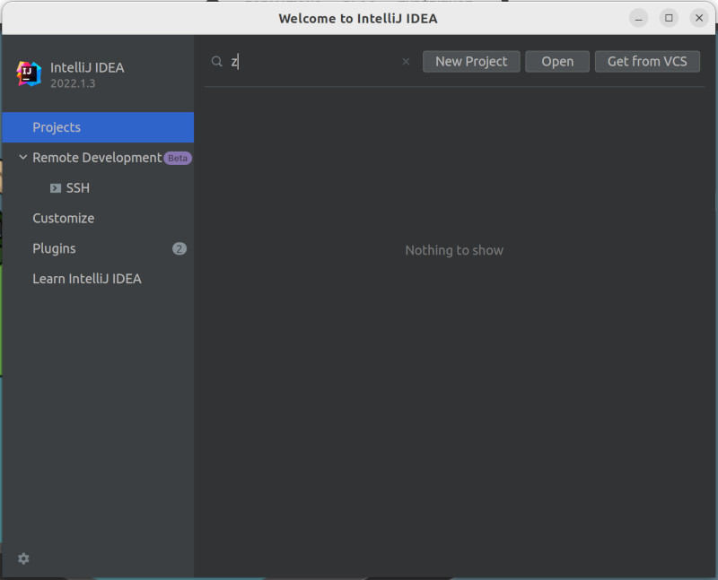
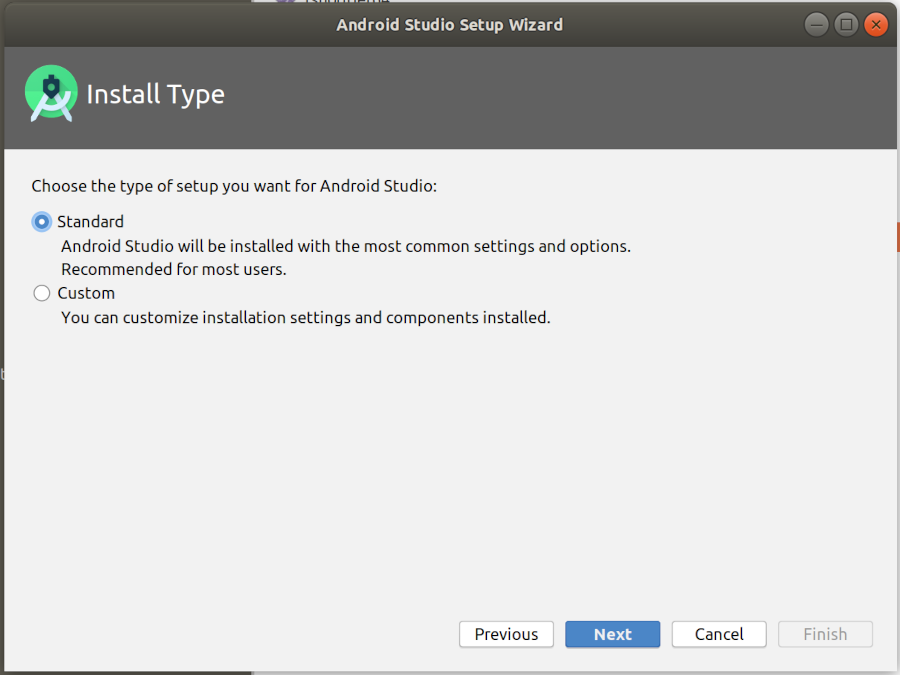
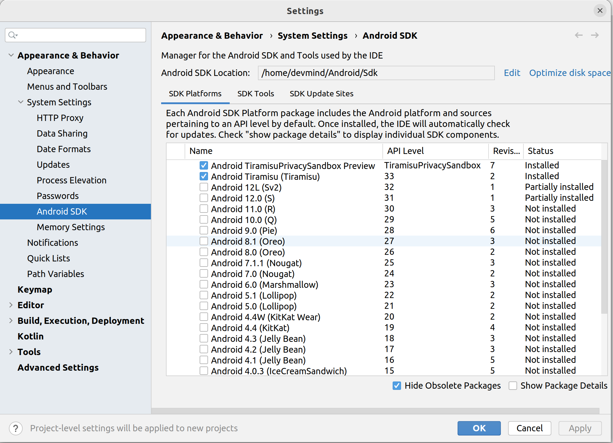

:doctitle: Prepare your working environment (EN)
:description: Quels sont les outils à installer pour être un développeur full stack, Java Android et Web
:keywords: Développement, Installation
:author: Guillaume EHRET - Dev-Mind
:revdate: 2021-09-24
:category: Java, IntelliJ
:teaser:  The aim of this part is to introduce you to the links and procedure to prepare your Java Web Developer workstation
:imgteaser: ../../img/training/environnement.png

We want to develop our own applications but how to be effective when we work ? What should I do to start? What software do I need to install? A good craftsman has good tools. It's the same for a software developer..

image::../../img/training/environnement.png[Environnement de travail, width=800, align="center"]

== Java installation

When you are a lambda user you can install a Java Runtime Environment (JRE).

To develop app, we need more tools to compile source code, monitor app execution... In this case we will use a *Java Development Kit* (JDK)

Java is released every 6 months, but only a few versions are defined as https://en.wikipedia.org/wiki/Long-term_support[LTS (long term support)].

As of September 2023, Java 19 is the last version, but we will use a Long Term Support (LTS) version as Java 11 or Java 17.

Java was created by James Gosling in 1995 in a company called Sun Microsystems. Sun was acquired by Oracle in 2010. Oracle defines the specification, and you can have several JDK editors which implements their JDK.

https://openjdk.org/[OpenJDK] (Open Java Development Kit) is a free and open-source implementation of the Java Platform, Standard Edition. You can download a version

All versions are available on this URL https://jdk.java.net/archive/

If you are running Linux (Fedora, CentOS) you can run

[source,shell]
----
~$ sudo yum install java-17-openjdk
----

under Linux (Debian, Ubuntu) you can run in a terminal

[source,shell]
----
~$ sudo apt install openjdk-17-jdk
----

On Ubuntu / Debian you can list the different versions with

[source,shell]
----
~$ apt search openjdk
----

If you have several versions of Java on Linux you can use the following command to set the default version

[source,shell]
----
~$  update-alternatives --config java
----

Check that Java is installed.
For that open a terminal

[source,shell]
----
~$  java -version
openjdk version "11.0.11" 2021-04-20
OpenJDK Runtime Environment (build 11.0.11+9-Ubuntu-0ubuntu2.20.10)
OpenJDK 64-Bit Server VM (build 11.0.11+9-Ubuntu-0ubuntu2.20.10, mixed mode, sharing)
----

== IDE installation

> An integrated development environment (IDE) is a set of tools that can increase the productivity of software developers.
It includes a text editor for programming, functions that allow to start the compiler, run tests, run executables, debug online ... There are several IDE on the market.

When you develop in Java, you have several alternatives: http://www.eclipse.org/downloads/[Eclipse], https://netbeans.org/[NetBeans], https://www.jetbrains.com/idea[IntelliJ Idea], https://code.visualstudio.com/[VS code].

After 20 years of development, I used a lot IDE.
IntelliJ Idea is for me the best one to develop in Java, but the Premium version is not free.
But *you can use the community version freely.*

*To simplify mutual aid we will all use the same IDE, IntelliJ Idea Community version. https://www.jetbrains.com/idea/download[Download] the last version.*
You can also try to obtain a free licence on this https://www.jetbrains.com/community/education/#students[link] for the premium version.

Launch your IDE to check that everything works

.logo IntelliJ
image::../../img/training/outil/idea.svg[IntelliJ]

== Android studio

Android studio is the tool we use to write Android code. If you don't follow my courses about Android, you don't need to install this tool

You need to install it on your computer (installation requires 900MB) on https://developer.android.com/studio.

=== Installation

For a Linux installation you have to go in the installation directory (for me ~/appli) with a terminal and launch script `launch.sh`

[source,shell]
----
cd ~/appli/android-studio/bin
sh ./studio.sh
----

Follow the wizard and choose a standard installation.

It's important to do that to download the last version of Android SDK, recent images for Emulator...

=== Update

If you have an existing version of Android Studio on your laptop you should update Android Sdk.
For that go on menu *Tools > SDK manager*

image::../../img/training/android/android-studio-update1.png[Menu SDK manager, width=800, align="center"]

Below on my example, I have 2 versions installed : a fully Android 9.0 and a partial Android 10.0. In my case the better choice is to uncheck these 2 versions and use the last One Android 10.0+ (version 30).

When you develop in Android you should always do it on the last SDK version.
Google requires you to always target this latest version when you publish apps to the official store.
