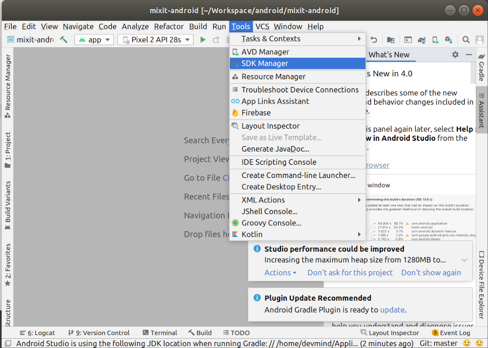

:doctitle: Prepare your working environment (EN)
:description: Quels sont les outils à installer pour être un développeur full stack, Java Android et Web
:keywords: Développement, Installation
:author: Guillaume EHRET - Dev-Mind
:revdate: 2023-11-15
:category: Java, IntelliJ
:teaser:  The aim of this part is to introduce you to the links and procedure to prepare your Java Web Developer workstation
:imgteaser: ../../img/training/environnement.png
:toc:

We want to develop our own applications but how to be effective when we work ? What should I do to start? What software do I need to install? A good craftsman has good tools. It's the same for a software developer..

image::../../img/training/environnement.png[Environnement de travail, width=800, align="center"]

== Java installation

When you are a lambda user you can install a Java Runtime Environment (JRE).

But to develop app, we need more tools to compile source code, monitor app execution... In this case we will use a *Java Development Kit* (JDK)

=== History

Java was created by James Gosling in 1995 in a company called Sun Microsystems. Sun was acquired by Oracle in 2010. Oracle defines the specification, and you can have several JDK editors which implements their JDK.

https://openjdk.org/[OpenJDK] (Open Java Development Kit) is a free and open-source implementation of the Java Platform, Standard Edition.

=== Which version ?

Java is released every 6 months, but only a few versions are defined as https://en.wikipedia.org/wiki/Long-term_support[LTS (long term support)].

As of September 2023, Java 19 is the last version, but we will use a Long Term Support (LTS) version. For the moment this version is Java 17. The next LTS version is Java 21 and the release is scheduled on September 19, 2023.

As Java 21 will be too young, we can use libraries that are not yet compatible. So please use the *Java 17 (LTS) version*.

=== JDK 17 Installation

Different companies provide a JDK version (Oracle, OpenJDK, Amazon, Microsoft...).

==== Package manager

Today it is recommended to use a package manager, a tool for managing parallel versions of multiple Software Development Kits on most Unix-based systems. We will use https://sdkman.io/[SdkMan].

If you are running Linux (Fedora, CentOS) you can run

[source,shell]
----
~$ curl -s "https://get.sdkman.io" | bash
~$ source "$HOME/.sdkman/bin/sdkman-init.sh"
----

Check the good installation with this command

[source,shell]
----
~$ sdk version

SDKMAN!
script: 5.18.2
native: 0.4.2
----

> SDKMAN requires a bash environment to run. On Windows, it can't be natively installed; you need WSL or MSYS+MinGW. Cygwin is no longer supported.

For Windows, there are two installation routes:

* WSL Approach: Install Windows Subsystem for Linux (WSL) before attempting SDKMAN installation. A basic toolset (bash, zip, unzip, curl) is necessary. Most times, it works out of the box.
* Git Bash Solution: If you use Git Bash for Windows, you'll need to supplement it with MinGW to have the required toolset for SDKMAN. There are some issues with this approach, but it works for the most part.

==== Java installation

If you are not able to install https://sdkman.io/[SdkMan] you can find a Java version on https://jdk.java.net/archive/

If https://sdkman.io/[SdkMan] is available you can list all the Java version available with this command

[source,shell]
----
~$ sdk java list
----

To install a Java version you can run

[source,shell]
----
~$ sdk install java 17.0.8-oracle
----

You can install different version of Java and you can change the default version with this command

[source,shell]
----
~$ sdk default java 17.0.8-oracle
----

Check that Java is installed.

For that open a terminal

[source,shell]
----
~$  java -version
java version "17.0.7" 2023-04-18 LTS
Java(TM) SE Runtime Environment Oracle GraalVM 17.0.7+8.1 (build 17.0.7+8-LTS-jvmci-23.0-b12)
Java HotSpot(TM) 64-Bit Server VM Oracle GraalVM 17.0.7+8.1 (build 17.0.7+8-LTS-jvmci-23.0-b12, mixed mode, sharing)
----

== IDE installation

> An integrated development environment (IDE) is a set of tools that can increase the productivity of software developers.
It includes a text editor for programming, functions that allow to start the compiler, run tests, run executables, debug online ... There are several IDE on the market.

When you develop in Java, you have several alternatives: http://www.eclipse.org/downloads/[Eclipse], https://netbeans.org/[NetBeans], https://www.jetbrains.com/idea[IntelliJ Idea], https://code.visualstudio.com/[VS code].

After 20 years of development, I used a lot IDE.
IntelliJ Idea is for me the best one to develop in Java, but the Premium version is not free.
But *you can use the community version freely.*

*To simplify mutual aid we will all use the same IDE, IntelliJ Idea Community version. https://www.jetbrains.com/idea/download[Download] the last version.*
You can also try to obtain a free licence on this https://www.jetbrains.com/community/education/#students[link] for the premium version.

Launch your IDE to check that everything works

image::../../img/training/outil/idea_welcome.jpg[IntelliJ, width=800, align="center"]

.logo IntelliJ

== Android studio

Android studio is the tool we use to write Android code. If you don't follow my courses about Android, you don't need to install this tool

You need to install it on your computer (installation requires 900MB) on https://developer.android.com/studio.

=== Installation

For a Linux installation you have to go in the installation directory (for me ~/appli) with a terminal and launch script `launch.sh`

[source,shell]
----
cd ~/appli/android-studio/bin
sh ./studio.sh
----

Follow the wizard and choose a standard installation.

It's important to do that to download the last version of Android SDK, recent images for Emulator...

image::../../img/training/android/android-studio.png[Follow wizard, width=800, align="center"]

=== Update

If you have an existing version of Android Studio on your laptop you should update Android Sdk.
For that go on menu *Tools > SDK manager*

Below on my example, I have 2 versions installed : a fully Android 9.0 and a partial Android 10.0. In my case the better choice is to uncheck these 2 versions and use the last One Android 10.0+ (version 30).

image::../../img/training/android/android-studio-update2.png[Choose SDK versions, width=800, align="center"]

When you develop in Android you should always do it on the last SDK version.
Google requires you to always target this latest version when you publish apps to the official store.
