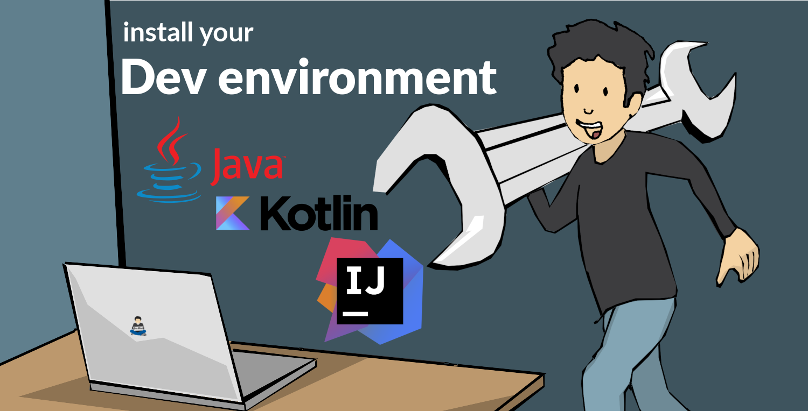
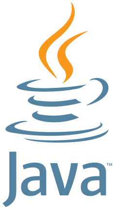

:doctitle: Prepare your working environment (EN)
:description: Quels sont les outils à installer pour être un développeur full stack, Java Android et Web
:keywords: Développement, Installation
:author: Guillaume EHRET - Dev-Mind
:revdate: 2018-09-24
:category: Java, IntelliJ
:teaser:  The aim of this part is to introduce you to the links and procedure to prepare your Java Web Developer workstation
:imgteaser: ../../img/training/environnement.png

We want to develop our own applications but how to be effective when we work ? What should I do to start? What software do I need to install? A good craftsman has good tools. It's the same for a software developer..

When you are a lambda user you can install a Java runtime environment => Java Runtime Environment. To develop, we need more tools to compile, monitor ... and we will use a Java Development Kit (JDK)

== Java installation

If you are running Linux (Fedora, CentOS) you can run

[source,shell]
----
~$ sudo yum install java-11-openjdk-devel
----

under Linux (Debian, Ubuntu) you can run

[source,shell]
----
~$ sudo apt install default-jdk
----

== Java installation (old version)

If you want to install a last version as Java 8 you can follow this section

.logo Java

You can download a version of Java 1.8+ at this http://www.oracle.com/technetwork/java/javase/downloads/jdk8-downloads-2133151.html[URL]. This is fine for Windows or Linux users (choose the rpm version)

If you are running Linux (Fedora, CentOS) you can run

[source,shell]
----
~$ cd ~/Downloads/
~$ sudo yum install jdk-8u181-linux-x64.rpm
----

under Linux (Debian, Ubuntu) you can run

[source,shell]
----
~$ cd ~/Downloads/
~$ sudo apt install alien
~$ sudo alien jdk-8u181-linux-x64.rpm
~$ sudo dpkg -i jdk-8u181-linux-x64.deb
----

If you have several versions of Java on Linux you can use the following command to set the default version

[source,shell]
----
~$  update-alternatives --config java
----

Check that Java is installed

[source,shell]
----
~$  java -version
java version "1.8.0_181"
Java(TM) SE Runtime Environment (build 1.8.0_181-b13)
Java HotSpot(TM) 64-Bit Server VM (build 25.181-b13, mixed mode)
----

== IDE installation

> An integrated development environment (IDE) is a set of tools that can increase the productivity of software developers. It includes a text editor for programming, functions that allow to start the compiler, run tests, run executables, debug online ... There are several IDE on the market.

When you develop in Java, you have several alternatives: http://www.eclipse.org/downloads/[Eclipse], https://netbeans.org/[NetBeans], https://www.jetbrains.com/idea[IntelliJ Idea]

After 20 years of development, I used a lot IDE. IntelliJ Idea is for me the best one, but the Premium version is not free. But you can use the community version freely.

We will use this Community version for the lessons about Spring Framework. You can download and install it. FYI this community version is also the base of https://developer.android.com/studio/[Android Studio] used for Android development.

Launch your IDE to check that everything works

.logo IntelliJ

