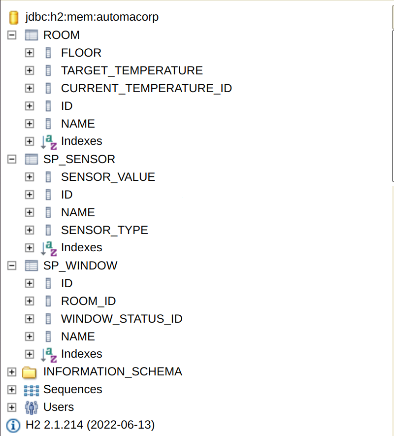

:doctitle: Spring in practice : database and JPA
:description: How use a database in your Spring project with Spring Data JPA and a H2 Database
:keywords: Java, Spring
:author: Guillaume EHRET - Dev-Mind
:revdate:2023-11-03
:category: Java
:teaser:  How use a database in your Spring project with Spring Data JPA and a H2 Database? Hibernate will be the JPA implementation
:imgteaser: ../../img/training/spring-data.png
:toc:
:icons: font

How use a database in your project.
We will use https://docs.spring.io/spring-data/commons/docs/2.5.4/reference/html/#reference[Spring Data] to do that.
Spring Data is an abstraction to help developers.
In our examples we will Hibernate as JPA implementation and a H2 Database.

image::../../img/training/spring-data.png[width=800, align="center"]

== Database

An application needs access to data, write data, update these data ...

Today we can access a multitude of data sources ... and Spring will help us

image::../../img/training/spring-intro/app-data2.png[width=900, align="center"]

How can we persist data in Java? For that we need to use different API and a database

1. a low level standard : *JDBC* (Java Database Connectivity)
2. an API, *JPA* (Java Persistence API) and frameworks as Hibernate
3. an API, *JTA* (Java Transaction API) to manage transactions
4. choose a database

=== JDBC

JDBC (Java Database Connectivity) is the common API used by all relational databases in Java applications.

* each database editor provides its driver (a jar added to your project)
* you can use a DBMS (DataBase Management System) to define, store, retrieve, and manage the data within a database.
* a DBMS can be just a cli available on a terminal or a GUI

=== H2
In our tests we will use a database written in Java, the H2 database

I choose this database for different reasons.

* Open source, JDBC driver
* embedded database
* in memory database (perfect for tests)
* Browser based Console application
* Small footprint

=== icon:flask[] Database and SQL

Go in your `AutomacorpApplication`. We need to add new Spring Boot starters and the H2 driver in the declared dependencies.

[source,groovy, subs="specialchars"]
----
implementation("org.springframework.boot:spring-boot-starter-data-jpa") // libs to use JPA in your project
implementation("com.h2database:h2") // libs to use a H2 database
----

Check your `build.gradle.kts` file and update it. Reload your Gradle project to apply changes. You can use the button  displayed when your Gradle config is updated. Or you can use the button  displayed in the Gradle view.

Spring Boot analyses jars defined in classpath and Spring is able to auto-configure features as the database, the H2 console...

Add some properties in file `src/main/resources/application.properties` to configure a in memory H2 database (database will be recreated after each app reload)

[source,properties,subs="specialchars"]
----
# Spring boot : datasource
spring.datasource.url=jdbc:h2:mem:automacorp;DB_CLOSE_DELAY=-1;DB_CLOSE_ON_EXIT=FALSE
spring.datasource.username=sa
spring.datasource.password=
spring.datasource.driverClassName=org.h2.Driver

# Spring boot : H2 datasource
spring.h2.console.enabled=true
spring.h2.console.path=/console

# Spring boot : JPA
spring.jpa.database=h2
----

To verify that everything is fine, launch your app and open this URL in your browser: http://localhost:8080/console

image::../../img/training/spring-intro/h2-console0.png[width=500]

*Use JDBC URL, user, password defined in your `application.properties* and click on *Connect* button.

You should access to the console

image::../../img/training/spring-intro/h2-console.png[size=90%]

You can create several SQL orders

* SQL order to create a table (Id is generated by the database and with use option auto_increment)
+
[source,sql,subs="specialchars"]
----
CREATE TABLE ROOM(ID BIGINT auto_increment PRIMARY KEY, NAME VARCHAR(255) NOT NULL);
----
+
* SQL order to insert data in this table (We use a negative id because we don't use the ID generator in manual inserts)
+
[source,sql,subs="specialchars"]
----
INSERT INTO ROOM(ID, NAME) VALUES(-10, 'Room1');
----
+
* SQL order to select this data
+
[source,sql, subs="specialchars"]
----
SELECT * FROM ROOM;
----

== Java and JDBC
To understand the value of Spring and JPA, it is important to see the code that would have to be done if we wanted to directly use the JDBC API which is a low level API requiring a lot of code.

=== Open a connection

This code open a database connection in Java with JDBC API

[source,java, subs="specialchars"]
----
try {
  Class.forName("org.h2.Drive"); // (1)
}
catch (ClassNotFoundException e) {
  logger.error("Unable to load JDBC Driver", e);
}
try {
  String database_url = "jdbc:h2:mem:bigcorp;DB_CLOSE_DELAY=-1;DB_CLOSE_ON_EXIT=FALSE"; // (2)
  Connection connection = DriverManager.getConnection(database_url, username, password); // (3)
}
catch (SQLException e) {
  logger.error("Unable to connect to the database", e);
}
----
* (1) Load JDBC driver (here H2 driver)
* (2) We define the URL to access to the database (here we say that we use a H2 database in memory) +
* (3) Open a connection with username/password
* (1) (2) (3) for each step we have to manage exceptions

This operation is slow. If you have thousands connections on your app per second your application will fail.

We need to use a connection pool with pre-opened connections. Several connections are opened when the pool is launched.

=== Execute a request
When you want to execute a request in Java you can write

*For an insert*
[source,java, subs="specialchars"]
----
public void insertSite(Site site) {
    try(Connection conn = dataSource.getConnection()){
        String sql = "insert into SITE (id, name) values (?, ?)";
        try(PreparedStatement stmt = conn.prepareStatement(sql)){
          stmt.setString(1, site.getId());
          stmt.setString(2, site.getName());
          stmt.executeUpdate();
        }
    }
    catch(SQLException e) {
        throw new DatabaseException("Impossible to insert site " +
            site.getName(), e);
    }
}
----

*For a select*
[.langage-small]
[source,java, subs="specialchars"]
----
public List<Site> findAll() {
    List<Site> sites = new ArrayList<>();
    try(Connection conn = dataSource.getConnection()){
        String sql = "select id, name from SITE";
        try(PreparedStatement stmt = conn.prepareStatement(sql)){
            try (ResultSet resultSet = stmt.executeQuery()) {
                while(resultSet.next()) {
                    Site s = new Site(resultSet.getString("name"));
                    s.setId(resultSet.getString("id"));
                    sites.add(s);
                }
            }
        }
    }
    catch(SQLException e) {
        throw new DatabaseException("Impossible to read sites", e);
    }
    return sites;
}
----

* The code is heavy and difficult to read
* We need to manipulate data types in SQL and in our Java entities
* We manipulate SQL while we are in an object language
* We would like to be more productive, simplified relationship management...
* What about transactions?

=== Transaction

* What happens if a query fails, or if an exception occurs?
* What happens if 2 requests run in parallel?
* What happens if a request is too long?

The solution is to work in a transaction. A database transaction symbolizes a unit of work performed within a database. A transaction generally represents any change in a database. Transactions have two main purposes:

* to provide reliable units of work that allow correct recovery from failures and keep a database consistent even in cases of system failure, when execution stops (completely or partially) and many operations upon a database remain uncompleted, with unclear status.
* To provide isolation between concurrent accesses. If this isolation is not provided, data could be erroneous.

We can try to use a transaction in our code

[source,java, subs="specialchars"]
----
public void insertSite(Site site) {
        try(Connection conn = dataSource.getConnection()){
            conn.setAutoCommit(false); // 1.
            String sql = "insert into SITE (id, name) values (?, ?)";

            try(PreparedStatement stmt = conn.prepareStatement(sql)){
                stmt.setString(1, site.getId());
                stmt.setString(2, "toto");
                stmt.executeUpdate();
                conn.commit(); // 2.
            }
            catch(SQLException e) {
                conn.rollback(); // 3.
                throw new DatabaseException("Impossible insérer site " + site.getName(), e);
            }
        }
        catch(SQLException e) {
            throw new DatabaseException("Impossible insérer site " + site.getName(), e);
        }
    }
----

1. `autocommit` is sometimes the default value. We have to disabled it
2. If everything is OK a *commit* persist data
3. If we have an error everything is cancelled by a *rollback*.

== JPA

The Java Persistence API (JPA) is a Java application programming interface specification that describes the management of relational data in applications using Java Platform, Standard Edition and Java Platform, Enterprise Edition.

http://hibernate.org/orm/[Hibernate ORM] is the JPA implementation that we’re going to use in this lab. we will use Hibernate via https://projects.spring.io/spring-data-jpa/[Spring Data JPA]

We’re going to use https://projects.spring.io/spring-data-jpa/[Spring Data JPA] to store and retrieve data in our relational database.

With Persistence API/Framework, the approach is to :

* work with Java objects (Java entities) and not with database tables
* add annotations to map entity properties to table columns
* generate common database request (Create, Update, Delete, Read)
* fill the SQL imperfections: inheritance, relationships, customs types, validation

Spring provides several sub projects to make database interactions easy

{nbsp}

Do not confuse https://projects.spring.io/spring-data/[Spring Data] with https://projects.spring.io/spring-data-jpa/[Spring Data JPA]. We can read on in the offical doc that

> "Spring Data’s mission is to provide a familiar and consistent, Spring-based programming model for data access while still retaining the special traits of the underlying data store. It makes it easy to use data access technologies, relational and non-relational databases, map-reduce frameworks, and cloud-based data services. This is an umbrella project which contains many subprojects that are specific to a given database […​]

> Spring Data JPA is part of Spring Data, lets implement JPA based repositories. It makes it easier to build Spring-powered applications that use data access technologies."

=== JPA Entity

Object relation mapping (ORM) is one of the main feature in the JPA specification. The ORM layer (Hibernate) performs the translation of the app model objects into a relational database. For that we just have to use different JPA annotations on our entity objects.

Let's take the example of a Java class named *Sensor* and see how to use JPA to bind it to the SP_SENSOR table of our database.

[source,java, subs="specialchars"]
----
import jakarta.persistence.*;

@Entity // (1).
@Table(name = "SP_SENSOR") // (2).
public class SensorEntity {
    @Id // (3).
    @GeneratedValue
    private Long id;

    @Column(nullable=false, length=255)  // (4).
    private String name;

    @Column(name = "sensor_value") // (5)
    private Double value;

    @Column(name = "sensor_type") // (5).
    @Enumerated(EnumType.STRING) // (6).
    private SensorType sensorType;

    @Transient // (7).
    private Integer notImportant;

    public SensorEntity() { // (8).
    }

    public SensorEntity(SensorType sensorType, String name) { // (9).
        this.name = name;
        this.sensorType = sensorType;
    }

    public Long getId() { // (10).
        return id;
    }

    public void setId(Long id) {
        this.id = id;
    }

    public String getName() {
        return name;
    }

    public void setName(String name) {
        this.name = name;
    }

    public Double getValue() {
        return value;
    }

    public void setValue(Double value) {
        this.value = value;
    }

    public SensorType getSensorType() {
        return sensorType;
    }

    public void setSensorType(SensorType sensorType) {
        this.sensorType = sensorType;
    }

    public Integer getNotImportant() {
        return notImportant;
    }

    public void setNotImportant(Integer notImportant) {
        this.notImportant = notImportant;
    }
}
----

* (1) *@Entity* indicates that this class is an entity managed by Hibernate
* (2) *@Table(name = "SP_SENSOR")* you can customize the table name (optional if table name = entity name)
* (3) *@Id* you have always an id annotated with `@jakarta.persistence.Id` (auto generated in this example). This ID is immutable (as the primary key in the database)
* (4) *@Column* by default, each property is mapped to a column. You can customize the nullability or the column name.
* (5) You can personalize the column used in the database to store the data
* (6) *@Enumerated(EnumType.STRING)* Java enum persisted as a String (choose always EnumType.STRING)
* (7) If a property should not be persisted, use *@Transient*
* (8) an entity *must have an empty constructor* (public or protected). +
[.small .small-block]#An empty constructor is needed to create a new instance via reflection (using `Class<T>.newInstance()`) by Hibernate which has to instantiate your Entity dynamically. If you don’t provide any additional constructors with arguments for the class, you don’t need to provide an empty constructor because you get one per default. Java always gives you a default invisible empty constructor. If an argument constructor is provided in your class, then jvm will not add the no-argument constructor.#
* (9) you can add (and you should) a constructor to build an object with all required properties
* (10) you have to define a getter and a setter for each property

=== Entity manager

When your app need to launch a query, it will call an https://docs.jboss.org/hibernate/orm/6.2/userguide/html_single/Hibernate_User_Guide.html#architecture[EntityManager] to execute it

The entities managed by Hibernate have a life-cycle associated with them. Either you can create a new object and save it into the database or your can fetch the data from the database.

The Entities go through several stages in the life-cycle.

image::../../img/training/spring-intro/lifecycle.png[width=800, align="center"]

* *Transient Objects*: Transient objects are non transactional and in fact Hibernate has no knowledge of these objects
* *Persistent Objects*: Persistent entity has a valid database identity associated with.
* *Removed Object*: An object scheduled for deletion either by calling delete or because of orphan deletion of entities.
* *Detached Object*: The object in persistent state go into detached state after the persistent context is closed. Detached objects can be brought into other persistent context by reattachment or merging. Detached object still has a valid primary key attribute but it is no longer managed by Hibernate.

We have different operations to several stages in the life-cycle.

* *persist()*  makes a persistent entity. It will be written in the database at the next commit of the transaction we are in..
* *remove()*: inverse of persist(). It will be erased from the database at the next commit of the transaction we are in.
* *refresh()*: synchronizes the state of an entity to its database state. If the fields of an entity have been updated in the current transaction, these changes will be canceled. This operation only applies to persistent entities (otherwise we have an IllegalArgumentException)
* *detach()*: detaches an entity from  entity manager. This entity will not be taken into account during the next commit of the transaction in which we are
* *merge()*: attach an entity to the current entity manager. This is used to associate an entity with another entity manager than the one that was used to create or read it.

=== Transaction and Spring

We must work in transactions to ensure data integrity. When you use Spring, Transactional policy is managed by Spring with *@Transactional* annotation. For example

[source,java, subs="specialchars"]
----
@Service
@Transactional
public class SiteServiceImpl implements SiteService {

    public Site addSite(String name){
        Site site = new Site(name);
        site.addSensor(new Sensor("default", site)
                               .withPowerSource(PowerSource.FIXED)
                               .withDefaultPowerInWatt(1_000_000));
        siteDao.save(site);
        return site;
    }
}
----

Your services, your components must use a *@Transactional* annotation to work in a transaction.

> Hibernate stores everything read from the database in a first-level cache. This cache is linked to the current transaction.

At the end of the transaction, Hibernate will launch a flush() of this cache

* Calculation of the modifications of the objects contained in this cache
* Execution of all requests as a result
* Launching commit() if everything is OK or rollback()

With the first level of cache, if you execute twice a `find()` on the same instance, it will only be loaded once

=== Schema generation

Hibernate (JPA implementation) is able to parse yours entities to generate your database schema.It's very useful when you develop an app.

In Spring you just have to add some properties in `application.properties` file.

Update the file `application.properties` and add these keys

[source,java,subs="specialchars"]
----
# Spring boot : JPA
spring.jpa.database-platform=org.hibernate.dialect.H2Dialect
spring.jpa.generate-ddl=true
spring.jpa.show_sql=true
spring.jpa.defer-datasource-initialization=true
----
* H2Dialect gives information to Hibernate for native SQL
* *generate-ddl* allows you to auto generate the schema (tables, constraints) from your Java data model (false if you do not want to do anything)
* *show_sql* displays queries in the logs (usefull in development)

== JPA and association mappings

Association mappings are one of the key features of JPA and Hibernate.
They define the relationship between the database tables and the attributes in your Entity.

image::../../img/training/spring-intro/relationship.png[width="800", align="center"]

An association between JPA entities, can be unidirectional or bidirectional.
In this second case, one of the two entities must be the parent (the main entity) and the other the child.

It defines in which direction you can use the association.

=== @OneToOne

Example of *unidirectional association*: a city has a mayor but the mayor does not know his city

A column *mayor_id* will be added in the table *City* and a foreign key will be created

[source,java,subs="specialchars"]
----
@Entity
public class Mayor {
    @Id
    private Long id;
    private String name;

    //...
}

@Entity
public class City {
     @Id
     private Long id;
     private String name;
     @OneToOne
     private Mayor mayor;

     // ...
}
----

Example of *bidirectional* association: a city has a mayor and the mayor now knows his city

We can' t add a column `*mayor_id*` in the `*City*` table and a column `*city_id*` in the `*Mayor*` table because of the cycle.

In Hibernate entity model, we have to use a `mappedBy` to define the field that owns the relationship. This element is only specified on the inverse (non-owning) side of the association.

For example the mappedBy can be defined on the OneToOne defined in the mayor entity

[source,java,subs="specialchars"]
----
@Entity
public class City {
    @Id
    private Long id;
    private String name;

    @OneToOne
    private Mayor mayor;

    // ...
}

@Entity
public class Mayor {
    @Id
    private Long id;
    private String name;

    @OneToOne(mappedBy = "mayor")
    private City city;

    //...
}
----

With this code a column *mayor_id* will be added in the `*City*` table and a foreign key will be created. *Mayor* table won't have a reference to the city table.

*mappedby* tells hibernate not to map this field because it's already mapped by this field [here property mayor in City entity].

> If you forget to define a parent and a child in the association (no association with a mappedBy), you will have a mayor_id reference in the City table and a city_id reference in the Mayor table with 2 constraints.
In this case, you will not be able to delete a row because you will always have a constraint error.

=== @OneToMany

Example of *unidirectional* association: a site has one or more sensors (sensor does not link to a site)

A join table is added (with 2 foreign keys)

[.langage-small]
[source,java,subs="specialchars"]
----
@Entity
public class Sensor {
    @Id
    private Long id;
    private String name;

     // ...
}

@Entity()
public class Site {
    @Id
    private Long id;
    private String name;

    @OneToMany
    private Set<Sensor> sensors = Set.of();

    // ...
}
----

=== @ManyToOne

Example of *unidirectional* association: a measurement is linked to a sensor and the sensor does not have the measurement list

A *sensor_id* column will be added to the *Measurement* table and a foreign key will be created

[.langage-small]
[source,java, subs="specialchars"]
----
@Entity
public class Sensor {
    @Id
    private Long id;
    private String name;

    // ...
}

@Entity
public class Measurement {

    @Id
    private Long id;

    @ManyToOne(optional = false)
    private Sensor sensor;

    // ...
}
----

=== @OneToMany @ManyToOne

Example of *bidirectional* association: a sensor has n measures and measure knows its sensor

*@ManyToOne ha nos property `mappedBy`.
So you can't make a mistake, add this `mappedBy` property on @OneToMany* (which is used to designate the parent)

[.langage-small]
[source,java,subs="specialchars"]
----
@Entity
public class Measure {
    @Id
    private Long id;
    private String name;

    @ManyToOne
    private Sensor sensor;
}

@Entity()
public class Sensor {
    @Id
    private Long id;
    private String name;

    @OneToMany(mappedBy = "sensor")
    private Set<Measure> measures = Set.of();
}
----

If you forget the mapped `mappedBy` property on the @OneToMany* you will have an unexpected join table betwwen the sensor and the measure.

=== @ManyToMany

Example of *unidirectional* association: a musician plays several instruments (instrument does not know who uses it)

A join table is added (with 2 foreign keys)

[.langage-small]
[source,java, subs="specialchars"]
----
@Entity
public class Instrument {
    @Id
    private Long id;
    private String name;

     // ...
}

@Entity()
public class Musician {
    @Id
    private Long id;
    private String name;

    @ManyToMany
    private Set<Instrument> instruments;

    // ...
}
----

Example *bidirectional* association: a musician plays several instruments (instrument knows that they play musicians)

A join table is always present (with 2 foreign keys) but we must define the `mappedBy` property on one entity

[.langage-small]
[source,java,subs="specialchars"]
----
// Child
@Entity
public class Instrument {
    @Id
    private Long id;
    private String name;

    @ManyToMany
    private Set<Musician> musicians;
     // ...
}

// Parent
@Entity()
public class Musician {
    @Id
    private Long id;
    private String name;

    @ManyToMany(mappedBy="musicians")
    private Set<Instrument> instruments;

    // ...
}
----

=== Fetching Strategy

Allows you to specify the loading strategy.

* *LAZY* the value is loaded only when it is used  (default)
* *EAGER* the value is always loaded

[source,java, subs="specialchars"]
----
@OneToMany(fetch = FetchType.EAGER)
private Set<Sensor> sensors = Set.of();
----

By default, we are in Lazy mode because the goal is to load the minimum of things.  If you navigate in your object and if relations are set in Lazy mode, you have 2 cases

* You are attached to a persistence context : one or more queries are started to load the missing data
* You are not attached to a persistence context: a LazyInitializationException is launched

[.langage-small]
[source,java, subs="specialchars"]
----
org.hibernate.LazyInitializationException: could not initialize proxy
----

If you have to serialize your object or send it to another layer, you have to use DTO. We will see that later

== JPQL

With JPA we don't write SQL but https://docs.oracle.com/html/E13946_04/ejb3_langref.html[JPQL] (Java Persistence Query Language). *We don't use the column names but we use the JPA entities* in.

In SQL we select a list of columns belonging to one or more tables. In JPQL we select an entity.

[.langage-small]
[source,java, subs="specialchars"]
----
// Selection sensors
select c from SensorEntity c

// Selection sites linked to a sensor
select c.site from SensorEntity c
----

You can use implicit join
[.langage-small]
[source,java, subs="specialchars"]
----
select c from SensorEntity c where c.site.id = :siteId
----

Or you can use explicit join
[.langage-small]
[source,java, subs="specialchars"]
----
select c from SensorEntity c join c.site s where s.id = :siteId
select c from SensorEntity c left join c.site s where s.id = :siteId
----

== Data Access Object (DAO)

A DAO (Data Access Object) lets you persist your Entities. The DAO is basically an object or an interface that provides access to an underlying database or any other persistence storage.

That definition from http://en.wikipedia.org/wiki/Data_access_object[Wikipedia]

An example of Spring Data Jpa repository (DAO)

[.langage-small]
[source,java, subs="specialchars"]
----
public interface SensorDao extends JpaRepository<SensorEntity, Long> {
    @Query("select c from SensorEntity c where c.name=:name")
    Sensor findByName(@Param("name") String name);
}
----

https://docs.spring.io/spring-data/jpa/docs/current/reference/html/#repositories[*JpaRepository*] is a Spring Data interface, which provides common methods such as *findOne*, *save*, *delete* and more. This example will handle Sensors entities, and those are identified by an Id of type Long (generics type used in JpaRepository).

=== Spring Data JPA

With Spring Data Jpa, if you respect conventions you don't need to create a DAO implementation

[.langage-small]
[source,java, subs="specialchars"]
----
public interface SensorDao extends JpaRepository<SensorEntity, Long> {

    List<SensorEntity> findBySiteId(Long siteId); // (1).

    @Query("select c from SensorEntity c where c.name=:name")  // (2)
    Sensor findByName(@Param("name") String name);

    @Modifying // (3)
    @Query("delete from SensorEntity c where c.name = ?1")
    void deleteByName(String name);
}
----

1. *findBy* pattern allows to execute a query and return an occurrence or an occurrence list
2. *@Query* helps to execute a JPQL query. Here we use a named parameter called name.
3. Another example with an update. In this case, you must use an *@Modifying* annotation

If a method starts by `findBy`, `findDistinctBy`, `countBy`, ...

* You can after add a property
+
[source,java, subs="specialchars"]
----
List<SensorEntity> findByName(String name);
----
* You can add a property of a property
+
[source,java, subs="specialchars"]
----
List<SensorEntity> findBySiteId(String siteId);
----
* You can cumulate criteria
+
[source,java, subs="specialchars"]
----
List<SensorEntity> findByNameAndSiteId(String name, String siteId);
List<SensorEntity> findByNameOrSiteId(String name, String siteId);
----
* You can ignore upper or lower case
+
[source,java, subs="specialchars"]
----
List<SensorEntity> findByNameIgnoreCase(String name);
List<SensorEntity> findByNameAndSiteIdAllIgnoreCase(String name, String siteId);
----
* You can sort data
+
[source,java, subs="specialchars"]
----
List<SensorEntity> findByNameOrderByNameAsc(String name);
List<SensorEntity> findByNameOrderByNameDesc(String name);
----
* You can select only one element (if you have for example an unicity constraint). But in this case if several elements are found an exception is thrown
+
[source,java, subs="specialchars"]
----
SensorEntity findByName(String name);
----

For more informations read link:https://docs.spring.io/spring-data/jpa/docs/current/reference/html/#repositories.query-methods.details[the documentation] to know more things

=== Custom DAO

If you need to create your own queries, you have to create a new interface

[.langage-verysmall]
[source,java, subs="specialchars"]
----
public interface SensorCustomDao {
    List<SensorEntity> findBySiteText(String searchText);
}
----

You need to update the main interface. In our code we will always inject a *SensorDao*. This Dao will have all JpaRepository methods and all your custom queries.

[.langage-verysmall]
[source,java, subs="specialchars"]
----
public interface SensorDao extends JpaRepository<SensorEntity, String>, SensorCustomDao {
}
----

Implement your `SensorCustomDao` and use entitiy manager to execute requests

[source,java, subs="specialchars"]
----
@Repository
public class SensorCustomDaoImpl implements SensorCustomDao {

    @PersistenceContext
    private EntityManager em;

    @Override
    public List<SensorEntity> findBySiteText(String searchText) {
        return em.createQuery("select c from SensorEntity c inner join c.site s where lover(s.name) like :searchText",
                              Sensor.class)
                 .setParameter("searchText", "%" + searchText.toLowerCase() + "%")
                 .getResultList();
    }
}
----

== icon:flask[] : JPA

It's time for you to start building a real application that can manage sensors in a building. The management of sanitary conditions (COVID-19 pandemic, pollution), user comfort and energy efficiency require concurrent management of window openings in the buildings of the École des Mines.

It is necessary to ventilate as much as possible to limit air pollution, but with the approach of winter it will become important to heat buildings to ensure the comfort of users.

> We will now create an application which will able to manage the building windows. +
- the building has an outside temperature, and rooms +
- each room has zero or more heaters, has zero or more windows, a name, a floor, a current temperature, a target temperature. +
- each heater has a name, an `on` or `off` status, possibly a power. +
- each window has a name, an a status `open` or `closed`

The heater status, the window status and the temperature are measured by external sensors.

=== Entity creation

==== Sensor entity

The `SensorEntity` entity was given https://dev-mind.fr/training/spring/spring-data.html#_jpa_entity[higher] on the page. You can remove the `notImportant` property

Create a Java enum called `SensorType` in package `com.emse.spring.automacorp.model` to define the type of the sensor.
[source,java, subs="specialchars"]
----
public enum SensorType { TEMPERATURE, POWER, STATUS }
----

==== Window entity

Create an Entity called `WindowEntity` in package `com.emse.spring.automacorp.model` (an entity is a class). You have to use the JPA annotations seen previously.

You can copy this code. For the moment this entity has no property room because this entity will be created later.

[source,java, subs="specialchars"]
----
// (1)
// (2)
public class WindowEntity {
    // (3)
    private Long id;

    // (4)
    private String name;

    // (5)
    private SensorEntity windowStatus;

    public WindowEntity() {
    }

    public WindowEntity(String name, SensorEntity sensor) {
        this.windowStatus = sensor;
        this.name = name;
    }

    public Long getId() {
        return this.id;
    }

    public void setId(Long id) {
        this.id = id;
    }

    public String getName() {
        return name;
    }

    public void setName(String name) {
        this.name = name;
    }

    public Sensor getWindowStatus() {
        return windowStatus;
    }

    public void setWindowStatus(Sensor windowStatus) {
        this.windowStatus = windowStatus;
    }
}
----

Use the good annotations to

* (1) Mark this class as a JPA entity
* (2) Give a different name for your table => SP_WINDOW
* (3) Declare this field as the table ID. This ID must to be auto generated
* (4) This field must be not nullable
* (5) The `windowStatus` is a SensorEntity. You need to use the good annotation to define the unidirectional association. This field must be not nullable

For the moment this entity has no property room because this entity will be created later.

You can start your application. If you updated your configuration (see this link:spring-data.html#_schema_generation[chapter]) you should see in your app logs

----
Hibernate: drop table if exists sp_sensor cascade
Hibernate: drop table if exists sp_window cascade
Hibernate: drop sequence if exists sp_sensor_seq
Hibernate: drop sequence if exists sp_window_seq
Hibernate: create sequence sp_sensor_seq start with 1 increment by 50
Hibernate: create sequence sp_window_seq start with 1 increment by 50
Hibernate: create table sp_sensor (sensor_value float(53), id bigint not null, name varchar(255) not null, sensor_type varchar(255) check (sensor_type in ('TEMPERATURE','POWER','STATUS')), primary key (id))
Hibernate: create table sp_window (id bigint not null, window_status_id bigint not null, name varchar(255) not null, primary key (id))
Hibernate: alter table if exists sp_window add constraint FKqdj6jbtn59whbpgt93n927yjn foreign key (window_status_id) references sp_sensor
----

==== Room entity

Create the *RoomEntity* entity with

* an auto generated id
* a non nullable floor (Integer)
* a non nullable String name
* a current temperature (SensorEntity) the current temperature is measured by a sensor
* a target temperature (Double)
* a list of windows. You have to define a bidirectional association between `RoomEntity` and `WindowEntity` : update the `Window` entity constructor to always send the room when a room is created, ie add an argument `RoomEntity` in the `WindowEntity` constructor
* create a constructor with non nullable fields and a default constructor

You can relaunch your application.

Open your H2 console you should see

_If you more tables you forgot to declare a bidirectional association..._

==== Other entities

You can continue the different exercises. If you choose to follow the given subject for your final project and evaluation, you will have to implement later:

* the `HeaterEntity` entity with
** an auto generated id
** a non nullable String name
** a non nullable room
** a non nullable status. This field is a Sensor.
** create a constructor with non nullable fields and a default constructor
* update the room entity to define a list of heaters. You have to define a bidirectional association between `RoomEntity` and `HeaterEntity` : update the `HeaterEntity` entity constructor to always send the room when a room is created, ie add an argument `RoomEntity` in the `HeaterEntity` constructor
* the `BuildingEntity` entity. The building has an outside temperature (a SensorEntity), and rooms.
* ...

=== Populate data

We're going to populate our database and insert data in tables. You can execute the script below in your H2 console, but data will be deleted on the next app reload. Fortunately Spring Boot offers a mechanism to populate a database at startup.

Create a file `data.sql` in `src/main/resources` next to `application.properties`

[source,sql]
----
INSERT INTO SP_SENSOR(id, name, sensor_value, sensor_type) VALUES(-10, 'Temperature room 2', 21.3, 'TEMPERATURE');
INSERT INTO SP_SENSOR(id, name, sensor_value, sensor_type) VALUES(-9, 'Window 1 status room 1', 1.0, 'STATUS');
INSERT INTO SP_SENSOR(id, name, sensor_value, sensor_type) VALUES(-8, 'Window 2 status room 1', 0.0, 'STATUS');
INSERT INTO SP_SENSOR(id, name, sensor_value, sensor_type) VALUES(-7, 'Window 1 status room 2', 0.0, 'STATUS');
INSERT INTO SP_SENSOR(id, name, sensor_value, sensor_type) VALUES(-6, 'Window 2 status room 2', 0.0, 'STATUS');

INSERT INTO SP_ROOM(id, name, floor) VALUES(-10, 'Room1', 1);
INSERT INTO SP_ROOM(id, name, floor, current_temperature_id, target_temperature) VALUES(-9, 'Room2', 1, -10, 20.0);

INSERT INTO SP_WINDOW(id, window_status_id, name, room_id) VALUES(-10, -9, 'Window 1', -10);
INSERT INTO SP_WINDOW(id, window_status_id, name, room_id) VALUES(-9, -8, 'Window 2', -10);
INSERT INTO SP_WINDOW(id, window_status_id, name, room_id) VALUES(-8, -7, 'Window 1', -9);
INSERT INTO SP_WINDOW(id, window_status_id, name, room_id) VALUES(-7, -6, 'Window 2', -9);
----

=== Dao creation

==== Simple DAO
Write now 3 link:spring-data.html#_data_access_object_dao[Spring data DAO] `SensorDao`, `WindowDao` and `RoomDao` in package `com.emse.spring.automacorp.dao` (interface that extends JpaRepository with the good types for entity and its id)

You're going to write your own DAO methods (for specific requests), you have to create custom interfaces and implementations with your custom methods.

To check `WindowDao`, create a class `WindowDaoTest` in *src/test/java/com.emse.spring.automacorp.dao*

[source,java, subs="specialchars"]
----
import com.emse.spring.automacorp.model.Window;
import com.emse.spring.automacorp.model.WindowStatus;
import org.assertj.core.api.Assertions;
import org.junit.jupiter.api.Test;
import org.junit.jupiter.api.extension.ExtendWith;
import org.springframework.beans.factory.annotation.Autowired;
import org.springframework.boot.test.autoconfigure.orm.jpa.DataJpaTest;
import org.springframework.test.context.junit.jupiter.SpringExtension;

@DataJpaTest // (1)
class WindowDaoTest {
    @Autowired // (2)
    private WindowDao windowDao;

    @Test
    public void shouldFindAWindowById() {
        WindowEntity window = windowDao.getReferenceById(-10L); // (3)
        Assertions.assertThat(window.getName()).isEqualTo("Window 1");
        Assertions.assertThat(window.getWindowStatus().getValue()).isEqualTo(1.0);
    }
}
----

* (1) `DataJpaTest` is a SpringBoot annotation to help the DAO tests. This annotation initialize a in memory database and a Spring context with the objects needed for our tests
* (2) With this initialization we can inject a Spring Bean, our DAO to test
* (3) and we can call the DAO to interact with the database

Execute your test. This test should be green.

You can write similar tests to test *RoomDao* and *SensorDao*

video::-BtxXL5bA8Q[youtube,width=1000,height=500]

==== Custom DAO

Create your own interface *WindowDaoCustom* in package `com.emse.spring.automacorp.dao`

[source,java,subs="specialchars"]
----
public interface WindowDaoCustom {
    List<WindowEntity> findRoomsWithOpenWindows(Long id);
}
----

Refactor your *WindowDao* interface : it must extend *JpaRepository* and *WindowDaoCustom*

Create your own implementation of *WindowDaoCustom* with your custom methods and inject the EntityManager (JPA)

[source,java,subs="specialchars"]
----
import com.emse.spring.automacorp.model.Window;
import jakarta.persistence.EntityManager;
import jakarta.persistence.PersistenceContext;

import java.util.List;

public class WindowDaoCustomImpl implements WindowDaoCustom {
    @PersistenceContext
    private EntityManager em;

    @Override
    public List<WindowEntity> findRoomsWithOpenWindows(Long id) {
        String jpql = "select w from Window w inner join w.windowStatus s " +
                "where w.room.id = :id and s.value > 0.0 order by w.name";
        return em.createQuery(jpql, WindowEntity.class)
                .setParameter("id", id)
                .getResultList();
    }
}
----

You have to test your DAO. When Spring context is loaded, the database is populated with the file `data.sql` and we can test these values. For that update `WindowDaoTest` test and add these methods

[source,java, subs="specialchars"]
----
@Test
public void shouldFindRoomsWithOpenWindows() {
    List<WindowEntity> result = windowDao.findRoomsWithOpenWindows(-10L);
    Assertions.assertThat(result)
              .hasSize(1)
              .extracting("id", "name")
              .containsExactly(Tuple.tuple(-10L, "Window 1"));
}

@Test
public void shouldNotFindRoomsWithOpenWindows() {
    List<WindowEntity> result = windowDao.findRoomsWithOpenWindows(-9L);
    Assertions.assertThat(result).isEmpty();
}
----

You have to test and develop :

* a custom DAO with a method to find all windows by room name
* add a method in WindowDao to delete all windows in a room.
* a method to close or open all windows in a room
* you have to develop these methods and their tests

To check that window room are deleted you can add this test method in *WindowDaoTest*

[source,java,subs="specialchars"]
----
@Test
public void shouldDeleteWindowsRoom() {
    RoomEntity room = roomDao.getById(-10L);
    List<Long> roomIds = room.getWindows().stream().map(Window::getId).collect(Collectors.toList());
    Assertions.assertThat(roomIds).hasSize(2);

    windowDao.deleteByRoom(-10L);
    List<WindowEntity> result = windowDao.findAllById(roomIds);
    Assertions.assertThat(result).isEmpty();

}
----

That's all for the moment. In this course you learnt how to configure and use a database in Spring Boot app.
