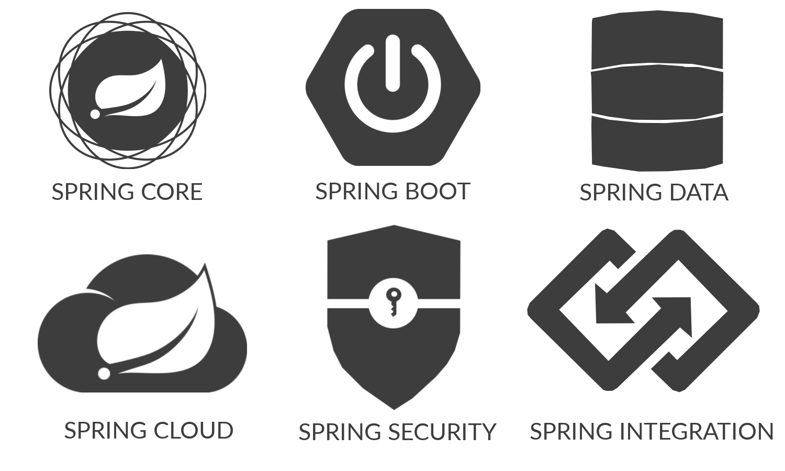
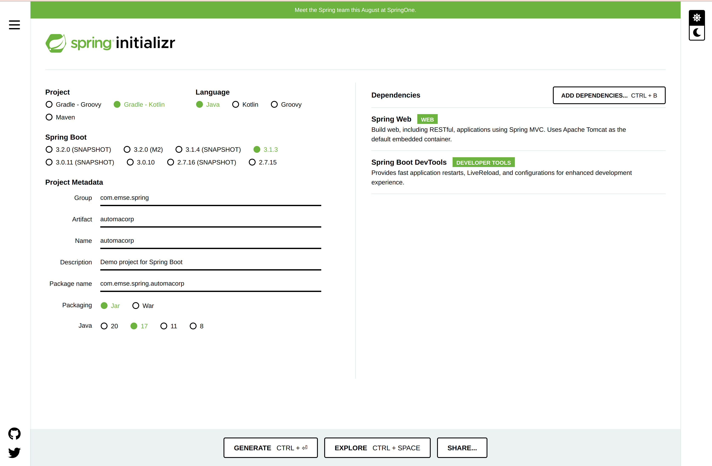
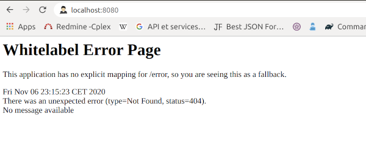
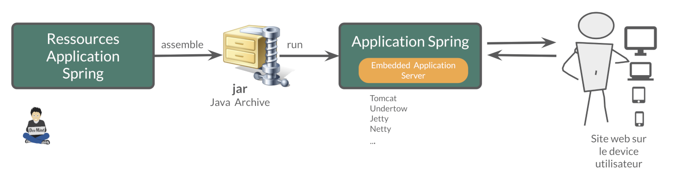
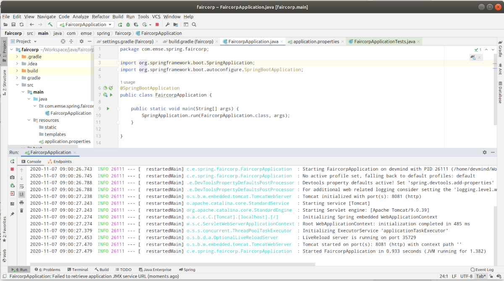

:doctitle: Spring in practice : introduction
:description: Présentation de l'écosystème de Spring
:keywords: Java, Spring
:author: Guillaume EHRET - Dev-Mind
:revdate: 2023-09-04
:category: Java
:teaser:  In this course you will learn Spring and how to create a server app written in Java. This app will expose REST services
:imgteaser: ../../img/training/spring-intro.png
:toc:
:icons: font

Since the beginning, https://spring.io/[Spring] has been a set of tools designed to simplify the development of https://www.java.com/fr/[Java] applications for every developer. Spring’s focus on speed, simplicity, and productivity has made it the world's most popular Java framework.

The last versions of Spring supports other languages on the JVM like https://kotlinlang.org/[Kotlin]. But we will focus on Java in this lecture course.

image::../../img/training/spring-intro.png[width=800, align="center"]

== Introduction

=== Requirements

To be able to learn https://spring.io/[Spring] you must have

* some basics in Java and JEE.
If you need to follow a complete course you can see the fabulous work of https://www.youtube.com/c/coursenlignejava/videos?view=0&sort=da&flow=grid[Jose Paumard]
* know unit testing in Java.
If not you have a http://localhost:8080/training/unit-test/unit-test-in-java.html[course] on this web site.
* have knowledge of the Web mechanisms
* know about https://docs.oracle.com/javase/tutorial/jdbc/basics/index.html[JDBC] and https://docs.jboss.org/hibernate/orm/5.4/quickstart/html_single/[Hibernate]
* a PC with a good IDE as https://www.jetbrains.com/idea[IntelliJ]. Follow this link:../outil/install-development-environment[page] to install your dev environment (IDE + Java)

=== What's Spring ?

Spring is the most used Java framework.
A framework comes with rules to organize developments

* Good practices
* Abstraction of the complexity
* Provides utility classes
* Helps to focus on the business code and not on the technical plumbing

Spring is

* an https://github.com/spring-projects[Open Source] Java framework. You can see the code and contribute to the project
* an entire https://spring.io/[ecosystem]. Spring provide a lot of tool to develop your app, deploy your app, manage your app
* a https://spring.io/community[community]
* a company (Spring is open source Licence «Apache 2.0» but managed by a company VM Ware Tanzu)

=== Spring framework

Make Java development easier

* https://spring.io/projects/spring-framework[Spring Core] provides a framework to simplify project technical aspects
* Sub-projects deal with more specific technical issues (Data, Security, Cloud...)
* Nothing is mandatory, everything is configurable
* Big effort on backward compatibility

=== Documentation

You can read the documentation related to everything we will see together during these lessons

* Spring Core https://docs.spring.io/spring/docs/current/spring-framework-reference/
* Spring Boot https://docs.spring.io/spring-boot/docs/current/reference/htmlsingle
* Spring Data JPA https://docs.spring.io/spring-data/jpa/docs/current/reference/html/
* Spring Security https://docs.spring.io/spring-security/site/docs/current/reference/htmlsingle/

== Spring Boot

Spring Boot helps you to create stand-alone, production-grade Spring applications.

The goal is to start an application in 3 lines. To do that, Spring Boot takes *an opinionated view of the Spring platform* and third-party libraries. A default convention is applied out of the box, but you can deviate easily from the defaults if you need to.

Spring Boot provides a range of non-functional features that are common to large classes of projects (such as embedded servers, security, metrics, health checks, and externalized configuration).

=== Spring boot starters
Starters are a set of convenient dependency descriptors that you can include in your application.

* *spring-boot-starter-web* : Starter for building web, including RESTful, applications using Spring MVC. Uses Tomcat as the default embedded container
* *spring-boot-devtools* : https://docs.spring.io/spring-boot/docs/current/reference/htmlsingle/#using-boot-devtools[devtools] is a set of tools that can make the application development experience a little more pleasant (live reload or automatic restart)
* *spring-boot-starter-test* : Starter for testing Spring Boot applications with libraries including JUnit, Hamcrest and Mockito
* ...

=== Spring Boot autoconfiguration

Spring Boot attempts to automatically configure your Spring application based on the jar dependencies that you have added. For example, if HSQLDB is on your classpath, and you have not manually configured any database connection beans, then Spring Boot auto-configures an in-memory database.

== icon:flask[] Start a new project

=== Generate
To start a new project, you can (you should) use the official generator https://start.spring.io/

Use these settings

* *Project* : Gradle Kotlin
* *Project metadata*:
+
** group : `com.emse.spring`
** artifact & name :  `automacorp`.
** Packaging : `jar`
** Java : `17`
* *Dependencies*, click on button "ADD DEPENDENCIES"" to choose which sub projects we will use. Choose *Spring Web* and *Spring Boot DevTools*

Click on the Generate button (bottom of the screen) to download a zip with generated files.

=== Import zip in your IDE

1. Unzip the project into a directory (you can put it next to the first project we did in the TPs)
2. Open the project in link:../outil/install-development-environment[IntelliJ Idea]. This step may take a long time if your Internet connectivity is slow. IntelliJ will update Gradle and all dependencies needed by the project.
3. You should have this project structure. One Application is generated with tests
+
image:../../img/training/spring-intro/springboot-tree.png[width=350]

We will open the main generated files

==== Read Gradle configuration

File : *> settings.gradle.kts* contains the project name

[source,kotlin]
----
rootProject.name = "automacorp"
----

File : *> build.gradle.kts* contains information used by Gradle to build app
[source,kotlin,subs="specialchars"]
----
plugins {
	java // (1)
	id("org.springframework.boot") version "3.1.2" // (2)
	id("io.spring.dependency-management") version "1.1.2" // (3)
}

group = "com.emse.spring" // (4)
version = "0.0.1-SNAPSHOT"

repositories { // (5)
	mavenCentral()
}

java { // (6)
	sourceCompatibility = JavaVersion.VERSION_17
}

dependencies { // (7)
	implementation("org.springframework.boot:spring-boot-starter-web") // (8)
	developmentOnly("org.springframework.boot:spring-boot-devtools") // (9)
	testImplementation("org.springframework.boot:spring-boot-starter-test") // (10)
}

tasks.withType<Test> { // (11)
	useJUnitPlatform()
}
----

* (1) Adds the Java plugin to help Gradle to manage our Java app lifecycle
* (2) Adds the Spring Boot plugin to be able to add task to run, compile, assemble our Spring Boot app
* (3) Adds Spring dependency management plugin to use the compatible dependencies with the Spring Boot version
* (4) Project id and versions
* (5) Tell Gradle where it will find all libraries
* (6) Customize the Java plugin and define the default Java version used by the project
* (7) This block contains all dependencies used by our app.
* (8) spring-boot-starter-web to load all the elements to start a web app (embedded server, libs to write REST services...)
* (9) spring-boot-devtools (tools used only in dev mode)
* (10) spring-boot-starter-test contains all lib used in tests (Junit, Mockito, Assetj...)
* (11) declare the Junit 5 runner to use to execute the tests

==== App files

File : *> src > main > java > com.emse.spring.automacorp.AutomacorpApplication*

The annotation `@SpringBootApplication` initialize a Spring Boot application. This is your app entry point

[source,java, subs="specialchars"]
----
package com.emse.spring.automacorp;

import org.springframework.boot.SpringApplication;
import org.springframework.boot.autoconfigure.SpringBootApplication;

@SpringBootApplication
public class AutomacorpApplication {
	public static void main(String[] args) {
		SpringApplication.run(AutomacorpApplication.class, args);
	}
}

----

On startup Spring Boot will automatically scan all sub packages, defined below `com.emse.spring.automacorp`.

If these packages contain Spring Beans (classes annotated with special annotations like `@Controller`, `@Service` ...), Spring Boot will automatically add them to the Spring context.

File : *> src > main > java > com.emse.spring.automacorp.AutomacorpApplicationTests*

This class is the test file of your AutomacorpApplication. In a good application, all files are tested and verified by unit tests

[source,java,subs="specialchars"]
----
@RunWith(SpringRunner.class) // (1)
@SpringBootTest // (2)
public class AutomacorpApplicationTests {
    @Test
    public void contextLoads() {
    }
}
----
* (1) Runner to use when we want to test a Spring class
* (2) Annotation which creates an application context dedicated for tests

You can run this test if you click on green button

video::6FlusTFOmRA[youtube, width=700, height=300]

File : *> src > main > resources > application.properties*

It contains all the application properties. For the moment this file is empty

* A property has a key and a value.
* In your code you read a property by its key and Spring will load the value at runtime
* Properties help to customize app on a particular environment+

== icon:flask[] Launch application

=== With Gradle
[source,shell,linenums,subs=""]
----
./gradlew --continuous bootRun // (1)

[...]
2023-08-22T17:15:59.685+02:00  INFO 124158 --- [  restartedMain] o.s.b.w.embedded.tomcat.TomcatWebServer  : Tomcat started on port(s): 8080 (http) with context path ''
2023-08-22T17:15:59.697+02:00  INFO 124158 --- [  restartedMain] c.e.spring.automacorp.AutomacorpApplication  : Started AutomacorpApplication in 1.76 seconds (process running for 2.126)
2023-08-22T17:16:04.331+02:00  INFO 124158 --- [nio-8085-exec-1] o.a.c.c.C.[Tomcat].[localhost].[/]       : Initializing Spring DispatcherServlet 'dispatcherServlet'
2023-08-22T17:16:04.332+02:00  INFO 124158 --- [nio-8085-exec-1] o.s.web.servlet.DispatcherServlet        : Initializing Servlet 'dispatcherServlet'
2023-08-22T17:16:04.334+02:00  INFO 124158 --- [nio-8085-exec-1] o.s.web.servlet.DispatcherServlet        : Completed initialization in 2 ms
<==========---> 80% EXECUTING
> :bootRun  // (2)
----

* (1) the _--continuous_ gradle option will restart the server when we recompile the project
* (2) the build gets "stuck" at XX%, but the server is actually started and ready to accept connections. To stop the application use kbd: [Ctrl + c]

A this step you can open URL localhost:8080 in your favorite browser. You should see this page

If Spring can't start your app you must read the logs in your terminal. For example il port 8080 is already used you will have this error

[source,shell,linenums,subs=""]
----
***************************
APPLICATION FAILED TO START
***************************

Description:

Web server failed to start. Port 8080 was already in use.

Action:

Identify and stop the process that's listening on port 8080 or configure this application to listen on another port.
----

If you need to use another port you can. For that open the file `application.properties` and add a new entry

[source,properties]
----
server.port=8085
----

You can relaunch the app. To stop the running app use *Use  [Ctrl + c] to stop the application*.

=== Application packaging

With Spring Boot, your application is packaged in a jar file containing an embedded application server to run your code

[source,shell]
----
./gradlew assemble
----

* This task generate a jar (Java archive) in `build/libs`.
* jar name is `automacorp-0.0.1-SNAPSHOT.jar`. It contains everything you need to launch the application (conf + libs)

To launch your Spring Boot App you can execute

[source,shell]
----
java -jar build/libs/automacorp-0.0.1-SNAPSHOT.jar
----

You can stop your app [Ctrl + c]

=== Launch application in dev mode

*com.emse.spring.automacorp.AutomacorpApplication* is a bootable class because it contains a main class

[source,java, subs="specialchars"]
----
public static void main(String[] args) { }
----

Open this class. You can click on the green button in the margin

video::f8mRHwIgxAY[youtube, width=700, height=300]

or use launch configuration in your toolbar 

When app is started, *Run pannel* is opened on the bottom. This pannel contains logs (if you search informations on errors). The button stop (red square) can be used to stop app

*This third solution to launch the application is the one recommended when you develop your application*

== icon:flask[] Update the welcome page of your app

1. Create a new file in `*src/main/resources/static*`. The name will be `*index.html*`
2. In this file copy the following code
+
[source,html,linenums,subs=""]
----
<html>
    <head>
        <title> Spring in practice</title>
    </head>
    <body>
        Hello world
    </body>
</html>
----
+
3. Recompile your code or restart your app
4. Reopen http://localhost:8080 in your browser. You should see your Hello message

If you want to have a nicer page, you can include a CSS library as Bootstrap (see the https://getbootstrap.com/docs/5.3/getting-started/introduction/#cdn-links[CDN links])

[source,html,linenums,subs=""]
----
<link href="https://cdn.jsdelivr.net/npm/bootstrap@5.3.1/dist/css/bootstrap.min.css" rel="stylesheet" integrity="sha384-4bw+/aepP/YC94hEpVNVgiZdgIC5+VKNBQNGCHeKRQN+PtmoHDEXuppvnDJzQIu9" crossorigin="anonymous">
----

After this import you can use the different CSS components provided by https://getbootstrap.com/[Bootstrap]. To see the result update your page

[source,html,linenums,subs=""]
----
<body>
    

        <h1>Automacorp</h1>
        

            Welcome on the Automacorp App used to learn Spring.
        

    

</body>
----

== Understand what's happened

In few lines you have started your first Spring project. I spoke about Spring, Spring Framework, Spring Boot... But what's the difference ?

=== Spring Framework

Spring Framework is a popular, open-source, Java-based application framework - we saw before that we have many other projects for big data, storing data, securing applications, and more!

Spring based applications have a lot of configuration. That's why we prefer use Spring Boot.

=== Spring Boot

Spring Boot takes an opinionated view of the Spring platform and third-party libraries.

With Spring Boot, it’s easy to create applications for all types of workloads. Most Spring Boot applications need very little Spring configuration.

> Spring Boot is a "convention over configuration" type of framework, with no code generation.

When we use Spring MVC (the original web framework built on the Servlet API), we need to configure for example the dispatcher servlet among other things.
When we use the Spring support of Hibernate/JPA, we would need to configure a datasource, an entity manager factory, a transaction manage....

Spring Boot simplifies all of these configuration elements, by auto-configuration. For example, when it sees spring-webmvc on the classpath, Spring Boot adds automatically `@EnableWebMvc` on your context.

With Spring boot we will use https://docs.spring.io/spring-boot/docs/current/reference/htmlsingle/#using-boot-starter[starters]

[source,kotlin]
----
dependencies {
 implementation('org.springframework.boot:spring-boot-starter-web')
 testImplementation('org.springframework.boot:spring-boot-starter-test')
}
----

The starter name starts by *spring-boot-starter-XXXX* and use a suffix XXXX (web, cache, data-jpa, mustache, web...)

In the next course we will see how to add objects to our app and how we can linked them each other...

