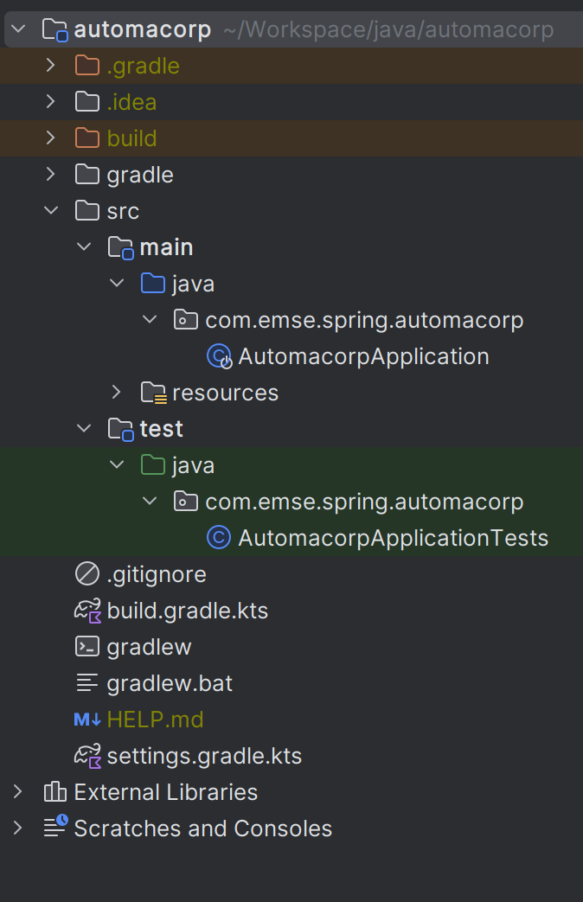
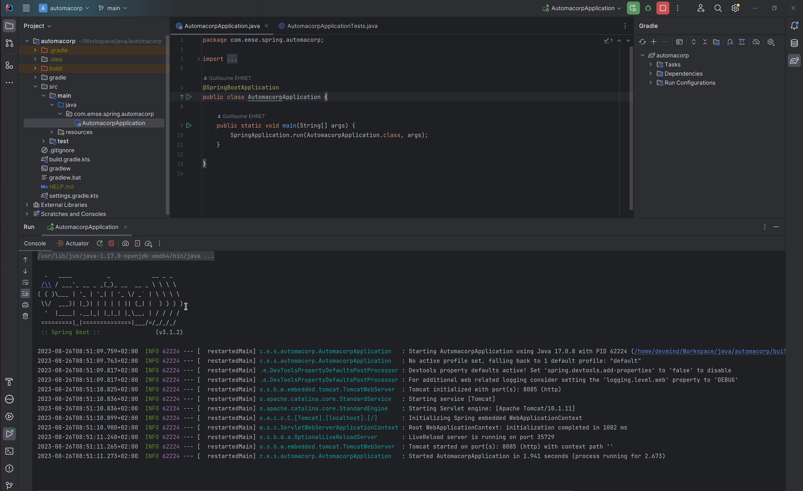

:doctitle: Spring in practice : introduction (EN)
:description: Présentation de l'écosystème de Spring
:keywords: Java, Spring
:author: Guillaume EHRET - Dev-Mind
:revdate: 2020-10-09
:category: Java
:teaser:  In this course you will learn Spring and how to create a server app written in Java. This app will expose REST services
:imgteaser: ../../img/training/spring-intro.png
:toc:

Since the beginning, https://spring.io/[Spring] has been a set of tools designed to simplify the development of https://www.java.com/fr/[Java] applications for everybody.Spring’s focus on speed, simplicity, and productivity has made it the world's most popular Java framework.

The last versions of Spring supports other languages on the JVM like https://kotlinlang.org/[Kotlin].But we will focus today on Java.

image::../../img/training/spring-intro.png[]

== Introduction

=== Requirements

To be able to learn https://spring.io/[Spring] you must have

* some basics in Java and JEE.
If you need to follow a complete course you can see the fabulous work of https://www.youtube.com/c/coursenlignejava/videos?view=0&sort=da&flow=grid[Jose Paumard]
* know unit testing in Java.
If not you have a http://localhost:8080/training/unit-test/unit-test-in-java.html[course] on this web site.
* have knowledge of the Web
* know about https://docs.oracle.com/javase/tutorial/jdbc/basics/index.html[JDBC] and https://docs.jboss.org/hibernate/orm/5.4/quickstart/html_single/[Hibernate]
* a PC with a good IDE as https://www.jetbrains.com/idea[IntelliJ]

Follow this link:../outil/install-development-environment_en.html[page] to install your dev environment

=== What's Spring ?

Spring is the most used Java framework.
A framework comes with rules to organize developments

* Good practices
* Abstraction of the complexity
* Provides utility classes
* Helps to focus on the business code and not on the technical plumbing

Spring is

* an https://github.com/spring-projects[Open Source] Java framework
* an entire https://spring.io/[ecosystem]
* a https://spring.io/community[community]
* a company (Spring is open source Licence «Apache 2.0» but managed by a company Pivotal)

=== Spring framework

Make Java development easier

* https://spring.io/projects/spring-framework[Spring Core] provides a framework to simplify project technical aspects
* Sub-projects deal with more specific technical issues (Data, Security, Cloud...)
* Nothing is mandatory, everything is configurable
* Big effort on backward compatibility

=== Documentation

Here is the documentation related to everything we will see together during these lessons

* Spring Core https://docs.spring.io/spring/docs/current/spring-framework-reference/
* Spring Boot https://docs.spring.io/spring-boot/docs/current/reference/htmlsingle
* Spring Data JPA https://docs.spring.io/spring-data/jpa/docs/current/reference/html/
* Spring Security https://docs.spring.io/spring-security/site/docs/current/reference/htmlsingle/

== Start a new project

=== Generate
To start a new project, you can (you should) use the official generator https://start.spring.io/

Use these settings

* *Project* : Gradle project
* *Language* : Java
* *Spring Boot* : the highest (not suffixed snapshot)
* *Project metadata*:
+
** group : `com.emse.spring`
** artifact & name :  `faircorp`.
** Packaging : `jar`
** Java : `11`
* *dependencies*: click on button "ADD DEPENDENCIES"" to choose which sub projects we will use.
Choose *Spring Web* and *Spring Boot DevTools*

Click on the Generate button (bottom of the screen) to download a zip with generated files.

=== Import zip in your IDE

1. Unzip the project into a directory (you can put it next to the first project we did in the TPs)
2. Open the project in link:../outil/install-development-environment_en.html[IntelliJ Idea].This step may take a long time if your Internet connectivity is slow.IntelliJ will update Gradle and all dependencies needed by the project.
3. You should have this project structure.Application is generated with tests
+

4. We will open the main generated files

==== Gradle configuration

File : *> settings.gradle* contains the project name
[source,groovy]
----
rootProject.name = 'faircorp'
----

File : *> build.gradle* contains informations used by Gradle to build app
[source,groovy]
----
plugins {
	id 'org.springframework.boot' version '2.3.5.RELEASE' // (1)
	id 'io.spring.dependency-management' version '1.0.10.RELEASE' // (2)
	id 'java' // (3)
}

group = 'com.emse.spring' // (4)
version = '0.0.1-SNAPSHOT'
sourceCompatibility = '11'

repositories { // (5)
	mavenCentral()
}

dependencies { // (6)
	implementation 'org.springframework.boot:spring-boot-starter-web' // (7)
	developmentOnly 'org.springframework.boot:spring-boot-devtools'  // (8)
	testImplementation('org.springframework.boot:spring-boot-starter-test')  // (9)
}

test {
	useJUnitPlatform()
}
----

* (1) Adds the Spring Boot plugin to be able to manage your app with Gradle
* (2) Adds Spring dependency management plugin to use the compatible dependencies with the Spring Boot version
* (3) Adds the Java plugin to help Gradle to manage our app lifecyle
* (4) Project id and versions
* (5) Tell Gradle where it will find all libraries
* (6) This block contains all dependencies used by our app. Some dependencies can be used
+
** only in dev (8) spring-boot-devtools
** only in test (9) spring-boot-starter-test : we exclude vintage junit library. This starter works with the last version and the vintage version, but the vintage version will be deleted in next release
** always (7) spring-boot-starter-web

Librairies used are Spring boot starters. Starters are a set of convenient dependency descriptors that you can include in your application.

* *spring-boot-starter-web* : Starter for building web, including RESTful, applications using Spring MVC. Uses Tomcat as the default embedded container
* *spring-boot-devtools* : https://docs.spring.io/spring-boot/docs/current/reference/htmlsingle/#using-boot-devtools[devtools] is a set of tools that can make the application development experience a little more pleasant (live reload or automatic restart)
* *spring-boot-starter-test* : Starter for testing Spring Boot applications with libraries including JUnit, Hamcrest and Mockito

==== App files

File : *> src > main > java > com.emse.spring.faircorp.FaircorpApplication* annotation `@SpringBootApplication` initialize a Spring Boot application. This is your app entry point

[source,java, subs="specialchars"]
----
@SpringBootApplication
public class FaircorpApplication {
	public static void main(String[] args) {
		SpringApplication.run(FaircorpApplication.class, args);
	}
}
----

File : *> src > main > java > com.emse.spring.faircorp.FaircorpApplicationTests* is the test file of your FaircorpApplication. In a good application, all files are tested and verified by unit tests

[source,java, subs="specialchars"]
----
@RunWith(SpringRunner.class) // (1)
@SpringBootTest // (2)
public class FaircorpApplicationTests {

	@Test
	public void contextLoads() {
	}

}
----
* (1) Runner to use when we want to test a Spring class
* (2) Annotation which creates an application context dedicated for tests

You can run this test if you click on green button
image::../../img/training/spring-intro/run-test.png[]

File : *> src > main > resources > application.properties* it contains all the application properties. For the moment this file is empty

* A property has a key and a value.
* In your code you read a property by its key and Spring will load the value at runtime
* Properties help to customize app on a particular environment+

== Launch application

=== With Gradle
[source,shell,linenums,subs=""]
----
./gradlew --continuous bootRun // (1)

[...]
INFO 9740 --- [  restartedMain] s.b.c.e.t.TomcatEmbeddedServletContainer : Tomcat started on port(s): 8080 (http)
INFO 9740 --- [  restartedMain] f.i.tc.s.SpringBootIntroApplication : Started SpringBootIntroApplication in 2.971 seconds
<==========---> 80% EXECUTING
> :bootRun  // (2)
----

* (1) the _--continuous_ gradle option will restart the server when we recompile the project
* (2) the build gets "stuck" at XX%, but the server is actually started and ready to accept connections. To stop the application use kbd: [Ctrl + c]

A this step you can open URL localhost:8080 in your favorite browser. You should see this page

If Spring can't start your app you must read the logs in your terminal. For example il port 8080 is already used you will have this error

[source,shell,linenums,subs=""]
----
***************************
APPLICATION FAILED TO START
***************************

Description:

Web server failed to start. Port 8080 was already in use.

Action:

Identify and stop the process that's listening on port 8080 or configure this application to listen on another port.
----

**

*Use  [Ctrl + c] to stop the application*

=== Application packaging

With Spring Boot, your application is packaged in a jar file containing an embedded application server to run your code

[source,shell]
----
./gradlew assemble
----

* This task generate a jar (Java archive) in `build/libs`.
* jar name is `faircorp-0.0.1-SNAPSHOT.jar`. It contains everything you need to launch the application (conf + libs)

To launch your Spring Boot App you can execute
+
[source,shell]
----
java -jar build/libs/faircorp-0.0.1-SNAPSHOT.jar
----

You can stop your app [Ctrl + c]

=== Launch application in dev mode

*com.emse.spring.faircorp.FaircorpApplication* is a bootable class because it contains a main class

[source,java, subs="specialchars"]
----
public static void main(String[] args) { }
----

Open this class. You can click on the green button in the margin
image:../../img/training/spring-intro/run-class.png[]

or use launch configuration in your toolbar image:../../img/training/spring-intro/run-config.png[]

When app is started, *Run pannel* is opened on the bottom. This pannel contains logs (if you search informations on errors). The button stop (red square) can be used to stop app

*This third solution to launch the application is the one recommended when you develop your application*

== Update the welcome page of your app

1. Create a new file in `*src/main/resources/static*`. The name will be `*index.html*`
2. In this file copy the following code
+
[source,html,linenums,subs=""]
----
<html>
    <head>
        <title> Spring in practice</title>
    </head>
    <body>
        Hello world
    </body>
</html>
----
+
3. Recompile your code or restart your app
4. Reopen localhost:8080 in your browser. You should see your Hello message

== Understand what's happened

In few lines you have started your first Spring project.I spoke about Spring, Spring Framework, Spring Boot... But what's the difference ?

**Spring Framework **

is a popular, open-source, Java-based application framework - we saw before that we have many other projects for big data, storing data, securing applications, and more!

Spring based applications have a lot of configuration.

*Spring Boot*

takes an opinionated view of the Spring platform and third-party libraries.

With Spring Boot, it’s easy to create applications for all types of workloads.Most Spring Boot applications need very little Spring configuration.

Spring Boot is a "convention over configuration" type of framework, with no code generation.

[.small]#When we use Spring MVC (the original web framework built on the Servlet API), we need to configure for example the dispatcher servlet among other things.
When we use the Spring support of Hibernate/JPA, we would need to configure a datasource, an entity manager factory, a transaction manager…​#

Spring Boot simplifies all of these configuration elements, by auto-configuration. [.small]#For example, when it sees spring-webmvc on the classpath, Spring Boot adds automatically @EnableWebMvc on your context.#

With Spring boot we will use https://docs.spring.io/spring-boot/docs/current/reference/htmlsingle/#using-boot-starter[starters]

[source,groovy]
----
dependencies {
 implementation('org.springframework.boot:spring-boot-starter-web')
 testImplementation('org.springframework.boot:spring-boot-starter-test')
}
----

The starter name starts by *spring-boot-starter-XXXX* and use a suffix XXXX (web, cache, data-jpa, mustache, web...)

In the next course we will see how to add objects to our app and how we can linked them each other...

