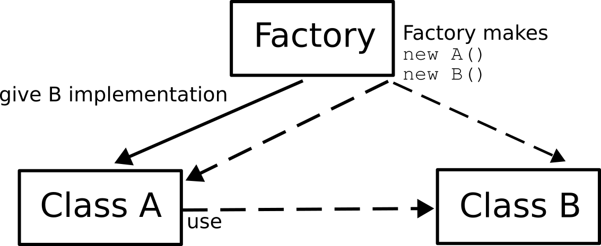
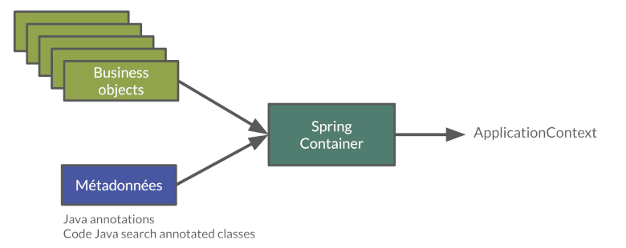
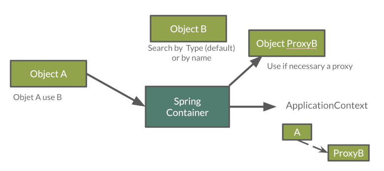
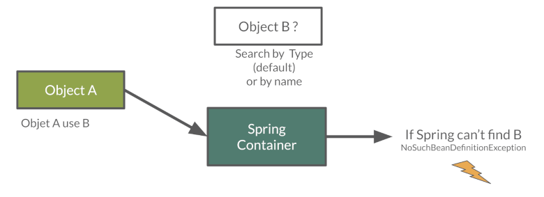
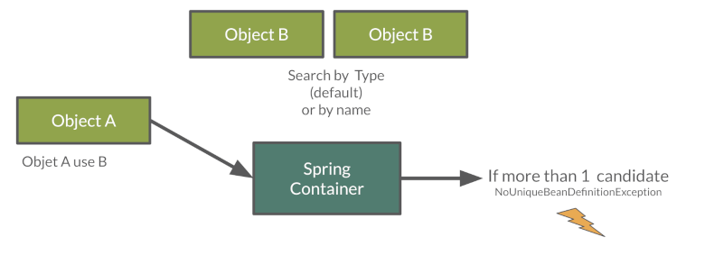

:doctitle: Spring in practice : dependency injection (EN)
:description: Présentation de l'écosystème de Spring
:keywords: Java, Spring
:author: Guillaume EHRET - Dev-Mind
:revdate: 2021-10-10
:category: Java
:teaser:  In this course you will learn one of the main principle of software design, the dependency injection
:imgteaser: ../../img/training/spring-core.png
:toc:

In this course you will learn one of the main principle of software design, the dependency injection

* Fundamental principle of software design
* Introduced by https://martinfowler.com/articles/injection.html[Martin Fowler] (famous english computer engineer)
* Helps to split responsibilities in your code => weakly coupled components
* Facilitates testing

== Objects and application

When writing an application, as developers, we break down the problem we’re trying to solve into smaller ones, and do our best to comply with the architecture and design principles we’ve chosen for our application: flexible, decoupled, testable, easy to understand, etc.

For that we use a lot of objects

image::../../img/training/spring-intro/java-objects.png[background,size=90%]

* Service contains implementations of your business rules
* Components help to resolve a technical problem
* Repository interacts with external systems as database, webapi...
* Controllers are in front of your app to read and check data sent by users
* And you have objects to transport data DTO, entities

When we want to define an object we write for example

[source,java,subs="specialchars"]
----
public class NameService {

    public String getName() {
        return "Guillaume";
    }
}
----

And to use this object elsewhere we have to create a new instance with a `new` instruction

[source,java,subs="specialchars"]
----
public class WelcomeService {

    public void sayHello() {
        NameService nameService = new NameService();
        System.out.println("Hello " + nameService.getName());
    }
}
----

We have a strong coupling between these classes *WelcomeService* and *NameService*.
If we want to change *NameService* we have a good chance of having to update *WelcomeService*.

For example, if *NameService* need to use others objects, you have to update the *WelcomeService* class constructor

[source,java,subs="specialchars"]
----
public class NameService {

    private UserService userService;

    public NameService(UserService userService) {
        this.userService = userService;
    }

    public String getName() {
        return "Guillaume";
    }

    // ...
}
----

As the constructor changed you must update the coupled class

[source,java,subs="specialchars"]
----
public class WelcomeService {

    public void sayHello() {
        UserService userService = new UserService();
        NameService nameService = new NameService(userService);
        System.out.println("Hello " + nameService.getName());
    }
}
----

We have to break this coupling between components and the solution is *Inversion of Control*.
To introduce this principle we will use a simpler example

If a class A uses a class B

[source,java,subs="specialchars"]
----
public class B {
    public String name() {
        return "Guillaume";
    }
}

public class A {
    public void hello() {
        B b = new B();
        System.out.println("Hello " + b.name());
    }
}
----

== Inversion of Control (IOC) Principle

To resolve this problem, we can use a client, a factory to instantiate class B and inject it into class A.

If an object needs other objects, it does not instantiate itself but they are provided by a factory or a client (a container).

Objects define their dependencies (that is, the other objects they work with) through constructor arguments or properties.
Container is responsible for the construction of the objects.
It will provide (inject) the dependencies requested by an object.

The first version of Spring was created to resolve this problem.
Spring provides https://docs.spring.io/spring-framework/docs/current/reference/html/core.html#beans[a container] to create and inject objects.

You must remember

> If an object needs other objects, it does not instantiate itself but they are provided by a factory (in our case Spring).
Therefore we no longer have to find new in your code.
The only exception is for objects which contain data : Entity and DTO.
**Inversion of Control (IoC) principle is also known as dependency injection (DI)**.

== Beans Spring

In Spring, the objects that form the backbone of your application and that are managed by the Spring IoC container are called beans.
A https://docs.spring.io/spring-framework/docs/current/reference/html/core.html#beans-definition[bean] is an object that is instantiated, assembled, and managed by a Spring IoC container

NOTE: The Java language was named Java in reference to Java coffee, the coffee of Indonesia... With Spring an app can be seen as a set of Java beans 

=== Create an object

==== By annotation

In Spring, we can use a stereotype on our classes to defined them as Bean Spring : @Service, @Component, @Repository, @Controller

[source,java,subs="specialchars"]
----
@Service
public class MyGreetingService {
   // Code ...
}

@Controller
public class MyGreetingController {
   // Code ...
}
----

Spring Boot is able to scan classpath to auto-detect and auto-configure beans annotated with @Service, @Component, @Repository, or @Controller.
Each annotation is equivalent, but a sterotype (@Service, @Repository...) helps to understand the object role in your app

image::../../img/training/spring-intro/java-objects.png[size=90%]

==== By configuration

Also, we can create a Spring bean in a configuration bean, when we need to configure it.

The first step is to create a Configuration bean annotated with @Configuration.
This annotation indicates that the class can be used by the Spring IoC container as a source of bean definitions

[source,java,subs="specialchars"]
----
@Configuration
public class MyAppConfiguration {

    // ...

}
----

Beans are components instances.A method annotated with @Bean will return an object that should be registered as a bean in the Spring application context.@Bean is used to explicitly declare a single bean, rather than letting Spring do it automatically as @Component, @Service...

In this example we said to Spring that our UserStore object needs a `DataStoreConnectionPool` and

[source,java,subs="specialchars"]
----
@Configuration
public class MyAppConfiguration {

  @Bean
  public UserStore userStore(DataStoreConnectionPool connectionPool) {
    return new UserStore(connectionPool.fetchConnection());
  }

}
----

=== Add dependencies

When a class need another object, we use @Autowired to inject them via Spring.You have 2 ways to inject a bean in another

*Injection by setter*
[source,java, subs="specialchars"]
----
@Component
public class AImpl implements A {

    @Autowired
    private B b;

    public void setB(B b) {
        this.b = b;
    }

    public B getB() {
        return b;
    }
}
----

*Injection by constructor*
[source,java, subs="specialchars"]
----
@Component
public class AImpl implements A {

    private B b;

    @Autowired
    public AImpl(B b) {
        this.b = b;
    }

    public B getB() {
        return b;
    }
}
----
If you have only one constructor `@Autowired` is not mandatory for Spring.However, if several constructors are available and there is no primary/default constructor, at least one of the constructors must be annotated with @Autowired in order to instruct the container which one to use.

NOTE: You have 2 ways of injecting dependencies into an object but injection by constructor is the one recommended by the community

In this example UserStore and CertificateManager are injected into AuthenticationService

[source,java, subs="specialchars"]
----
@Service
public class AuthenticationService {

  private final UserStore userStore;
  private final CertificateManager certManager;

  public AuthenticationService(UserStore userStore, CertificateManager certManager) {
    this.userStore = userStore;
    this.certManager = certManager;
  }

  public AcccountStatus getAccountStatus(UserAccount account) {
    // here we can use the UserStore with this.userStore
  }
}
----

=== How it works

Spring looks for components by scanning your application classpath : looking for annotated classes in the packages or the beans you’ve declared in your configuration beans.

All those components are registered in an application context.
Spring searches a Bean by its type or else by its name

Spring throws a NoSuchBeanDefinitionException if a bean can't be found

Spring throws a NoUniqueBeanDefinitionException if several beans are found and if it doesn't know which bean use

== Lab : Using Dependency Injection

=== Create a first bean

First, let’s create an interface for our application called `*GreetingService*` in package `*com.emse.spring.faircorp.hello*`

[source,java,subs="specialchars"]
----
package com.emse.spring.faircorp.hello;

public interface GreetingService {

  void greet(String name);
}
----

> Good habits fall to the wayside ;-( Don’t forget to commit periodically your work.For this, you can run the `git init` cmd to convert this unversioned project to a Git repo.You can linked this repo to Github

Your first job is to output "Hello, Spring!" in the console when the application starts.

For that, do the following:

1. Create in package `*com.emse.spring.faircorp.hello*` a class called *ConsoleGreetingService*. This class implements *GreetingService* interface
2. Mark it as a service with *@Service* annotation.
3. Implement _greet_ method. This method should write to the console using `System.out.println`.

To check your work you have to create this test in folder `src/test`

[source,java, subs="specialchars"]
----
package com.emse.spring.faircorp.hello;

import org.assertj.core.api.Assertions;
import org.junit.jupiter.api.Test;
import org.junit.jupiter.api.extension.ExtendWith;
import org.springframework.boot.test.system.CapturedOutput;
import org.springframework.boot.test.system.OutputCaptureExtension;

@ExtendWith(OutputCaptureExtension.class) // (1)
class GreetingServiceTest {

    @Test
    public void testGreeting(CapturedOutput output) {
        GreetingService greetingService = new ConsoleGreetingService(); // (2)
        greetingService.greet("Spring");
        Assertions.assertThat(output.getAll()).contains("Hello, Spring!");
    }
}
----

* (1) We load a https://docs.spring.io/spring-boot/docs/current/api/org/springframework/boot/test/system/OutputCaptureExtension.html[Junit5 extension] to capture output (log generated by your app)
* (2) We’re testing our service implementation without Spring being involved. We create a new instance of this service with a new

You can verify that your implementation is working properly by running  `./gradlew test` command or by buttons in your IDEA.See this video to see the different solutions

video::I2jCW8pjWlk[youtube, width=600, height=330]

=== Inject your bean

Your second Job is to create a new interface *UserService* in package `com.emse.spring.faircorp.hello`

[source,java, subs="specialchars"]
----
package com.emse.spring.faircorp.hello;

public interface UserService {
  void greetAll();
}
----

You can now

1. create an implementation of this interface called *DummyUserService*
2. Mark it as a service.
3. Inject service *GreetingService* (use interface and not implementation)
4. Write `greetAll` method. You have to create a List of String with 2 elements ("Elodie" and "Charles") and for each one you have to call `greet` method of the *GreetingService*

As for the first service, we're going to check this new service with a unit test

[source,java, subs="specialchars"]
----
package com.emse.spring.faircorp.hello;

import org.assertj.core.api.Assertions;
import org.junit.jupiter.api.Test;
import org.junit.jupiter.api.extension.ExtendWith;
import org.springframework.beans.factory.annotation.Autowired;
import org.springframework.boot.test.system.CapturedOutput;
import org.springframework.boot.test.system.OutputCaptureExtension;
import org.springframework.context.annotation.ComponentScan;
import org.springframework.context.annotation.Configuration;
import org.springframework.test.context.junit.jupiter.SpringExtension;

@ExtendWith(OutputCaptureExtension.class)
@ExtendWith(SpringExtension.class) // (1)
class DummyUserServiceTest {

    @Configuration // (2)
    @ComponentScan("com.emse.spring.faircorp.hello")
    public static class DummyUserServiceTestConfig{}

    @Autowired // (3)
    public DummyUserService dummyUserService;

    @Test
    public void testGreetingAll(CapturedOutput output) {
        dummyUserService.greetAll();
        Assertions.assertThat(output).contains("Hello, Elodie!", "Hello, Charles!");
    }
}
----

* (1) We use `SpringExtension` to link our test to Spring. With this annotation a Spring Context will be loaded when this test will run +
* (2) We have to configure how the context is loaded. In our case we added `@ComponentScan("com.emse.spring.faircorp.hello")` to help Spring to found our classes. In our app this scan is made by SpringBoot, but in our test SpringBoot is not loaded  +
* (3) As our test has is own Spring Context we can inject inside the bean to test#

You can verify that your implementation is working properly by running `./gradlew test` command.

=== Inject your bean in configuration bean

Now, a new class `*FaircorpApplicationConfig*` in *com.emse.spring.faircorp* package next *FaircorpApplication* class. We want to create a new bean of type `*CommandLineRunner*`.

CommandLineRunner instances are found by Spring Boot in the Spring context and are executed during the application startup phase.

[source,java, subs="specialchars"]
----
// (1)
public class FaircorpApplicationConfig {

  // (2)
  public CommandLineRunner greetingCommandLine() { // (3)
      return new CommandLineRunner() {
        @Override
        public void run(String... args) throws Exception {
            // (4)
        }
      };
  }
}
----

* (1) First, annotate this class to mark it as a configuration bean
* (2) Add annotation to say that this method return a new Bean Spring
* (3) Then, tell Spring that here we need here a *GreetingService* component, by declaring it as a method argument
* (4) Finally, call here some service method to output the "Hello, Spring!" message at startup; since we’re getting *GreetingService*, no need to instantiate one manually

Starting your application, you should see something like:

[source,shell]
----
INFO 10522 --- [  restartedMain] s.b.c.e.t.TomcatEmbeddedServletContainer : Tomcat started on port(s): 8080 (http)
Hello, Spring!
INFO 10522 --- [  restartedMain] f.i.tc.s.SpringBootIntroApplication      : Started SpringBootIntroApplication in 4.431 seconds (JVM running for 4.886)
----

=== Other cases

Now, we’re going to test a few cases to understand how a Spring Application reacts to some situations. For each case, try the suggested modifications, restart your application and see what happens.

Of course, after each case, *revert those changes*, to get "back to normal". (You can use Git for that)

1. What happens if you comment the @Component / @Service annotation on your _ConsoleGreetingService_?

2. Now, try adding *AnotherConsoleGreetingService* (which says "Bonjour" instead of "Hello"), marked as a component as well. Try again this time after adding a *@Primary* annotation on *ConsoleGreetingService*.

3. Finally, try the following - what happens and why?

[source,java, subs="specialchars"]
----
@Service
public class ConsoleGreetingService implements GreetingService {

  private final CycleService cycleService;

  @Autowired
  public ConsoleGreetingService(CycleService cycleService) {
    this.cycleService = cycleService;
  }

  @Override
  public void greet(String name) {
    System.out.println("Hello, " + name + "!");
  }
}
----

[.small]
[source,java, subs="specialchars"]
----
@Service
public class CycleService {

  private final ConsoleGreetingService consoleGreetingService;

  @Autowired
  public CycleService(ConsoleGreetingService consoleGreetingService) {
    this.consoleGreetingService = consoleGreetingService;
  }
}
----

> @Primary is not the only way to resolve multiple candidates, you can also use @Qualifier; check its javadoc to see how you could use it.

More information on @Primary https://docs.spring.io/spring-framework/docs/current/reference/html/core.html#beans-autowired-annotation-primary[here], and qualifiers https://docs.spring.io/spring-framework/docs/current/reference/html/core.html#beans-autowired-annotation-qualifiers[here].

Does Spring Framework be only Dependency Injection container? No.

It builds on the core concept of Dependeny Injection but comes with a number of other features (Web, Persistence, etc.) which bring simple abstractions. Aim of these abstractions is to reduce Boilerplate Code and Duplication Code, promoting Loose Coupling of your application architecture.
