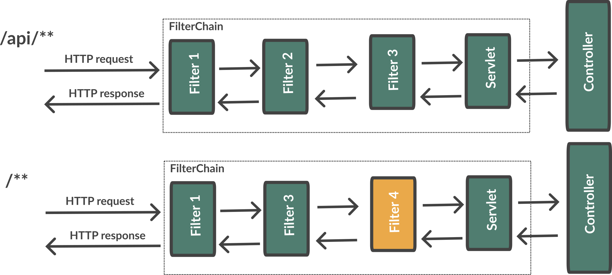
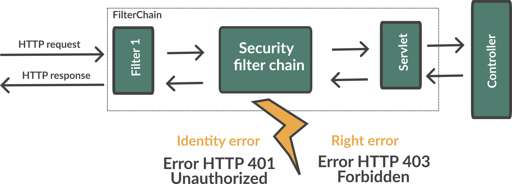

:doctitle: Spring in practice : Security
:description: Each app must be secured and Spring is still here to simplify the work
:keywords: Java, Spring
:author: Guillaume EHRET - Dev-Mind
:revdate: 2023-11-01
:category: Java
:teaser:  Each app must be secured and Spring is still here to simplify the work
:imgteaser: ../../img/training/spring-security.png
:toc:
:icons: font

== Introduction

https://docs.spring.io/spring-security/reference/index.html[Spring Security] provides comprehensive support for authentication, authorization, and protection against https://docs.spring.io/spring-security/reference/features/exploits/index.html[common exploits].

[.text-center]


The security is a complex subject. We retrieve this complexity in Spring Security

But Spring Security and Spring Boot come with an abstraction to make easier the integration with the main tools and concepts : SSO, OpenID, Oauth, NTLM, LDAP, Kerberos


== CORS

Today browsers forbid a website to access to resources served by another website defined on a different domain.

If you want to call your API on http://localhost:8080 from a webapp exposed on a different port you should have this error.

```
Access to fetch at 'http://localhost:8080/api/rooms' from origin 'null' has been blocked by CORS policy: No 'Access-Control-Allow-Origin' header is present on the requested resource. If an opaque response serves your needs, set the request's mode to 'no-cors' to fetch the resource with CORS disabled.
```

https://en.wikipedia.org/wiki/Cross-origin_resource_sharing[Cross-Origin Resource Sharing] is a mechanism that allows this dialog

To resolve this problem you have to manage CORS headers or you install a proxy.

As we won't install a web proxy we will manage CORS in our app

Add annotation `@CrossOrigin` to your `@RestController` to open your API to all other apps

[source,java, subs="specialchars"]
----
@CrossOrigin
----

If your Vue.js app is launched on http://localhost:3010 ou can open your API only for this app

[source,java, subs="specialchars"]
----
@CrossOrigin(origins = { "http://localhost:3010" }, maxAge = 3600)
----


== Authentication

Authentication is how we verify the identity of who is trying to access a particular resource.

[.text-center]


A common way to authenticate users is to force them to enter a username and password. If user is unknown, app will return a 401 error (Bad authentication)


== Authorization

Once authentication is performed we know the identity and can perform authorization.

[.text-center]


If user has no access to a resource, he will receive a 403 error (Forbidden)


== How to install ?

You can use the Spring Boot starters (one for the main libs and one for tests)

[source,java]
----
implementation("org.springframework.boot:spring-boot-starter-security")
testImplementation("org.springframework.security:spring-security-test")
----

With nothing else, Spring Security will add a basic auth to your application and you can configure the default user in `application.properties`

----
spring.security.user.name=user
spring.security.user.password=password
----

Spring generate this page for you

[.text-center]
image:../../img/training/spring-security/authent_screen.png[width=600]

You can logout when you try to call
http://localhost:8080/logout


== icon:flask[] : Security level 1

Update your project to be able to secure you app with the default security form (follow the given steps above)

At this step you can connect to your app but several things must be set to continue to use Swagger and run your controller tests. We will fix these problems in the next lab.

== How it works ?

On a Spring web application, Spring Security support is based on Servlet Filters, so it is helpful to look at the role of Filters generally first.


=== Web filter

When a request is sent to call a controller, the HTTP request is sent to a chain of filters. Activated filters and servlets depend on the path of the request URI.

[.text-center]


In a Spring MVC application you have only one Servlet. This Servlet is an instance of DispatcherServlet. The servlet can handle a single HttpServletRequest and HttpServletResponse.

Filters can read the request and stop the filter chain if we have a problem and the filter can also update the response

[source,java]
----
public void doFilter(
        ServletRequest request,
        ServletResponse response,
        FilterChain chain) {
	  // do something before the rest of the application
    chain.doFilter(request, response); // invoke the rest of the application
    // do something after the rest of the application
}
----

Filters can be activated only on a given path URI and you can add different filter chain depending on this path

[.text-center]



Spring Security add several filters. And Spring filter will throw an exception if user is not authenticated or if he has no right to access to a resource

[.text-center]



=== Architecture

The security context is hold by a SecurityContextHolder. This object uses a ThreadLocal to store its data (one value by user thread)

[.text-center]
image:../../img/training/spring-security/architecture.png[width=500]

`SecurityContext` contains an `Authentication` object.

An `Authentication` represents the currently authenticated user.

- `principal` contains the details (often an instance of UserDetails)
- `credentials` contains the password or the token
- `authorities` contains the user permissions. These permissions are usually loaded by a UserDetailsService.

An `Authentication` request is processed by an AuthenticationProvider. You can have different  providers in you app. For example,

[.text-center]
image:../../img/training/spring-security/architecture2.png[width=700]

DaoAuthenticationProvider supports username/password based authentication while JwtAuthenticationProvider supports authenticating a JWT token.


== Configuration

We can configure our own `UserDetailsService` to manage the user and their permissions. In this basic example we will use a in memory configuration

[source,java]
----
@Configuration
public class SpringSecurityConfig {

    public static final String ROLE_USER = "USER";

    @Bean
    public UserDetailsService userDetailsService() {
        // We create a password encoder
        PasswordEncoder encoder = PasswordEncoderFactories.createDelegatingPasswordEncoder();
        InMemoryUserDetailsManager manager = new InMemoryUserDetailsManager();
        manager.createUser(
                User.withUsername("user").password(encoder.encode("myPassword")).roles(ROLE_USER).build()
        );
        return manager;
    }
}
----

You can add a `SecurityFilterChain` to secure an http route. The default configuration in Spring Boot is this one

[source, java]
----
@Bean
@Order(SecurityProperties.BASIC_AUTH_ORDER)
SecurityFilterChain defaultSecurityFilterChain(HttpSecurity http) throws Exception {
			http.authorizeHttpRequests((requests) -> requests.anyRequest().authenticated());
			http.formLogin(withDefaults());
			http.httpBasic(withDefaults());
			return http.build();
}
----

* (1) Ensures that any request to our application requires the user to be authenticated
* (2) Allows users to authenticate with form based login
* (3) Allows users to authenticate with HTTP Basic authentication

<<<

But you can use several `SecurityFilterChain` to implement different security level. You can add another filter to only let admin user access to the route `/api/**`

[source, java]
----
@Bean
@Order(1)
public SecurityFilterChain filterChain(HttpSecurity http) throws Exception {
    return http
            .authorizeHttpRequests((requests) -> requests
                    .requestMatchers(AntPathRequestMatcher.antMatcher("/api/**")).hasRole(ROLE_USER) // (2)
                    .anyRequest().permitAll() // (3)
            )
            .formLogin(withDefaults())
            .httpBasic(withDefaults())
            .build();
}
----
* (1) If you have more than one filter you need to use an annotation `Order` to define the first one to use
* (2) requestMatchers states that this HttpSecurity will only be applicable to URLs that start with `/api/`. And for each URL we want an authenticated user with the User role
* (3) we permit all other requests

<<<

== Get the user

The simplest way to retrieve the currently authenticated principal is via a static call to the SecurityContextHolder.

[source, java]
----
Authentication authentication = SecurityContextHolder.getContext().getAuthentication();
String currentPrincipalName = authentication.getName();
----

Alternatively, we can also inject the user via the AuthenticationPrincipal annotation in a web controller.

[source, java]
----
@CrossOrigin
@RestController
@RequestMapping("/api/admin/users")
public class SecurityController {
    public record User(String username) {
    }

    @GetMapping(path = "/me")
    public User findUserName(@AuthenticationPrincipal UserDetails userDetails) {
        return new User(userDetails.getUsername());
    }
}
----
<<<

== Check permission

You can configure your app to secure yours methods. For that, add an annotation `PreAuthorize` where you need to check a user role

[source, java]
----
@PreAuthorize("hasRole('ADMIN')") // 1
@GetMapping(path = "/me")
public User findUserName(@AuthenticationPrincipal UserDetails userDetails) {
    return new User(userDetails.getUsername());
}
----

* (1) Here we add a constraint on the user role and user must have the role ADMIN


<<<

== icon:flask[] : Personalize your configuration

- Implement a custom config to manage your users in your own `UserDetailsService`. You must have one classical user and one admin user
- Configure security to secure all the routes exposed with /api. The user must have the role User or Admin to access to our api.
- Add a new REST endpoint to return the username. This endpoint must be only accessible to an admin user
- the H2 console must be also secured and only admins can manage the database via this console

== Unit tests

=== Resolve error 401

With Spring Security configuration you have to update your controller tests. You have to simulate a user to not receive a 401 or 403 HTTP error.

To simulate a user you can use a Spring Security test annotation called `@WithMockUser`

For example in the following test, you can use this annotation to define a user with a given name or roles

[source, java]
----
@Test
@WithMockUser(username = "admin", roles = "ADMIN")
void shouldLoadAWindowAndReturnNullIfNotFound() throws Exception {
    given(windowDao.findById(999L)).willReturn(Optional.empty());
        mockMvc.perform(get("/api/windows/999").accept(APPLICATION_JSON))
                // check the HTTP response
                .andExpect(status().isOk())
                // the content can be tested with Json path
                .andExpect(content().string(""));
}
----

=== Resolve error 403

For put, post or delete HTTP methods, Spring Security add a security level and force you to send a CSRF token. You can read more information on the https://docs.spring.io/spring-security/reference/features/exploits/csrf.html[Spring website].

=== On a web application

If you use the https://developer.mozilla.org/en-US/docs/Web/API/Fetch_API[Fetch API], you can update the headers sent in a request. For example

[source, javascript]
----
const headers = new Headers();
headers.set('Authorization', 'Basic ' + btoa(username + ":" + password));
const response = await fetch('myurl', {headers});
----

==== In the tests
In your test you can configure csrf like on the code below

[source, java]
----
@Test
@WithMockUser(username = "admin", roles = "ADMIN")
void shouldSwitchWindow() throws Exception {
    Window expectedWindow = createWindow("window 1");
    Assertions.assertThat(expectedWindow.getWindowStatus()).isEqualTo(WindowStatus.OPEN);

    given(windowDao.findById(999L)).willReturn(Optional.of(expectedWindow));

    mockMvc.perform(put("/api/windows/999/switch").accept(APPLICATION_JSON).with(csrf()))
            // check the HTTP response
            .andExpect(status().isOk())
            .andExpect(jsonPath("$.name").value("window 1"))
            .andExpect(jsonPath("$.windowStatus").value("CLOSED"));
}
----

==== In the API

You can also disable csrf on your global configuration to be able to use your REST API. To do that add

```
http
    .csrf(AbstractHttpConfigurer::disable)
    .headers(headers -> headers.frameOptions(HeadersConfigurer.FrameOptionsConfig::disable));
```

in your `SpringSecurityConfig` when you configure the `SecurityFilterChain` bean

