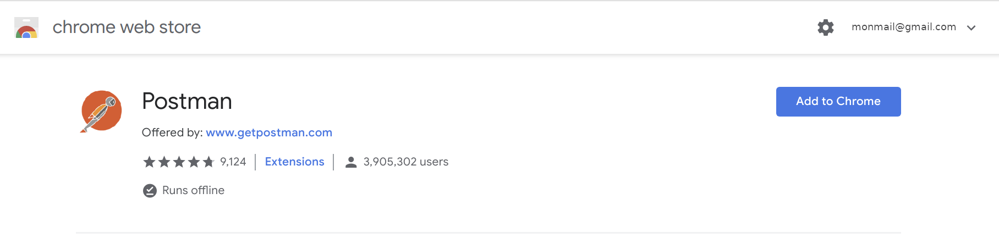
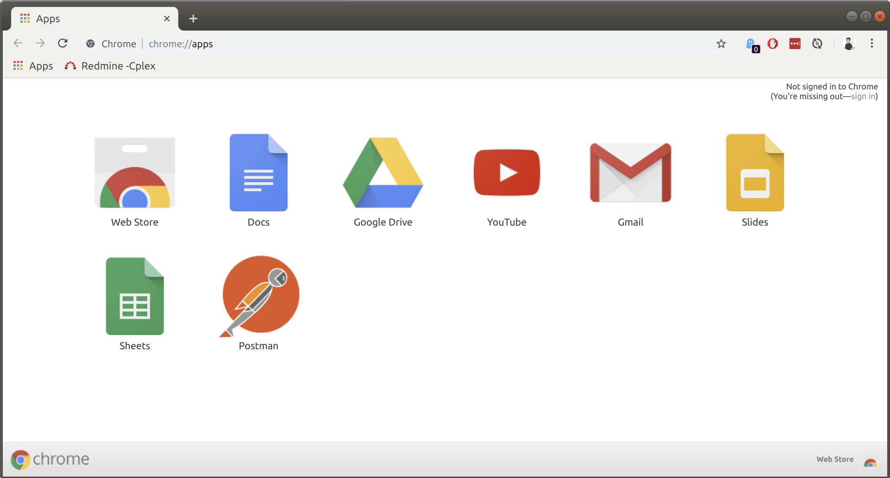
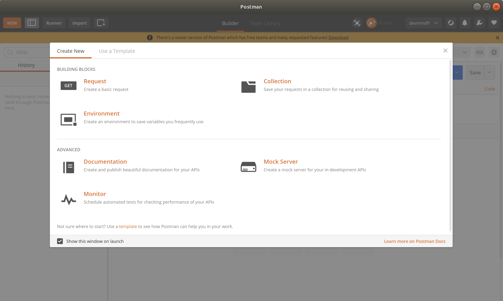
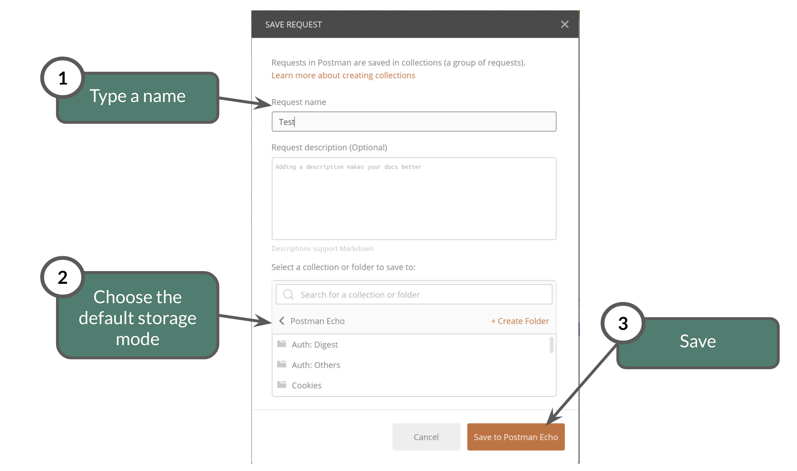
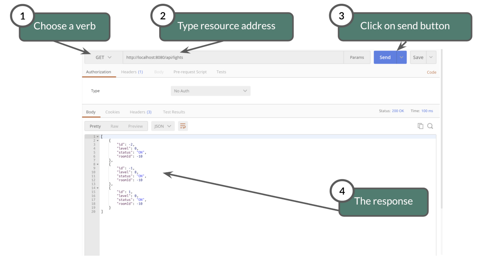
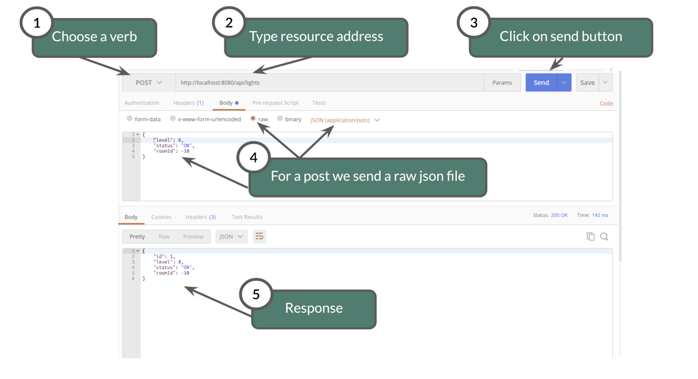

:doctitle: Spring in practice : REST service(EN)
:description: How write REST services in Spring Web and expose resource to your apps
:keywords: Java, Spring
:author: Guillaume EHRET - Dev-Mind
:revdate: 2020-11-13
:category: Java
:teaser:  How write REST services in Spring Web and expose resource to your apps
:imgteaser: ../../img/training/spring-boot.png
:toc:

Spring MVC is the Web Framework built in Spring;

It helps you write web applications and takes care of a lot of boilerplate code, so you just have to focus on your application features.

image::../../img/training/spring-boot.png[size=100%]
With Spring Web (Spring MVC) you can write screens with a template solution which are used to generate HTML. But we don't use this solution in this course. We will see how to write REST services

image::../../img/training/spring-intro/spring-mvc.png[]

With Spring Web you can expose REST services to another app (web api, JS app, android app...)

image::../../img/training/spring-intro/mvc-rest.png[]

== Data Transfert Object

A DTO is an object that carries data between processes. Data need to be serializable to go across the HTTP connection

image::../../img/training/spring-intro/dto.png[]

Serialization is the process of translating data structures or object into a format that can be transmitted

It’s often just a bunch of fields and the getters and setters for them.

[.small]
[source,java, subs="specialchars"]
----
public class LightDto {

    private  Long id;
    private  Integer level;
    private  Status status;

    public LightDto() {
    }

    public LightDto(Light light) {
        this.id = light.getId();
        this.level = light.getLevel();
        this.status = light.getStatus();
    }

    public Long getId() {
        return id;
    }

    public Integer getLevel() {
        return level;
    }

    public Status getStatus() {
        return status;
    }
}
----

DTO will be used to transfer and to receive data in our REST controllers (entry point in our Java webapp)

image::../../img/training/spring-intro/java-objects.png[]

== HTTP
The Hypertext Transfer Protocol (HTTP) is an application protocol used for data communication on the World Wide Web.

HTTP defines methods (sometimes referred to as verbs) to indicate the desired action to be performed on the identified *resource*

A resource can be an image, a video, an HTML page, a JSON document.

To receive a response you have to send a request with a verb in a client an application as Curl, Wget.... or with a website

image::../../img/training/spring-intro/http-verbs.png[]

Each HTTP response has a status identified by a code. This code is sent by the server, by your app

* 1XX : Wait… request in progress
* 2XX : Here ! I send you a resource
* 3XX : Go away !
* 4XX : You made a mistake
* 5XX : I made a mistake

== REST
HTTP requests are handled by the methods of a  REST service. In Spring’s approach a  REST service is a controller. It is able to respond to HTTP requests

* GET: read resource
* POST: creates new record or executing a query
* PUT: edit a resource (sometimes we use only a post request)
* DELETE: delete a record

Controllers are the link between the web http clients (browsers, mobiles) and your application. They should be lightweight and call other components in your application to perform actual work (DAO for example).

These components are easily identified by the @RestController annotation.

Example of addressable resources

* Retrieve a light list : GET `/api/lights`
* Retrieve a particular light : GET `/api/lights/{light_id}`
* Create or update a light : POST `/api/lights`
* Update a light and switch its status : PUT `/api/lights/{light_id}/switch`
* Delete a light : DELETE `/api/lights/{light_id}`

This LightController handles GET requests for `/api/lights` by returning a list of LightDto.

A complete example to manage lights

[.small]
[source,java, subs="specialchars"]
----
@RestController  // 1.
@RequestMapping("/api/lights") // 2.
@Transactional // 3.
public class LightController {

    @Autowired
    private LightDao lightDao; // 4.
    @Autowired
    private RoomDao roomDao;

    @GetMapping // 5.
    public List<LightDto> findAll() {
        return lightDao.findAll()
                       .stream()
                       .map(LightDto::new)
                       .collect(Collectors.toList());
    }

    @GetMapping(path = "/{id}")
    public LightDto findById(@PathVariable Long id) {
        return lightDao.findById(id).map(light -> new LightDto(light)).orElse(null);
    }

    @PutMapping(path = "/{id}/switch")
    public LightDto switchStatus(@PathVariable Long id) {
        Light light = lightDao.findById(id).orElseThrow(IllegalArgumentException::new);
        light.setStatus(light.getStatus() == Status.ON ? Status.OFF: Status.ON);
        return new LightDto(light);
    }

    @PostMapping
    public LightDto create(@RequestBody LightDto dto) {
        Light light = null;
        if (dto.getId() != null) {
            light = lightDao.findById(dto.getId()).orElse(null);
        }

        if (light == null) {
            light = lightDao.save(new Light(roomDao.getOne(dto.getRoomId()), dto.getLevel(), dto.getStatus()));
        } else {
            light.setLevel(dto.getLevel());
            light.setStatus(dto.getStatus());
            lightDao.save(light);
        }

        return new LightDto(light);
    }

    @DeleteMapping(path = "/{id}")
    public void delete(@PathVariable Long id) {
        lightDao.deleteById(id);
    }
}
----

1. `RestController` is a Spring stereotype to mark a class as a rest service
2. `@RequestMapping` is used to define the URL prefix used to manage a resource (in our example we manage lights)
3. In this example we will use a DAO and this DAO is injected via `@Autowired`
4. `@GetMapping` indicates that the following method will respond to a GET request. This method will return a light list. We transform our entities `Light` in `LightDto`

== Lab 5 : Rest service

Create your first REST controller

[.small]
[source,java, subs="specialchars"]
----
@RestController
@RequestMapping("/api/hello")
@Transactional
public class HelloController {

    @GetMapping("/{name}")
    public MessageDto welcome(@PathVariable String name) {
        return new MessageDto("Hello " + name);
    }

    class MessageDto {
        String message;

        public MessageDto(String message) {
            this.message = message;
        }

        public String getMessage() {
            return message;
        }
    }
}
----

Launch your app with `gradlew bootRun` and open the URL http://localhost:8080/api/hello/Guillaume in your browser

When you type an URL in the adress bar, your browser send a GET HTTP request. You should see a response as this one

[source,javascript]
----
{"message":"Hello Guillaume"}
----

Read the previous examples and create

* a DTO LightDto
* a rest service which is able to
** Retrieve a light list via a GET
** Retrieve a particular light via a GET
** Create or update a light via a POST
** Update a light and switch its status via a PUT
** Delete a light via a DELETE

Use postman (see presentation above) to test your API to manage yours lights

* create a new light
* list all the lights
* list the light which have the id `-2`
* switch its status
* updates its level
* deletes this light

== Postman
To test our services, we need a client which be able to write and send requests. We will use a Chrome addon : https://chrome.google.com/webstore/detail/postman/fhbjgbiflinjbdggehcddcbncdddomop[postman]

=== Launch Postman
Postman is added to the chrome apps.

We're going to create a request

You have to choose how to save this request

=== Execute requests

You can try to launch a GET request to read lights on http://localhost:8080/api/lights

Or create a new one with a POST

== Lab 6 : Rest service

You can now create BuildingDto, RoomDto and write services which follow this service

[source,java, subs="specialchars"]
----
/api/rooms (GET) send room list
/api/rooms (POST) add a room
/api/rooms/{room_id} (GET) read a room
/api/rooms/{room_id} (DELETE) delete a room and all its lights
/api/rooms/{room_id}/switchLight switch the room lights
----

and

[source,java, subs="specialchars"]
----
/api/buildings (GET) send room list
/api/buildings (POST) add a building
/api/buildings/{building_id} (GET) read a building
/api/buildings/{building_id} (DELETE) delete a building and all its rooms and all its lights
----

== CORS

Today browsers forbid a website to access to resources served by another website defined on a different domain. [.small .small-block]#If you want to call your API on http://localhost:8080 from a webapp you should have this error#

> *Access to fetch at 'http://localhost:8080/api/rooms' from origin 'null' has been blocked by CORS policy: No 'Access-Control-Allow-Origin' header is present on the requested resource. If an opaque response serves your needs, set the request's mode to 'no-cors' to fetch the resource with CORS disabled.*

https://en.wikipedia.org/wiki/Cross-origin_resource_sharing[Cross-Origin Resource Sharing] is a mechanism that allows this dialog

To resolve this problem you have to manage CORS headers.

Add annotation `@CrossOrigin` to your `@RestController` to open your API to all other apps

[source,java, subs="specialchars"]
----
@CrossOrigin
----

If your Vue.js app is launched on http://localhost:3010 ou can open your API only for this app

[source,java, subs="specialchars"]
----
@CrossOrigin(origins = { "http://localhost:3010" }, maxAge = 3600)
----

== Lab 6+ replace postman by Swagger embedded in your app

More informartion on http://swagger.io/

To use Swagger in your app you need to update your `build.gradle` file and add these dependencies

[source,java, subs="specialchars"]
----
implementation 'io.springfox:springfox-swagger2:2.9.2'
implementation 'io.springfox:springfox-swagger-ui:2.9.2'
----

You need to configure Swagger. For that créate a configuration bean in your app

[source,java, subs="specialchars"]
----
@Configuration
@EnableSwagger2
public class FaircorpConfig {

	@Bean
	public Docket api() {
		return new Docket(DocumentationType.SWAGGER_2)
				.select()
				.apis(RequestHandlerSelectors.any())
				.paths(PathSelectors.any())
				.build();
	}
}
----

And now you can relaunch you app and Play with the swagger interface http://localhost:8080/swagger-ui.html
Try to launch several action tu update, insert load data
