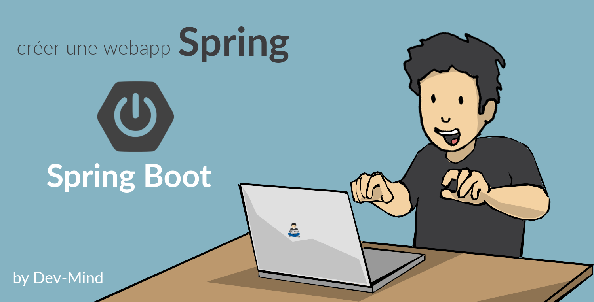
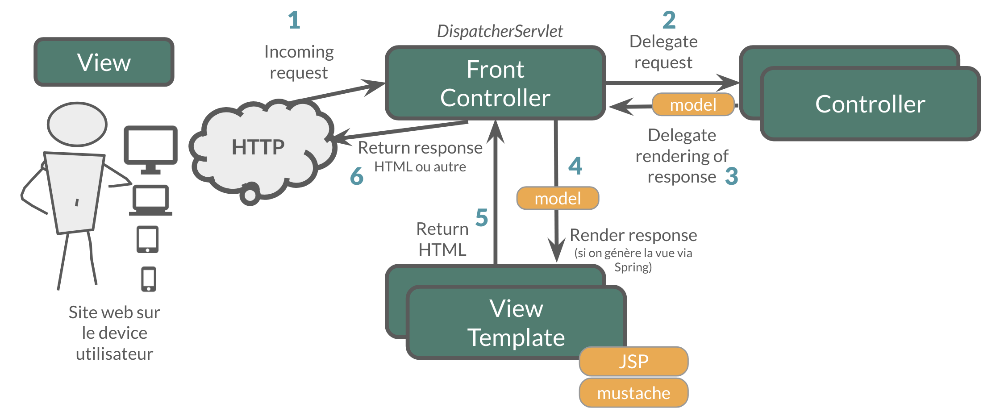
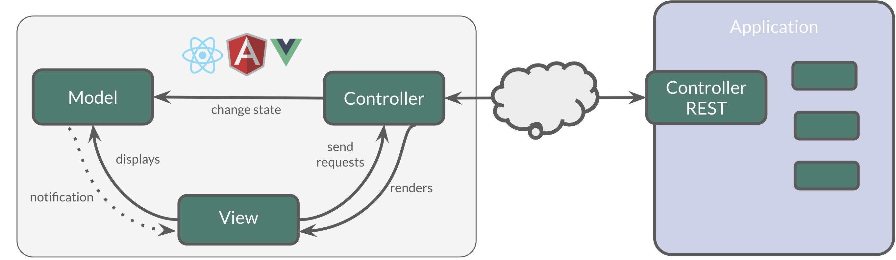
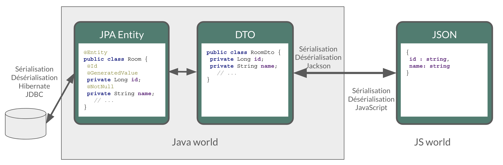
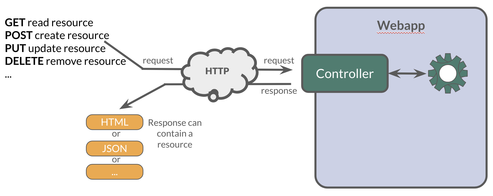
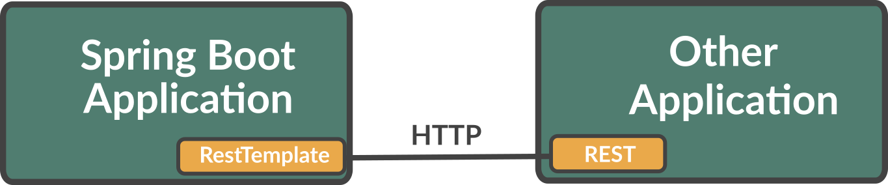
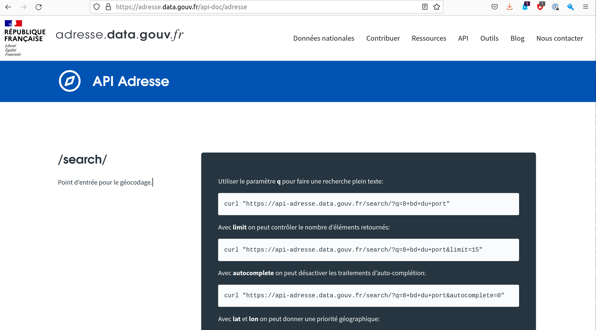
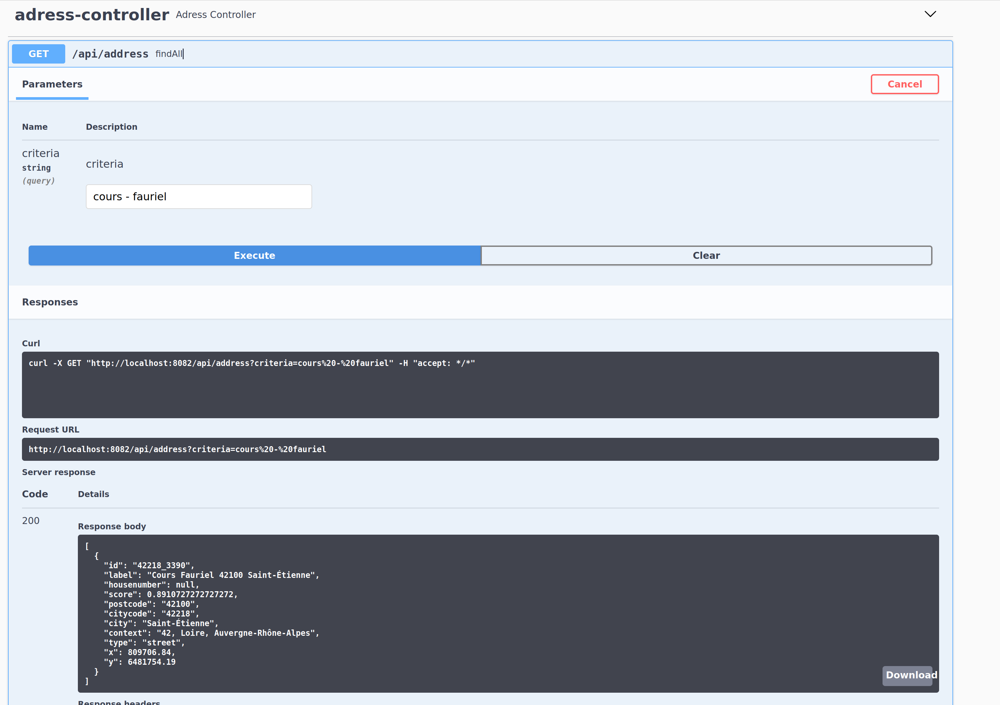

:doctitle: Spring in practice : REST service
:description: How write REST services in Spring Web and expose resource to your apps
:keywords: Java, Spring
:author: Guillaume EHRET - Dev-Mind
:revdate: 2022-11-13
:category: Java
:teaser:  How write REST services in Spring Web and expose resource to your apps
:imgteaser: ../../img/training/spring-boot.png
:toc:
:icons: font

== Introduction

Spring purpose 2 web framework to build an application : the Servlet-based https://docs.spring.io/spring-framework/docs/current/reference/html/web.html#spring-web[Spring MVC] web framework and, in parallel, the https://docs.spring.io/spring-framework/docs/current/reference/html/web-reactive.html#spring-webflux[Spring WebFlux] reactive web framework.

In this course we will focus on https://docs.spring.io/spring-framework/docs/current/reference/html/web.html#spring-web[Spring MVC] because this framework is the most used.

https://docs.spring.io/spring-framework/docs/current/reference/html/web.html#spring-web[Spring MVC] helps you write web applications and takes care of a lot of boilerplate code, so you just have to focus on your application features.

With Spring Web (Spring MVC) you can write screens with a template solution which are used to generate HTML.But we don't use this solution in this course.We will see how to write REST services.However if you are interested you can read https://docs.spring.io/spring-framework/docs/current/reference/html/web.html#mvc-view[official documentation].

With Spring Web you can expose REST services to another app (web api, JS app, android app...).This is the purpose of this lesson.You will learn how to develop endpoints on a backend application.These REST endpoints will be used later by a JS app or an Android app.

== Data Transfert Object

A DTO is an object that carries data between processes. Data need to be serializable to go across the HTTP connection

Serialization is the process of translating data structures or object into a format that can be transmitted

It’s often just a bunch of fields and the getters and setters for them.

[.small]
[source,java, subs="specialchars"]
----
public class WindowDto {
    private Long id;
    private String name;
    private WindowStatus windowStatus;
    private String roomName;
    private Long roomId;

    public WindowDto() {
    }

    public WindowDto(Window window) {
        this.id = window.getId();
        this.name = window.getName();
        this.windowStatus = window.getWindowStatus();
        this.roomName = window.getRoom().getName();
        this.roomId = window.getRoom().getId();
    }

    public Long getId() {
        return id;
    }

    public void setId(Long id) {
        this.id = id;
    }

    public String getName() {
        return name;
    }

    public void setName(String name) {
        this.name = name;
    }

    public WindowStatus getWindowStatus() {
        return windowStatus;
    }

    public void setWindowStatus(WindowStatus windowStatus) {
        this.windowStatus = windowStatus;
    }

    public String getRoomName() {
        return roomName;
    }

    public void setRoomName(String roomName) {
        this.roomName = roomName;
    }

    public Long getRoomId() {
        return roomId;
    }

    public void setRoomId(Long roomId) {
        this.roomId = roomId;
    }
}
----

DTO will be used to transfer and to receive data in our REST controllers (entry point in our Java webapp).

Very often we find a constructor with the entity allowing to build a new instance. *But beware, a DTO must always have an empty constructor*. Libraries used to serialize or deserialize an object use the Java reflection API. In our case we will have a constructor allowing to build a *WindowDto* from *Window* entity.

image::../../img/training/spring-intro/java-objects.png[width=800, align="center"]

== HTTP

The Hypertext Transfer Protocol (HTTP) is an application protocol used for data communication on the World Wide Web.

HTTP defines methods (sometimes referred to as verbs) to indicate the desired action to be performed on the identified *resource*

A resource can be an image, a video, an HTML page, a JSON document.

To receive a response you have to send a request with a verb in a client an application as Curl, Wget.... or with a website

Each HTTP response has a status identified by a code. This code is sent by the server, by your app

* 1XX : Wait… request in progress
* 2XX : Here ! I send you a resource
* 3XX : Go away !
* 4XX : You made a mistake
* 5XX : I made a mistake

== REST
HTTP requests are handled by the methods of a REST service. In Spring’s approach a REST service is a controller. It is able to respond to HTTP requests

* GET: read resource
* POST: creates new record or executing a query
* PUT: edit a resource (sometimes we use only a post request)
* DELETE: delete a record

=== Write a controller

Controllers are the link between the web http clients (browsers, mobiles) and your application. They should be lightweight and call other components in your application to perform actual work (DAO for example).

These components are easily identified by the @RestController annotation.

Example of addressable resources

* Retrieve a window list : GET `/api/windows`
* Retrieve a particular window : GET `/api/windows/{window_id}`
* Create or update a window : POST `/api/windows`
* Update a window and update its status : PUT `/api/windows/{window_id}/switch`
* Delete a window : DELETE `/api/windows/{window_id}`

This WindowController handles GET requests for `/api/windows` by returning a list of WindowDto.

A complete example to manage windows

[source,java, subs="specialchars"]
----
@RestController // (1)
@RequestMapping("/api/windows") // (2)
@Transactional // (3)
public class WindowController {

    private final WindowDao windowDao;
    private final RoomDao roomDao;

    public WindowController(WindowDao windowDao, RoomDao roomDao) { // (4)
        this.windowDao = windowDao;
        this.roomDao = roomDao;
    }

    @GetMapping // (5)
    public List<WindowDto> findAll() {
        return windowDao.findAll().stream().map(WindowDto::new).collect(Collectors.toList());  // (6)
    }

    @GetMapping(path = "/{id}")
    public WindowDto findById(@PathVariable Long id) {
        return windowDao.findById(id).map(WindowDto::new).orElse(null); // (7)
    }

    @PutMapping(path = "/{id}/switch")
    public WindowDto switchStatus(@PathVariable Long id) {
        Window window = windowDao.findById(id).orElseThrow(IllegalArgumentException::new);
        window.setWindowStatus(window.getWindowStatus() == WindowStatus.OPEN ? WindowStatus.CLOSED: WindowStatus.OPEN);
        return new WindowDto(window);
    }

    @PostMapping // (8)
    public WindowDto create(@RequestBody WindowDto dto) {
        // WindowDto must always contain the window room
        Room room = roomDao.getById(dto.getRoomId());
        Window window = null;
        // On creation id is not defined
        if (dto.getId() == null) {
            window = windowDao.save(new Window(room, dto.getName(), dto.getWindowStatus()));
        }
        else {
            window = windowDao.getById(dto.getId());  // (9)
            window.setWindowStatus(dto.getWindowStatus());
        }
        return new WindowDto(window);
    }

    @DeleteMapping(path = "/{id}")
    public void delete(@PathVariable Long id) {
        windowDao.deleteById(id);
    }
}
----

* (1) *RestController* is a Spring stereotype to mark a class as a rest service
* (2) *@RequestMapping* is used to define a global URL prefix used to manage a resource (in our example all requests that start with `/api/windows` will be handle by this controller)
* (3) *@Transactional* is used to delegate a transaction opening to Spring.Spring will initiate a transaction for each entry point of this controller. This is important because with Hibernate you cannot execute a query outside of a transaction.
* (4) DAOs used by this controller are injected via constructor
* (5) *@GetMapping* indicates that the following method will respond to a GET request.This method will return a window list. We transform our entities `Window` in `WindowDto`
* (6) (7) We use https://www.oracle.com/technical-resources/articles/java/ma14-java-se-8-streams.html[Java Stream API] to manipulate our data
* (8) *@PostMapping* indicates that the following method will respond to a POST request (for saving).
* (9) For an update you don't need to call the DAO save method.
Method `getById` load the persisted data and all changes on this object (attached to a persistent context) will be updated when the transaction will be commited.

=== Test a controller

To test whether Spring MVC controllers are working as expected, use the @WebMvcTest annotation. @WebMvcTest auto-configures the Spring MVC infrastructure and the Mock MVC component.

- Mock MVC offers a powerful way to quickly test MVC controllers without needing to start a full HTTP server.
- Annotation @MockBean provides mock implementations for required collaborators in place of the real implementations.

With Mock MVC you can perform requests for each HTTP methods

[source,java, subs="specialchars"]
----
// static import of MockMvcRequestBuilders.*

// a post example
mockMvc.perform(post("/hotels/{id}", 42).accept(MediaType.APPLICATION_JSON));

// you can specify query parameters in URI template style
mockMvc.perform(get("/hotels").param("thing", "somewhere"));
----

You can define expectations by appending one or more andExpect(..) calls after performing a request, as the following example shows. As soon as one expectation fails, no other expectations will be asserted.

[source,java, subs="specialchars"]
----
// static import of MockMvcRequestBuilders.* and MockMvcResultMatchers.*

mockMvc.perform(get("/accounts/1")).andExpect(status().isOk());
----

You can use https://goessner.net/articles/JsonPath/index.html#e2[Json path expression] to check your JSON result. And if you want to test your syntax this https://jsonpath.com/[website] will help you.

You can find several example in the WindowController test

[source,java, subs="specialchars"]
----
package com.emse.spring.faircorp.web;

import com.emse.spring.faircorp.domain.*;
import com.emse.spring.faircorp.repository.*;
import com.fasterxml.jackson.databind.ObjectMapper;
import org.assertj.core.api.Assertions;
import org.junit.jupiter.api.Test;
import org.springframework.beans.factory.annotation.Autowired;
import org.springframework.boot.test.autoconfigure.web.servlet.WebMvcTest;
import org.springframework.boot.test.mock.mockito.MockBean;
import org.springframework.test.web.servlet.MockMvc;

import java.util.List;
import java.util.Optional;

import static org.hamcrest.Matchers.containsInAnyOrder;
import static org.mockito.ArgumentMatchers.any;
import static org.mockito.ArgumentMatchers.anyLong;
import static org.mockito.BDDMockito.given;
import static org.springframework.http.MediaType.APPLICATION_JSON;
import static org.springframework.http.MediaType.APPLICATION_JSON_VALUE;
import static org.springframework.test.web.servlet.request.MockMvcRequestBuilders.*;
import static org.springframework.test.web.servlet.result.MockMvcResultMatchers.*;

@WebMvcTest(WindowController.class)
class WindowControllerTest {
@Autowired
private MockMvc mockMvc;

    @Autowired
    private ObjectMapper objectMapper;

    @MockBean
    private WindowDao windowDao;

    @MockBean
    private RoomDao roomDao;

    @Test
    void shouldLoadWindows() throws Exception {
        given(windowDao.findAll()).willReturn(List.of(
                createWindow("window 1"),
                createWindow("window 2")
        ));

        mockMvc.perform(get("/api/windows").accept(APPLICATION_JSON))
                // check the HTTP response
                .andExpect(status().isOk())
                // the content can be tested with Json path
                .andExpect(jsonPath("[*].name").value(containsInAnyOrder("window 1", "window 2")));
    }

    @Test
    void shouldLoadAWindowAndReturnNullIfNotFound() throws Exception {
        given(windowDao.findById(999L)).willReturn(Optional.empty());

        mockMvc.perform(get("/api/windows/999").accept(APPLICATION_JSON))
                // check the HTTP response
                .andExpect(status().isOk())
                // the content can be tested with Json path
                .andExpect(content().string(""));
    }

    @Test
    void shouldLoadAWindow() throws Exception {
        given(windowDao.findById(999L)).willReturn(Optional.of(createWindow("window 1")));

        mockMvc.perform(get("/api/windows/999").accept(APPLICATION_JSON))
                // check the HTTP response
                .andExpect(status().isOk())
                // the content can be tested with Json path
                .andExpect(jsonPath("$.name").value("window 1"));
    }

    @Test
    void shouldSwitchWindow() throws Exception {
        Window expectedWindow = createWindow("window 1");
        Assertions.assertThat(expectedWindow.getWindowStatus()).isEqualTo(WindowStatus.OPEN);

        given(windowDao.findById(999L)).willReturn(Optional.of(expectedWindow));

        mockMvc.perform(put("/api/windows/999/switch").accept(APPLICATION_JSON))
                // check the HTTP response
                .andExpect(status().isOk())
                .andExpect(jsonPath("$.name").value("window 1"))
                .andExpect(jsonPath("$.windowStatus").value("CLOSED"));
    }

    @Test
    void shouldUpdateWindow() throws Exception {
        Window expectedWindow = createWindow("window 1");
        expectedWindow.setId(1L);
        String json = objectMapper.writeValueAsString(new WindowDto(expectedWindow));

        given(roomDao.getReferenceById(anyLong())).willReturn(expectedWindow.getRoom());
        given(windowDao.getReferenceById(anyLong())).willReturn(expectedWindow);

        mockMvc.perform(post("/api/windows").content(json).contentType(APPLICATION_JSON_VALUE))
                // check the HTTP response
                .andExpect(status().isOk())
                .andExpect(jsonPath("$.name").value("window 1"))
                .andExpect(jsonPath("$.id").value("1"));
    }

    @Test
    void shouldCreateWindow() throws Exception {
        Window expectedWindow = createWindow("window 1");
        expectedWindow.setId(null);
        String json = objectMapper.writeValueAsString(new WindowDto(expectedWindow));

        given(roomDao.getReferenceById(anyLong())).willReturn(expectedWindow.getRoom());
        given(windowDao.save(any())).willReturn(expectedWindow);

        mockMvc.perform(post("/api/windows").content(json).contentType(APPLICATION_JSON_VALUE))
                // check the HTTP response
                .andExpect(status().isOk())
                .andExpect(jsonPath("$.name").value("window 1"));
    }

    @Test
    void shouldDeleteWindow() throws Exception {
        mockMvc.perform(delete("/api/windows/999"))
                .andExpect(status().isOk());
    }

    private Window createWindow(String name) {
        Room room = new Room("S1", 1);
        return new Window(name, WindowStatus.OPEN, room);
    }

}
----

== icon:flask[] : Create your rest services

=== A basic example

This is the time to create your first REST controller with Spring.

Create a new class *HelloController* in package `com.emse.spring.faircorp.api`.

[.small]
[source,java, subs="specialchars"]
----
@RestController
@RequestMapping("/api/hello")
@Transactional
public class HelloController {

    @GetMapping("/{name}")
    public MessageDto welcome(@PathVariable String name) {
        return new MessageDto("Hello " + name);
    }

    class MessageDto {
        String message;

        public MessageDto(String message) {
            this.message = message;
        }

        public String getMessage() {
            return message;
        }
    }
}
----

=== Test your service in your browser

If your REST service expose an handler for a GET HTTP request, this handler can be tested in a browser.

Launch your app and open the URL http://localhost:8080/api/hello/Guillaume in your browser

When you type an URL in the adress bar, your browser send a GET HTTP request. You should see a response as this one

[source,javascript]
----
{"message":"Hello Guillaume
----

=== Test your service with Swagger

With a browser you are limited to GET requests. If you want to test PUT, POST or DELETE HTTP requests, you need another tool. We will use https://swagger.io/[swagger].

The advantage of swagger is that it is very well integrated into the Spring world. Update your `build.gradle` file and add these dependencies

[source,java, subs="specialchars"]
----
implementation 'io.springfox:springfox-boot-starter:3.0.0'
----

You also need to add this property in your `application.properties` file
----
spring.mvc.pathmatch.matching-strategy=ant_path_matcher
----

And now you can relaunch your app and open swagger interface http://localhost:8080/swagger-ui/index.html

All your endpoints are available. You can click on one of them to test it

video::f6FUpLs0H_4[youtube, width=600, height=330]

=== Add WindowController

Read the previous examples and create

* a DTO *WindowDto* and the REST service *WindowController*
* a rest service which is able to
** Retrieve a window list via a GET
** Retrieve a particular window via a GET
** Create or update a window via a POST
** Update a window and switch its status via a PUT
** Delete a window via a DELETE

Use swagger to test your API

* create a new window
* list all the window
* find the window with id `-8`
* switch its status
* deletes this window

=== More Rest service

You can now create BuildingDto, RoomDtoo, HeaterDto and write services which follow this service

[source,java, subs="specialchars"]
----
/api/heaters (GET) send heaters list
/api/heaters (POST) add a heater
/api/heaters/{heater_id} (GET) read a heater
/api/heaters/{heater_id} (DELETE) delete a heater
----

[source,java, subs="specialchars"]
----
/api/rooms (GET) send room list
/api/rooms (POST) add a room
/api/rooms/{room_id} (GET) read a room
/api/rooms/{room_id} (DELETE) delete a room and all its windows and its heaters
/api/rooms/{room_id}/switchWindow switch the room windows (OPEN to CLOSED or inverse)
/api/rooms/{room_id}/switchHeaters switch the room heaters (ON to OFF or inverse)
----

<<<
== RestTemplate

If you need to call remote REST services from your application, you can use the Spring Framework’s RestTemplate class.

A Java method for each HTTP method

- *DELETE* : delete(...)
- *GET* :	getForObject(...)
- *HEAD* :	headForHeaders(...)
- *OPTIONS* :	optionsForAllow(...)
- *POST* : postForObject(...)
- *PUT* : put(...)
- *any method* : exchange(...) or execute(...)

=== How use RestTemplate ?

1. You need to create DTOs to serialize inputs and deserialize outputs
2. Use `RestTemplate` to call the service with the good HTTP method

[source,java, subs="specialchars"]
----
 String result = restTemplate.getForObject(
         "http://example.com/hotels/{hotel}/bookings/{booking}",
         String.class,
         "42",
         "21");
----

will perform a GET on `http://example.com/hotels/42/bookings/21.`

The map variant expands the template based on variable name, and is therefore more useful when using many variables, or when a single variable is used multiple times. For example:

[source,java, subs="specialchars"]
----
 Map<String, String> vars = Collections.singletonMap("hotel", "42");
 String result = restTemplate.getForObject(
         "http://example.com/hotels/{hotel}/rooms/{hotel}",
         String.class,
         vars
);
----
will perform a GET on `http://example.com/hotels/42/rooms/42.`

Since RestTemplate instances often need to be customized before being used, Spring Boot does not provide any single auto-configured RestTemplate bean but a builder to help the creation.

[source,java, subs="specialchars"]
----
@Service
public class SearchService {

    private final RestTemplate restTemplate;

    public AdressSearchService(RestTemplateBuilder restTemplateBuilder) {
        this.restTemplate = restTemplateBuilder.rootUri("https://example.com").build();
    }

    public ResponseDto findUsers() {
        String uri = UriComponentsBuilder.fromUriString("/users/search")
                                         .queryParam("name", "Guillaume")
                                         .build()
                                         .toUriString();
        return restTemplate.getForObject(uri, ResponseDto.class);
    }
}
----
will perform a GET on `http://example.com/users/search?name=Guillaume`

<<<

===  icon:flask[] Call a remote REST API

Now we can see how call a remote REST API in a Spring application.

We will test https://adresse.data.gouv.fr/api-doc/adresse

You can test a request in your terminal with the curl tool or in a browser as it's a GET request.

----
curl "https://api-adresse.data.gouv.fr/search/?q=cours+fauriel+&limit=15"
----

You have a JSON as result

----
{
  "type": "FeatureCollection",
  "features": [
    {
      "type": "Feature",
      "geometry": {
        "type": "Point",
        "coordinates": [4.402982, 45.426444]
      },
      "properties": {
        "label": "Cours Fauriel 42100 Saint-\u00c9tienne",
        "score": 0.8910727272727272,
        "id": "42218_3390",
        "name": "Cours Fauriel",
        "postcode": "42100,
        "city": "Saint-\u00c9tienne",
        "context": "42, Loire, Auvergne-Rh\u00f4ne-Alpes",
        "type": "street"
      }
    }
  ],
  "query": "cours fauriel "
}
----

Now you have to implement a service to call the API.

==== Create the DTOs

To help your job you can use these DTOs

* ApiGouvResponseDto describes the API response. Inside you will have a list of...
* ...ApiGouvFeatureDto. Each feature will have different properties ...
* ...ApiGouvAdressDto

[source,java, subs="specialchars"]
----
public class ApiGouvResponseDto {
    private String version;
    private List<ApiGouvFeatureDto> features;

    public String getVersion() {
        return version;
    }

    public void setVersion(String version) {
        this.version = version;
    }

    public List<ApiGouvFeatureDto> getFeatures() {
        return features;
    }

    public void setFeatures(List<ApiGouvFeatureDto> features) {
        this.features = features;
    }
}
----

[source,java, subs="specialchars"]
----
public class ApiGouvFeatureDto {
    private String type;
    private ApiGouvAdressDto properties;

    public String getType() {
        return type;
    }

    public void setType(String type) {
        this.type = type;
    }

    public ApiGouvAdressDto getProperties() {
        return properties;
    }

    public void setProperties(ApiGouvAdressDto properties) {
        this.properties = properties;
    }
}
----

[source,java, subs="specialchars"]
----
public class ApiGouvAdressDto {
    private String id;
    private String label;

    private String housenumber;
    private Double score;
    private String postcode;
    private String citycode;
    private String city;
    private String context;
    private String type;
    private Double x;
    private Double y;

    public String getId() {
        return id;
    }

    public void setId(String id) {
        this.id = id;
    }

    public String getLabel() {
        return label;
    }

    public void setLabel(String label) {
        this.label = label;
    }

    public String getHousenumber() {
        return housenumber;
    }

    public void setHousenumber(String housenumber) {
        this.housenumber = housenumber;
    }

    public Double getScore() {
        return score;
    }

    public void setScore(Double score) {
        this.score = score;
    }

    public String getPostcode() {
        return postcode;
    }

    public void setPostcode(String postcode) {
        this.postcode = postcode;
    }

    public String getCitycode() {
        return citycode;
    }

    public void setCitycode(String citycode) {
        this.citycode = citycode;
    }

    public String getCity() {
        return city;
    }

    public void setCity(String city) {
        this.city = city;
    }

    public String getContext() {
        return context;
    }

    public void setContext(String context) {
        this.context = context;
    }

    public String getType() {
        return type;
    }

    public void setType(String type) {
        this.type = type;
    }

    public Double getX() {
        return x;
    }

    public void setX(Double x) {
        this.x = x;
    }

    public Double getY() {
        return y;
    }

    public void setY(Double y) {
        this.y = y;
    }
}
----

==== Create the service

Now you are able to write

1. a service called `AdressSearchService`
2. with a constructor in which you will create the `restTemplate`
3. add a method to return the `List<ApiGouvAdressDto>`
4. this method can have a list of String to define the parameters to send to the API
5. You can build the URI with this code ` UriComponentsBuilder.fromUriString("/search").queryParam("q", params).queryParam("limit", 15).build().toUriString()`

==== Test your service with Swagger

You can expose a new REST endpoint in a controller to use Swagger to test this API

==== Test your service with a unit test

You can use the @RestClientTest annotation to test REST clients. By default, it auto-configures Jackson, configures a RestTemplateBuilder, and adds support for MockRestServiceServer.

This test should work

[source,java, subs="specialchars"]
----
package com.emse.spring.faircorp.service;

import com.emse.spring.faircorp.service.dto.ApiGouvAdressDto;
import com.emse.spring.faircorp.service.dto.ApiGouvFeatureDto;
import com.emse.spring.faircorp.service.dto.ApiGouvResponseDto;
import com.fasterxml.jackson.core.JsonProcessingException;
import com.fasterxml.jackson.databind.ObjectMapper;
import org.assertj.core.api.Assertions;
import org.junit.jupiter.api.Test;
import org.springframework.beans.factory.annotation.Autowired;
import org.springframework.boot.test.autoconfigure.web.client.RestClientTest;
import org.springframework.http.MediaType;
import org.springframework.test.web.client.MockRestServiceServer;
import org.springframework.test.web.client.match.MockRestRequestMatchers;
import org.springframework.test.web.client.response.MockRestResponseCreators;

import java.util.List;
import java.util.stream.Collectors;

import static org.junit.jupiter.api.Assertions.*;
import static org.springframework.test.web.client.match.MockRestRequestMatchers.requestTo;
import static org.springframework.test.web.client.response.MockRestResponseCreators.withSuccess;

@RestClientTest(AdressSearchService.class)
class AdressSearchServiceTest {
@Autowired
private AdressSearchService service;

    @Autowired
    private ObjectMapper objectMapper;

    @Autowired
    private MockRestServiceServer server;

    @Test
    void shouldFindAdresses() throws JsonProcessingException {
        // Arrange
        ApiGouvResponseDto expectedResponse = simulateApiResponse();

        this.server
                .expect(requestTo("/search?q=cours+fauriel&limit=15"))
                .andRespond(withSuccess(objectMapper.writeValueAsString(expectedResponse), MediaType.APPLICATION_JSON));

        // Act
        List<ApiGouvAdressDto> adresses = this.service.findAdress(List.of("cours", "fauriel"));

        // Assert
        Assertions
                .assertThat(adresses)
                .hasSize(1)
                .extracting(ApiGouvAdressDto::getCity)
                .contains("Saint Etienne");
    }

    private ApiGouvResponseDto simulateApiResponse() {
        ApiGouvAdressDto expectedAdress = new ApiGouvAdressDto();
        expectedAdress.setCity("Saint Etienne");

        ApiGouvFeatureDto expectedFeature = new ApiGouvFeatureDto();
        expectedFeature.setProperties(expectedAdress);

        ApiGouvResponseDto expectedResponse = new ApiGouvResponseDto();
        expectedResponse.setFeatures(List.of(expectedFeature));

        return expectedResponse;
    }
}
----

== CORS

Today browsers forbid a website to access to resources served by another website defined on a different domain. [.small .small-block]#If you want to call your API on http://localhost:8080 from a webapp you should have this error#

> *Access to fetch at 'http://localhost:8080/api/rooms' from origin 'null' has been blocked by CORS policy: No 'Access-Control-Allow-Origin' header is present on the requested resource. If an opaque response serves your needs, set the request's mode to 'no-cors' to fetch the resource with CORS disabled.*

https://en.wikipedia.org/wiki/Cross-origin_resource_sharing[Cross-Origin Resource Sharing] is a mechanism that allows this dialog

To resolve this problem you have to manage CORS headers.

Add annotation `@CrossOrigin` to your `@RestController` to open your API to all other apps

[source,java, subs="specialchars"]
----
@CrossOrigin
----

If your Vue.js app is launched on http://localhost:3010 ou can open your API only for this app

[source,java, subs="specialchars"]
----
@CrossOrigin(origins = { "http://localhost:3010" }, maxAge = 3600)
----
