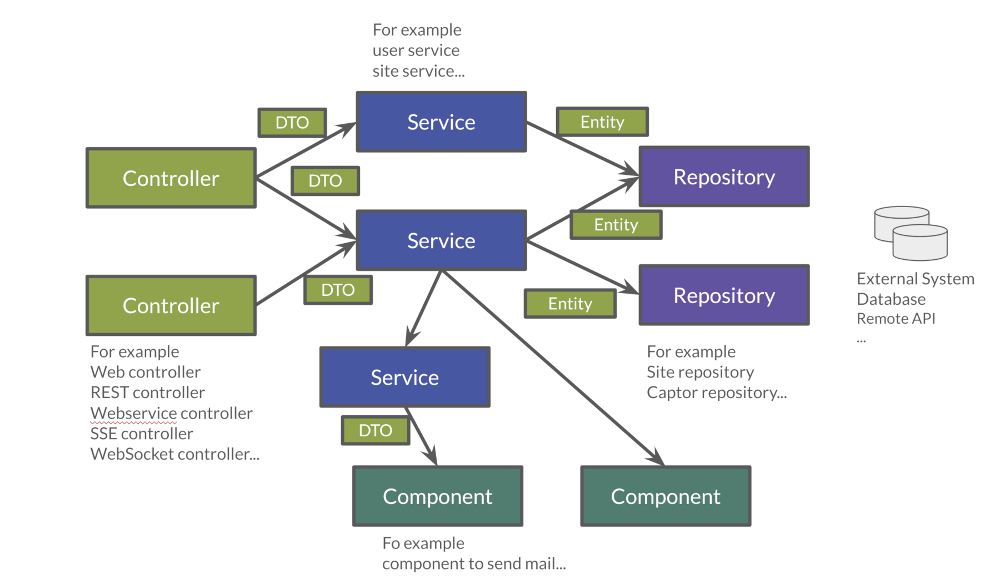

:doctitle: Spring in practice : REST service(EN)
:description: How write REST services in Spring Web and expose resource to your apps
:keywords: Java, Spring
:author: Guillaume EHRET - Dev-Mind
:revdate: 2021-11-13
:category: Java
:teaser:  How write REST services in Spring Web and expose resource to your apps
:imgteaser: ../../img/training/spring-boot.png
:toc:

https://docs.spring.io/spring-framework/docs/current/reference/html/web.html#spring-web[Spring MVC] is the Web Framework built in Spring;

It helps you write web applications and takes care of a lot of boilerplate code, so you just have to focus on your application features.

With Spring Web (Spring MVC) you can write screens with a template solution which are used to generate HTML.But we don't use this solution in this course.We will see how to write REST services.However if you are interested you can read https://docs.spring.io/spring-framework/docs/current/reference/html/web.html#mvc-view[official documentation].

image::../../img/training/spring-intro/spring-mvc.png[]

With Spring Web you can expose REST services to another app (web api, JS app, android app...).This is the purpose of this lesson.You will learn how to develop endpoints on a backend application.These REST endpoints will be used later by a JS app or an Android app.

image::../../img/training/spring-intro/mvc-rest.png[]

== Data Transfert Object

A DTO is an object that carries data between processes. Data need to be serializable to go across the HTTP connection

image::../../img/training/spring-intro/dto.png[]

Serialization is the process of translating data structures or object into a format that can be transmitted

It’s often just a bunch of fields and the getters and setters for them.

[.small]
[source,java, subs="specialchars"]
----
public class WindowDto {
    private Long id;
    private String name;
    private WindowStatus windowStatus;
    private String roomName;
    private Long roomId;

    public WindowDto() {
    }

    public WindowDto(Window window) {
        this.id = window.getId();
        this.name = window.getName();
        this.windowStatus = window.getWindowStatus();
        this.roomName = window.getRoom().getName();
        this.roomId = window.getRoom().getId();
    }

    public Long getId() {
        return id;
    }

    public void setId(Long id) {
        this.id = id;
    }

    public String getName() {
        return name;
    }

    public void setName(String name) {
        this.name = name;
    }

    public WindowStatus getWindowStatus() {
        return windowStatus;
    }

    public void setWindowStatus(WindowStatus windowStatus) {
        this.windowStatus = windowStatus;
    }

    public String getRoomName() {
        return roomName;
    }

    public void setRoomName(String roomName) {
        this.roomName = roomName;
    }

    public Long getRoomId() {
        return roomId;
    }

    public void setRoomId(Long roomId) {
        this.roomId = roomId;
    }
}
----

DTO will be used to transfer and to receive data in our REST controllers (entry point in our Java webapp).

Very often we find a constructor with the entity allowing to build a new instance. *But beware, a DTO must always have an empty constructor*. Libraries used to serialize or deserialize an object use the Java reflection API. In our case we will have a constructor allowing to build a *WindowDto* from *Window* entity.

== HTTP

The Hypertext Transfer Protocol (HTTP) is an application protocol used for data communication on the World Wide Web.

HTTP defines methods (sometimes referred to as verbs) to indicate the desired action to be performed on the identified *resource*

A resource can be an image, a video, an HTML page, a JSON document.

To receive a response you have to send a request with a verb in a client an application as Curl, Wget.... or with a website

image::../../img/training/spring-intro/http-verbs.png[]

Each HTTP response has a status identified by a code. This code is sent by the server, by your app

* 1XX : Wait… request in progress
* 2XX : Here ! I send you a resource
* 3XX : Go away !
* 4XX : You made a mistake
* 5XX : I made a mistake

== REST
HTTP requests are handled by the methods of a REST service.In Spring’s approach a REST service is a controller.It is able to respond to HTTP requests

* GET: read resource
* POST: creates new record or executing a query
* PUT: edit a resource (sometimes we use only a post request)
* DELETE: delete a record

Controllers are the link between the web http clients (browsers, mobiles) and your application.They should be lightweight and call other components in your application to perform actual work (DAO for example).

These components are easily identified by the @RestController annotation.

Example of addressable resources

* Retrieve a window list : GET `/api/windows`
* Retrieve a particular window : GET `/api/windows/{window_id}`
* Create or update a window : POST `/api/windows`
* Update a window and update its status : PUT `/api/windows/{window_id}/switch`
* Delete a window : DELETE `/api/windows/{window_id}`

This WindowController handles GET requests for `/api/windows` by returning a list of WindowDto.

A complete example to manage windows

[.small]
[source,java, subs="specialchars"]
----
@RestController // (1)
@RequestMapping("/api/windows") // (2)
@Transactional // (3)
public class WindowController {

    private final WindowDao windowDao;
    private final RoomDao roomDao;

    public WindowController(WindowDao windowDao, RoomDao roomDao) { // (4)
        this.windowDao = windowDao;
        this.roomDao = roomDao;
    }

    @GetMapping // (5)
    public List<WindowDto> findAll() {
        return windowDao.findAll().stream().map(WindowDto::new).collect(Collectors.toList());  // (6)
    }

    @GetMapping(path = "/{id}")
    public WindowDto findById(@PathVariable Long id) {
        return windowDao.findById(id).map(WindowDto::new).orElse(null); // (7)
    }

    @PutMapping(path = "/{id}/switch")
    public WindowDto switchStatus(@PathVariable Long id) {
        Window window = windowDao.findById(id).orElseThrow(IllegalArgumentException::new);
        window.setWindowStatus(window.getWindowStatus() == WindowStatus.OPEN ? WindowStatus.CLOSED: WindowStatus.OPEN);
        return new WindowDto(window);
    }

    @PostMapping // (8)
    public WindowDto create(@RequestBody WindowDto dto) {
        // WindowDto must always contain the window room
        Room room = roomDao.getById(dto.getRoomId());
        Window window = null;
        // On creation id is not defined
        if (dto.getId() == null) {
            window = windowDao.save(new Window(room, dto.getName(), dto.getWindowStatus()));
        }
        else {
            window = windowDao.getById(dto.getId());  // (9)
            window.setWindowStatus(dto.getWindowStatus());
        }
        return new WindowDto(window);
    }

    @DeleteMapping(path = "/{id}")
    public void delete(@PathVariable Long id) {
        windowDao.deleteById(id);
    }
}
----

* (1) *RestController* is a Spring stereotype to mark a class as a rest service
* (2) *@RequestMapping* is used to define a global URL prefix used to manage a resource (in our example all requests that start with `/api/windows` will be handle by this controller)
* (3) *@Transactional* is used to delegate a transaction opening to Spring.Spring will initiate a transaction for each entry point of this controller.This is important because with Hibernate you cannot execute a query outside of a transaction.
* (4) DAOs used by this controller are injected via constructor
* (5) *@GetMapping* indicates that the following method will respond to a GET request.This method will return a window list.We transform our entities `Window` in `WindowDto`
* (6) (7) We use https://www.oracle.com/technical-resources/articles/java/ma14-java-se-8-streams.html[Java Stream API] to manipulate our data
* (8) *@PostMapping* indicates that the following method will respond to a POST request (for saving).
* (9) For an update you don't need to call the DAO save method.
Method `getById` load the persisted data and all changes on this object (attached to a persistent context) will be updated when the transaction will be commited.

== Lab : Create your rest services

=== A basic example

This is the time to create your first REST controller with Spring.

Create a new class *HelloController* in package `com.emse.spring.faircorp.api`

[.small]
[source,java, subs="specialchars"]
----
@RestController
@RequestMapping("/api/hello")
@Transactional
public class HelloController {

    @GetMapping("/{name}")
    public MessageDto welcome(@PathVariable String name) {
        return new MessageDto("Hello " + name);
    }

    class MessageDto {
        String message;

        public MessageDto(String message) {
            this.message = message;
        }

        public String getMessage() {
            return message;
        }
    }
}
----

=== Test your service

==== Browser for GET requests

If your REST service expose an handler for a GET HTTP request, this handler can be tested in a browser.

Launch your app and open the URL http://localhost:8080/api/hello/Guillaume in your browser

When you type an URL in the adress bar, your browser send a GET HTTP request. You should see a response as this one

[source,javascript]
----
{"message":"Hello Guillaume"}
----

==== Swagger for all requests

With a browser you are limited to GET requests. If you want to test PUT, POST or DELETE HTTP requests, you need another tool. We will use https://swagger.io/[swagger].

The advantage of swagger is that it is very well integrated into the Spring world. Update your `build.gradle` file and add these dependencies

[source,java, subs="specialchars"]
----
implementation 'io.springfox:springfox-boot-starter:3.0.0'
----

And now you can relaunch your app and open swagger interface http://localhost:8080/swagger-ui/index.html

All your endpoints are available. You can click on one of them to test it

video::f6FUpLs0H_4[youtube, width=600, height=330]

=== Add WindowController

Read the previous examples and create

* a DTO *WindowDto* and the REST service *WindowController*
* a rest service which is able to
** Retrieve a window list via a GET
** Retrieve a particular window via a GET
** Create or update a window via a POST
** Update a window and switch its status via a PUT
** Delete a window via a DELETE

Use swagger to test your API

* create a new window
* list all the window
* find the window with id `-8`
* switch its status
* deletes this window

=== More Rest service

You can now create BuildingDto, RoomDtoo, HeaterDto and write services which follow this service

[source,java, subs="specialchars"]
----
/api/heaters (GET) send heaters list
/api/heaters (POST) add a heater
/api/heaters/{heater_id} (GET) read a heater
/api/heaters/{heater_id} (DELETE) delete a heater
----

[source,java, subs="specialchars"]
----
/api/rooms (GET) send room list
/api/rooms (POST) add a room
/api/rooms/{room_id} (GET) read a room
/api/rooms/{room_id} (DELETE) delete a room and all its windows and its heaters
/api/rooms/{room_id}/switchWindow switch the room windows (OPEN to CLOSED or inverse)
/api/rooms/{room_id}/switchHeaters switch the room heaters (ON to OFF or inverse)
----

[source,java, subs="specialchars"]
----
/api/buildings (GET) send building list
/api/buildings (POST) add a building
/api/buildings/{building_id} (GET) read a building
/api/buildings/{building_id} (DELETE) delete a building and all its rooms and all its windows and heaters
----

== CORS

Today browsers forbid a website to access to resources served by another website defined on a different domain. [.small .small-block]#If you want to call your API on http://localhost:8080 from a webapp you should have this error#

> *Access to fetch at 'http://localhost:8080/api/rooms' from origin 'null' has been blocked by CORS policy: No 'Access-Control-Allow-Origin' header is present on the requested resource. If an opaque response serves your needs, set the request's mode to 'no-cors' to fetch the resource with CORS disabled.*

https://en.wikipedia.org/wiki/Cross-origin_resource_sharing[Cross-Origin Resource Sharing] is a mechanism that allows this dialog

To resolve this problem you have to manage CORS headers.

Add annotation `@CrossOrigin` to your `@RestController` to open your API to all other apps

[source,java, subs="specialchars"]
----
@CrossOrigin
----

If your Vue.js app is launched on http://localhost:3010 ou can open your API only for this app

[source,java, subs="specialchars"]
----
@CrossOrigin(origins = { "http://localhost:3010" }, maxAge = 3600)
----
