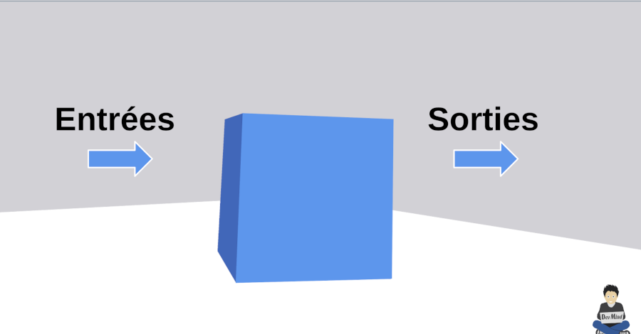
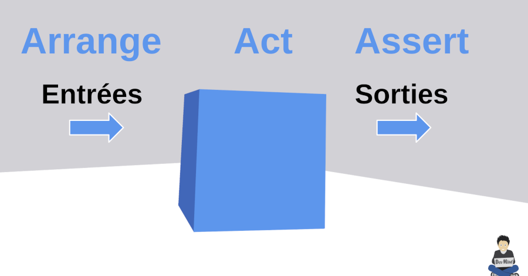
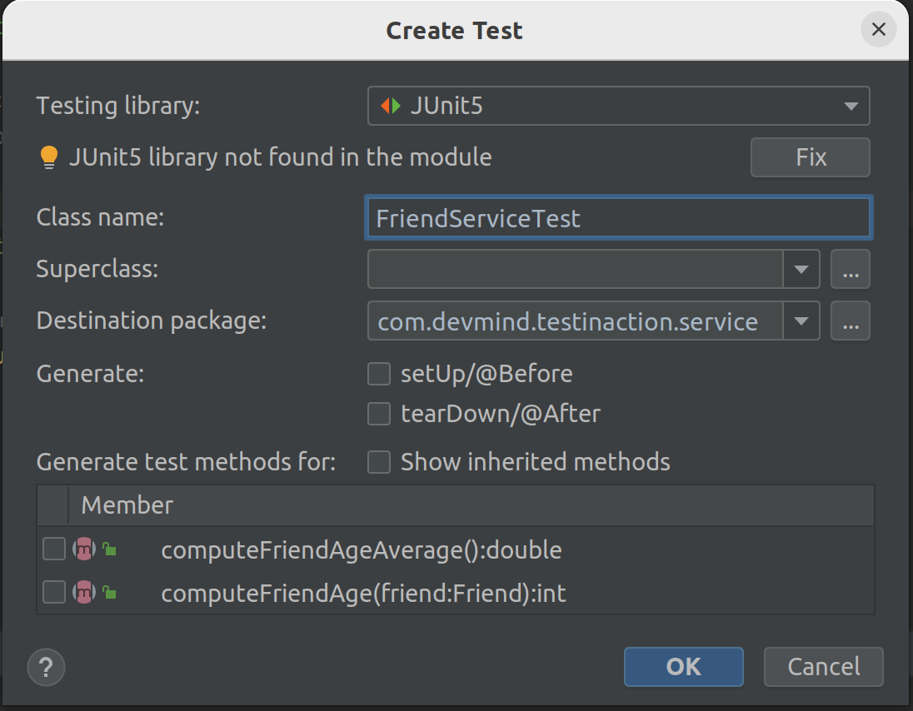

:doctitle: Write unit tests in Java (EN)
:description: Write unit tests in Java
:keywords: Java, Unit Test, AssertJ, Mockito, Junit
:author: Guillaume EHRET - Dev-Mind
:revdate: 2018-10-17
:category: Java
:teaser:  In this course you will learn how to write a unit test, how to simulate the collaborator behaviors and how to check the results
:imgteaser: ../../img/training/unit-tests.png
:toc:

In this course you will learn how to write a unit test, how to simulate the collaborator behaviors and how to check the results


== Software testing

[%step]
* checks if the actual results match the expected results
* but also
** helps to identify errors by testing limits
** helps to not reproduce errors : When a bug occurs, we create a new test case, we fix the bug.. And after each code update, we execute this tests to know if the bug won't occur anymore#

You can test your software manually

* but you have to do that before each feature update
* and more your application is rich more you need to do more tests

The solution is *to have automatic tests* and code them


You have different types of tests

* *Installation testing*: A software is often a set of little apps (web app, spring boot app, datasource....). This kind of test helps to check if your installation procedure is correct and if the software can be used
* *Security testing*: Checks the security and if your data keep confidential and not available from hackers
* *Performance testing*: to determine how a system or sub-system performs in terms of responsiveness and stability under a particular workload
* *End to end testing*: You test your app as a user. These tests are sometimes called functional tests
* *Unit testing*: We test every units of source code (each class, each methods...).
* ...


Manual tests are cheaper on short-term but more expensive on long-term

Automated tests are expensive on short-term but cheaper on long-term

A human will tire when he has to execute the same tests continuously.He will be less conscientious and less attentive.It's not the case for a test program


If you want to facilitate your tests you can apply 2 rules

* use *interface* to define the contract to code
* use *dependency injection*. This mechanism helps to use for example
** a mock object, to simulate the object behavior in a test and
** the real implementation in production code

== Unit tests

A unit test is a method that instantiates a small portion of your application (one method for example) and checks its behavior independently from other parts.

Portion to test, can be viewed as an independent system.We talk about System Under Test (SUT)


For example, if we want to test a service which follows this contract

[source,java,subs="specialchars"]
----
public interface FriendService {
   /**
     * Compute friend age from his birth year
     */
    double computeFriendAge(Friend friend);
}
----

Implementation to test is
[source,java, subs="specialchars"]
----
public class FriendServiceImpl implements FriendService {
    @Override
    public int computeFriendAge(Friend friend) {
        if(friend == null){
            throw new IllegalArgumentException("Friend is required");
        }
        return LocalDate.now().getYear() - friend.getBirthYear();
    }
}
----

When you write a test you have to test all the cases.In our example you have to check when the user is nulland when a user is defined and has a birth year

In an application this system SUT will interact with other components


These other components are called collaborators.


For example if we change our service

[source,java, subs="specialchars"]
----
public class FriendServiceImpl implements FriendService {

    private FriendRepository friendRepository;
    private IntegerComputer integerComputer;

    public FriendServiceImpl(FriendRepository friendRepository,
                             IntegerComputer integerComputer) {
        this.friendRepository = friendRepository;
        this.integerComputer = integerComputer;
    }


    // ...
}
----

`FriendRepository` and `IntegerComputer` are collaborators


When you want to write a test of your SUT, you need to simulate the collaborator behaviors.


To simulate collabators, you have several possibilities

* *Use a fake object*: You create an object only for your test (it's not a good solution)
* *Use a spy object*: You create a spy from the the real implementation of one collaborator. You use a library for that and you can overrided the returned values
* *Use a mock object*: A mock is created via a library from a specified contract (an interface). And you can pre preprogrammed these objects to return your wanted values during the test


== Black box

When you want to write a test you have to consider this SUT (system under test) as a black box.


The code to test is not important, it's the black box... you have to focus on inputs and outputs




Your black box can have inputs (method parameters for example) +
[.small .small-block]#In your test you will invoke the SUT and you test this one by sending inputs#

Your black box can return a result or update the system state (we have an output) +
[.small .small-block]#In your test you will check the result and assert if this result is equals to the expected behavior#

When you write you can follow the AAA pattern : *arrange /act /assert* [.small .small-block]#Another pattern is Given / When / Then#



We use Junit to write tests in Java

[source,java,subs="specialchars"]
----
package com.devmind.testinaction.service;

import com.devmind.testinaction.model.Friend;
import org.assertj.core.api.Assertions;
import org.junit.jupiter.api.BeforeEach;
import org.junit.jupiter.api.Test;

import static org.junit.jupiter.api.Assertions.*;

class FriendServiceTest {

    private FriendService friendService;

    @BeforeEach // 1.
    public void init(){
        friendService = new FriendServiceImpl();
    }

    @Test // 2.
    public void computeFriendAge() {
        // Arrange
        Friend friend = new Friend("Guillaume", 1977);

        // Act
        int age = friendService.computeFriendAge(friend);

        // Assert
        Assertions.assertThat(age).isEqualTo(42); // 3.
    }

    @Test
    public void computeFriendAgeWithNullFriendShouldFail() { // 4.
        Assertions.assertThatThrownBy(() -> friendService.computeFriendAge(null))
                .isExactlyInstanceOf(IllegalArgumentException.class)
                .hasMessage("Friend is required");
    }
}
----

1. Method annotated with @BeforeEach is executed before each tests (a @AfterEach exists)
2. Method annotated with @Test is a unit test.
3. We use assertJ to write assertions
4. We expect an exception when friend is null. It's important to use an explicit test method name

== Assertions

Assertions methods provided by Junit are not very readable.We prefer to use the AssertJ library

AssertJ provides a fluent API and with this API you always use the method `asserThat`

[source,java, subs="specialchars"]
----
Assertions.assertThat(age).isEqualTo(41);
Assertions.assertThat(name).isEqualTo("Dev-Mind");
----

With assertJ you can test the exception thrown by a method, its type, its message

[source,java,subs="specialchars"]
----
Assertions.assertThatThrownBy(() -> friendService.computeFriendAge(null))
                .isExactlyInstanceOf(IllegalArgumentException.class)
                .hasMessage("Friend is required");
----

If you expected result is a list of friends

[source,java, subs="specialchars"]
----
List<Friend> myFriends = Arrays.asList(
                new Friend("Elodie", 1999),
                new Friend("Charles", 2001));
----
you can check the content of this list

[source,java, subs="specialchars"]
----
Assertions.assertThat(myFriends)
                  .hasSize(2)
                  .extracting(Friend::getName)
                  .containsExactlyInAnyOrder("Elodie", "Charles");

Assertions.assertThat(myFriends)
          .hasSize(2)
          .extracting(Friend::getName, Friend::getBirthYear)
          .containsExactlyInAnyOrder(
                  Tuple.tuple("Elodie", 1999),
                  Tuple.tuple("Charles", 2001));
----

AssertJ is IDE friendly and its fluent API can be discovered by completion

image::../../img/training/unit-test/assertj-completion.png[]

You can find more informations on the official website http://joel-costigliola.github.io/assertj

== Lab : Unit tests

You need to clone a new project in your workspace.Use a terminal and launch

```
git clone https://github.com/Dev-Mind/unitTestInAction.git
```

This project is a Gradle project.You can Open it in IntelliJ and configure it

Go on `FriendServiceImpl` and generate a test class with `Ctrl` + `Shift` + `T`



Write the test of the method `computeFriendAge`

1. Declare 2 properties of type `FriendRepository` (mocked dependency) and `FriendService` (class to test)
2. In @Before block create this property implementation.
This block will be executed before each test.
So a a new implementation will be created after each tests.
3. Write a unit test to compute your age.For that use the pattern AAA
** Arrange => define a Friend object with your firstname and your birthYear
** Act => call the method `computeFriendAge`
** Assert => check that the result is equal to your age
4. Execute test (red means fail and green means pass)

Write a second test and verify the exception thrown


== Mockito

Now we will try to test a class which has collaborators.We will use https://static.javadoc.io/org.mockito/mockito-core/2.23.0/org/mockito/Mockito.html[Mockito] to simulate their behaviors

https://static.javadoc.io/org.mockito/mockito-core/2.23.0/org/mockito/Mockito.html[Mockito] is a popular mock framework which can be used in conjunction with JUnit.

https://static.javadoc.io/org.mockito/mockito-core/2.23.0/org/mockito/Mockito.html[Mockito] allows you to create and configure mock objects.Using Mockito simplifies the development of tests for classes with external dependencies significantly.

Add a new method in your interface `FriendService`

[source,java, subs="specialchars"]
----
/**
  * Compute the average age of your friends and round the result
  */
int computeFriendAgeAverage();
----

And implement this method in `FriendServiceImpl`

[source,java, subs="specialchars"]
----
@Override
public double computeFriendAgeAverage() {
    List<Friend> friends = friendRepository.findAll();
    int sumAge = 0;
    for(Friend friend : friends){
        sumAge += computeFriendAge(friend);
    }
    return sumAge * 1.0 / friends.size();
}
----

In this code we use `friendRepository`.You have to declare it as a property (1), and declare a constructor to inject an implementation (2)

[source,java, subs="specialchars"]
----
public class FriendServiceImpl implements FriendService {

    private FriendRepository friendRepository; // 1.

    public FriendServiceImpl(FriendRepository friendRepository) { // 2.
        this.friendRepository = friendRepository;
    }

    @Override
    public double computeFriendAgeAverage() {
        List<Friend> friends = friendRepository.findAll();
        return friends.stream().collect(Collectors.averagingInt(this::computeFriendAge));
    }

    @Override
    public int computeFriendAge(Friend friend) {
        if (friend == null) {
            throw new IllegalArgumentException("Friend is required");
        }
        return LocalDate.now().getYear() - friend.getBirthYear();
    }
}
----

`FriendRepository` is an interface and you have no implementation in the code for the moment

It's not a problem and you can write the `FriendServiceImpl` test.In Java you define an interface and you start to write test.This is the TDD (https://en.wikipedia.org/wiki/Test-driven_development[Test Driven Development]) approach

Go on `FriendServiceImplTest` and update the existing class.We will use Mockito to simulate `FriendRepository`

[source,java, subs="specialchars"]
----
package com.devmind.testinaction.service;

import com.devmind.testinaction.model.Friend;
import com.devmind.testinaction.repository.FriendRepository;
import org.assertj.core.api.Assertions;
import org.junit.jupiter.api.BeforeEach;
import org.junit.jupiter.api.Test;
import org.junit.jupiter.api.extension.ExtendWith;
import org.mockito.InjectMocks;
import org.mockito.Mock;
import org.mockito.Mockito;
import org.mockito.junit.jupiter.MockitoExtension;

import java.util.Arrays;
import java.util.List;

import static org.junit.jupiter.api.Assertions.*;

@ExtendWith(MockitoExtension.class) // 1.
class FriendServiceTest {

    @Mock // 2.
    private FriendRepository friendRepository;

    @InjectMocks //3.
    private FriendServiceImpl friendService;

    @Test
    public void computeFriendAgeAverage(){
        // Arrange
        List<Friend> myFriends = Arrays.asList(
                new Friend("Elodie", 1999),
                new Friend("Charles", 2001));

        Mockito.when(friendRepository.findAll()).thenReturn(myFriends); // 4.

        // Act
        double average = friendService.computeFriendAgeAverage(); // 5.

        // Assert
        Assertions.assertThat(average).isEqualTo(21.0);
    }

    // Old code...

}
----

1. We use `MockitoExtension`. This extension is able to manage annotations `@Mock` and `@InjectMocks`
2. Property annotated with `@Mock` will be generated by Mockito. Mockito create a mock (each collaborators have to be defined as mocks). You can define a mock behavior on a test
3. The class to test is annotated `@InjectMocks`. Mockito create the implementation and inject automatically mocks inside
4. You can define the mock object behavior in your test. Here, we want the mock will return a list of friends
5. You can call your SUT and check the result

You can now write a new test when the list of friend is empty

[source,java,subs="specialchars"]
----
@Test
public void computeFriendAgeAverageWhenFriendListIsEmpty(){
    // Arrange
    List<Friend> myFriends = null;

    Mockito.when(friendRepository.findAll()).thenReturn(myFriends);

    // Act
    // ...
}
----

What happens ?

Writing tests help to fix problems.Fix the code of `computeFriendAgeAverage` and return 0 when the list is empty.You can now fix your test

As our examples Mockito allows to configure the return values.If you don't specify the mock behavior, the mock will return

* null for objects
* 0 for numbers
* false for boolean
* empty collections for collections

You can also return an exception in place of a value.For example

[source,java, subs="specialchars"]
----
Mockito.when(friendRepository.findAll()).thenThrow(new IllegalArgumentException("Error"));
----

We don't test this Mockito features but you can read the official documentaion to know how

1. https://static.javadoc.io/org.mockito/mockito-core/2.23.0/org/mockito/Mockito.html#13[Create a Spy] a real object and override its behavior
2. https://static.javadoc.io/org.mockito/mockito-core/2.23.0/org/mockito/Mockito.html#4[Verify] that a mock was called (it's sometimes usefull when you want to check if a void method was called)
3. other use cases on https://static.javadoc.io/org.mockito/mockito-core/2.23.0/org/mockito/Mockito.html
